# Using WCF in .NET Native

*This post was authored by **Ron Cain, a Software Development Engineer** on the WCF team.*

In our [previous post][NewReleases], we mentioned that some of the client
components of Windows Communication Foundation (WCF) had been made available for
.NET Native Windows Store apps in Visual Studio "14" CTP3. In this post, I will
describe how to build a sample WCF Windows Store App using CTP3 and make it run
using the .NET Native compiler.

Note that most of this walk-through is not unique to .NET Native and applies
equally well to a conventional Windows Store App. The final section of the walk-
through describes the extra couple steps to make it run with .NET Native.

Before you start, follow the directions at
<http://support.microsoft.com/kb/2967191> to install Visual Studio "14" CTP3.

If you want to read more about .NET Native, refer to [Announcing .NET Native Preview][NetNative].

[NewReleases]: http://blogs.msdn.com/b/dotnet/archive/2014/08/18/try-out-the-new-releases-net-framework-vnext-asp-net-vnext-net-native-and-ryujit.aspx
[NetNative]: http://blogs.msdn.com/b/dotnet/archive/2014/04/02/announcing-net-native-preview.aspx

# Create an IIS hosted WCF service to test our app

Before we build our Windows Store app, we need a WCF service it can use. And
because Windows Store apps cannot connect to `localhost` we need to provide a
host for this service. For this sample, we'll use IIS on our own development
machine.

## Enable IIS

We can enable IIS by swiping in from the right edge of the screen, searching for
**Turn Windows features on or off** and running it. Checking
**Internet Information Services** enables IIS to run on this machine.

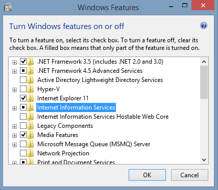

## Create the WCF service

We need to open Visual Studio as an Administrator because it will need to
configure IIS to host the service. We'll start by creating a new WCF
application project:

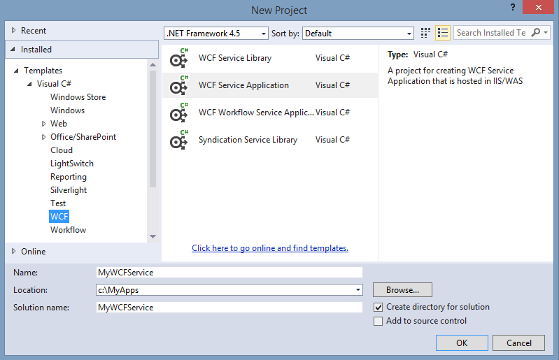

The out-of-the-box service is fully functional but a little dull, so we'll
enhance it a bit. We do this by editing the generated WCF service contract
(`IService1.cs`) to add a new `SayHello()` method. Marking it with
`[OperationContract]` makes this method callable from WCF clients.

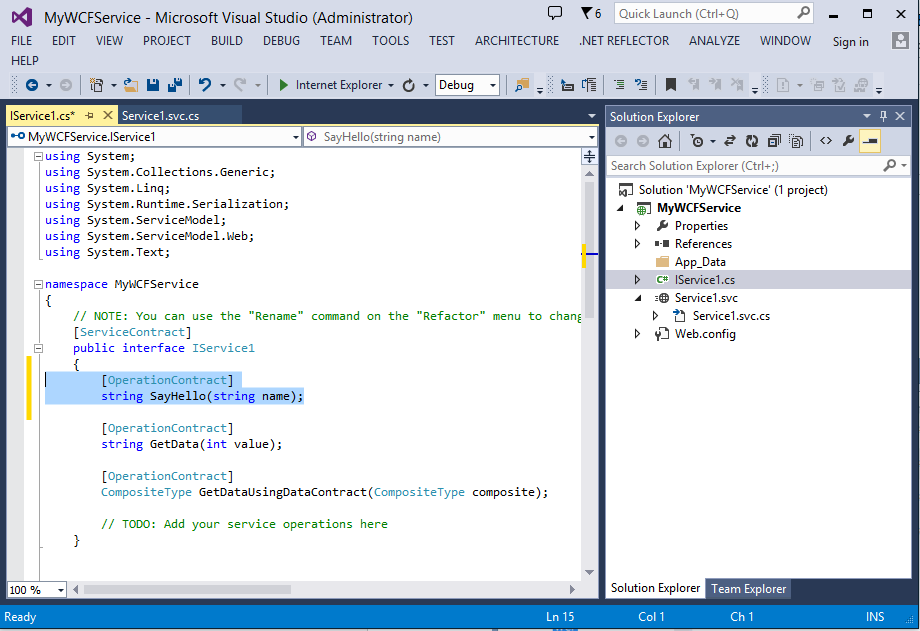

And of course we need to implement this new interface method, so we add code to
the generated service implementation class (`Service1.svc.cs`):

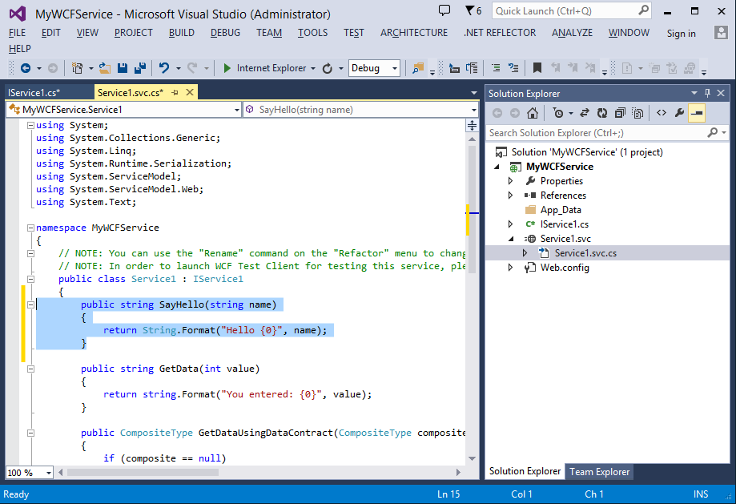

The WCF service is now complete. After building it, all that remains is to host
it. We do this by right clicking on the MyWCFService in the **Solution Explorer**
and opening its **Properties** window. In the Web tab, we choose "Local IIS". This
means the IIS we enabled on our development machine will be the host for this
service.

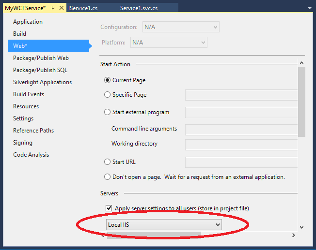

We'll be asked to create a **Virtual Directory** when we save, which is the
final step to host the service. Say **Yes**. At this point, IIS is hosting our
service.

We can verify the service is available by right-clicking `Service1.svc` and
choosing **View in Browser**. If we see something like the screenshot below, we
know the service is running in IIS and ready to use. Notice the URL. We will
need it later.

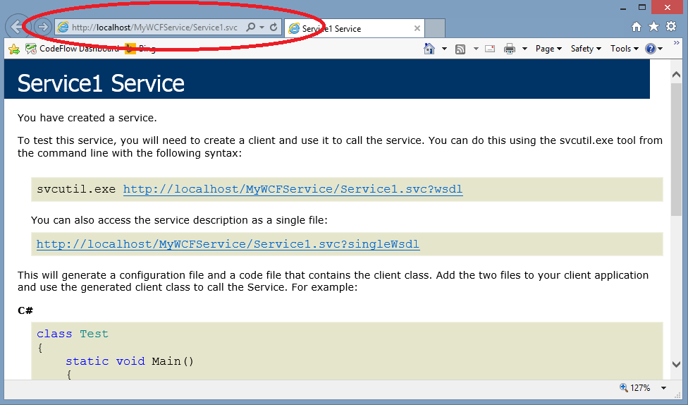

It is a good idea to test this URL from another machine, after replacing
`localhost` with the machine name. If necessary grant World Wide Web Services
(HTTP) through Windows or any other Firewall on the machine(s). This URL with
the machine name is the one we want to use from our Windows Store app.

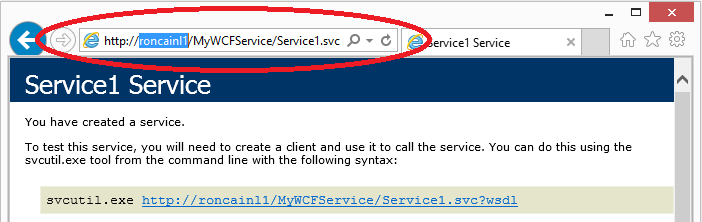

# Create the WCF Windows Store client app

So our WCF service is up and running. Let's make a Windows Store client to call
it. In this section, we'll create a conventional Windows Store app. In the
next section, we'll make it run in .NET Native.

We'll start by creating a new **Blank App** Windows Store project. We can use
the same development machine or a different one. I created mine on a different
one to ensure I didn't inadvertently rely on **localhost**.

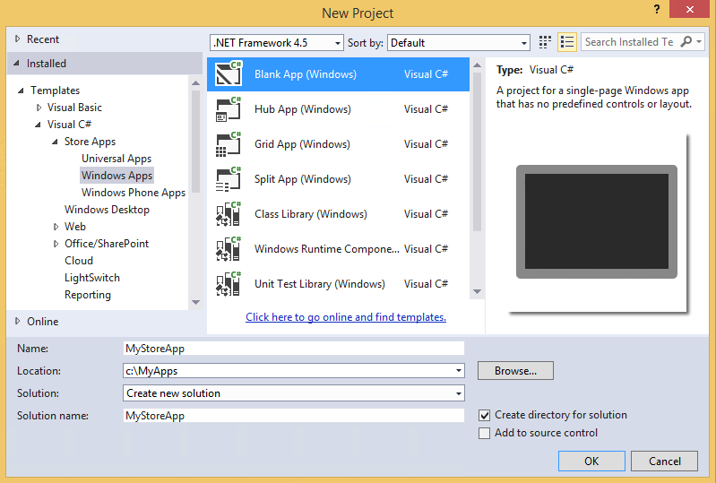

And this is the project generated for us.

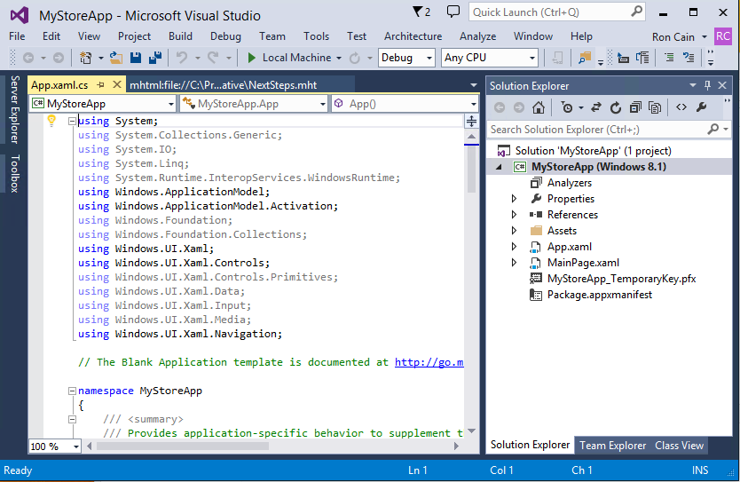

We can link to the WCF service we created by right-clicking **References** in
**Solution Explorer** and choosing **Add Service Reference**. We set the
**Address** field to be the URL we used to browse to the service. Because
Windows Store apps cannot access `localhost`, we must use the URL with the
machine name where IIS is running. Then we press **Go**, select `Service1`, and
OK. For this exercise, I recommend keeping the default names in case you want to
paste code from this post.

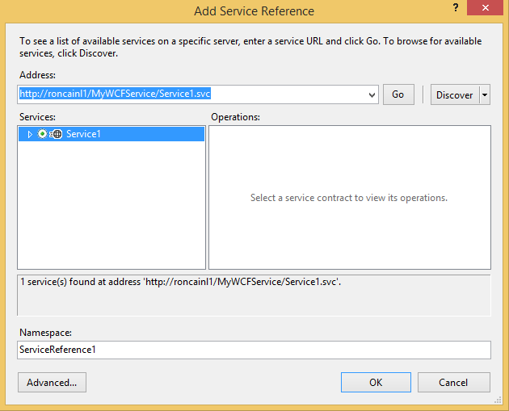

By using **Add Service Reference** we have caused code to be generated that can
communicate with our WCF service. This code is normally hidden, but if you're
curious what it looks like, click the **Show All Files** button in the
**Solution Explorer** and navigate to `Reference.cs`.

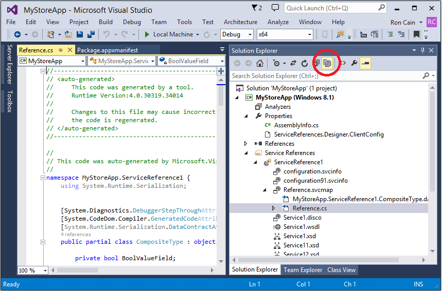

To reach our external WCF service, our app will need access to the network. We
do this by double-clicking `Package.appxmanifest`, selecting the
**Capabilities** tab and checking the **Internet and Private Network**
checkboxes.

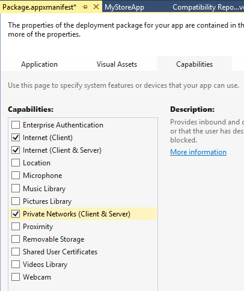

Now let's add some UI to the store app. Here I've double-clicked `MainPage.xaml`
and dragged from the **Toolbox** two `TextBox` controls and a `Button`. I used
the **Properties** pane (F4) to change their names to `TheInputBox`,
`TheOutputBox` and `TheButton`. I never claimed to be a designer or good at
naming pets.

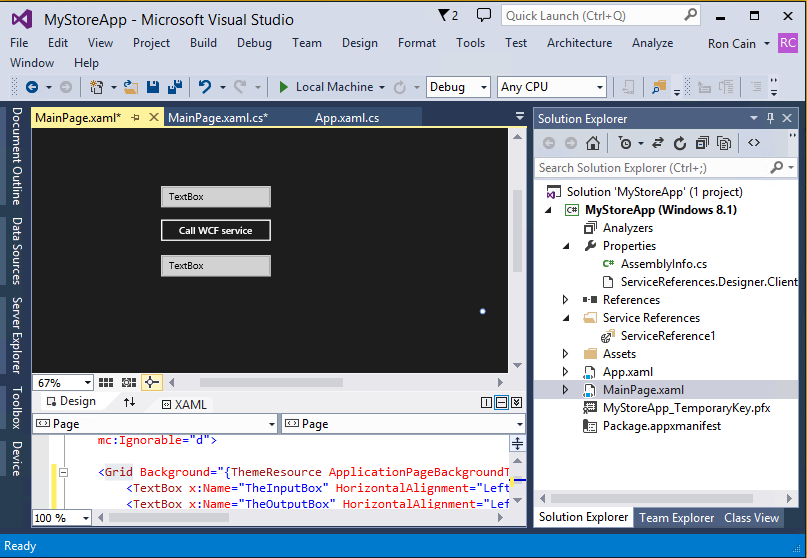

I changed `TheButton`'s text, and I also double-clicked on it to create a
handler. If you want to compare notes, this is what my XAML code looked like for
the `Grid`:

    <Grid Background="{ThemeResource ApplicationPageBackgroundThemeBrush}">
        <TextBox x:Name="TheInputBox" HorizontalAlignment="Left" Margin="203,197,0,0" TextWrapping="Wrap"
                 Text="TextBox" VerticalAlignment="Top" Height="31" Width="164" />
        <TextBox x:Name="TheOutputBox" HorizontalAlignment="Left" Margin="203,300,0,0" TextWrapping="Wrap"
                 Text="TextBox" VerticalAlignment="Top" Height="28" Width="164" />
        <Button x:Name="TheButton" Click="TheButton_Click" Content="Call WCF service"
                HorizontalAlignment="Left" Margin="200,244,0,0" VerticalAlignment="Top" Width="170" />
    </Grid>

All that remains to complete this as a normal Windows Store app is to wire up
the button. We do this by choosing **View Code** on `TheButton` and add this
code:

    private async void TheButton_Click(object sender, RoutedEventArgs e)
    {
        var client = new ServiceReference1.Service1Client();
        TheOutputBox.Text = await client.SayHelloAsync(TheInputBox.Text);
    }

It is worth looking at this code for a moment.

`ServiceReference1.Service1Client` is in the hidden file `Reference.cs`
generated by **Add Service Reference**. `SayHelloAsync()`` is the method that
was generated to invoke the `SayHello()` method of our WCF service. The method
name ends in `Async` to indicate it is asynchronous and returns a `Task`. In
this code we create a `Service1Client`, call `SayHelloAsync()` and `await` the
`Task` it returns. We use `await` because we don't want to block the UI thread.
The `Tasks`'s result obtained via `await` is the value returned from the server.
Note that we needed to add `async` to the `TheButton_Click` method signature so
that we could use `await`. I've omitted exception handling for brevity.

At this point, we've finished our conventional Windows Store app and can run it.
But the purpose of this sample is to show how we can make a conventional WCF
store app into a .NET Native app, so let's do that.

# Final step – make the app use .NET Native

First, we must change the configuration from **Any CPU** to target a specific
architecture. This is required for .NET Native. For this sample, let's use
**x64**.

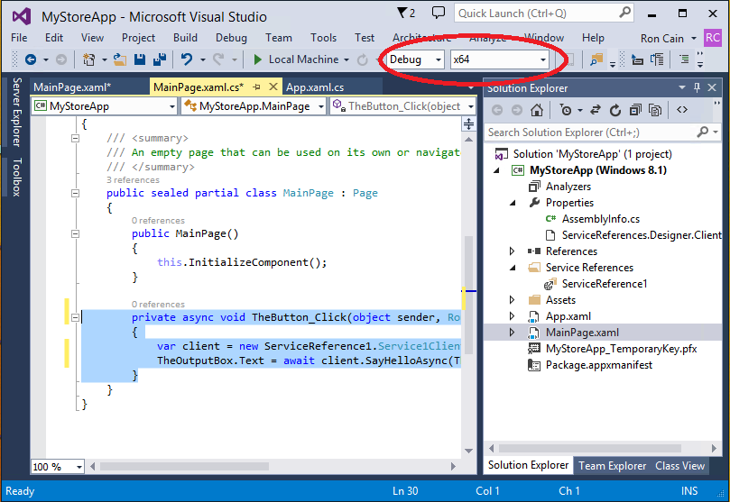

Then we right-click on the project and select **Enable for .NET Native**:

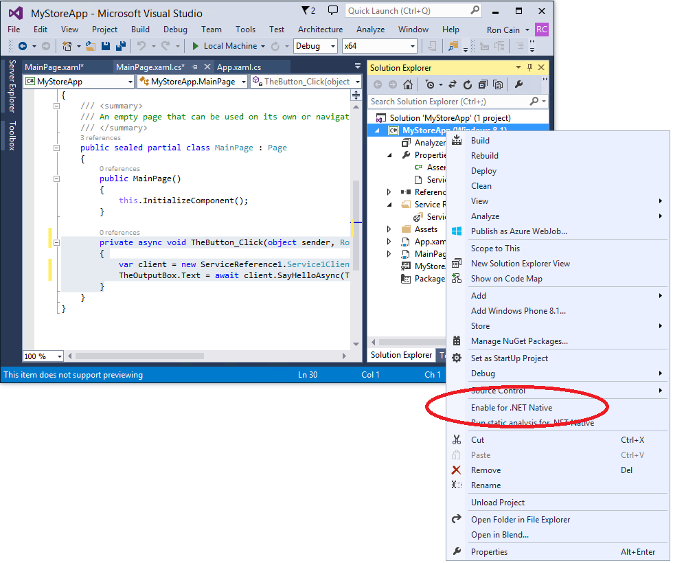

Setting this property triggers analysis of our code for compatibility with .NET
Native and produces a report identifying any issues. We'll see the report, but
we should not see any issues with this sample.

The final step is to configure the application to build as a .NET Native app. We
right-click on the project, choose Properties, and on the **Build** tab check
the **Compile with NET Native tool chain**.

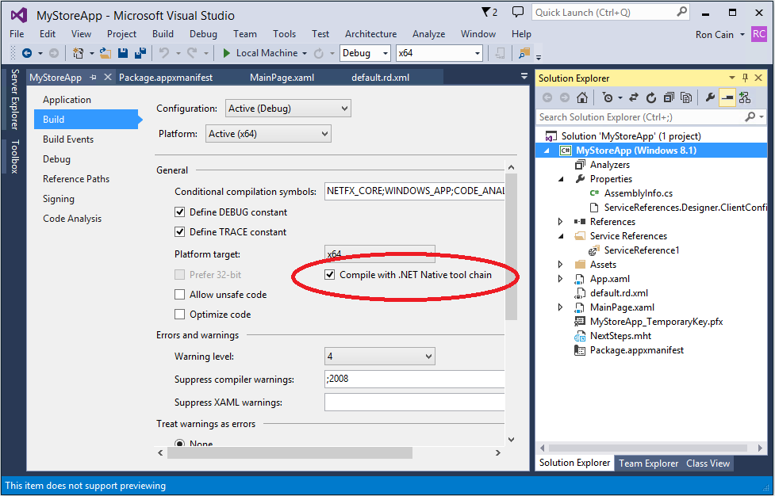

That's it. The app is complete and ready to use the .NET Native compiler when
it builds.

To test the app, we launch it in the debugger (<kbd>F5</kbd>), enter a name,
press the button, and see the reply back from the WCF service. There we have it!
We've sent a request from our .NET Native executable to the external WCF service
and received a successful reply.

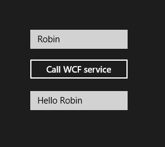

# Next steps

We encourage you to use this sample app and change the hosted WCF service
interface to do more interesting things, like exchanging complex
`[DataContract]` types, etc. Be aware that when you change the public interface
between the service and the client, you will need to click on the service
reference and choose **Update Service Reference**. This will contact the WCF
service, acquire the new service contract and update the generated code.

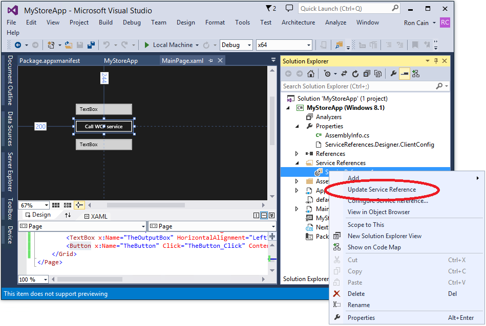

# Troubleshooting

Because this is a very early preview of WCF in .NET Native, you may encounter
issues. I'll give an example of one such issue and how it was resolved.

I built a .NET Native Windows Store app exactly as described in this post, but
experimentally used [Virtual Earth][VirtualEarth]. for the **Add Service Reference**.
When I tried to run it, I encountered an `InvalidOperationException` creating
the client. Debugging showed this app uses WCF's `FaultContractAttribute`, and
unfortunately we had not enabled Reflection over `FaultContractAttribute` in
CTP3 (oops).

The fix was to enable Reflection for that type from within the app itself. The
file `default.rd.xml` in the app contains **Runtime Directives** to the .NET
Native compiler. You can read more about the schema of this file and see some
[examples].

In my case, I edited this file as shown below to say "my app needs to use
Reflection on `System.ServiceModel.FaultContractAttribute`." With that change,
the exception was no longer thrown.

[VirtualEarth]: http://dev.virtualearth.net/webservices/v1/routeservice/routeservice.svc
[examples]: http://msdn.microsoft.com/en-us/library/dn600639(v=vs.110).aspx

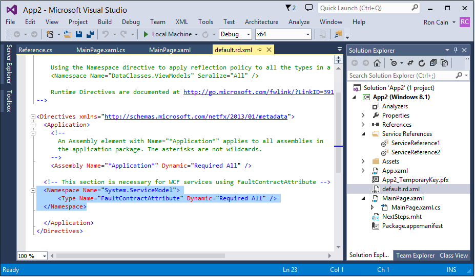

# Conclusion

We will continue to stabilize and enhance WCF for .NET Native in upcoming
releases. In future posts, we'll talk more about these enhancements and provide
more samples. We are very interested in hearing from you, especially about the
features you need and why they are important to you.

We welcome your feedback on the developer experience using WCF with.NET Native.
Please leave comments on this post or send mail to <dotnetnative@microsoft.com>.