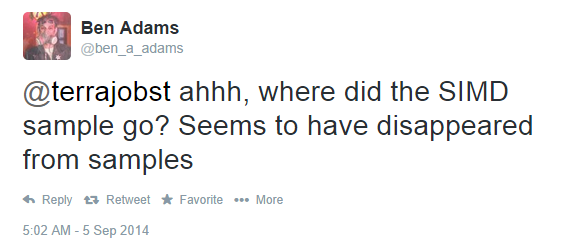
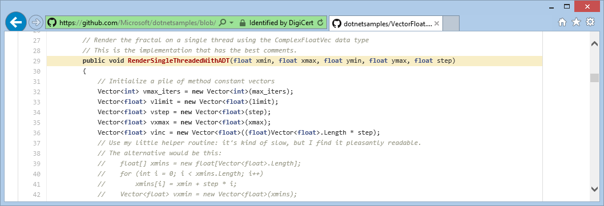

# .NET Sample Code on GitHub

Today, we're happy to announce that we've started to move some of our sample
assets over to GitHub, using the MIT license. So I can directly answer Ben's
question

with this tweet:

> It's now [here][SIMD].

# Why did we move to GitHub?

The reasons we decided to move the samples to GitHub is as follows:

1. We want to be where our community is
2. GitHub offers an awesome browsing experience
3. GitHub enables conceptual documentation to be located with sample code
4. We want to be able to accept contributions

Let me take them one by one.

## We want to be where our community is

It's where the majority of the .NET community is these days. Our principle is,
and has been, to go where our customers are, rather than asking them to move to,
say, MSDN Code Gallery.

## GitHub offers an awesome browsing experience

The nice thing with GitHub is that it allows us to link to parts of the samples.
For example, in SIMD [we can point][simd-pointer] you to a specific line of code
that shows how you can use the SIMD types to vectorize Mandelbrot:

<https://github.com/Microsoft/dotnetsamples/blob/master/System.Numerics/SIMD/Mandelbrot/VectorFloat.cs#L29>

## GitHub enables conceptual documentation to be located with sample code

Sample code usually comes with at least a `README` file that explains how to get
started. However, depending on the component the sample is for we may want to
include a more comprehensive documentation. While sample code and documentation
aren't a replacement for MSDN, but we think they can provide a starting point
for what will eventually become the official documentation.

Take, for example, the [CLR Memory Diagnostics (CLRMD)][clrmd] library. The
[README.md][clrmd-readme] file links to a more comprehensive documentation in
the [docs folder][clrmd-docs].

## We want to be able to accept contributions

Publishing our samples to GitHub streamlines any updates. Team members can
easily fix typos or clarify parts of the documentation using the web front-end.

But more importantly, **it also enables you** to provide sample code or propose
changes. Many of you have asked about this for years -- it's finally a reality!

# Summary

Please take a look at the [new sample site on GitHub][dotnetsamples] and let
us know if you have any feedback!

[dotnetsamples]: https://github.com/Microsoft/dotnetsamples
[simd]: https://github.com/Microsoft/dotnetsamples/tree/master/System.Numerics/SIMD
[simd-pointer]: https://github.com/Microsoft/dotnetsamples/tree/master/System.Numerics/SIMD#using-vectors-with-a-hardware-dependent-size
[clrmd]: https://github.com/Microsoft/dotnetsamples/tree/master/Microsoft.Diagnostics.Runtime/CLRMD
[clrmd-readme]: https://github.com/Microsoft/dotnetsamples/blob/master/Microsoft.Diagnostics.Runtime/CLRMD/README.md
[clrmd-docs]: https://github.com/Microsoft/dotnetsamples/tree/master/Microsoft.Diagnostics.Runtime/CLRMD/docs