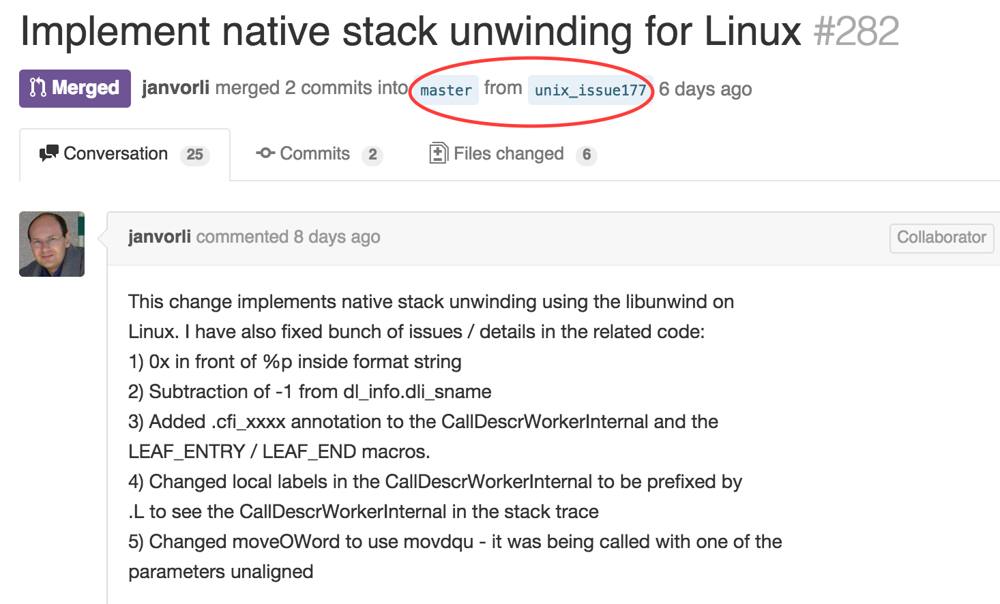
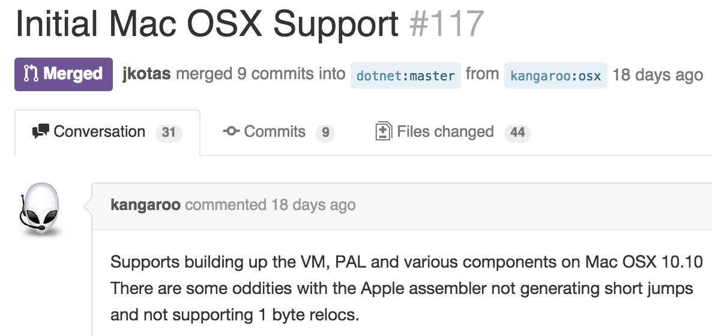
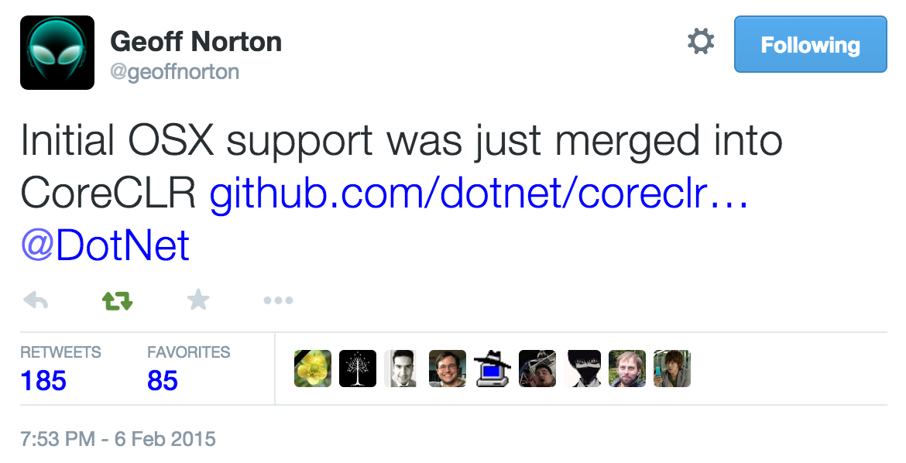
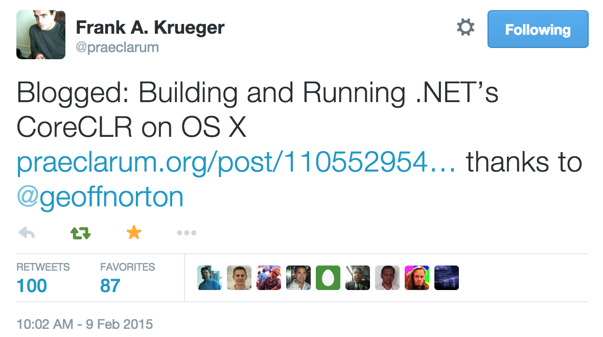
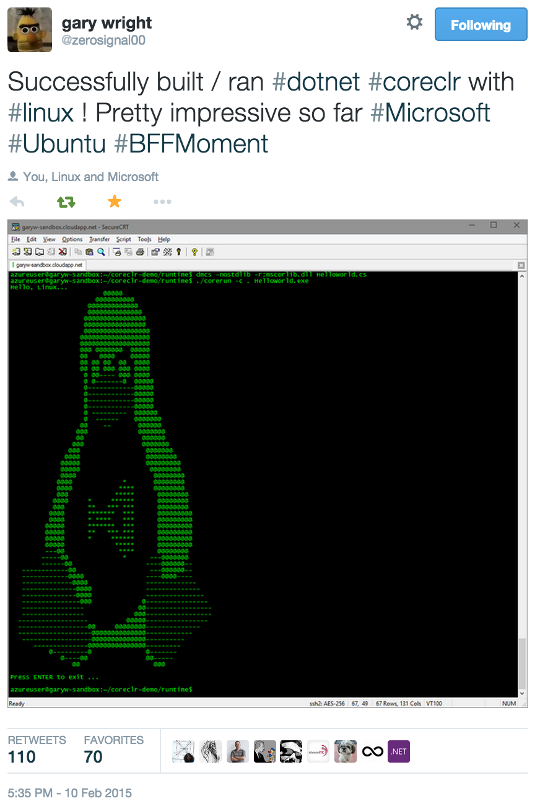
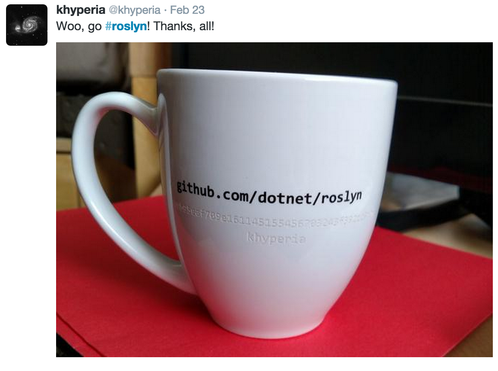

.NET Core Open Source Update
============================

It has been a couple weeks since we last reported on the .NET Core open source project. It's been a very fun time, watching more people get involved in the project and to see progress on a daily basis. It's amazing watching my GitHub news feed. I have to scroll through several page views just to get through the last hour (on a weekday) of [corefx](https://github.com/dotnet/corefx), [coreclr](https://github.com/dotnet/coreclr) and [roslyn](https://github.com/dotnet/roslyn) repo activity. Today, we're going to focus on the CoreCLR repo.

In addition to the growing community activity, there have been important product improvements that have been committed. Some of the key changes are coming from the community. That's very impressive. Wow and Thanks.

Work-in-progress
================

We published the CoreCLR source earlier this month, but did not immediately transition our work-in-progress feature work to be open and viewable. We received community encouragement to adopt a more transparent approach. We are following through on that.

People want to approach building a significant feature with the knowledge that Microsoft is not building the same thing. It would be very frustrating to see a PR closed (not merged) after putting several hours (or more) into it, due to inadequate coordination upfront. That's the anti-pattern.

There are two parts to that. The .NET Core team will:

- Publish issues, as both self-assign and _up-for-grabs_.
- Do work on a publicly visible branch (either coreclr/corefx or a fork).

Here are a few of the issues that we published using both the self-assign and up-for-grabs patterns. The act of publishing issues enables transparent ownership of issues, which is beneficial for everyone. 

- [Implement calling convention for structs passing in JIT for Linux and Mac](https://github.com/dotnet/coreclr/issues/200)
- [Implement a plugin for loading CoreCLR debugger extensions into LLDB](https://github.com/dotnet/coreclr/issues/202)
- [Port assembly code for JIT_MemSet and JIT_MemCpy to Linux and Mac](https://github.com/dotnet/coreclr/issues/199)

Doing feature work in the open means that anyone can:

- Watch changes as they are made, to understand and give feedback on the approach for a given feature, _before_ it is submitted as a PR.
- Collaborate as a group on the actual feature work.

Here's a [good example](https://github.com/dotnet/coreclr/pull/282) of one of the first features that was developed in the open. If you read the PR, you'll see an in-depth publicly-visible conversation, with both community and Microsoft folks. I cannot show you the actual branch anymore, since it has been (naturally) deleted. 

You can see that this feature was developed in a central branch on the coreclr repo. We will make use of both central branches and personal forks for feature work. We choose the branch location based on the level of discoverability and engagement that makes sense for a given feature. 

You might be wondering how to find out about these feature branches before they show up as PRs. Watch the [Issues](https://github.com/dotnet/coreclr/issues) queue. Feature branches should be advertised within the issues they 'implement'.

Most of you are are not paying attention at quite this level of detail. There are a set of folks who are making a significant set of contributions and for whom transparency matters a lot, for both product direction and code changes. We are making a real effort to cater to that need. Keep the feedback coming, so that we can continue to improve the transparency and communication.

Mac OS X Support
================

One of the biggest additions since we published the CoreCLR repo is the initial implementation of Mac OS X support. The internal Microsoft team has been focussed on Linux support, making Mac OS X support a great community-led project, in order to bring it up in parallel with Linux. 

[@kangaroo](https://github.com/kangaroo) has been leading the charge on Mac OS X. Thanks! Check out these two PRs if you want to look at the changes: [Mac OS X Support](https://github.com/dotnet/coreclr/pull/105) and [Initial Mac OS X Support](https://github.com/dotnet/coreclr/pull/117). There have been lots of changes since then.

You can see from the community response to the initial support announcement that there are a lot of folks that would like to see .NET Core on Mac OS X. Me, too!

[@praeclarum](https://twitter.com/praeclarum/status/564846894837272576) wrote a great set of instructions, [Building and Running .NET’s CoreCLR on OS X](http://praeclarum.org/post/110552954728/building-and-running-nets-coreclr-on-os-x), to help you follow along at home. Check it out.

You'll quickly see that the Mac OS X experience is still pretty raw. We'll publish an official set of instructions when the experience is a bit further along. For now, please do refer to @praeclarum's instructions.

Linux Support
=============

There is also a lot of great work going into Linux. [@mikem8361](https://github.com/mikem8361) is working on [getting SOS working on Linux](https://github.com/dotnet/coreclr/pull/304). I already mentioned the [stack unwinding feature](https://github.com/dotnet/coreclr/pull/282), based on libunwind. 

Like Mac OS X support, it is still "early days" in the project. That said, we have an enterprising community that likes to try things out. We'll publish official Linux instructions when we've got a good experience in place.

@zerosignal00 was one of the first to try out [.NET Core on Linux](https://twitter.com/zerosignal00/status/565323160477007874). 

Tracking progress on library work for .NET Core
===============================================

The previous [.NET Core Open Source Update](http://blogs.msdn.com/b/dotnet/archive/2015/01/28/net-core-open-source-update.aspx) attached a spreadsheet that allowed you to get a sense for which APIs we foresee .NET Core will have. To make tracking easier, we've create a new repository on GitHub, called
[dotnet/corefx-progress](https://github.com/dotnet/corefx-progress).

This repository is designed to allow you to track our progress towards publishing all of .NET Core library source. It's only provided as a temporary mechanism to allow you track the difference between what we've already open sourced and what is yet to come. As a result, we
don't intend you to contribute to this repository.

This repository contains the following folders:

* **lib-full**. These are the reference assemblies (i.e. assemblies without IL) that represent the entire surface area of all .NET Core libraries.
* **src-full**. This is the C# representation of the assemblies in `lib-full`.
* **src-oss**. This is the C# representation of the assemblies that are already open sourced, i.e. are available on GitHub.
* **src-diff**. For each assembly, this folder has a Markdown file that contains the unified diff between `src-full` and `src-oss`.

In order to understand what hasn't been open sourced what is coming, you should take a look at the [.NET Core: Library Open Source Progress][progress].

Alternatively you can clone this repository and use your favorite tool to diff the directories `src-full` and `src-oss`.

[progress]: https://github.com/dotnet/corefx-progress/tree/master/src-diff/README.m

Gitter Chat
===========

We received three PRs recently - [Add a Gitter chat badge to README.md](https://github.com/dotnet/coreclr/pull/153/files), [Add a Gitter chat badge to README.md](https://github.com/dotnet/corefx/pull/685) and [Add a Gitter chat badge to README.md](https://github.com/dotnet/roslyn/pull/525) - to publicize Gitter chat rooms created by [@migueldeicaza](https://github.com/migueldeicaza). This guy must like to talk about .NET!

Please drop into the Gitter rooms and join the crowd.

- [CoreFX](https://gitter.im/dotnet/corefx)
- [CoreCLR](https://gitter.im/dotnet/coreclr)
- [Roslyn](https://gitter.im/dotnet/roslyn)

Gitter is an impressive product. I like using it. It's the integration with GitHub (obviously!) that makes it a pleasure to use. That said, if someone likes a different chat room service, we're happy to publicize it, provided you can create an active community around it.

dotnet.github.io
================

Microsoft created the [.NET Foundation](http://www.dotnetfoundation.org) last year. We contributed .NET Core and other .NET components, like Roslyn, ASP.NET and Orleans, to it. Several other companies and individuals have contributed components. 

We've been spending a lot of time on GitHub, since most of the Microsoft projects are now there. There is a trend of hosting org.github.io pages to make it easier to discover repos. The [Netflix](http://netflix.github.io) and [Twitter](http://twitter.github.io) sites are great examples. We shamelessly borrowed their ideas.

Check out the [dotnet.github.io](http://dotnet.github.io) page we built for the .NET Foundation. It helps you discover [.NET Foundation project](http://www.dotnetfoundation.org/projects) repos. Repos are ordered in terms of  [_OSS Awesomeness_](http://dotnet.github.io/about.html), which is a concept we borrowed from Twitter.

Community Thanks!
=================

I was impressed to see the Roslyn team [recognize recent committers](https://twitter.com/khyperia/status/569992447708819456) to the Roslyn repo. I've heard folks on the team refer to these as sha-cups. That's quite classy.

We haven't sent out any cups for corefx and coreclr just yet (should we?). That said, we're equally appreciative for the level of support that we're seeing on a daily basis, almost 24 hours a day. Thanks to everyone who has contributed to the .NET Core project. If you haven't yet, I encourage you to get involved.