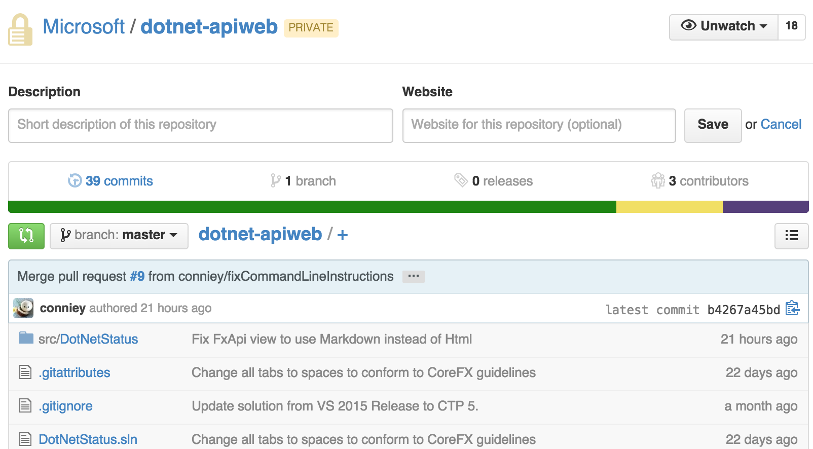

.NET Portability Analyzer
=========================

Today, we are releasing the source for the [.NET Portability website](https://github.com/Microsoft/dotnet-apiweb) on GitHub. The site is an MVC app built with [ASP.NET 5](https://github.com/aspnet/home). It's a good example of ASP.NET 5 code that you can look at, to see how the new web stack works. By virtue of using ASP.NET 5, this site can run on Windows, Linux and Mac.

The .NET Portability site provides access to the [.NET Portabilty Analyzer](http://dotnetstatus.azurewebsites.net) tools and [.NET API Usage](http://dotnetstatus.azurewebsites.net/usage) information. The API usage section displays the top used .NET APIs, allows you to search for supported APIs on each platform and displays porting recommendations. This aggregate information is collected from people who run the [.NET Portabilty Analyzer](http://dotnetstatus.azurewebsites.net) tool. 

We've also released [Microsoft.Fx.Portability](https://github.com/Microsoft/dotnet-apiport) on GitHub. It's a component used by the .NET Portability analyzers to communicate with our back-end Azure services. We are now publishing nightly builds of our dotnet-apiport repository to [myget](https://www.myget.org/gallery/dotnet-apiport) for anyone to consume.  This will allow developers to call the service using the Microsoft.Fx.Portability library and do things like search through the FX catalog for APIs.

To use this library, add a reference to our MyGet feed, [https://www.myget.org/F/dotnet-apiport](https://www.myget.org/F/dotnet-apiport) in NuGet settings, then search for the package (enable searching for prerelease pacakges). You can also add a reference via the Package Manager Console: `Install-Package Microsoft.Fx.Portability -IncludePrerelease`.  

The [code sample](https://github.com/Microsoft/dotnet-apiport/blob/master/samples/SearchFxApi/Program.cs) below shows how to find matching APIs using our Portability Service.

	public static void Main(string[] args)
	{
        var analysisService = new ApiPortService("https://portability.cloudapp.net", new ProductInformation("MyAPIQueryProgram"));

        Console.WriteLine("Enter API you want to search for:");
        var api = Console.ReadLine();

        var matchingApis = FindMatchingApis(analysisService, api).Result;

        Console.WriteLine("Enter the number of the API you want to get more information about.");

        for (int i = 0; i < matchingApis.Count; i++)
        {
            Console.WriteLine("[" + i + "] " + matchingApis[i].FullName);
        }

        var index = int.Parse(Console.ReadLine());

        var apiToSearchFor = matchingApis[index];
        var apiInformation = GetApi(analysisService, apiToSearchFor.DocId).Result;

        Console.WriteLine("These are the platforms this API is supported on: ");

        foreach (var platform in apiInformation.Supported.Select(x => x.FullName))
        {
            Console.WriteLine(platform);
        }

        Console.WriteLine("Enter any key to quit...");
        Console.ReadKey();
	}

You can watch the [dotnet-apiport](https://github.com/Microsoft/dotnet-apiport) repo for updates. We intend to open-source the [.NET Portability console tool](https://www.microsoft.com/en-us/download/details.aspx?id=42678) and [VSIX Extension](https://visualstudiogallery.msdn.microsoft.com/1177943e-cfb7-4822-a8a6-e56c7905292b). It would be great to know if these projects are valuable to you as open source. If you intend to use this code for your project, we'd appreciate talking with you to better align plans.

For more information, check out these more in-depth blog posts on the Portability Analyzer.

* [.NET Team Blog: Leveraging existing code across .NET platforms](http://blogs.msdn.com/b/dotnet/archive/2014/08/06/leveraging-existing-code-across-net-platforms.aspx)
* [Scott Hanselman: Getting ready for the future with the Microsoft .NET Portability Analyzer](http://www.hanselman.com/blog/GettingReadyForTheFutureWithTheMicrosoftNETPortabilityAnalyzer.aspx)

