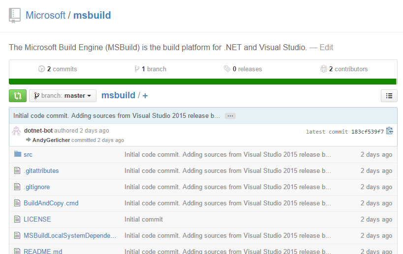

# MSBuild is now Open Source on GitHub

Today we are pleased to announce that [MSBuild](https://github.com/Microsoft/msbuild) is now available on [GitHub](https://github.com/Microsoft/msbuild) and we are contributing it to the [.NET Foundation](http://www.dotnetfoundation.org/)! The Microsoft Build Engine (MSBuild) is a platform for building applications. By invoking msbuild.exe on your project or solution file, you can orchestrate and build products in environments where Visual Studio isn't installed. For instance, MSBuild is used to build the [.NET Core Libraries](https://github.com/dotnet/corefx) and [.NET Core Runtime](https://github.com/dotnet/coreclr) open source projects.



The MSBuild sources we're publishing today are closely aligned with the version we will ship with Visual Studio 2015. You may notice a few differences as this is our first attempt at a standalone build, but you should see those discrepancies reduced over time. And keep in mind that for now, you'll need to have [Visual Studio 2015](http://www.visualstudio.com/downloads/visual-studio-2015-ctp-vs) installed in order to build the first time.

We will be adding Linux and Mac support soon (perhaps with your help!) so you can use MSBuild to build the open source .NET projects on your preferred platform. We'll initially start with Mono and look to port the code to run on .NET Core. But we're really just getting started on our ports. We wanted to open up the code first, so that we could all enjoy the cross-platform journey from the outset.

### Walkthrough

**Build the Source Tree**

The first scenario you might want to try is building the source tree and then using those binaries to build the sources again. To do this, you will need to have Visual Studio 2015 installed on your machine. From a Developer Command Prompt, run the following:

```
git clone https://github.com/Microsoft/msbuild.git
cd msbuild
build.cmd
RebuildWithLocalMSBuild.cmd
```

Note: This will create a folder `bin\MSBuild` in your source tree which you can use to build other managed projects, including MSBuild.

**Build a Console App**

To build a console app, you'll first want to run the BuildAndCopy.cmd script we included in the root folder of the source. This will build the sources and create a copy of your build output with everything you need. Again from a Developer Command Prompt, run this command from your MSBuild source location:
```
BuildAndCopy.cmd bin\MSBuild true
```
Now, to build a simple .NET Core console application, try the following:

```
cd ..\
git clone https://github.com/dotnet/corefxlab
.\msbuild\bin\MSBuild\MSBuild.exe .\corefxlab\demos\CoreClrConsoleApplications\HelloWorld\HelloWorld.csproj
.\corefxlab\demos\CoreClrConsoleApplications\HelloWorld\bin\Debug\HelloWorld.exe
```

# Summary

MSBuild is the default build engine for Visual Studio and the .NET community on the Windows platform. Through open sourcing MSBuild we are responding to community [feedback](http://forums.dotnetfoundation.org/t/compiling-net-core-code-on-linux-os-x/302/3) and we intend to make it the best choice for .NET developers on the Linux and Mac platforms.

You can learn about the opportunities to get involved [here](https://github.com/Microsoft/msbuild/wiki/Contributing%20Code). We look forward to your comments and hearing from you on the [.NET Foundation Forums](http://forums.dotnetfoundation.org/)!

Tags: MSBuild, open source, announcement
