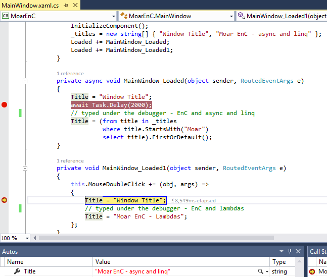

Visual Studio Improvements for .NET
===================================

The Visual Studio Team has added some key improvements for .NET in the RC release. There were many additional [Visual Studio improvements for .NET in the Preview release](http://blogs.msdn.com/b/dotnet/archive/2014/11/12/announcing-net-2015-preview-a-new-era-for-net.aspx#_Visual_Studio_Improvements) that you can also try out. 

Moar EnC - Lambda and Async Task support
========================================

Edit and Continue (EnC) is a great productivity feature that everyone (wants to) use every day. It enables you to edit your code while you are debugging it. This is useful for a lot of reasons, particularly if your code needs to interact with state that isn't directly part of an API (e.g. processing JSON files) and can be most easily discovered at runtime.

You can now use EnC with lambdas, async methods, LINQ and a few other situations. Given today's coding patterns, that's a huge jump forward for EnC usability. The following screenshot demonstrates the new support. There are two separate lines that were typed using this new support, one in an async method and the other in a lamda.

The following scenarios are now supported:

- Async functions
- Lambda expressions
- LINQ queries
- Functions with yield return expressions

In some cases, the combination of these features are not yet supported with EnC (e.g. async lamdas).

WPF - Live Visual Tree 
======================

Visual Studio includes a new viewer and editor for the XAML Visual Tree - Live! - while debugging a WPF app. It enables you to navigate the visual tree as it exists at any point in the life cycle of your app. You can edit properties on the tree, for example button text, which are then displayed in the running app. You cannot change the composition of the tree.

You can also select visual components in the running app. These selections will update the Live Visual Tree in Visual Studio, enabling you to focus in on the parts of your app that might need investigation or updates.

The Live Visual Tree is also connected to the XAML source editing experience. As you select XAML nodes in the Live Visual Tree, the selected textual XAML in the IDE changes to match. You always know which text matches, making it easy to find the line of XAML to look at or change.

The following screenshot demonstrates the Live Visual Tree and an app that has a button selected with the new feature. 

TODO: Get a better screenshot.

Perf Tips - Accuracy
====================

Perf Tips were introduced in one of the earlier Visual Studio 2015 CTPs. They provide performance information directly within Visual Studio, providing you with the performance cost of methods. It removes guessing and breaks assumptions.  The team found that the perf tips were not accurate enough. Internal measurement infrastructure in the .NET Framework was updated to measure operations in a different way. Perf Tips in the RC update are now taking adantage of the new infrastructure and are significantly more accurate.

TODO: Add screen shot of perf tips