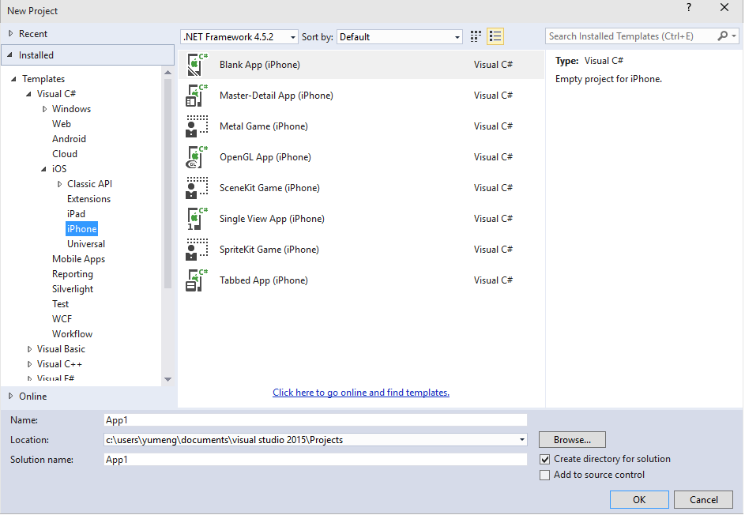

Xamarin Starter now Included in Visual Studio
=============================================

Xamarin is a great way to start building iOS and Android apps in C# or F# within Visual Studio. [Xamarin Starter Edition](http://xamarin.com/starter) is now included as a free optional feature within Visual Studio 2015.  Many .NET developers are using Xamarin to increase the reach of their apps and development effort to iOS and Android. According to a recent blog post, Xamarin has been downloaded by [1 Million unique developers](http://blog.xamarin.com/xamarin-passes-1-million-developer-milestone/). That's a lot.

To install Xamarin with Visual Studio 2015, select the _Custom_ installation option. Select the displayed checkbox below.

There are several additional application templates that are available for you to use after installing Xamarin Starter edition, for iOS (displayed below) and Android.

You can use Xamarin Starter editon as long as you want, build apps, test on devices and publish to app stores. You can start a [Xamarin Business trial](http://developer.xamarin.com/guides/cross-platform/getting_started/beginning_a_xamarin_trial/#Activating_a_Trial_in_Visual_Studio) to try out the richer experience. You can always return to Xamarin Starter Edition after that.