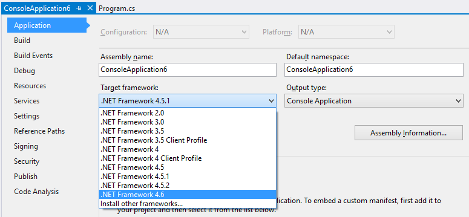

Targeting the .NET Framework 4.6
================================

The .NET Framework 4.6 is the latest version of the .NET Framework. The .NET Framework 4.6 exposes new APIs that you can use in your app or library. You can also use it to run existing apps.

Using Visual Studio 2015
========================

You can target the .NET Framework 4.6 using Visual Studio 2015. Visual Studio 2015 targets the .NET Framework 4.5.2 by default, since the .NET Framework 4.5.2 has been deployed broadly (globally). Targeting the .NET Framework 4.5.2 is the best choice, unless you specifically need the new APIs in the .NET Framework 4.6.

You can target the .NET Framework 4.6 by changing the _Target Framework_ for your app or library, under Project Properties. See how to do that in the image below.

Using Visual Studio 2012 or 2013
================================

You can target the .NET Framework 4.6 in Visual Studio 2012 and Visual Studio 2013. You can do that by installing the .NET Framework 4.6 Targeting Pack or installing Visual Studio 2015 on the same machine. 

You also need to install the .NET Framework 4.6 to run your app. It does not contain the targeting pack. The targeting pack and the framework are separate components.

Note: The targeting pack was released concurrently with the .NET Framework 4.6 but had an issue that is being addressed. It will be re-released shortly. 

On a Build Machine
==================

You can target the .NET Framework 4.6 as part of your build, to build 4.6 apps and libraries. You can do that by installing the .NET Framework 4.6 Targeting Pack.

Note: The .NET Framework 4.6 Targeting Pack was released concurrently with the .NET Framework 4.6 but had an issue that is being addressed. It will be re-released shortly. 

Using the .NET Framework 4.6
============================

By targeting the .NET Framework 4.6, your app will require the .NET Framework 4.6 (or later) to run. You will need to deploy the .NET Framework 4.6 or rely on your users to do that. See the Deploying the .NET Framework 4.6 section below for more information on deployment.

You can run existing apps built for the .NET Framework 4.0 and 4.5.x on the newer framework without making any changes to your apps. These existing apps will start using the .NET Framework 4.6 after it has been installed on a given machine. They will benefit from performance and reliability updates that are part of the .NET Framework 4.6

Deploying the .NET Framework
============================

The [Deploying the .NET Framework and Applications](https://msdn.microsoft.com/library/6hbb4k3e.aspx) guide describes several options for deploying the .NET Framework. It is important to choose an approach for ensuring that your users have the version of the .NET Framework that is needed to run your app.

As a last resort, your users will be prompted to download the .NET Framework if they attempt to run your app and it is not installed. They will be directed to the download location for the given version of the .NET Framework that they need.
