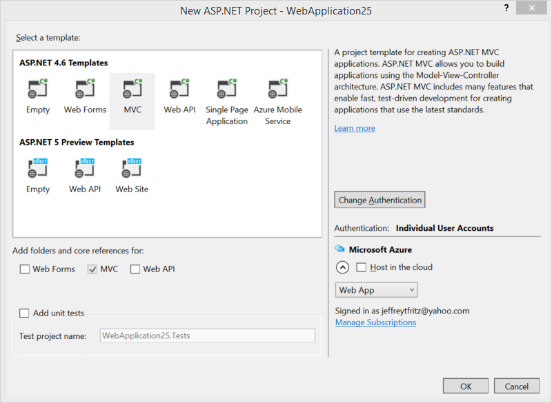
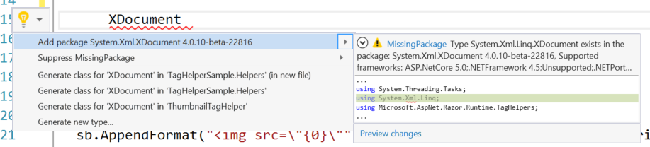

Announcing .NET Framework 4.6 RTM
=================================

We're excited to announce [.NET Framework 4.6](http://go.microsoft.com/fwlink/?LinkId=528259) and [Visual Studio 2015](http://go.microsoft.com/fwlink/?LinkId=517106), both as RTM releases, today. You can read about the new features or leave that for that and install these new versions now to try them out. The quickest way to get started is to install the free Visual Studio 2015 Community version.

With the .NET Framework 4.6, you'll enjoy better performance with the new 64-bit "RyuJIT" JIT and high DPI support for WPF and Windows Forms. ASP.NET provides HTTP/2 support when running on Windows 10 and has more async task-returning APIs. There are also major updates in Visual Studio 2015 for .NET developers, many of which are built on top of the new Roslyn compiler framework. The .NET languages -- C# 6, F# 4, VB 15 -- have been updated, too. 

We're also announcing updates to .NET Core and ASP.NET 5, both releasing as beta 5 today. We've also got news to share on .NET Universal Windows Platform tools, including .NET Native.

You can download and try out the releases now:

- [Visual Studio 2015](http://go.microsoft.com/fwlink/?LinkId=517106)
- [.NET Framework 4.6](http://go.microsoft.com/fwlink/?LinkId=528259)

As a team, we're really excited to share everything we've been working on:

- .NET Framework 4.6
- Visual Studio Improvements for .NET Developers
- ASP.NET
- .NET Core - for device and cloud
- .NET Universal Windows Apps (including .NET Native)

You can check out the earlier [RC](http://blogs.msdn.com/b/dotnet/archive/2015/04/29/net-announcements-at-build-2015.aspx) and [Preview](http://blogs.msdn.com/b/dotnet/archive/2014/11/12/announcing-net-2015-preview-a-new-era-for-net.aspx) releases to see how the release has developed over the last year. In fact, it's only been 14 months since we released the [.NET Framework 4.5.2](http://blogs.msdn.com/b/dotnet/archive/2014/05/05/announcing-the-net-framework-4-5-2-release.aspx). 

.NET Framework 4.6
==================

There are many great features in the [.NET Framework 4.6](http://go.microsoft.com/fwlink/?LinkId=528259). Some of these features, like RyuJIT and the latest GC updates, can provide improvements by just installing the .NET Framework 4.6. Give it at try!

Windows Presentation Foundation
-------------------------------

The team has made key improvements to WPF in this release:

### HDPI Improvements

HDPI support in WPF is now better in the .NET Framework 4.6. Changes have been made to Layout rounding to reduce instances of clipping in controls with borders. By default, this feature is enabled if your Target Framework is .NET Framework 4.6 (".NETFramework,Version=v4.6") or higher. Applications that target earlier versions of the framework can opt in into the new behavior by adding the following setting to an app.config file. The setting only takes effect when the application is running on the .NET Framework 4.6.

	<runtime>
		<AppContextSwitchOverrides value="Switch.MS.Internal.DoNotApplyLayoutRoundingToMarginsAndBorderThickness=false" />
	</runtime>

WPF windows straddling multiple monitors with different DPI settings (Multi-DPI setup) are now rendered without blacked out regions. You can opt out of this behavior by adding the following line to the <appSettings> section to disable this new Behavior:

	<appSettings>
		<add key="EnableMultiMonitorDisplayClipping" value="true"/>
	</appSettings>

Support for automatically loading the right cursor based on DPI setting has been added to [System.Windows.Input.Cursor](https://msdn.microsoft.com/library/dn823350.aspx). This enables you to provide a multi-image .cur file to the WPF platform and configure it to automatically pick up the right cursor based on the current DPI of the active display.

### Touch is better

The team adopted the double-tap threshold used by UWP applications, which is considered to be an industry-quality implementation. WPF now uses this same implementation on Windows 8.1 and above. 

Touch events are now more reliable. The [Connect issue](https://connect.microsoft.com/VisualStudio/feedback/details/903760/wpf-touch-services-are-badly-broken) requesting this change has been marked fixed.

### Transparent Child Window support

WPF in .NET 4.6 supports transparent child windows in Windows 8.1 and above. This enables you to create and compose non rectangular and transparent child windows in your top level Windows. You can enable this by setting the [UsesPerPixelTransparency property](https://msdn.microsoft.com/library/system.windows.interop.hwndsourceparameters.usesperpixeltransparency.aspx) to true in [HwndSourceParameters](https://msdn.microsoft.com/library/system.windows.interop.hwndsourceparameters.aspx).

See an example of an application that includes a heads-up-display, improved with a transparent child window.


Windows Forms Updates for High DPI
----------------------------------

Windows Forms High DPI support has been updated to include more controls. The [.NET Framework 4.5.2(http://blogs.msdn.com/b/dotnet/archive/2014/05/05/announcing-the-net-framework-4-5-2-release.aspx) included high DPI support for an initial set of Windows Forms controls.

The following controls have High DPI support in the .NET Framework 4.6: ComboBox, Cursor, DataGridView, DataGridViewColumn, DataGridViewComboBoxColumn, DomainUpDown, NumericUpDown, ToolStripComboBox, ToolStripMenuItem and ToolStripSplitButton.

This is an opt-in feature. To enable it, set the EnableWindowsFormsHighDpiAutoResizing element to true in the application configuration (app.config) file:

	<appSettings>
		<add key="EnableWindowsFormsHighDpiAutoResizing" value="true" />
	</appSettings>

Windows Communication Foundation
--------------------------------

WCF now supports SSL version TLS 1.1 and TLS 1.2, in addition to SSL 3.0 and TLS 1.0, when using NetTcp with transport security and client authentication. It is now possible to select which protocol to use, or to disable old lesser secure protocols. This can be done either by setting the System.ServiceModel.TcpTransportSecurity.SslProtocols property or by adding a line to a configuration file.

ADO.NET improvements
--------------------

ADO .NET now supports the [Always Encrypted](https://msdn.microsoft.com/library/mt147923.aspx) feature available in SQL Server 2016. With Always Encrypted, SQL Server can perform operations on encrypted data, and best of all the encryption key resides with the application inside the customer’s trusted environment and not on the server. Always Encrypted secures customer data so DBAs do not have access to plain text data. Encryption and decryption of data happens transparently at the driver level, minimizing changes that have to be made to existing applications. You can learn more about this feature on the [SQL Securtity Blog](http://blogs.msdn.com/b/sqlsecurity/).

Async
-----

For apps that target the .NET Framework 4.6, System.Threading.Tasks.Task and System.Threading.Tasks.Task objects inherit the culture and UI culture of the calling thread. The behavior of apps that target previous versions of the .NET Framework, or that do not target a specific version of the .NET Framework, is unaffected. For more information, see the "Culture and task-based asynchronous operations” section of the System.Globalization.CultureInfo class topic.

The System.Threading.AsyncLocal class allows you to represent ambient data that is local to a given asynchronous control flow, such as an async method. It can be used to persist data across threads. You can also define a callback method that is notified whenever the ambient data changes either because the AsyncLocal.Value property was explicitly changed, or because the thread encountered a context transition.

Some additional members support the task-based asynchronouspattern (TAP), such as System.Threading.Tasks.Task.CompletedTask, System.Threading.Tasks.Task.FromCanceled, System.Threading.Tasks.Task.FromException, and System.IO.Pipes.NamedPipeClientStream.ConnectAsync.

RyuJIT
------

RyuJIT is the next generation Just-In-Time (JIT) compiler for .NET. It uses a high-performance JIT architecture, focussed on high throughput JIT compilation. It is much faster than the existing _JIT64_ 64-bit JIT that has been used for the last 10 years (introduced in 2005 .NET 2.0 release). There was always a big gap in throughput between the 32- and 64-bit JITs. That gap has been closed, making it easier to exclusively target 64-bit architectures or migrate workloads from 32- to 64-bit.

RyuJIT is enabled for 64-bit processes running on top of the .NET Framework 4.6. Your app will run in a 64-bit process if it is compiled as 64-bit or AnyCPU, and run on a 64-bit operating system. RyuJIT is similarly integrated into .NET Core, as the 64-bit JIT.

We've used a transparent process over the last two years with RyuJIT. You've been able to read [RyuJIT blog posts](http://blogs.msdn.com/b/dotnet/archive/tags/ryujit/), try out several RyuJIT CTPs and (suprise!) can now even read and contribute to the [RyuJIT source code](https://github.com/dotnet/coreclr/tree/master/src/jit). Thanks to everyone who helped improve RyuJIT along the way to RTM. We fixed a lot of publicly-reported bugs and performance issues based on those CTP releases. It's been a pleasure for Microsoft engineers to adopt a more public development process with RyuJIT.

The project was initially targeted to improve high-scale 64-bit cloud workloads, although it has much broader applicability. We do expect to add 32-bit support in a future release.

SIMD
----


Garbage Collector Updates
-------------------------

The garbage collector has a few important improvements that reduce latency and improve memory utilization. The GC update has already been deployed to large Microsoft cloud workloads, such as Office 365 and Bing. We've seen impressive improvements in the performance of those services. They've simply deployed the update, without any code changes.

The GC now handles pinned objects in a more optimized way. It is now possible for the GC to compact more memory around pinned objects. This change can provide a suprisingly impactful improvement for large-scale workloads with significant use of pinning.

Promotion of generation 1 objects to generation 2 has been updated to use memory more efficiently. The GC attempts to use free space in a given generation before allocating a new memory segment. A new algorithm has been adopted that uses a free space region to allocate an object that more closely matches the object size.

The Garbage Collector has a new mode that avoids garbage collection while certain memory-related conditions are met. This new mode is important for low-latency workloads that cannot afford interuptions.

The new mode enables you to [specify a certain amount of memory be available](https://msdn.microsoft.com/library/system.gc.trystartnogcregion.aspx) as a pre-requisite to enter a _No GC Region_. While in the region the GC will not collect. It will start collecting if a collection is explicitly requested (e.g. [GC.Collect](https://msdn.microsoft.com/library/system.gc.collect.aspx)) or if the initially specified memory size is exhausted.

The new mode exposes multiple points of configuration, including allowing you to specify the memory available for the small and large object heaps separately, for use within the No GC region. 

Networking Enhancements
-----------------------

Networking in the .NET Framework 4.6 supports socket reuse. Ordinarily, there is an artificial concurrent connection limit of 64K in Windows, which can limit the scalability of a service and cause local port exhaustion as the number of clients of high-scale online services grows. In the .NET Framework 4.6, the System.Net.Sockets.SocketOptionName.ReuseUnicastPort enumeration value and the System.Net.ServicePointManager.ReusePort property, have been added to enable port reuse, which effectively removes the 64K limit on concurrent connections. 

By default, the System.Net.ServicePointManager.ReusePort property is false unless the HWRPortResueOnSocketBind value of the HKLM\SOFTWARE\Microsoft.NETFramework\v4.0.30319 registry key is set to 0x1. To enable local port reuse on HTTP connections, set the System.Net.ServicePointManager.ReusePort property to true. This causes all outgoing TCP socket connections from System.Net.Http.HttpClient and System.Net.HttpWebRequest to use a new Windows 10 socket option, SO_REUSE_UNICASTPORT, that enables local port reuse.

Developers writing a sockets-only application can specify the System.Net.Sockets.SocketOptionName.ReuseUnicastPort option when calling a method such as System.Net.Sockets.Socket.SetSocketOption so that outbound sockets reuse local ports during binding.

A new property, System.Uri.IdnHost, has been added to the System.Uri class to better support international domain names and PunyCode.

Cryptography Updates
--------------------

The team is updating the [System.Security.Cryptography APIs](https://msdn.microsoft.com/library/system.security.cryptography.aspx) to support the [Windows CNG cryptography APIs](https://msdn.microsoft.com/library/windows/desktop/aa376214.aspx). To date, the .NET Framework has use an earlier version of [Windows Cryptography APIs](https://msdn.microsoft.com/library/windows/desktop/aa380255.aspx) as the basis of the System.Security.Cryptography implementation. We have had requests to support the CNG API, since it supports [modern cryptography algorithms](https://msdn.microsoft.com/library/windows/desktop/bb204775.aspx#suite_b_support), which are important for certain categories of apps. In this update, the team has added support to use CNG certificate keys with the [X509Certificate class](https://msdn.microsoft.com/library/system.security.cryptography.x509certificates.x509certificate.aspx).
  
This update is the first step towards broader support for the Windows CNG API and for more modern cryptography algorithms generally. Note that team is still in the middle of building this new support, so expect the API to change for RTM.

Unix Time
---------

You can now more easily convert date and time values to or from .NET Framework types and Unix time. This can be necessary, for example, when converting time values between a JavaScript client and .NET server. The following APIs have been added to the DateTimeOffset structure:

- static DateTimeOffset FromUnixTimeSeconds(long seconds)
- static DateTimeOffset FromUnixTimeMilliseconds(long milliseconds)
- long DateTimeOffset.ToUnixTimeSeconds()
- long DateTimeOffset.ToUnixTimeMilliseconds()

Channel support for EventSource
-------------------------------

You now can use .NET EventSource instrumentation to log significant administrative or operational messages to the event log, in addition to any existing ETW sessions created on the machine.

Compatibility Switches
----------------------

AppContext is a new compatibility feature that enables library writers to provide a uniform opt-out mechanism for new functionality for their users. It established a loosley-coupled contract between components in order to communicate an opt-out request. This capability is typically important when a change is made to existing functionality. Conversely, there is already an implicit opt-in for new functionality.

With AppContext, libraries define and expose compatibility switches, while code that depends on them can set those switches, to affect the library behavior. By default libraries provide the new functionality and only alter it (e.g. provide the old behavior) if the switch is set.

An application (or a library) can declare the value (always boolean) of a switch that a dependent library defines. The switch is always implicity `false`. Setting the switch to `true` enables the switch. Explicity the switch to `false` provides the new behavior.

	AppContext.SetSwitch("Switch.AmazingLib.ThrowOnException”, true)

The library must check if a consumer has declared the value of the switch and then appropraitely act on it.

<script src="https://gist.github.com/richlander/7ab29fe9ffa71eabe9be.js"></script>

It's beneficial to use a consistent format for switches, since they are a formal contract exposed by libraries. The following are two obvious formats.  

- Switch.namespace.switchname
- Switch.library.switchname

This same infrastructure is used by the .NET Framework internally, to enable developers to opt out of updates to existing functionality.

Other Base Class Library changes
--------------------------------

- A number of collection objects, such as System.Collections.Generic.Queue and System.Collections.Generic.Stack, now implement System.Collections.Generic.IReadOnlyCollection.
- The System.Globalization.CultureInfo.CurrentCulture and System.Globalization.CultureInfo.CurrentUICulture properties are now read-write rather than read-only. If you assign a new System.Globalization.CultureInfo object to these properties, the current thread culture defined by the Thread.CurrentThread.CurrentCulture property and the current UI thread culture defined by the Thread.CurrentThread,CurrentUICulture properties also change.
- The System.Numerics namespace now includes a number of SIMD-enabled types for scientific computing, such as System.Numerics.Matrix3x2, System.Numerics.Matrix4x4, System.Numerics.Plane, System.Numerics.Quaternion, System.Numerics.Vector2, System.Numerics.Vector3, and Vector4T:System.Numerics.Vector4.

Entity Framework
================

There are two versions of Entity Framework currently under development.

- [EF 6.1.3](http://blogs.msdn.com/b/adonet/archive/2015/03/10/ef6-1-3-rtm-available.aspx) is recommended for production workloads. It contains fixes for high priority issues that were reported on EF 6.1.2.
- [EF 7](http://blogs.msdn.com/b/adonet) introduces some significant changes and improvements over EF6.x. In particular, it provides an implementation for .NET Core, including support for Linux, OS X and Windows. You can use it in ASP.NET 5 and UWP apps. Like EF 6.x, it is also supported on the .NET Framework. It is not yet supported in production workloads.

EF 7 currently supports the following databases, with the beta 5 release:

- SQL Server
- PostgreSql (via the npgsql provider)
- SQL Compact
- SQLite
- InMemory (intended for testing purposes only)

.NET Languages
==============

The .NET languages team is releasing final updates to C# 6, F# 4 and VB 14 today. This includes final language specs and compiler implementations. The language specs were actually [complete at RC](http://blogs.msdn.com/b/dotnet/archive/2015/04/29/net-announcements-at-build-2015.aspx#dotnetlang).

C# 6 and VB 14
--------------

C# and VB are both part of the [Roslyn compiler](https://github.com/dotnet/roslyn). You can see the language specs for the new versions in the [Roslyn GitHub wiki](https://github.com/dotnet/roslyn/wiki/Languages-features-in-C%23-6-and-VB-14).

The following language features are a subset of the new capabilities you can use starting today in either language. Some of the other [new language features](https://github.com/dotnet/roslyn/wiki/Languages-features-in-C%23-6-and-VB-14) are unique to one language or the other. 

**String interpolation:** An intuitive String.Format-like syntax for composing strings from templates with inline expressions.

C#

``` c#
var s = $"{p.Name} is {p.Age} year{{s}} old";
```

VB

The **Null-Conditional operator (?.):** A streamlined syntax for conditionally accessing a member or invoking a method on a value if it's non-null and returning null if the object is null instead of throwing a NullReferenceException.

C#

``` c#
int length = customers?.Length ?? 0; // 0 if customers is null
```

VB


The **NameOf operator:** A rename-safe way to refer to the name of a code element such as in PropertyChanged events and ArgumentExceptions.

C#

``` c#
(if x == null) throw new ArgumentNullException(nameof(x));
```

VB


**Read-only Auto-Properties:** A concise syntax for declaring properties which may only be assigned in their initializers or inside of a constructor.

C#

``` c#
public class Customer
{
    public string First { get; } = "Jane";
    public string Last { get; } = "Doe";
}
```

VB


**Using static members:** Enables a concise syntax for calling static methods without type qualification.

C#

``` c#
using static System.Console;
using static System.Math;
using static System.DayOfWeek;
class Program
{
    static void Main()
    {
        WriteLine(Sqrt(3*3 + 4*4)); 
        WriteLine(Friday - Monday); 
    }
}
```

VB


F# 4
----

Content here.


Visual Studio Improvements for .NET
===================================

Visual Studio 2015 includes major improvements for .NET. 

EnC - Lambda and Async Task support
-----------------------------------

Edit and Continue (EnC) is a great productivity feature that everyone (wants to) use every day. It enables you to edit your code while you are debugging it. This is useful for a lot of reasons, particularly if your code needs to interact with state that isn't directly part of an API (e.g. processing JSON files) and can be most easily discovered at runtime.

You can now use EnC with lambdas, async methods, LINQ and a few other situations. Given today's coding patterns, that's a huge jump forward for EnC usability. You can check out the set of [EnC improvements the team already released](http://blogs.msdn.com/b/csharpfaq/archive/2015/02/23/edit-and-continue-and-make-object-id-improvements-in-ctp-6.aspx) in Visual Studio CTP 6.

The following screenshot demonstrates the new support. There are two separate lines that were typed using this new support, one in an async method and the other in a lamda.


The following scenarios are now supported:

- Async functions
- Lambda expressions
- LINQ queries
- Iterator functions

EnC improvements are still in progress and we are working to support more scenarios (and providing more documentation). Please [file any issues](https://github.com/dotnet/roslyn/issues) you come across on our GitHub.

> **Note:** If you don't understand why an edit fails, try checking the Error List. There are explanations for errors there that should help clarify issues. Please file an issue if you find these messages confusing or if they do not exist for your error.

Read more about [earlier EnC improvements](http://blogs.msdn.com/b/csharpfaq/archive/2015/02/23/edit-and-continue-and-make-object-id-improvements-in-ctp-6.aspx) from Visual Studio 2015 CTP 6, such as modifying iterators, async/await, methods, etc.

Debugger Improvements 
---------------------

Visual Studio 2015 addresses many requests that you have made for improving your debugging life, such as [lambda debugging](http://blogs.msdn.com/b/visualstudioalm/archive/2014/11/12/support-for-debugging-lambda-expressions-with-visual-studio-2015.aspx), [Edit and Continue (EnC) improvements](http://blogs.msdn.com/b/visualstudioalm/archive/2015/02/23/enc-improvements-for-net-debugging-in-visual-studio-2015.aspx), [child-process debugging](http://blogs.msdn.com/b/visualstudioalm/archive/2014/11/24/introducing-the-child-process-debugging-power-tool.aspx), as well revamp core experiences such as [powerful breakpoint configuration](http://blogs.msdn.com/b/visualstudioalm/archive/2014/10/06/new-breakpoint-configuration-experience.aspx) and introduce a [new Exceptions Settings tool window](http://blogs.msdn.com/b/visualstudioalm/archive/2015/02/23/the-new-exception-settings-window-in-visual-studio-2015.aspx). We also pushed the state of the art by integrating performance tooling into the debugger with [PerfTips](http://blogs.msdn.com/b/visualstudioalm/archive/2014/08/18/perftips-performance-information-at-a-glance-while-debugging-with-visual-studio.aspx) and the [all new Diagnostic Tools window](http://blogs.msdn.com/b/visualstudioalm/archive/2015/01/16/diagnostic-tools-debugger-window-in-visual-studio-2015.aspx) which includes the [redesigned IntelliTrace](http://blogs.msdn.com/b/visualstudioalm/archive/2015/01/16/intellitrace-in-visual-studio-ultimate-2015.aspx) for historical debugging and the [Memory Usage tool](http://blogs.msdn.com/b/visualstudioalm/archive/2014/11/13/memory-usage-tool-while-debugging-in-visual-studio-2015.aspx).

WPF - Live Visual Tree 
======================

Visual Studio includes a new viewer and editor for the XAML Visual Tree - Live! - while debugging a WPF app. It enables you to navigate the visual tree as it exists at any point in the life cycle of your app. You can edit properties on the tree, for example button text, which are then displayed in the running app. You cannot change the composition of the tree.

You can also select visual components in the running app. These selections will update the Live Visual Tree in Visual Studio, enabling you to focus in on the parts of your app that might need investigation or updates.

The Live Visual Tree is also connected to the XAML source editing experience. As you select XAML nodes in the Live Visual Tree, the selected textual XAML in the IDE changes to match. You always know which text matches, making it easy to find the line of XAML to look at or change.

The following screenshot demonstrates the Live Visual Tree and an app that has a button selected with the new feature. 


TODO: Get a better screenshot.

Updated New Project Dialog
--------------------------

The addition of ASP.NET 5 as new separate version of ASP.NET motivated the team to re-work the ASP.NET _New ASP.NET Project_ dialog in Visual Studio. ASP.NET 4.6 and ASP.NET 5 are clearly divided, making it easy to choose which type of app you want to build. The ASP.NET 5 section has fewer choices since more of the scenarios are integrated now. For examoke, you can opt to make your Web API a Mobile service at any time. 



Missing NuGet Packages - No Longer
----------------------------------

The transition from the monolithic .NET Framework to distributing all of .NET as NuGet packages has a lot of advantages, but has come with some challenges, including package discovery. You can now resolve NuGet package references in a similar way as you can resolve missing namespace references for types. 

In the example below, the XDocument type (just the text `XDocument`) is resolved to its type definition with a simple `CTRL .`. The using statement is added to the file and the System.Xml.XmlDocument NuGet package. 



We wanted to make it easy to copy some code from [StackOverflow](http://stackoverflow.com/questions/tagged/asp.net), for example, and resolve type and package references quickly and easily. Please tell us if we've achieved that goal.

Enabling the .NET Compiler Platform (“Roslyn”) in ASP.NET applications
----------------------------------------------------------------------

You can use the new language features of C# and VB in any ASP.NET 4.6 project. The Web Forms templates in VS 2015 have the [Microsoft.CodeDom.Providers.DotNetCompilerPlatform package](https://www.nuget.org/packages/Microsoft.CodeDom.Providers.DotNetCompilerPlatform) pre-installed. For VS 2015 RTM, it will be installed in all templates. Read [Enabling the .NET Compiler Platform (“Roslyn”) in ASP.NET applications](http://blogs.msdn.com/b/webdev/archive/2014/05/12/enabling-the-net-compiler-platform-roslyn-in-asp-net-applications.aspx) post for more details.

Async Model Binding for Web Forms
---------------------------------

In the .NET Framework 4.5, Model Binding support was added to Web Forms. In the .NET Framework 4.6, we are adding support for Async Model Binding which allow you write Asynchronous Model Binding actions. The following code snippet shows a Web Forms page using Async Model Binding actions.

<script src="https://gist.github.com/rustd/f3ccd70472c9f06c3f47.js"></script>

HTTP/2 Support (Windows 10)
---------------------------

[HTTP/2](http://en.wikipedia.org/wiki/HTTP/2) support has been added to ASP.NET in the .NET Framework 4.6. New features were required in Windows, in IIS and in ASP.NET to enable HTTP/2 given that networking functionality exists at multiple layers. You must be running on Windows 10 to use HTTP/2 with ASP.NET. HTTP/2 has not yet been added to ASP.NET 5.

HTTP/2 is a new version of the HTTP protocol that provides much better connection utilization (fewer round-trips between client and server), resulting in lower latency web page loading for users.  Web pages (as opposed to services) benefit the most from HTTP/2, since the protocol optimizes for multiple artifacts being requested as part of a single experience. 

The browser and the webserver (IIS on Windows) do all the work. You don't have to do any heavy-lifting for your users. You can opt-in to HTTP/2 by doing A, B and C. You can see ASP.NET serving HTTP/2 traffic in the Fiddler screenshot below. 

Screen-shot of HTTP/2 traffic with fiddler.

Most of the [major browsers](http://en.wikipedia.org/wiki/HTTP/2#Browser_support) support HTTP/2, so it's likely that your users will benefit from HTTP/2 support if your server supports it. Give it a try with the RC update.

Support for Token Binding Protocol
----------------------------------

Microsoft and Google have been collaborating on a new approach to authentication, called the [Token Binding Protocol](https://github.com/TokenBinding/Internet-Drafts). The premise is that  authentication tokens (in your browser cache) can be stolen and used by criminals to access otherwise secure resources (e.g. your bank account) without the requirement of your password or any other priviliged knowledge. The new protocol aims to mitigate this problem.

The Token Binding Protocol will be implemented in Windows 10, as a browser feature. ASP.NET apps will participate in the protocol, such that authentication tokens are validated to be legitimate. The client and the server implementations establish the end-to-end protection specified by the protocol.

