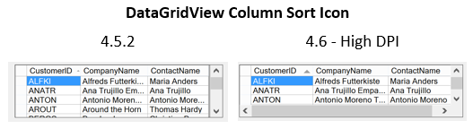
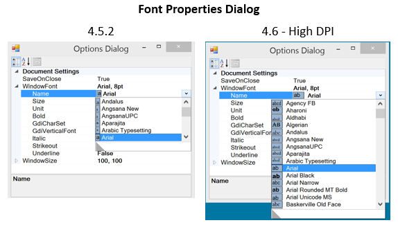
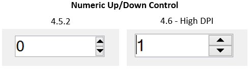
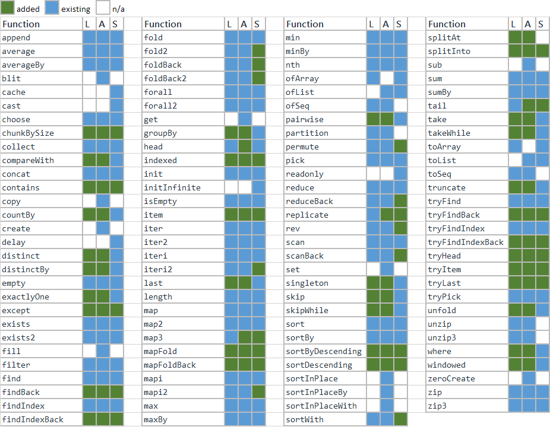
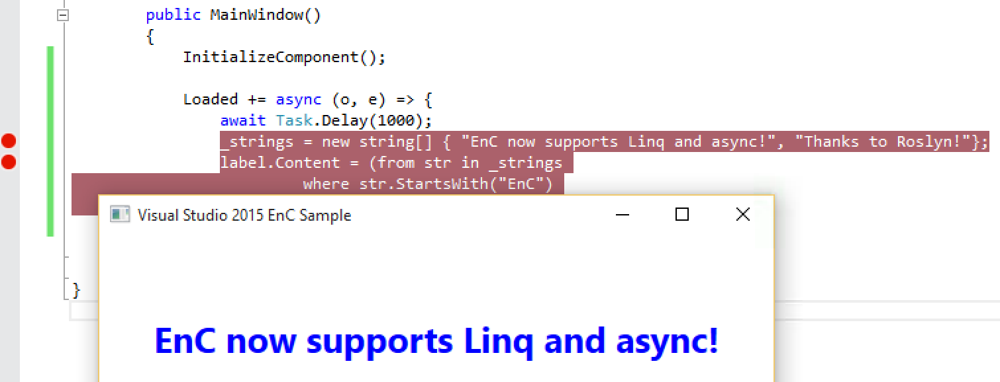
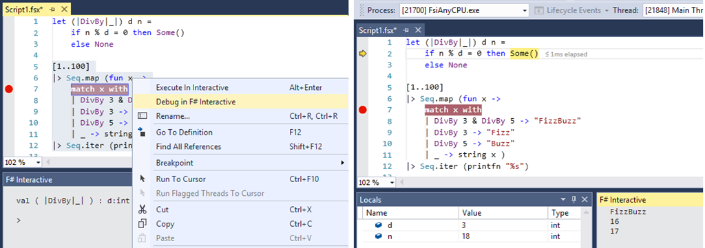
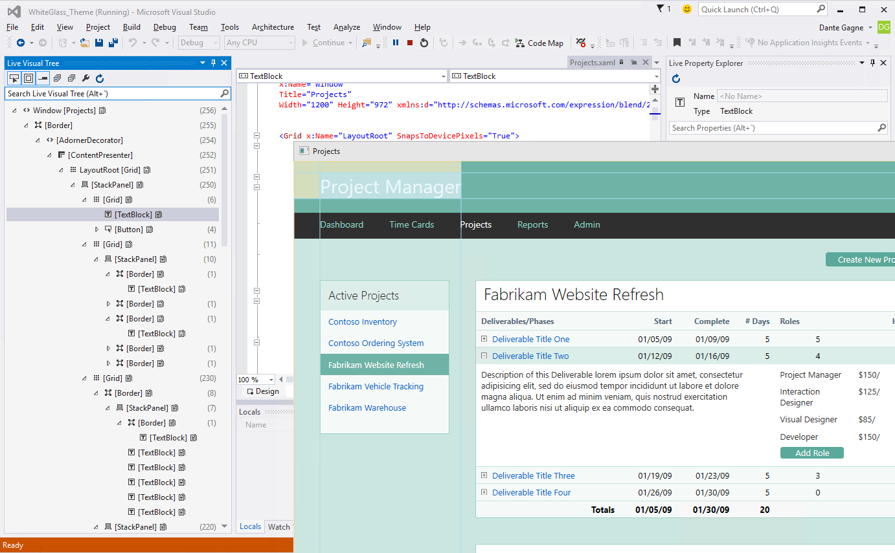
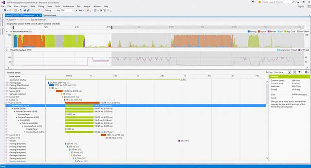
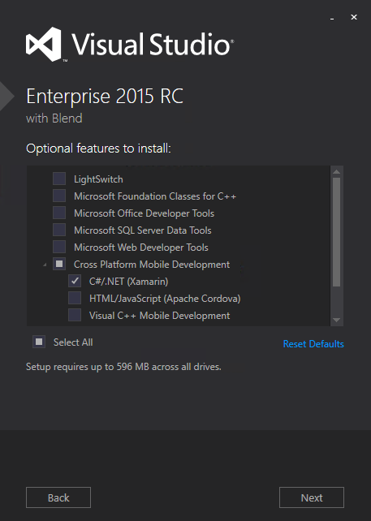
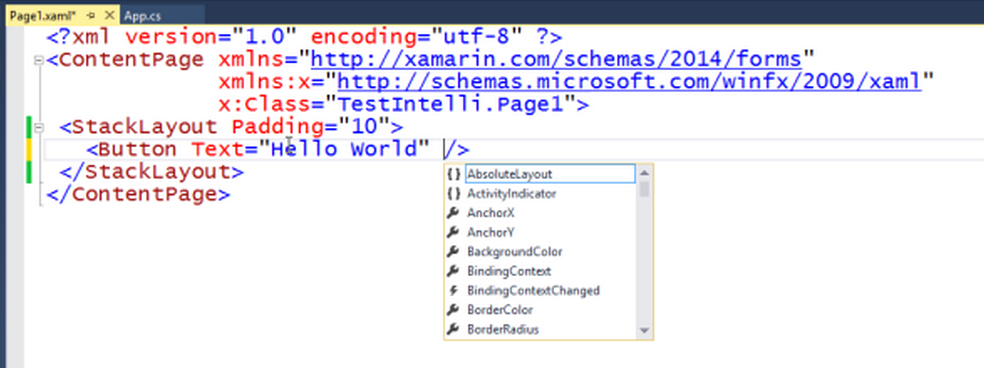

Announcing .NET Framework 4.6
=============================

We're excited to announce the RTM releases of [.NET Framework 4.6](http://go.microsoft.com/fwlink/?LinkId=528259) and [Visual Studio 2015](http://go.microsoft.com/fwlink/?LinkId=517106) today. You can read about the new features or leave that for later and try them out now. The quickest way to get started is to install the free Visual Studio 2015 Community version.

With the .NET Framework 4.6, you'll enjoy better performance with the new 64-bit "RyuJIT" JIT and high DPI support for WPF and Windows Forms. ASP.NET provides HTTP/2 support when running on Windows 10 and has more async task-returning APIs. There are also major updates in Visual Studio 2015 for .NET developers, many of which are built on top of the new Roslyn compiler framework. The .NET languages -- C# 6, F# 4, VB 15 -- have been updated, too. 

We're also announcing updates to .NET Core and ASP.NET 5, both releasing as beta 5 today. We've also got news to share on .NET Universal Windows Platform tools, including .NET Native.

You can download and try out the releases now:

- [Visual Studio 2015](http://go.microsoft.com/fwlink/?LinkId=517106)
- [.NET Framework 4.6](http://go.microsoft.com/fwlink/?LinkId=528259)

As a team, we're really excited to share everything we've been working on:

- .NET Framework 4.6
- ASP.NET 4.6
- Entity Framework
- .NET Languages
- Visual Studio Improvements for .NET Developers
- .NET Core and ASP.NET 5
- .NET Universal Windows Apps (including .NET Native)

You can check out the earlier [RC](http://blogs.msdn.com/b/dotnet/archive/2015/04/29/net-announcements-at-build-2015.aspx) and [Preview](http://blogs.msdn.com/b/dotnet/archive/2014/11/12/announcing-net-2015-preview-a-new-era-for-net.aspx) releases to see how the release has developed over the last year. In fact, it's only been 14 months since we released the [.NET Framework 4.5.2](http://blogs.msdn.com/b/dotnet/archive/2014/05/05/announcing-the-net-framework-4-5-2-release.aspx). 

.NET Framework 4.6
==================

There are many great features in the [.NET Framework 4.6](http://go.microsoft.com/fwlink/?LinkId=528259). Some of these features, like RyuJIT and the latest GC updates, can provide improvements by just installing the .NET Framework 4.6. Give it at try!

You learn more about the release by looking at [What's New in the .NET Framework](https://msdn.microsoft.com/library/ms171868.aspx#v46), the [.NET Framework 4.6 release changelist](https://github.com/microsoft/dotnet) and an [framework library API diff](https://github.com/microsoft/dotnet) between the .NET Framework 4.6 and 4.5.2 releases. Check out the [ASP.NET Team post](http://blogs.msdn.com/b/webdev/archive/2015/07/20/announcing-asp-net-4-6-and-asp-net-5-beta-5-in-visual-studio-2015-release.aspx) to learn more about ASP.NET updates.

Reference Source
----------------

The .NET Framework reference source has been updated for the .NET Framework 4.6. You can see the latest source at the [.NET Framework Reference Source Website](http://referencesource.microsoft.com/), which is also used for [.NET Framework source debugging](http://blogs.msdn.com/b/dotnet/archive/2014/02/24/a-new-look-for-net-reference-source.aspx). 

The [.NET Framework referencesource repo on GitHub](https://github.com/microsoft/referencesource) has also been updated with the [latest update](https://github.com/Microsoft/referencesource/commit/74706335e3b8c806f44fa0683dc1e18d3ed747c2). This repo is primarily in place so that the [Mono Project](http://www.mono-project.com/) can adopt .NET Framework source in Mono.

Windows Presentation Foundation
-------------------------------

The team has made key improvements to WPF in this release:

### Transparent Child Window support

WPF in now supports transparent child windows in Windows 8.1 and above. This enables you to create and compose non rectangular and transparent child windows in your top level Windows. You can enable this by setting the [UsesPerPixelTransparency property](https://msdn.microsoft.com/library/system.windows.interop.hwndsourceparameters.usesperpixeltransparency.aspx) to true in [HwndSourceParameters](https://msdn.microsoft.com/library/system.windows.interop.hwndsourceparameters.aspx).

### High DPI Improvements

High DPI support in WPF is now better. Changes have been made to layout rounding to reduce instances of clipping in controls with borders. By default, this feature is enabled if your Target Framework is .NET Framework 4.6 (".NETFramework,Version=v4.6") or higher. Applications that target earlier versions of the framework can opt in into the new behavior by adding the following setting to an app.config file. The setting only takes effect when the application is running on the .NET Framework 4.6.

	<runtime>
		<AppContextSwitchOverrides value="Switch.MS.Internal.DoNotApplyLayoutRoundingToMarginsAndBorderThickness=false" />
	</runtime>

WPF windows straddling multiple monitors with different DPI settings (Multi-DPI setup) are now rendered without blacked out regions. You can opt out of this behavior by adding the following line to the <appSettings> section in the app.config file:

	<appSettings>
		<add key="EnableMultiMonitorDisplayClipping" value="true"/>
	</appSettings>

Support for automatically loading the right cursor based on DPI setting has been added to [System.Windows.Input.Cursor](https://msdn.microsoft.com/library/dn823350.aspx). This enables you to provide a multi-image .cur file to the WPF platform and configure it to automatically pick up the right cursor based on the current DPI of the active display.

### Touch is better

The team adopted the double-tap threshold used by UWP applications, which is considered to be an industry-quality implementation. WPF now uses this same implementation on Windows 8.1 and above. 

Touch events are now more reliable. This [Connect issue](https://connect.microsoft.com/VisualStudio/feedback/details/903760/wpf-touch-services-are-badly-broken) requesting touch event improvements has been fixed in this release.

Windows Forms Updates for High DPI
----------------------------------

Windows Forms High DPI support has been updated to include more controls, which is a project that started in the [.NET Framework 4.5.2](http://blogs.msdn.com/b/dotnet/archive/2014/05/05/announcing-the-net-framework-4-5-2-release.aspx).

The following controls have High DPI support in the .NET Framework 4.6: ComboBox, Cursor, DataGridView, DataGridViewColumn, DataGridViewComboBoxColumn, DomainUpDown, NumericUpDown, ToolStripComboBox, ToolStripMenuItem and ToolStripSplitButton.

You can see a few examples of Windows Forms High DPI improvements.







This is an opt-in feature. To enable it, set the EnableWindowsFormsHighDpiAutoResizing element to true in the app.config file:

	<appSettings>
		<add key="EnableWindowsFormsHighDpiAutoResizing" value="true" />
	</appSettings>

RyuJIT
------

RyuJIT is the next generation Just-In-Time (JIT) compiler for .NET. It uses a high-performance JIT architecture, focussed on high throughput JIT compilation. It is much faster than the existing _JIT64_ 64-bit JIT that has been used for the last 10 years (introduced in 2005 .NET 2.0 release). There was always a big gap in throughput between the 32- and 64-bit JITs. That gap has been closed, making it easier to exclusively target 64-bit architectures or migrate workloads from 32- to 64-bit.

RyuJIT is enabled for 64-bit processes running on top of the .NET Framework 4.6. Your app will run in a 64-bit process if it is compiled as 64-bit or AnyCPU, and run on a 64-bit operating system. RyuJIT is similarly integrated into .NET Core, as the 64-bit JIT.

We've used a transparent process over the last two years with RyuJIT. You've been able to read [RyuJIT blog posts](http://blogs.msdn.com/b/dotnet/archive/tags/ryujit/), try out several RyuJIT CTPs and (suprise!) can now even read and contribute to the [RyuJIT source code](https://github.com/dotnet/coreclr/tree/master/src/jit). Thanks to everyone who helped improve RyuJIT along the way to RTM. We fixed a lot of publicly-reported bugs and performance issues based on those CTP releases. It's been a pleasure for Microsoft engineers to adopt a more public development process with RyuJIT.

The project was initially targeted to improve high-scale 64-bit cloud workloads, although it has much broader applicability. We do expect to add 32-bit support in a future release.

SIMD
----

The 64-bit CLR introduces support for [Single Instruction Multiple Data (SIMD)](https://en.wikipedia.org/wiki/SIMD) Vectors. These new types are in the [System.Numerics namespace](https://msdn.microsoft.com/library/system.numerics.aspx), and are recognized as intrinsics by the JIT, which generates code utilizing the capabilities of SSE2 and AVX2 hardware, depending on the machine.
 
The new types include fixed-size Vectors with 2 to 4 single precision floating point elements that are suitable for use in applications with explicit N-dimensional algorithms and data types (e.g. points and colors), as well as Vector&lt;T&gt; whose size is target-dependent (e.g. 4 floats on SSE2, 8 on AVX2), allowing applications with larger degrees of available data parallelism to scale to the target hardware without rebuilding.
 
For example, if you wanted to compute the sums of the values in two arrays of integers, A and B, you might start with this:

``` c#
for (int i = 0; i < size; i++)
{
    C[i] = A[i] + B[i];
}
```

With Vector&lt;int&gt; you can instead do this:

``` c#
for (int i = 0; i < size; i += Vector<int>.Count)
{
    Vector<int> v = new Vector<int>(A,i) + new Vector<int>(B,i);
    v.CopyTo(C,i);
}
```

This will perform 4 adds in parallel on SSE2, or 8 on AVX2.  (Of course, details about ensuring that the arrays are all the same size, and a multiple of Vector<int>.Count have been omitted.)

The Vector&lt;T&gt; constructor takes an array, and a starting index within the array. It does a single load of Vector&lt;int&gt;.Count values from the starting offset. The CopyTo (which is sort of an analog for the constructor that takes an array) does a single store of Count values into the starting offset of the target array.
 
These new types are available via the [System.Numerics.Vectors NuGet package](http://www.nuget.org/packages/System.Numerics.Vectors), and will automatically be accelerated when run on the 64-bit .NET Framework runtime. SIMD is also supported on the 64-bit .NET Core.

Garbage Collector Updates
-------------------------

The garbage collector has important improvements that reduce latency and improve memory utilization. The GC update has already been deployed to large Microsoft cloud workloads, such as Office 365 and Bing. We've seen impressive improvements in the performance of those services. They've simply deployed the update, without needing any code changes.

The GC now handles pinned objects in a more optimized way. It is now possible for the GC to compact more memory around pinned objects. This change can provide a suprisingly impactful improvement for large-scale workloads with significant use of pinning.

Promotion of generation 1 objects to generation 2 has been updated to use memory more efficiently. The GC attempts to use free space in a given generation before allocating a new memory segment. A new algorithm has been adopted that uses a free space region to allocate an object that more closely matches the object size.

The Garbage Collector has a new mode that avoids garbage collection while certain memory-related conditions are met. This new mode is important for low-latency workloads that cannot afford interuptions. It enables you to [specify a certain amount of memory that must be available](https://msdn.microsoft.com/library/system.gc.trystartnogcregion.aspx) before entering a _No GC Region_. While in the region the GC will not collect, which means that it will not interupt your workload during that time. It will start collecting if a collection is explicitly requested (e.g. [GC.Collect](https://msdn.microsoft.com/library/system.gc.collect.aspx)) or if the initially specified memory size is exhausted.

The new mode exposes multiple points of configuration, including allowing you to specify the memory available for the small and large object heaps separately, for use within the No GC region. 

Windows Communication Foundation
--------------------------------

WCF now supports SSL version TLS 1.1 and TLS 1.2, in addition to SSL 3.0 and TLS 1.0, when using NetTcp with transport security and client authentication. It is now possible to select which protocol to use, or to disable old less secure protocols. This can be done either by setting the System.ServiceModel.TcpTransportSecurity.SslProtocols property or by updating a configuration file, as shown below.

	<netTcpBinding>
	   <binding>
	      <security mode= "None|Transport|Message|TransportWithMessageCredential" >
	         <transport clientCredentialType="None|Windows|Certificate"
	                    protectionLevel="None|Sign|EncryptAndSign"
	                    sslProtocols="Ssl3|Tls1|Tls11|Tls12">
	            </transport>
	      </security>
	   </binding>
	</netTcpBinding>

Windows Workflow
----------------
 
The workflow team added a new setting that specifies the number of seconds a workflow service will hold on to an out-of-order operation request when there is an outstanding “non-protocol” bookmark before timing out the request. A “non-protocol” bookmark is a bookmark that is not related to outstanding Receive activities. Some activities create non-protocol bookmarks within their implementation, so it may not be obvious that a non-protocol bookmark exists. These include State and Pick. So if you have a workflow service implemented with a state machine or containing a Pick activity, you will most likely have non-protocol bookmarks. 

You can add the setting in the appSettings section of an app.config file.

	<appSettings>
		<add key="microsoft:WorkflowServices:FilterResumeTimeoutInSeconds" value="60"/>
	</appSettings>

The default value is 60 seconds. If the value is set to 0, then the out-of-order requests are immediately rejected with a fault with text that looks like this:
 
	Operation 'Request3|{http://tempuri.org/}IService' on service instance with identifier '2b0667b6-09c8-4093-9d02-f6c67d534292' cannot be performed at this time. Please ensure that the operations are performed in the correct order and that the binding in use provides ordered delivery guarantees.
 
This is the same message that is received if an out-of-order operation message is received and there are no non-protocol bookmarks.
 
If the value of FilterResumeTimeoutInSeconds is non-zero and there are non-protocol bookmarks and the timeout expires, the operation fails with a timeout message.

ADO.NET improvements
--------------------

ADO .NET now supports the [Always Encrypted](https://msdn.microsoft.com/library/mt147923.aspx) feature available in SQL Server 2016. With Always Encrypted, SQL Server can perform operations on encrypted data, and best of all the encryption key resides with the application inside the customer’s trusted environment and not on the server. Always Encrypted secures customer data so DBAs do not have access to plain text data. Encryption and decryption of data happens transparently at the driver level, minimizing changes that have to be made to existing applications. You can learn more about this feature on the [SQL Securtity Blog](http://blogs.msdn.com/b/sqlsecurity/).

Async
-----

The new System.Threading.AsyncLocal class allows you to represent ambient data that is local to a given asynchronous control flow, such as an async method. It can be used to persist data across threads. You can also define a callback method that is notified whenever the ambient data changes either because the AsyncLocal.Value property was explicitly changed, or because the thread encountered a context transition. You can see an example of this new type in use.

<script src="https://gist.github.com/richlander/2a3e3338b7b170735c57.js"></script>

System.Threading.Tasks.Task and System.Threading.Tasks.Task objects now inherit the culture and UI culture of the calling thread, for apps that target the .NET Framework 4.6. The behavior of apps that target previous versions of the .NET Framework is unaffected. For more information, see the "Culture and task-based asynchronous operations” section of the [System.Globalization.CultureInfo](https://msdn.microsoft.com/library/system.globalization.cultureinfo.aspx) class topic.

Three convenience methods, CompletedTask, FromCancelled, and FromException, have been added to Task to return completed tasks in a particular state.
 
The NamedPipeClientStream class now supports asynchronous communication with its new ConnectAsync method.

Networking Enhancements
-----------------------

Windows 10 includes a new high-scalability networking algorithm that makes better use of machine resources by reusing ports. The .NET Framework 4.6 supports the new algorithm, enabling .NET apps to take advantage of the new behavior. In previous versions of Windows, there was an artificial concurrent connection limit of 64K, which could limit the scalability of a service by causing port exhaustion when under load. 

In the .NET Framework 4.6, the System.Net.Sockets.SocketOptionName.ReuseUnicastPort enumeration value and the System.Net.ServicePointManager.ReusePort property, have been added to enable port reuse.

By default, the System.Net.ServicePointManager.ReusePort property is false unless the HWRPortResueOnSocketBind value of the HKLM\SOFTWARE\Microsoft.NETFramework\v4.0.30319 registry key is set to 0x1. To enable local port reuse on HTTP connections, set the System.Net.ServicePointManager.ReusePort property to true. This causes all outgoing TCP socket connections from System.Net.Http.HttpClient and System.Net.HttpWebRequest to use a new Windows 10 socket option, SO_REUSE_UNICASTPORT, that enables local port reuse.

Developers writing a sockets-only application can specify the System.Net.Sockets.SocketOptionName.ReuseUnicastPort option when calling a method such as System.Net.Sockets.Socket.SetSocketOption so that outbound sockets reuse local ports during binding.

A new property, System.Uri.IdnHost, has been added to the System.Uri class to better support international domain names and PunyCode.

CLR Assembly Loader Performance
-------------------------------

The assembly loader now uses memory more efficiency by unloading IL assemblies after a corresponding NGEN image is loaded. This change is a major benefit for virtual memory for large 32-bit apps (such as Visual Studio) and also saves physical memory.

Cryptography Updates
--------------------

The team is updating the [System.Security.Cryptography APIs](https://msdn.microsoft.com/library/system.security.cryptography.aspx) to support the [Windows CNG cryptography APIs](https://msdn.microsoft.com/library/windows/desktop/aa376214.aspx). To date, the .NET Framework has use an earlier version of [Windows Cryptography APIs](https://msdn.microsoft.com/library/windows/desktop/aa380255.aspx) as the basis of the System.Security.Cryptography implementation. We have had requests to support the CNG API, since it supports [modern cryptography algorithms](https://msdn.microsoft.com/library/windows/desktop/bb204775.aspx#suite_b_support), which are important for certain categories of apps. In this update, the team has added support to use CNG certificate keys with the [X509Certificate2 class](https://msdn.microsoft.com/library/system.security.cryptography.x509certificates.x509certificate2.aspx).

Unix Time
---------

You can now more easily convert date and time values to or from .NET Framework types and Unix time. This can be necessary, for example, when converting time values between a JavaScript client and .NET server. The following APIs have been added to the DateTimeOffset structure:

- static DateTimeOffset FromUnixTimeSeconds(long seconds)
- static DateTimeOffset FromUnixTimeMilliseconds(long milliseconds)
- long DateTimeOffset.ToUnixTimeSeconds()
- long DateTimeOffset.ToUnixTimeMilliseconds()

EventSource now supports the Event Log
--------------------------------------

You now can use System.Diagnostics.Tracing.EventSource to log administrative or operational messages to the event log, in addition to any existing ETW sessions created on the machine. This is also called "ETW Channel support". In the past, you had to use the [Microsoft.Diagnostics.Tracing.EventSource NuGet package](https://www.nuget.org/packages/Microsoft.Diagnostics.Tracing.EventSource) for this functionality. The functionality is now built into the .NET Framework 4.6.
 
Both the NuGet package and the .NET Framework 4.6 have been updated with the following features:

- DynamicEvents - Allows events defined 'on the fly' by without creating a event method.
- RichPayloads - Allows specially attributed classes and arrays as well as primitive types to be passed as a payload.
- ActivityTracking - Causes Start and Stop events to tag events between them with ID that represents all currently active activities.

Compatibility Switches
----------------------

AppContext is a new compatibility feature that enables library writers to provide a uniform opt-out mechanism for new functionality for their users. It established a loosley-coupled contract between components in order to communicate an opt-out request. This capability is typically important when a change is made to existing functionality. Conversely, there is already an implicit opt-in for new functionality.

With AppContext, libraries define and expose compatibility switches, while code that depends on them can set those switches, to affect the library behavior. By default libraries provide the new functionality and only alter it (e.g. provide the old behavior) if the switch is set.

An application (or a library) can declare the value (always boolean) of a switch that a dependent library defines. The switch is always implicity `false`. Setting the switch to `true` enables the switch. Explicity the switch to `false` provides the new behavior.

	AppContext.SetSwitch("Switch.AmazingLib.ThrowOnException”, true)

The library must check if a consumer has declared the value of the switch and then appropraitely act on it.

<script src="https://gist.github.com/richlander/7ab29fe9ffa71eabe9be.js"></script>

It's beneficial to use a consistent format for switches, since they are a formal contract exposed by libraries. The following are two obvious formats.  

- Switch.namespace.switchname
- Switch.library.switchname

This same infrastructure is used by the .NET Framework internally, to enable developers to opt out of updates to existing functionality.

Other Base Class Library changes
--------------------------------

- A number of collection objects, such as System.Collections.Generic.Queue and System.Collections.Generic.Stack, now implement System.Collections.Generic.IReadOnlyCollection.
- The System.Globalization.CultureInfo.CurrentCulture and System.Globalization.CultureInfo.CurrentUICulture properties are now read-write rather than read-only. If you assign a new System.Globalization.CultureInfo object to these properties, the current thread culture defined by the Thread.CurrentThread.CurrentCulture property and the current UI thread culture defined by the Thread.CurrentThread,CurrentUICulture properties also change.
- The System.Numerics namespace now includes a number of SIMD-enabled types for scientific computing, such as System.Numerics.Matrix3x2, System.Numerics.Matrix4x4, System.Numerics.Plane, System.Numerics.Quaternion, System.Numerics.Vector2, System.Numerics.Vector3, and Vector4T:System.Numerics.Vector4.

ASP.NET 4.6
===========

The ASP.NET team has made many updates to ASP.NET 4.6. You can learn more by reading the [ASP.NET 4.6 RTM blog post](http://blogs.msdn.com/b/webdev/archive/2015/07/20/announcing-asp-net-4-6-and-asp-net-5-beta-5-in-visual-studio-2015-release.aspx) or watch [ASP.NET team member Pranav Rastogi describe the update](https://channel9.msdn.com/Events/Visual-Studio/Connect-event-2014/812). The release includes updates for the following components.

- ASP.NET Web Forms 4.6
- ASP.NET MVC 5.2.3
- ASP.NET Web Pages 3.2.3
- ASP.NET Web API 5.2.3
- ASP.NET SignalR 2.1.2

Async Model Binding for Web Forms
---------------------------------

In the .NET Framework 4.5, Model Binding support was added to Web Forms. In the .NET Framework 4.6, we are adding support for Async Model Binding which allow you write Asynchronous Model Binding actions. The following code snippet shows a Web Forms page using Async Model Binding actions.

<script src="https://gist.github.com/rustd/f3ccd70472c9f06c3f47.js"></script>

Identity and Authentication Updates
-----------------------------------

The ASP.NET 4.6 templates now use Open Id Connect middleware to authenticate to Azure Active Directory (Azure AD) which makes the programming model to authenticate with Azure AD much easier. Additionally, when starting a new project and you choose the ‘Individual User Accounts’ option then the templates will provide sample code for two-factor authentication and social logins with ASP.NET Identity 2.2.1.

HTTP/2 Support (Windows 10)
---------------------------

[HTTP/2](http://en.wikipedia.org/wiki/HTTP/2) support has been added to ASP.NET in the .NET Framework 4.6. New features were required in Windows, in IIS and in ASP.NET to enable HTTP/2 given that networking functionality exists at multiple layers. You must be running on Windows 10 to use HTTP/2 with ASP.NET. HTTP/2 has not yet been added to ASP.NET 5.

HTTP/2 is a new version of the HTTP protocol that provides much better connection utilization (fewer round-trips between client and server), resulting in lower latency web page loading for users.  Web pages (as opposed to services) benefit the most from HTTP/2, since the protocol optimizes for multiple artifacts being requested as part of a single experience. 

The browser and the webserver (IIS on Windows) do all the work. You don't have to do any heavy-lifting for your users. 

Most of the [major browsers](http://en.wikipedia.org/wiki/HTTP/2#Browser_support) support HTTP/2, so it's likely that your users will benefit from HTTP/2 support if your server supports it. Give it a try with the RC update.

Support for Token Binding Protocol
----------------------------------

Microsoft and Google have been collaborating on a new approach to authentication, called the [Token Binding Protocol](https://github.com/TokenBinding/Internet-Drafts). The premise is that  authentication tokens (in your browser cache) can be stolen and used by criminals to access otherwise secure resources (e.g. your bank account) without the requirement of your password or any other priviliged knowledge. The new protocol aims to mitigate this problem.

The Token Binding Protocol will be implemented in Windows 10, as a browser feature. ASP.NET apps will participate in the protocol, such that authentication tokens are validated to be legitimate. The client and the server implementations establish the end-to-end protection specified by the protocol.

Entity Framework
================

There are two versions of Entity Framework currently under development.

- [EF 6.1.3](http://blogs.msdn.com/b/adonet/archive/2015/03/10/ef6-1-3-rtm-available.aspx) is recommended for production workloads. It contains fixes for high priority issues that were reported on EF 6.1.2.
- [EF 7](http://blogs.msdn.com/b/adonet) introduces some significant changes and improvements over EF6.x. In particular, it provides an implementation for .NET Core, including support for Linux, OS X and Windows. You can use it in ASP.NET 5 and UWP apps. Like EF 6.x, it is also supported on the .NET Framework. It is not yet supported in production workloads.

EF 7 currently supports the following databases, with the beta 5 release:

- SQL Server
- PostgreSql (via the npgsql provider)
- SQL Compact
- SQLite
- InMemory (intended for testing purposes only)

.NET Languages
==============

The .NET languages team is releasing final updates to C# 6, F# 4.0 and VB 14 today. This includes final compiler implementations, and, for C# and VB, final language specs. The language specs were actually [complete at RC](http://blogs.msdn.com/b/dotnet/archive/2015/04/29/net-announcements-at-build-2015.aspx#dotnetlang).

C# 6 and VB 14
--------------

C# and VB are both part of the [Roslyn compiler](https://github.com/dotnet/roslyn). You can see the language specs for the new versions in the [Roslyn GitHub wiki](https://github.com/dotnet/roslyn/wiki/Languages-features-in-C%23-6-and-VB-14).

The following language features are a subset of the new capabilities you can use starting today in either language. Some of the other [new language features](https://github.com/dotnet/roslyn/wiki/Languages-features-in-C%23-6-and-VB-14) are unique to one language or the other. 

**String interpolation:** An intuitive String.Format-like syntax for composing strings from templates with inline expressions.

C#

``` c#
var s = $"{p.Name} is {p.Age} year{{s}} old";
```

VB

The **Null-Conditional operator (?.):** A streamlined syntax for conditionally accessing a member or invoking a method on a value if it's non-null and returning null if the object is null instead of throwing a NullReferenceException.

C#

``` c#
int length = customers?.Length ?? 0; // 0 if customers is null
```

VB


The **NameOf operator:** A rename-safe way to refer to the name of a code element such as in PropertyChanged events and ArgumentExceptions.

C#

``` c#
(if x == null) throw new ArgumentNullException(nameof(x));
```

VB


**Read-only Auto-Properties:** A concise syntax for declaring properties which may only be assigned in their initializers or inside of a constructor.

C#

``` c#
public class Customer
{
    public string First { get; } = "Jane";
    public string Last { get; } = "Doe";
}
```

VB


**Using static members:** Enables a concise syntax for calling static methods without type qualification.

C#

``` c#
using static System.Console;
using static System.Math;
using static System.DayOfWeek;
class Program
{
    static void Main()
    {
        WriteLine(Sqrt(3*3 + 4*4)); 
        WriteLine(Friday - Monday); 
    }
}
```

VB


F# 4.0
----

F# 4.0 introduces a number of new language and runtime capabilities.  Just a few are described below; see the team blog posts from the [Preview](http://blogs.msdn.com/b/fsharpteam/archive/2014/11/12/announcing-a-preview-of-f-4-0-and-the-visual-f-tools-in-vs-2015.aspx) and [RC](http://blogs.msdn.com/b/dotnet/archive/2015/04/29/rounding-out-visual-f-4-0-in-vs-2015-rc.aspx) releases for a more complete list, or review the VS 2015 [release notes](https://www.visualstudio.com/en-us/news/vs2015-vs#fsharp).

**Constructors as first-class function values** Constructors can now be treated as first-class function values, similar to curried functions or other .NET methods. This eliminates the need to create small lambdas for the sole purpose of calling a constructor.


``` fsharp
// old approach
let makeStrings chars lens =
    List.zip chars lens
    |> List.map (fun (char, len) -> new System.String(char, len))

// new approach
let makeStrings' chars lens =
    List.zip chars lens
    |> List.map System.String // use ctor as function

makeStrings' ['a';'b';'c'] [1;2;3] // ["a"; "bb"; "ccc"]

```

**Simplified mutable values** The `mutable` keyword can now be used in all cases to create a mutable value. Scenarios where `ref` values were previously required will be handled automatically by the compiler.


``` fsharp
// old approach - need a `ref` value
let sumSquares n =
    let total = ref 0
    { 1 .. n } |> Seq.iter (fun i ->
        total := !total + i*i
    )
    !total

// new approach - `mutable` just works
let sumSquares' n =
    let mutable total = 0
    { 1 .. n } |> Seq.iter (fun i ->
        total <- total + i*i
    )
    total

```

**Implicit quotation of method arguments** Method arguments now support the `[<ReflectedDefinition>]` attribute, which enables access to both the passed argument value and a quotation of its callsite expression.


``` fsharp
type Test =
	static member EchoExpression([<ReflectedDefinition(true)>] x : Expr<_>) =
		let expression, value = (* decompose AST of x *)
        printfn "%s evaluates to %O" expression value

let x, y, z = 42, 89.0, 92.5
Test.EchoExpression(x)             // "x evaluates to 42" 
Test.EchExpression(Math.Max(y, z)) // "Math.Max(y, z) evaluates to 92.5"

```

**Normalized collections API** The `List`, `Array`, and `Seq` modules have been expanded and fully normalized, with dedicated implementations of every API across all collection types. This represents the addition of 104 new APIs.



Visual Studio Improvements for .NET
===================================

Visual Studio 2015 includes major improvements for .NET. 

Visual Studio Community
-----------------------

You can use the free Visual Studio 2015 Community edition. It is very similar to Visual Studio Pro and free for students, open source developers and many individual developers. It supports Visual Studio plugins like Xamarin or Resharper.

EnC - Lambda and Async Task support
-----------------------------------

Edit and Continue (EnC) is a popular productivity feature. It enables you to edit your code while you are debugging it. This is useful for a lot of reasons, particularly if your code needs to interact with state that isn't directly part of an API (e.g. processing JSON files) and can be most easily explored at runtime.

You can now use EnC with lambdas, async methods, Linq and other language features. Given today's coding patterns, that's a huge jump forward for EnC usability. Check out [Supported Edits in Edit & Continue (EnC)](https://github.com/dotnet/roslyn/wiki/EnC-Supported-Edits) to see the complete set of EnC operations supported by EnC in Visual Studio 2015.

Here's an example of some code that didn't support async before. It is an async lambda that includes a Linq statement. You can see how it was fixed up in the debugger, in the image below, to correctly query the string[] with "EnC" instead of "Enc" and change the message in the string[].

``` c#
public MainWindow()
{
    InitializeComponent();
    
    Loaded += async (o, e) => {
        await Task.Delay(1000);
        _strings = new string[] { "EnC now supports more features!", "Thanks to Roslyn!"};
        label.Content = (from str in _strings
                 where str.StartsWith("Enc")
                select str).FirstOrDefault();
    };
}
```



F# Script Debugging
-------------------

F# scripts and F# Interactive are now integrated with the Visual Studio debugger.  You can now take advantage of the rich Visual Studio debugging tools while working interactively.




WPF - Live Visual Tree 
----------------------

Visual Studio includes a new viewer and editor for the XAML Visual Tree - Live! - while debugging a WPF app. It enables you to navigate the visual tree as it exists at any point in the life cycle of your app. You can edit properties on the tree, for example button text, which are then displayed in the running app. You cannot change the composition of the tree.

You can also select visual components in the running app. These selections will update the Live Visual Tree in Visual Studio, enabling you to focus in on the parts of your app that might need investigation or updates.

The Live Visual Tree is also connected to the XAML source editing experience. As you select XAML nodes in the Live Visual Tree, the selected textual XAML in the IDE changes to match. You always know which text matches, making it easy to find the line of XAML to look at or change.

The following screenshot demonstrates the Live Visual Tree and an app that has a button selected with the new feature. 



Application Timeline Tool
-------------------------

The Application Timeline tool, which is in "Start Diagnostic Tools Without Debugging…", shows you how much time your application spends in preparing UI frames and in servicing network and disk requests, and it does so in the context of scenarios such as Application Load. This scenario centric view of system resource consumption, enables you to inspect, diagnose, and improve the performance of your WPF applications. In addition, this tool along with the CPU Usage and Memory Usage tools are now available on Windows 7 as well.



Debugger Improvements 
---------------------

Visual Studio 2015 addresses many requests that you have made for improving your debugging life, such as [lambda debugging](http://blogs.msdn.com/b/visualstudioalm/archive/2014/11/12/support-for-debugging-lambda-expressions-with-visual-studio-2015.aspx), [Edit and Continue (EnC) improvements](http://blogs.msdn.com/b/visualstudioalm/archive/2015/02/23/enc-improvements-for-net-debugging-in-visual-studio-2015.aspx), [child-process debugging](http://blogs.msdn.com/b/visualstudioalm/archive/2014/11/24/introducing-the-child-process-debugging-power-tool.aspx), as well revamp core experiences such as [powerful breakpoint configuration](http://blogs.msdn.com/b/visualstudioalm/archive/2014/10/06/new-breakpoint-configuration-experience.aspx) and introduce a [new Exceptions Settings tool window](http://blogs.msdn.com/b/visualstudioalm/archive/2015/02/23/the-new-exception-settings-window-in-visual-studio-2015.aspx). 

We also pushed the state of the art by integrating performance tooling into the debugger with [PerfTips](http://blogs.msdn.com/b/visualstudioalm/archive/2014/08/18/perftips-performance-information-at-a-glance-while-debugging-with-visual-studio.aspx) and the [all new Diagnostic Tools window](http://blogs.msdn.com/b/visualstudioalm/archive/2015/01/16/diagnostic-tools-debugger-window-in-visual-studio-2015.aspx) which includes the [redesigned IntelliTrace](http://blogs.msdn.com/b/visualstudioalm/archive/2015/01/16/intellitrace-in-visual-studio-ultimate-2015.aspx) for historical debugging and the [Memory Usage tool](http://blogs.msdn.com/b/visualstudioalm/archive/2014/11/13/memory-usage-tool-while-debugging-in-visual-studio-2015.aspx).

Xamarin Starter Included in Visual Studio 2015
----------------------------------------------

Xamarin is a great way to start building iOS and Android apps in C# or F# within Visual Studio. [Xamarin Starter Edition](http://xamarin.com/starter) is now included as a free optional feature within Visual Studio 2015.  Many .NET developers are using Xamarin to increase the reach of their apps and development effort to iOS and Android. 

To install Xamarin with Visual Studio 2015, select the _Custom_ installation option. Select the displayed checkbox below.



You can use Xamarin Starter editon as long as you want, build apps, test on devices and publish to app stores. It is limited to apps that are [128k of byte code or less](http://xamarin.com/faq#q18), but does enable you to deploy to a simulator, a device or an app store. You can start a [Xamarin Business trial](http://developer.xamarin.com/guides/cross-platform/getting_started/beginning_a_xamarin_trial/#Activating_a_Trial_in_Visual_Studio) to try out the richer experience. You can always return to Xamarin Starter Edition after that.

Xamarin.Forms for Windows
-------------------------

Xamarin.Forms support for the Windows platform has been updated to support Windows 8.1, and Windows Phone 8.1 apps. This means that you can build and ship Xamarin.Forms apps that target all of the major mobile platforms from a single code base.

Code Completion for Xamarin.Forms XAML
--------------------------------------

Declarative UI development in Visual Studio gets even more powerful with code completion for Xamarin.Forms. You can easily explore Xamarin.Forms user interface APIs, quickly build complex screens, and avoid typos and other common mistakes while creating UIs in XAML.



Xamarin + Visual C++ Debugger Integration
-----------------------------------------

You can reference and debug native C++ libraries in a Xamarin.Android app. Just choose the Microsoft debugger in the project's property pages. Then, you can step through those libraries by using all of the debug features you know and love, including expression evaluation, watch window, and auto window.

.NET Core - for Device and Cloud
================================

.NET Core is a new version of .NET for modern device and cloud workloads. It provides a single set of APIs for you to use for your apps. You can write and share the same code for device and cloud apps without needing to use portable libraries, shared projects or other code sharing techniques. .NET has always offered low-level code portability as a fundamental tenet, and now has a uniform API that can be used in multiple app types.

Today, the [.NET Core Framework](https://github.com/dotnet/corefx) can be used in ASP.NET 5, Windows 10 UAP and .NET Core console apps. The .NET Core API started as the API for Windows 8 Store Apps. It has since grown, both in terms of APIs exposed and to also include other scenarios such as ASP.NET 5 apps. Now, when we add new APIs to .NET Core, they are available for multiple app types at once. This approach makes better use of our engineering time and provides you with a consistent API right away.

All of the .NET Core libraries are distributed as NuGet packages. You can acquire the packages easily within Visual Studio or with one of the NuGet clients directly.

Open Source
-----------

The [.NET Core](http://github.com/dotnet/core) is open source on GitHub. You can look at the code and even make contributions. We have received many great contributions over the last number of months. Thanks!

The [.NET Core Framework](https://github.com/dotnet/corefx) team are in the process of publishing all of their code on GitHub and are now over half-way done. You can check out their progress, maintained at the [CoreFX Progress](https://github.com/dotnet/corefx-progress) repo. You can also see their progress in the image below.

 
