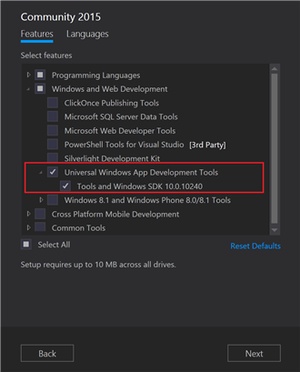
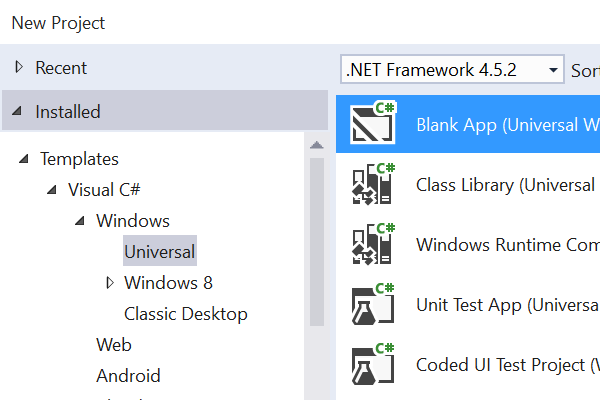
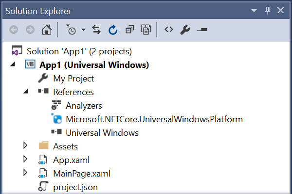
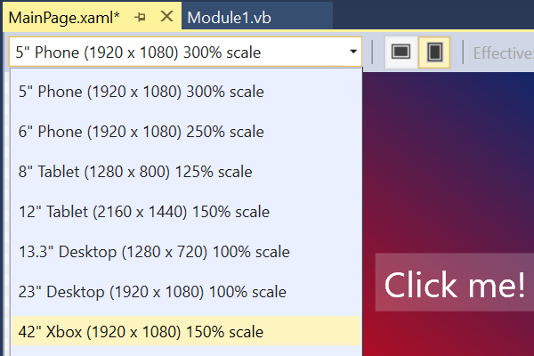
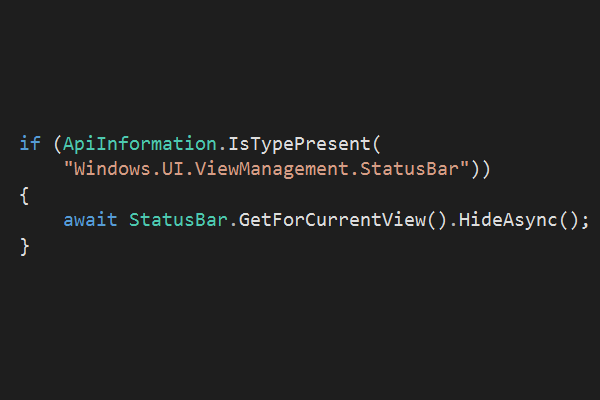
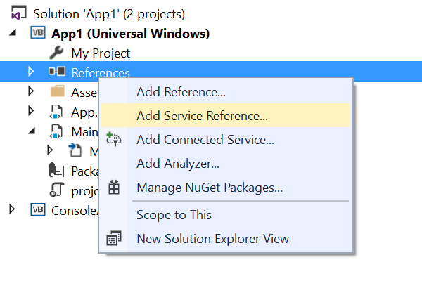
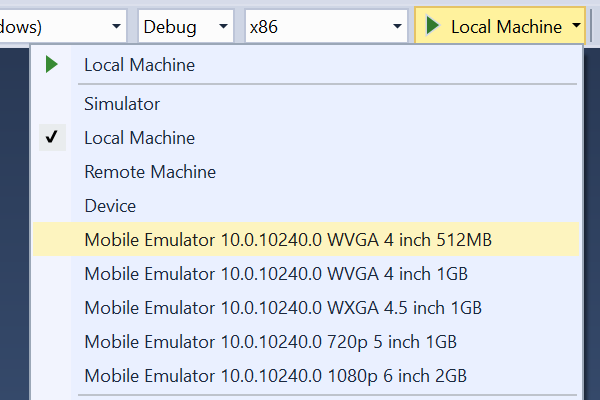
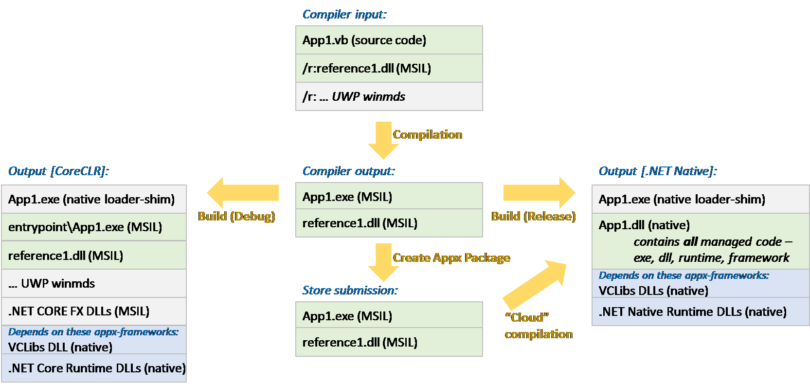
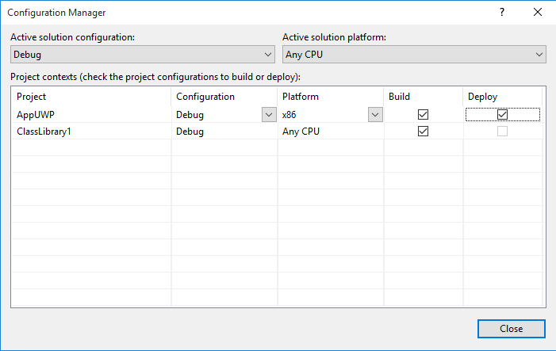
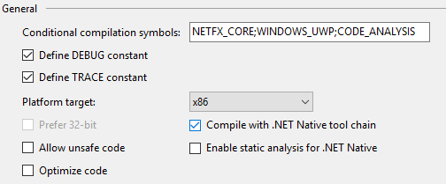

Universal Windows apps in .NET
==============================

> This post was written by Lucian Wischik, Program Manager on the Managed Languages team.

We just released the [Universal Windows app development tools](http://go.microsoft.com/fwlink/?LinkID=619615) for writing Windows 10 apps in [Visual Studio 2015](http://go.microsoft.com/fwlink/?LinkId=517106). It is an exciting release: you can now use the latest .NET technology to build **Universal Windows Platform** ("UWP") apps that run on every Windows device - the phone in your pocket, the tablet or laptop in your bag, the PC on your desk, the Xbox console in your living room, and all the new devices that are being added to the Windows family like [HoloLens](http://www.microsoft.com/microsoft-hololens/en-us), [Surface Hub](https://www.microsoft.com/microsoft-surface-hub/en-us), and IoT devices like the [Raspberry Pi 2](http://blogs.windows.com/buildingapps/2015/02/02/windows-10-coming-to-raspberry-pi-2/).

Installing the UWP Tools
========================

You can [install the free Community Edition](http://go.microsoft.com/fwlink/?LinkID=619615), which install the UWP tools by default. If you need the Professional or Enterprise edition, you can download them from [VisualStudio.com](http://www.microsoft.com/click/services/Redirect2.ashx?CR_CC=200662091). During setup, choose 'Custom' to install the Tools for Universal Windows Apps.

If you already have Visual Studio 2015, here's two ways to get the new tools:

- Download and run the [Windows Tools installer](http://go.microsoft.com/fwlink/?LinkID=619615).
- Open up Programs and Features from the Control Panel, select Visual Studio 2015 and click Change. Then in setup, click Modify and select the Tools for Universal Windows Apps.




What's new with UWP
===================

As a .NET developer you'll appreciate what UWP offers --

- UWP apps run "windowed" on the huge number of desktop machines out there that will upgrade to Windows 10.
- UWP apps will also reach every other Windows 10 device out there -- Phone, XBox, HoloLens, even "Internet of Things" devices including Raspberry Pi.
- UWP apps take advantage of the new [.NET Core](http://dotnet.github.io/core/). You can use the latest version of .NET Core, which will include new features that makes your app easier to write.
- The .NET heart of your app, your business logic, can run on other platforms that support .NET Core, including ASP.NET 5.
- UWP apps deploy a small copy of .NET with your app, so that your app always uses the .NET version that you tested with.
- UWP apps use _.NET Native_, which generates highly optimized native machine code before they are downloaded onto customer machines. .NET Native provides much faster app launch times, lower battery consumption, and faster performance.
- UWP apps are easy for your customers to buy, install and upgrade via the Windows Store.
- UWP apps integrate perfectly with [_Application Insights_](http://azure.microsoft.com/en-us/services/application-insights/) for detailed telemetry and analytics -- this is a crucial tool with which to understand your users and improve your apps.

The new things you can do with this release --

- Write Windows 10 UWP apps with .NET.
- Write Portable Class Libraries that target .NET Core.
- Use more .NET surface area in UWP apps than was previously available to Windows Store or Phone apps, including [System.Net.Sockets](http://blogs.msdn.com/b/dotnet/archive/2015/07/28/net-networking-apis-for-uwp-apps.aspx), [WCF Client](https://github.com/dotnet/wcf), [System.Numerics.Vectors](https://github.com/dotnet/corefx/tree/master/src/System.Numerics.Vectors), and new [Diagnostics APIs](http://blogs.msdn.com/b/vancem/archive/2015/05/11/version-1-1-24-of-the-eventsource-nuget-package-marked-as-stable.aspx).
- You can choose to use [NuGet 3.1](http://blog.nuget.org/20150729/Introducing-nuget-uwp.html) (recognizable by the file "project.json") for NuGet consumption in all project types.

Getting started with UWP development
====================================

Here are some useful overviews and tutorials for UWP development:

- [How to build a Windows 10 universal app](https://msdn.microsoft.com/library/windows/apps/xaml/dn609832.aspx) [MSDN] -- with adaptive UI and adaptive code so your UWP app looks good and runs well on all Windows 10 devices.
- [Guide to UWP apps](https://msdn.microsoft.com/library/windows/apps/dn894631.aspx) [MSDN] -- how "universal" apps are supported across all devices.
- [Porting apps to UWP](https://msdn.microsoft.com/library/mt148501%28v=vs.140%29.aspx) [MSDN] -- from Phone Silverlight, Win8.1 and VS2015 RC.
- [Developing Universal Windows Apps with C# and XAML](http://msft.it/6010BEiXI) [Microsoft Virtual Academy] -- practical online training course by expert Jerry Nixon, spread over 22 hour-long lessons.
- [Developing UWP apps in VS2015](https://channel9.msdn.com/Events/Build/2015/2-650) [BUILD talk].
- [Deep dive into XAML and .NET UWP development](https://channel9.msdn.com/Events/Build/2015/2-790) [BUILD talk].

In this blog post I want to tell you more about the improvements you'll notice as a .NET developer – things that the other tutorials don't go into. But first, to set the stage, here is an overview in ten short pictures of everything that Microsoft is delivering right now for .NET UWP development:




**File > New > C#/VB > Windows > Universal** Get started with a new blank UWP app. It's faster than VS2015 RC thanks to improvements in NuGet. You can also create Portable Class Libraries (PCLs) that span UWP, ASP.NET 5 and .NET4.6.



**Solution Explorer > References**
The References node shows NuGet packages with their own distinctive icon. One important package here is ```Microsoft.NETCore.UniversalWindowsPlatform```; it contains the .NET Core runtime and framework. The project.json file drives the new NuGet 3.0, replacing packages.config. NuGet 3.0 is faster and more flexible than NuGet 2.0.



**Adaptive XAML** Developers could always design "adaptive UIs" that scale to any device, any form-factor. It's easier now thanks to many XAML improvements, including ViewState triggers, more device previews, and live Visual XAML Tree debugging. Also, use the new _x:Bind_ for higher performance data-binding.



**Adaptive code** One key to a great universal app is sharing as much code as you can between devices, while still lighting up the best experience on each device. You can now write adaptive code in .NET, calling platform-specific WinRT APIs. This is much better than using reflection, a prior technique for adaptive code.


**Fast graphics: [Win2d](https://github.com/microsoft/win2d) and [System.Numerics.Vectors](https://github.com/dotnet/corefx/tree/master/src/System.Numerics.Vectors/src/System/Numerics)** For fast graphics, use the [Win2d library](http://microsoft.github.io/Win2D/html/Introduction.htm) – an elegant .NET-friendly wrapper around DirectX. Of course, you can still use [SharpDX](http://sharpdx.org/) or [MonoGame](http://www.monogame.net/) too. And [System.Numerics.Vectors](https://msdn.microsoft.com/en-us/library/dn858218(v=vs.111).aspx) leverages the CPU's [SIMD](https://en.wikipedia.org/wiki/SIMD) instructions for faster vector and matrix arithmetic. All this let me compute the Mandelbrot fractal in just 70 milliseconds on my mid-range Nokia 635.



**WCF, HTTP/2 and Sockets** The .NET Core libraries now include [WCF](https://github.com/dotnet/wcf) and AddServiceReference, previously unavailable for Phone apps. [HttpClient](http://blogs.msdn.com/b/dotnet/archive/2015/07/28/net-networking-apis-for-uwp-apps.aspx) has been rewritten from scratch: it performs better and supports [HTTP/2](https://en.wikipedia.org/wiki/HTTP/2). We've also included System.Networking.Sockets, a long-requested .NET feature for Windows Store apps.



**Improved debugging and EnC** You can now use "Edit and Continue" (EnC) when debugging on the emulator. The whole debugger engine has been overhauled – to [support lambdas and LINQ expressions in the immediate and watch windows](http://blogs.msdn.com/b/visualstudioalm/archive/2014/11/12/support-for-debugging-lambda-expressions-with-visual-studio-2015.aspx), and [to support EnC in many more places than ever before](http://blogs.msdn.com/b/visualstudioalm/archive/2015/04/29/net-enc-support-for-lambdas-and-other-improvements-in-visual-studio-2015.aspx). Some developers code their entire app while in EnC. Try it!

![vs2015-dotnet-native.png]

**.NET Native** When you build in Release mode, your app gets built with the new ".NET Native" compiler. This turns it into heavily optimized native machine code – for much faster app startup time, lower battery consumption, and faster overall performance.

![uwp-store-submission.png]
 
**Store submission** You'll appreciate the new unified Developer Center. When you submit an app, the wizard submits your app's MSIL. The store compiles it with .NET Native, optimizing your app into native machine code (that is difficult to reverse-engineer, just like C++ code), for deployment to your users.

![uwp-application-insights.png]

**Application Insights and Diagnostics** Application Insights is included by default in every new project. It provides detailed analytics about your app – like crashes and usage. All the top apps in the Store already know that obtaining and responding to analytics is what makes them top. There are also [richer tracing features](http://blogs.msdn.com/b/vancem/archive/2015/05/11/version-1-1-24-of-the-eventsource-nuget-package-marked-as-stable.aspx) available in ETW.

.NET Native
===========

.NET Native is ahead-of-time ("AOT") compilation: it turns your code into native machine code when you compile. This differs from traditional .NET that uses just-in-time ("JIT") compilation, deferring the native compilation of a method until it is first executed, at runtime. .NET Native is closer to a C++ compiler. In fact, it uses the Visual C++ compiler as part of its tool chain, which is run in the Windows Store upon app submission (not the end-user machine). It produces code that's fast, lean, and self-contained.

.NET Native has huge end-user benefits: apps start up to 60% faster, and use a much smaller memory footprint. In some of my own UWP apps I've managed to get startup times down from 1 second to 110ms on my Nokia 635, thanks to .NET Native and by paying careful attention to the new [perf-tips feature and Diagnostics Tools window](http://blogs.msdn.com/b/visualstudioalm/archive/2015/07/20/performance-and-diagnostic-tools-in-visual-studio-2015.aspx), new in VS 2015.

There have been [many articles about .NET Native preview](http://blogs.msdn.com/b/dotnet/archive/tags/dotnetnative/) on the .NET team blog already. What's new with UWP is that it's the first _production_ use of .NET Native. For the most part, .NET Native is transparent: it happens under-the-hood when you build in Release build; Release builds take a little longer, and have slightly worse debugging and slightly different performance characteristics; but other than that your app will continue to function as normal. Debug builds, which rely on CoreCLR, continue to have the same great debugging experience that you'd expect.

Although .NET Native has been in public preview over a year, UWP will be the first time many of you have used it. For that reason I want to go into more detail about how it works. Also because we're proud of it, and you're curious about it!

# .NET Core Framework

The [.NET Core](http://dotnet.github.io/core/) Framework ("CoreFX") has already been [discussed last week on this blog](http://blogs.msdn.com/b/dotnet/archive/2015/07/20/announcing-net-framework-4-6.aspx#net-core):

> .NET Core is a new version of .NET for modern device and cloud workloads. It is a general purpose and modular implementation that can be ported and used in many different environments for a variety of workloads.

CoreFX is used for UWP apps. It is a superset of the .NET APIs that were available for Windows Store development.

Let's highlight some parts of .NET Core FX that will be of particular interest to UWP developers:

- [System.Net.Sockets](http://blogs.msdn.com/b/dotnet/archive/2015/07/28/net-networking-apis-for-uwp-apps.aspx) (used for UDP communication) was previously unavailable in WinRT apps. The workaround was to use the WinRT-specific UDP APIs. Now System.Net.Sockets is part of .NET Core and so can be used by all UWP apps. Indeed you can share your Sockets code with your other .NET apps. Note: We are in the process of making System.Net.Sockets open source.
- [HttpClient](http://blogs.msdn.com/b/dotnet/archive/2015/07/28/net-networking-apis-for-uwp-apps.aspx) (like many low-level parts of .NET Core FX), needs a different implementation for each platform it runs upon. In UWP apps it is built on top of the WinRT HTTP stack. This brings it the ability to use [HTTP/2](https://en.wikipedia.org/wiki/HTTP/2) by default if the server supports it, with lower latency and fewer round-trip communications. 
- [WCF Client](https://github.com/dotnet/wcf) (and the associated Add Service Reference dialog) was previously unavailable in Windows Phone appx projects. But since it's part of .NET Core, it can be used by all UWP apps.
- [System.Numerics.Vectors](https://github.com/dotnet/corefx/tree/master/src/System.Numerics.Vectors) provides vector and matrix types that are implemented by SIMD opcodes on the CPU -- _Single Instruction Multiple Data_. These are faster for vectors and matrices than the normal "single instruction _single_ data" opcodes!
-System.Diagnostics.Tracing.EventSource now lets you send [richer payloads](http://blogs.msdn.com/b/vancem/archive/2015/05/11/version-1-1-24-of-the-eventsource-nuget-package-marked-as-stable.aspx) to _Event Tracing for Windows_ (ETW) in your events.

Two exciting aspects of CoreFX are that [it's open-source](https://github.com/dotnet/corefx) and out-of-band of major Windows and Visual Studio releases. Anyone can contribute, and the .NET team contributes on a daily basis. The team and community are working on expanding CoreFX, to add more APIs. As they are added, they will become available to UWP apps. Thanks to project.json and NuGet, any UWP developer can use the latest releases of .NET Core FX packages as soon as they become available – just via the "Manage NuGet Packages" dialog.

Note that File>New will give you a UWP application with the full set of official Microsoft .NET Core assemblies that are tested and relevant to UWP apps. If there are any other or future Microsoft libraries you want to add, they're not under "References > Add References" – instead you'll find them under "References > Manage NuGet References".

If you are a library author who wants to write .NET Core libraries, you can write PCLs that target any of .NET4.6, UWP and ASP.NET 5.

Universal Projects
==================

What UWP delivers is the ability to write _universal_ apps – a single project in VS, a single codebase, a single upload to the Windows Developer Center – even though it runs on multiple "device families" (Desktop, Mobile, Xbox, …). With UWP your code no longer needs #ifdefs nor Shared Projects. This way, your app is easier to develop and maintain.

There's a good explanation on the MSDN " [Guide to UWP apps](https://msdn.microsoft.com/library/windows/apps/dn894631.aspx)" about how to make sure your app looks good on all the different devices. Happily, it often turns out that the UI tweaking needed to make your app look good at different _window sizes_ on desktop, also makes it look good on different devices.

From the .NET side, the technically most interesting aspect is _adaptive code_. Here's an example:


<script src="https://gist.github.com/richlander/d7ef561db43df938f549.js"></script>

[gist](https://gist.github.com/richlander/d7ef561db43df938f549)


My app looked great on Windows 10 Desktop, but on Windows 10 Mobile it was showing the Status Bar. I thought it would look better if I called ```StatusBar.HideAsync```. However ```StatusBar``` is a type (and concept) that doesn't even exist on Desktop. The code to deal with this absence looks simple – the WinRT API ```Windows.Foundation.Metadata.ApiInformation.IsTypePresent``` is used to determine whether a named WinRT type is present on the machine an app happens to be running on, and it will only invoke the platform-specific methods in that case.

Sometimes it's hard to remember whether an API you're calling needs to be guarded by ```IsTypePresent```. To help with this, I wrote a NuGet package called [PlatformSpecific.Analyzer](https://www.nuget.org/packages/PlatformSpecific.Analyzer) which you add to your project: it gives squiggly warning messages in the IDE if you've forgotten the guard.

What's interesting is that this style of _adaptive code_ is currently possible in .NET only on the UWP platform, and only for UWP types. Low-level .NET experts will appreciate knowing the details. For Debug builds, the CoreCLR needs be able to JIT your method SetupAsync, and to do this it needs to know metadata for every type and method in its body even if they're in branches never taken at runtime. UWP handles this by bundling an app-local file "windows.winmd" that contains metadata for every WinRT type and method across _all_ UWP device families and versions. As for Release builds, .NET Native compilation bakes in the necessary metadata into the final native machine code, in the form of COM IIDs and vtables.

I want to make one final mention of PCLs in adaptive apps, because it's important for bringing your existing codebase forward into UWP. If you wrote an "8.1 universal PCL", one that targeted both Windows 8.1 and Phone 8.1, then you can reference it from a UWP app and it will generally work fine. That's because those PCLs were only ever able to call into a subset of WinRT APIs, and this subset is supported on all UWP platforms.

NuGet 3.0 and "project.json"
============================

NuGet has become the de facto standard for package management in .NET apps. We wanted to deploy .NET Core as NuGet packages, but the existing NuGet 2.0 client and its _packages.config_, although great for its scenarios, [wasn't the best choice](http://blog.nuget.org/20141010/nuget-is-broken.html) for scaling up to the 100+ sub-packages that make up .NET Core – too slow, and not flexible enough. [NuGet 3.0](http://blog.nuget.org/20150720/nuget-3.0.0.html) fixes those issues. First used in ASP.NET 5; it is now used in UWP as well.

You can tell that a project uses Nuget 3.0 because it has a project.json file instead of packages.config. You can actually even add a project.json to any existing .NET project and it works the same. (It needs a project unload+load first). The way that project.json works is this:

1. When you install a NuGet package, a reference is added to your project.json file, and shows up in your SolutionExplorer > References node.
2. Prior to build, VS ensures all NuGet packages (including dependencies) are downloaded to a central per-user cache on your machine, and it picks which ones to use based on your project's current target/architecture. Note: a standalone "nuget.exe" command-line tool will soon be released for doing this outside of Visual Studio.
3. At build-time, if a project.json file is present, then MSBuild reads it and references the appropriate DLLs and .targets files contained within it.

Let's spell out the advantages that the project.json workflow brings:

- Your .vbproj/.csproj no longer includes any NuGet references: they are kept completely separate. This makes source-control and merge-conflict-resolution easier!
- You can change your app target platform, and change Debug/Release and x86/x64/ARM/AnyCPU, and NuGet will now honor those settings.
- You can now have two different solutions in two different directories that include the same NuGet-consuming project. This is particularly useful when you're working across two different repositories.
- Your Solution Explorer > References node looks cleaner because it only includes the packages you've actually chosen to install rather than all their dependencies too. Uninstalling NuGet packages is easier, again because you only have to uninstall the ones you chose to install rather than all their dependencies.
- Packages are cached globally (on a per-user per-machine) basis rather than being downloaded+unzipped locally into every single solution that uses them.
- File > New and Manage NuGet Packages > Install have both become faster.
- You get more precise control over NuGet package upgrades, and version mismatches.

Please read more about NuGet on the [NuGet Team Blog](http://blog.nuget.org/) and the [NuGet Home repo](https://github.com/NuGet/Home). They are the best places to discuss NuGet changes with the team. One issue we know about and would like to address in a future update: having the Solution Explorer References node show all transitive dependencies of a NuGet package in UWP apps, just like it already does for ASP.NET 5. Would that be a good change?

Some NuGet packages don't work quite the same way when installed into UWP apps. If you find others, or are blocked on some, please let us know in the Comments box at the bottom of this post.

- **SharpDX.Toolkit 2.6.3**. Upgrade to [SharpDX 3](https://www.nuget.org/packages/SharpDX) (currently in alpha), which works fine in UWP apps. The SharpDX _Toolkit_ has been deprecated and won't move to version 3 and can't be installed into UWP apps. As an alternative consider other toolkits built on SharpDX such as [Paradox](http://paradox3d.net/) or [MonoGame](http://monogame.codeplex.com/). 
- **MvvmLight**. This NuGet package works correctly in UWP apps, except for needing an extra step when you install it. Installation is supposed to modify your App.xaml file and add some other files into your project. It no longer does this for UWP apps, so you must either do the changes manually, or use the [MvvmLight VSIX](http://www.mvvmlight.net/installing/) instead.
- **Sqlite-net**. Although this NuGet package can no longer be installed into UWP apps, the equivalent [Sqlite.Net-PCL](https://www.nuget.org/packages/SQLite.Net-PCL) (by the same author) works fine.
- **LiveSDK**. This NuGet package claims to install okay, but fails to actually reference the DLLs. As a short-term work around you can add a reference to Microsoft.Live.dll yourself manually. (Where is this DLL? Easiest way to find it is to attempt adding a LiveSDK reference to a UWP app, then locating the downloaded NuGet package at %USERPROFILE%\.nuget\packages\LiveSDK). As alternatives, for sign-in you can use [Windows.Security.Authentication.OnlineID](https://msdn.microsoft.com/library/windows/apps/hh701371) as described [here](http://blogs.msdn.com/b/vcblog/archive/2013/03/04/test.aspx), and for OneDrive you can use the [REST APIs](https://dev.onedrive.com/README.htm) via HttpClient. 

Incidentally, project.json is also used by default for "modern" PCLs – i.e. those whose targets are limited to some or all of .NET4.6, UWP, and ASP.NET 5 Core.

UWP apps use CoreCLR for Debug and .NET Native for Release
==========================================================

The following diagram shows what happens when you build your UWP app, debug it, and submit it to the store. The VB and C# compilers continue to emit DLLs in MSIL format as before. It's what happens next that's different…



**Debug build: CoreCLR**. When you build your UWP app in Debug mode, it uses the ".NET Core CLR" runtime, the same as used in ASP.NET 5. This provides a great edit+run+debug experience – fast deploy, rich debugging, Edit and Continue. It also means 

**Release build: .NET Native.** When you build in Release mode, it takes an additional 30+ seconds to turn your MSIL and your references into optimized native machine code. We're working on improving that time. It does "tree-shaking" to remove all code that will never be called. It does " [Marshalling Code Generation](http://blogs.msdn.com/b/dotnet/archive/2014/06/13/net-native-deep-dive-debugging-into-interop-code.aspx)" to pre-compile serialization code so it doesn't have to use reflection at runtime. It does whole-program optimization. This work and compilation to native code results in a single native DLL. You can explore this in bin\x86\Release\ilc.

**.NET Core: Both CoreCLR and .NET Native are ".NET Core Runtimes". They can both use and run the same .NET Core libraries (CoreFX), so that you get the same experience between Debug and Release. In Windows 8/8.1, the .NET Framework was used as the underlying .NET implementation for Windows Store apps. We moved to using .NET Core completely to provide the debug and release experience that we wanted for Windows 10, while providing access to  the new CoreFX libraries.

**Store submission.** When you create an Appx package for submission to the Windows Store, the appx bundle contains MSIL. Then the Windows Store does a .NET Native compilation for you. This mitigates the worries that some people have about "app-local deployment" of .NET Core FX. They worry what will happen if a security flaw is discovered in .NET. In the past, this was solved by shipping out a Windows Update to fix the OS-wide version of .NET. Now, it can be done by identifying the appx packages that are vulnerable, and working with the authors to fix them.

Tips for developing with .NET Native
====================================

**Test your app in Release build**. Please make sure you regularly test your UWP app in Release builds as you go along. Release builds use .NET Native. If you test regularly (I do it once every four hours or so of development), you can discover issues promptly, such different performance of Expression<T>.Compile.  If you discover an issue in testing that requires debugging, be aware that the [Release build is fully optimized and you will want to disable optimizations to have the best debugging experience](http://blogs.msdn.com/b/visualstudioalm/archive/2015/07/29/debugging-net-native-windows-universal-apps.aspx).

**.NET Native Analyzer**. There are a few features of .NET that aren't supported by .NET Native, such as multi-dimensional arrays with more than four dimensions (!). You'll be told about these when you do a .NET Native build. But if you'd prefer to save yourself the 30+ seconds that a .NET Native build takes, you can get immediate warnings as-you-type by adding a reference to the NuGet package [Microsoft.NETNative.Analyzer](https://www.nuget.org/packages/Microsoft.NETNative.Analyzer/).

**AnyCPU is gone**. This is because .NET Native compiles to native machine code. For app development, this barely matters. You just have to remember to select x86 for deploying to local machine or emulator, or ARM for deploying to Win10 Mobile devices, or x64 (this doesn't have much benefit over x86). And when you create your appx package for the store, the wizard builds all three flavors to submit to the store in an app bundle.

If you're developing a class library or PCL, however, you should generally develop these as "AnyCPU". That makes things easier - you can distribute a single DLL that can be consumed by all project targets.

The easiest approach I've found is with the Build > ConfigurationManager dialog. I can set it so that even if my toolbar shows "AnyCPU" for the benefit of the libraries, it still builds+deploys my UWP application as x86.



**Debugging .NET Native**. Sometimes you want to set breakpoints and debug code in .NET Native. It would be better not to have to do this in Release builds, since they are always harder to debug, and the aggressive optimizations by .NET Native make that harder. The answer is to use Debug mode (thereby turning off optimizations), and then temporarily tweak your project's configuration to use .NET Native even in Debug build. In C# the setting is under _Project > Properties > Compile with the .NET Native tool chain_. In VB it's under _MyProject > Build > Advanced_.



**Customizing the .NET Native optimizations**. Sometimes, especially in apps that make subtle use of reflection, .NET Native can remove too much in its optimizations. You can control this. These blog posts explain it well:

1. [Dynamic features in static code](http://blogs.msdn.com/b/dotnet/archive/2014/05/20/net-native-deep-dive-dynamic-features-in-static-code.aspx).
2. [Help! I hit a MissingMetadataException!](http://blogs.msdn.com/b/dotnet/archive/2014/05/21/net-native-deep-dive-help-i-hit-a-missingmetadataexception.aspx).
3. [Help! I didn't hit a MissingMetadataException!](http://blogs.msdn.com/b/dotnet/archive/2014/05/22/net-native-deep-dive-help-i-didn-t-hit-a-missingmetadataexception.aspx).
4. [.NET Native deep dive: making your library great](http://blogs.msdn.com/b/dotnet/archive/2014/05/23/net-native-deep-dive-making-your-library-great.aspx).
5. [.NET Native deep dive: optimizing with Runtime Directives](http://blogs.msdn.com/b/dotnet/archive/2014/05/24/net-native-deep-dive-optimizing-with-runtime-directives.aspx).

****Expression<T>.Compile.**** I want to call this one out, because it's used internally by Newtonsoft's Json.Net and impacts many developers. In the traditional CLR, expression-trees can be compiled at runtime to MSIL and then the JIT will turn them into native code. This isn't possible in .NET Native, so instead it _interprets_ the expression trees. The change you might observe with Json.Net, for instance, is that it's much faster to start up (since it no longer has to load the CLR expression-tree infrastructure), but slower when serializing large data files. Please measure if this is important to your app. I was delighted that this change allowed my app to start up ~200ms faster.

**F# -** F# DLLs cannot be used in UWP store apps: they are not currently supported by .NET Native. That's a scenario we'd like to fix. Please tell us if that's important to you!

**Get help**. If you're stuck with a .NET Native issue, the best place to find help is email to [netnativehelp@microsoft.com](mailto:netnativehelp@microsoft.com).

Summary
=======

Today's release of the Universal Windows Platform opens up important new opportunities for .NET developers. You'll get huge reach for your UWP apps, and you'll be able to code them with very latest .NET technologies.

Please try it out. Let us know what you think. If you have questions, post here or at the " [Developing Universal Apps](https://social.msdn.microsoft.com/Forums/windowsapps/en-US/home?forum=wpdevelop)" forum on the Windows Dev Center. And you can [measure your app startup time](https://msdn.microsoft.com/en-us/library/dn643729(v=vs.110).aspx) to under 200ms thanks to .NET Native, please post here to boast about it!