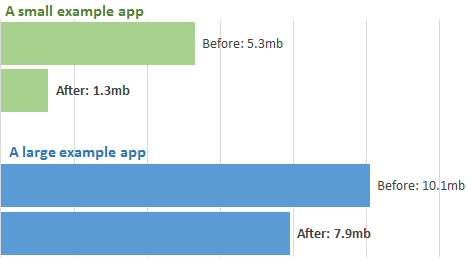
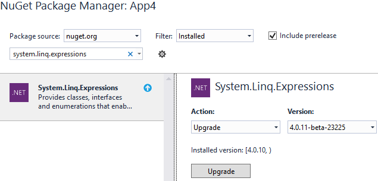
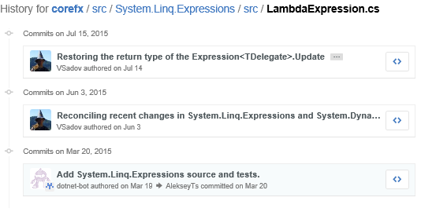
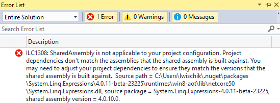
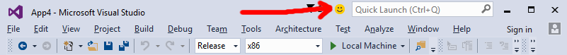

What's new for .NET and UWP in Win10 Tools 1.1
================================================

> This post was written by Lucian Wischik, Program Manager on the Managed Languages team.

Last week we updated the [Visual Studio tools for Universal Windows Apps](http://blogs.msdn.com/b/visualstudio/archive/2015/09/16/wintools-1-1-typescript-1-6-rtm-and-tools-for-apache-cordova-updates.aspx). The easiest way to get the update is within Visual Studio, under *Tools > Extensions > Updates*. (Also read the [release notes](https://social.msdn.microsoft.com/Forums/en-US/e9df01f6-1474-4a4e-98fc-2567591c764f/update-11-release-notes-and-installation-instructions?forum=Win10SDKToolsIssues)).


As part of this update, we're including a new opt-in pre-release feature that will shrink the size of your app:

 

In this article I'll tell you the what and why and how of this new feature. Then I'll tell you how it fits into the wider context -- about how improvements in .NET make their way into your UWP apps.

UWP apps have included .NET app-locally
===================================

Until now, when you build a UWP app, it has included all the .NET APIs that it actually uses, app-locally.

*"... But doesn't this get a bit big?"*

Here's a concrete example. I wrote a [Game of Life](https://en.wikipedia.org/wiki/Conway%27s_Game_of_Life) simulator that runs on Windows 10 devices, both desktop and mobile, and takes advantage of the [Win2d library](http://microsoft.github.io/Win2D/html/Introduction.htm) to run the simulation fast on each device's graphics accelerator. My source code is [here on github](https://github.com/ljw1004/blog/tree/master/Win2d/GameOfLife). This is what the simulator looks like:
 


And this is what I get when I build my app in Release mode. I've shown the "before" and "after" of the new feature:
 
 

*What we're delivering with Win10 Tools 1.1 is the ability to shave off that extra grey segment that comes from the .NET libraries.*

How the feature works
===========================================================

The ability to reduce app-size is still in pre-release. We hope to make it the default experience soon, but for now in the Win10 Tools 1.1 release the feature is opt-in...

- This is the first public release of the feature, and we want to give it some time and testing before switching everyone over.
- *For most apps, the feature delivers faster build times for Release builds.* We observe build times are generally faster, up to about 30% -- but there are a few apps actually take longer to build. We are working on making the flag deliver a more consistent improvement to build times. 
- When you upgrade to VS2015 Update 1, if your project is using this flag, then you might need to upgrade your project in some way in order to open it. We haven't closed on this.
- Any apps you submit to the store right now, using this flag, will continue to work.


**How the feature works.** When the feature is enabled, .NET Native release builds *no longer* include the bulk of .NET locally within the app. Instead .NET is delivered through a *"Shared AppX Framework Package"*. That means:

1. When customers download your app from the Store, this download doesn't contain the bulk of .NET
2. Instead, the right version of .NET gets automatically downloaded on-demand from the Store, and is shared between all apps that use it.

You can see how it's accomplished inside your app's `bin\Release\x86\ilc\AppxManifest.xml` file. It has a line like this, which is what the Store app obeys when installing your app:
```
<PackageDependency
    Name="Microsoft.NET.Native.Framework.1.2"
    MinVersion="1.2.23231.0" />
```


Instructions to opt-in to using the SharedFramework
=====================================================
As mentioned, we plan make this feature the default so it will happen automatically. Until then, you must opt-in by a configuration flag as follows. Within Visual Studio, right-click on your UWP project and *unload project*. Right-click once again and *Edit the .vbproj/.csproj*. Within this proj file, look for all three occurrences of `<UseDotNetNativeToolchain>` and add a new directive under them as follows. By default, the three places that use the .NET Native toolchain are Release|x86, Release|x64 and Release|Arm.
```xml
<UseDotNetNativeToolchain>true</UseDotNetNativeToolchain>
<UseDotNetNativeSharedAssemblyFrameworkPackage>true</UseDotNetNativeSharedAssemblyFrameworkPackage>
```

Next, right-click on your project once again, *Reload*, and rebuild. 

Tip: you can also avoid unloading+reloading by editing the proj file outside VS, for instance in Notepad. VS will automatically detect when it needs to reload the project.


**Guidance.** Here are our recommendations for how to use this flag for now:

- **Try it at least once:** try turning on the flag at least once -- see whether it improves your Release mode buildtimes, and whether you encounter any issues.
- **Develop how you wish to submit:** in the daily rhythm of development and testing, use the flag in the same way as you intend to submit.
- **For store submission:** it's your call whether the benefits of smaller app-size and potentially faster build-times outweigh the risks of using a pre-release feature for you.
- **For sample code:** leave flag off, so that in the future you and others have an easier time building your sample.
- **If you're using out-of-band updates to .NET:** leave flag off. Read the next section for an explanation.


How to take advantage of fixes in .NET
========================================

There are a lot of improvements being made to .NET on a regular basis. How do you as a developer take advantage of these improvements?

Let's motivate this with a specific example. Suppose you're writing a UWP app using VS2015 RTM and you write this code:
```cs
Expression<Func<int>> e = () => 1;
e = e.Update(Expression.Constant(2), null);
int i = e.Compile().Invoke(); // should return "2"
```

Don't worry if this code is unfamiliar -- it's a small corner of the .NET framework using [expression trees](https://msdn.microsoft.com/en-us/library/vstudio/bb397951.aspx) that's not commonly used. But for those people who do use it, they need it, and were blocked when they discovered a .NET bug which prevents the call to *Expression.Update* from working.

In the past if you found an issue in .NET, you were basically stuck -- you'd have to wait for the next public release of .NET, and even then you couldn't depend on all your users installing that update onto their machines.

But now with UWP things are different. This particular Expression.Update issue was identified in the public open-source version of .NET on github, and was fixed with github changeset [#2361](https://github.com/dotnet/corefx/commit/ebac6f555fc1f89da91f09c4f9a11bc123c99889), and is available in a new publically-available beta of the NuGet package [System.Linq.Expressions](https://www.nuget.org/packages/System.Linq.Expressions/4.0.11-beta-23225). To use this beta in your UWP app, do *Manage Nuget References*, turn on the *Include prerelease* checkbox, and pick up the latest prerelease version of the package. Most people won't need any of this. But those who do, who were blocked by this particular API, they now have a way forward.


 
What's important with UWP is that *you don't have to depend on your users installing .NET updates onto their machines*. Your app will always run on end-user machines against the exact same version of .NET you chose to develop with.


(Where can you find a list of all these pre-release packages and the fixes are inside them? Well, they're all still in beta. Most developers won't need to live at the "bleeding edge" and can simply wait until we gather up the changes and publish them, likely in the next VS Update. Those developers who do need these immediate fixes should follow them on the [corefx github](https://github.com/dotnet/corefx/commit/ebac6f555fc1f89da91f09c4f9a11bc123c99889).)
 



You can't combine out-of-band .NET fixes with Shared Framework
================================================================

You can't combine out-of-band updates to .NET with the Shared Framework flag. This is what you'll see if you try it with a pre-release version of System.Linq.Expressions:
 


*"ILC1308: SharedAssembly is not applicable to you project configuration. Project dependencies don't match the assemblies that the shared assembly is built against. You may need to adjust your project dependencies to ensure they match the versions that the shared assembly is built against."*


Conclusions
=============

.NET Native is an important technology for building UWP apps. In this release we've improved it significantly.

We are eager for feedback on the new Shared Framework feature. Please turn the flag on during development. Many of you will observe faster build-times. What we're hoping to get are reports from you of any problems you encounter -- either by email to [dotnetnative@microsoft.com](mailto:dotnetnative@microsoft.com) or via the *send-a-smile/frown* icon at the top of the Visual Studio 2015 titlebar (below). Thank you!
 

