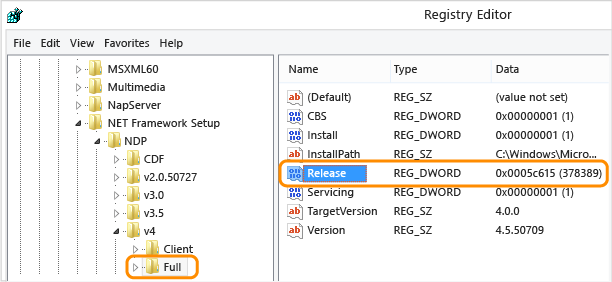

Support Ending for the .NET Framework 4, 4.5 and 4.5.1
==========================================================

As [previously announced][1], on January 12, 2016 Microsoft will no longer provide security updates, technical support or hotfixes for .NET 4, 4.5, and 4.5.1 frameworks. All other framework versions, including 3.5, 4.5.2, 4.6 and 4.6.1, will be supported for the duration of their [established lifecycle][2]. The decision to end support for these versions will allow us to invest more resources towards improvements of the .NET Framework. 

##What Does This Mean?
This means that you should take action to ensure that a supported version of the .NET Framework is installed on the machine.

You may have one or more applications that are currently targeting a .NET Framework version that will no longer be supported. You can run those applications on a later .NET Framework version without targeting a new version. More recent .NET Framework versions have high compatibility due to quirking, which was introduced in .NET Framework 4.5. Quirking allows an application that targets a lower version of the framework to use those APIs, even when a newer version of the framework is installed. More information can be found on the  [.NET Application Compatibility page][3].

The Azure team announced they will be making updated images available with the .NET Framework 4.5.2 for guest OS families 2.x, 3.x and 4.x, in order to support apps deployed to Azure. These updated images were available for manual deployment in November and are available for automatic deployment in January. The Additional Information section below has more information. 

##Validate the .NET Framework Version(s) Currently Installed
Multiple versions of the .NET framework can be installed on a machine. The registry can be used to determine if the .NET Framework version 4.5.2 or later has been installed. You will need administrative credentials to read the registry with regedit.

1. From the **Start** menu, choose **Run**
2. In the **Open** box, enter **regedit**
3. In the Registry Editor, open the following subkey: HKEY_LOCAL_MACHINE\SOFTWARE\Microsoft\NET Framework Setup\NDP\v4\Full
   ⋅⋅⋅_**Note:** If the **Full** subkey is not present, then you do not have the .NET Framework 4.5 or later installed._
4. Check for a DWORD value named **Release** which indicates which version of the .NET framework is installed.

    

| Value of the Release DWORD | Version |
|:---------------------------|:--------------------|
|378389                      |.NET Framework 4.5   |
|378675                      |.NET Framework 4.5.1 installed with Windows 8.1 or Windows Server 2012 R2   |
|378758                      |.NET Framework 4.5.1 installed on Windows 8, Windows 7 SP1, or Windows Vista SP2 |
|379893                      |.NET Framework 4.5.2 |
|393295 (Windows 10) or 393297 (All other OS versions) | .NET Framework 4.6 |
|394256                      |.NET Framework 4.6.1  |

See the MSDN article, "[How to: Determine Which .NET Framework Versions Are Installed][8]", for more information on checking the version programmatically as well as for older .NET releases. 

##Install a Supported Framework Version
The following links can be used to download and install a supported version:

1. .NET Framework 4.6.1 ([Web Installer][9];  [Offline Installer][10])
3. .NET Framework 4.6 ([Web Installer][11];  [Offline Installer][12])
3. .NET Framework 4.5.2 ([Web Installer][13];  [Offline Installer][14])

More information, including links to download the development packs, can be found [here][15].

##Additional Support Information

We have addressed common questions in the Q&A below. For more details on the .NET Framework support lifecycle, visit the [Microsoft .NET Framework Support Lifecycle Policy FAQ][2]. Additionally, compatibility of the .NET framework can be viewed on the [.NET Application Compatibility page][3]. Should you have any unanswered questions please reach out to [Microsoft Support][4] or write us directly at [netfxcompat@microsoft.com][5]. 

**_Will I need to recompile/rebuild my applications to make use of .NET 4.5.2, 4.6 or 4.6.1?_**

.NET 4.5.2, 4.6 and 4.6.1 are compatible, in-place updates on top of .NET 4, .NET 4.5, and .NET 4.5.1. This means that applications built to target any of these previous .NET 4.x versions will continue running on .NET 4.5.2 without change. No recompiling of apps is necessary.

**_Are there any breaking changes in .NET 4.5.2? Why do you include these changes?_**

There are a very small number of changes in .NET 4.5.2 that are not fully compatible with earlier .NET versions.  We include these changes only when absolutely necessary in the interests of security, in order to comply with industry wide standards, or in order to correct a previous incompatibility within .NET. Additionally, there are a small number of changes included in .NET 4.5.2 that will only be enabled if you choose to recompile your application against .NET 4.5.2.

More information about application compatibility across the various versions in the .NET 4.x family can be found [here][6].

**_Microsoft products such as Exchange Server, SQL Server, Dynamics CRM, SharePoint, and Lync are built on top of .NET. Do I need to make any updates to these products if they are using .NET 4, 4.5 or 4.5.1?_**

Newer versions of products such as Exchange, SQL Server, Dynamics CRM, Sharepoint, and Lync are based on the .NET 4 or .NET 4.5. Since .NET 4.5.2 is a compatible, in-place update on top of the .NET 4, 4.5, and 4.5.1 even a large software application such as Exchange that was built using .NET 4 will continue to run without any changes when the .NET is updated from .NET 4 or .NET 4.5 to .NET 4.5.2. That said we recommend you validate your deployment by updating .NET to .NET 4.5.2 in a QA/pre-production environment first before rolling this out to a production environment.

**_How will I get this update in Windows Azure Guest operation system (Guest OS)?_**

 On November 10, 2015 Azure announced that they will update the .NET Framework in Windows Azure Guest operating system (Guest OS) family 2.x, 3.x and 4.x to .NET Framework 4.5.2 in the January 2016 Guest OS Release. Cloud services running on Guest OS family 2.x, 3.x and 4.x with automatic updates enabled will be updated to the January 2016 Guest OS with .NET Framework 4.5.2. In order to help customers validate their cloud service with .NET 4.5.2, Azure will provide a second set of November OS Versions 201511-02 for with .NET 4.5.2 for manual deployment. If you have any questions or require further information, please use one of the [support options][7] to contact Azure. 

**_What about .NET 3.5 SP1? Is that no longer available?_**

This announcement does not affect versions prior to .NET 4. You can continue to use .NET 3.5 SP1 beyond January 12, 2016.

[1]: http://blogs.msdn.com/b/dotnet/archive/2014/08/07/moving-to-the-net-framework-4-5-2.aspx
[2]: http://go.microsoft.com/fwlink/?LinkID=507568
[3]: http://msdn.microsoft.com/en-us/library/dn458358(v=vs.110).aspx
[4]: https://support.microsoft.com/
[5]: mailto:netfxcompat@microsoft.com
[6]: http://msdn.microsoft.com/en-us/library/dn458358(v=vs.110).aspx
[7]: https://azure.microsoft.com/en-us/support/options/?WT.mc_id=azurebg_email_Trans_963_RevisedNET_Update
[8]: https://msdn.microsoft.com/en-us/library/hh925568(v=vs.110).aspx
[9]: http://go.microsoft.com/fwlink/?LinkId=671729
[10]: http://go.microsoft.com/fwlink/?LinkId=671744
[11]: http://go.microsoft.com/fwlink/?LinkId=528259 
[12]: https://www.microsoft.com/en-us/download/details.aspx?id=48137
[13]: http://go.microsoft.com/fwlink/?LinkId=397674
[14]: http://go.microsoft.com/fwlink/?LinkId=328856
[15]: https://msdn.microsoft.com/en-us/vstudio/aa496123
