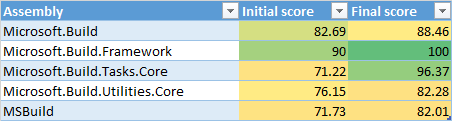

# MSBuild .NET Core Porting Experience

*This post was written by [Daniel Plaisted](https://twitter.com/dsplaisted), a software engineer on the .NET Team.*

MSBuild is the build engine for .NET and Visual Studio.  It is used to build many of our Open Source .NET projects, including the [.NET Core Runtime](https://github.com/dotnet/coreclr), [.NET Core Libraries](https://github.com/dotnet/corefx), and [.NET Compiler Platform](https://github.com/dotnet/Roslyn).  As open source, cross platform projects, we want to enable people to modify, build, and contribute to these projects without requiring them to use Windows to do so.  To support this, we [open sourced MSBuild](http://blogs.msdn.com/b/dotnet/archive/2015/03/18/msbuild-engine-is-now-open-source-on-github.aspx), and recently [announced](http://blogs.msdn.com/b/dotnet/archive/2015/09/03/msbuild-is-going-cross-platform-with-net-core.aspx) that we are working on porting it to run cross platform on top of [.NET Core](http://dotnet.github.io/).

We've now largely completed the work of porting MSBuild to .NET Core, and are now working on [integrating it into the infrastructure of our OSS repositories](https://github.com/dotnet/buildtools/pull/396).  This blog post summarizes our porting experience, which you may find helpful if you are also porting code to .NET Core.  This post also suggests some ways we could improve the experience for other developers porting their code.

## Strategy
MSBuild was originally open sourced on GitHub in May 2015.  Initially it was ported to run on Linux using the Mono runtime, in a [separate branch](https://github.com/microsoft/msbuild/tree/xplat) of the repo.  This branch was our starting point for the .NET Core port.  The plan is to eventually merge these changes back into the master branch and to compile both the .NET Core and full .NET Framework versions of MSBuild from the same source code.

The goal of the .NET Core version of MSBuild is to support building .NET Core projects on Windows, Linux, and Mac OS, without depending on the full .NET Framework or Mono.  It is not a goal to be fully compatible with the full .NET Framework version of MSBuild or to build projects that target the desktop .NET Framework, as building such projects can rely on functionality that is not available in .NET Core (for example, the Global Assembly Cache).

Because the .NET Core version of MSBuild would not be fully compatible with the desktop .NET Framework version, but we wanted to be able to eventually merge the codebases, we used conditional compilation in the code where the .NET Core version would differ from the desktop version.  We used fine-grained feature flags such as [`FEATURE_APPDOMAIN`](https://github.com/Microsoft/msbuild/blob/54c137f24422481e6ecbfc8c8f857cafb09b488b/src/Shared/TaskLoggingHelper.cs#L36) for AppDomain support or [`FEATURE_BINARY_SERIALIZATION`](https://github.com/Microsoft/msbuild/blob/54c137f24422481e6ecbfc8c8f857cafb09b488b/src/Framework/BuildErrorEventArgs.cs#L275).  This helps make it clearer why a given portion of the code isn't enabled for .NET Core than if we had simply used a single compilation constant such as `NETCORE`.  It also means that if some of these features are added to .NET Core, it will be easier to go back and enable the corresponding code for the .NET Core version of MSBuild.

## Porting
### Tracking Progress
We used the [ApiPort tool](https://github.com/Microsoft/dotnet-apiport/blob/master/docs/HowTo/Introduction.md) to find the APIs MSBuild was using that weren't supported on .NET Core, to help us get an initial idea of what we would need to do to port it to .NET Core and how much work it would be.  Subsequently we used ApiPort to track our progress porting.

ApiPort analyzes compiled managed assemblies.  So you need to successfully compile your code to analyze it.  Since, by definition, we couldn't compile successfully for .NET Core until the porting was completed, we ran ApiPort on the code compiled for .NET Framework.  We didn't want to change the behavior of the normal .NET Framework build, so we created a new build configuration that targeted .NET Framework but used the same feature flag configuration as .NET Core in order to get a successful compilation result to analyze.

However, we discovered we couldn't use ApiPort to track how close we were to successfully compiling a project for .NET Core, because once the project was successfully ported to .NET Core, ApiPort would still generally report a portability of below 100%.  The main reason for this is that in some cases, we copied APIs from the .NET Framework to the MSBuild code base.  These APIs would still be reported as unavailable by ApiPort when analyzing the portability even though we had made them available to our projects by adding the implementations ourselves.  Another contributor to this is that ApiPort always detects certain reflection APIs as unsupported (details are in the [bug on GitHub](https://github.com/Microsoft/dotnet-apiport/issues/113)).  In the table below are the portability scores reported for MSBuild projects with minimal changes to support .NET Core (Initial score) and the scores after the projects have been ported to successfully compile for .NET Core (Final score).

There were two other minor issues with ApiPort: It does [not analyze calls to native APIs (via PInvoke)](https://github.com/Microsoft/dotnet-apiport/issues/234), and it reports the portability score based on the number of distinct APIs, [not based on the number of usages of an API](https://github.com/Microsoft/dotnet-apiport/issues/233).  So removing a call to an unsupported API that's only used once in a project will improve the portability score, while removing many calls to an unsupported API won't affect the score until the last usage of that API is removed.

Although in our case the portability scores reported by ApiPort could be misunderstood, I don't think it's necessarily worth trying to make it more "accurate".  There's no tool that will magically tell you how much work it will be to port something or how long it will take.  ApiPort simply reports a metric, and like all metrics it will be more helpful if you understand what it really means.

### Building for .NET Core
The first part of porting to .NET Core was to set up the build system so that we could compile the code for .NET Core.  At the time, the only out-of-box way to build and run apps on .NET Core was DNX.  DNX's project system doesn't support a lot of the extensibility and flexibility that MSBuild does, which is part of the reason we are porting MSBuild to .NET Core in the first place.  So DNX wasn't appropriate for us.

[Eric St. John](https://github.com/ericstj) provided a proof of concept sample project for a .NET Core console application.  Using that as a guide we were able to set up [build configurations](https://github.com/Microsoft/msbuild/blob/54c137f24422481e6ecbfc8c8f857cafb09b488b/dir.props#L125) for the MSBuild projects to compile for .NET Core.  Today, tooling for targeting .NET Core is still a work in progress, but if you want to create an MSBuild project that targets .NET Core, you can follow the steps in this guide: [Getting Started Writing a .NET Core app and Class Library](http://aka.ms/porttocore)  

### Porting Code to .NET Core
Porting code to .NET Core primarily means removing usages of APIs that are not available on .NET Core.  I mostly used the error list in Visual Studio as the way of finding code that needed to be updated to remove API usages.  Often there was an alternate API that provided the same functionality on .NET Core.  Reflection, File I/O, Culture, and Globalization APIs were some of the most common in this category.

Other APIs were not applicable to MSBuild in .NET Core and the usage could be easily removed.  XAML integration or resolving assemblies from the Global Assembly Cache are examples of this.  In some cases where an API wasn't available in .NET Core, we copied the implementation for the API from the .NET Framework, added it to the MSBuild code base, and ported it to compile for .NET Core as necessary.  We did this for `XmlTextWriter` and its dependencies, `Environment.GetSpecialFolder`, and for reflection method binding and invocation functionality.  We [plan](https://github.com/Microsoft/msbuild/issues/294) to follow up with the .NET Framework team to discuss whether these APIs represent generally applicable gaps in functionality which should be added to .NET Core.

Finally, it is possible to remove usage of an API by re-implementing the functionality or removing it altogether.  Large-scale reimplementation runs the risk of changing the behavior.  The main example of code that I re-implemented was the method binding logic for property functions.  However, the code I wrote didn't match the expected behavior, so I ended up [replacing it](https://github.com/dsplaisted/msbuild/commit/6edd6fc15c02c8ee3c597ba9389c69189b69ecf9#diff-d02c4c446cb505c1bf955c40a8de2737) with code from the .NET Framework- [twice](https://github.com/Microsoft/msbuild/pull/293).

Currently, we've removed multi-process build support from MSBuild for .NET Core.  The current implementation for the .NET Framework communicates between processes using binary serialization, which isn't supported on .NET Core.  To [support this feature in .NET Core](https://github.com/Microsoft/msbuild/issues/303) we'll need to re-implement it with a different serialization mechanism for communication.  (Note that we don't plan to add binary serialization to .NET Core.  It is not resilient across different runtimes or operating systems.)

The changes that were made to port the core MSBuild engine to .NET Core can be seen in the following pull requests: [#152](https://github.com/Microsoft/msbuild/pull/152), [#156](https://github.com/Microsoft/msbuild/pull/156), [#158](https://github.com/Microsoft/msbuild/pull/158), and [#159](https://github.com/Microsoft/msbuild/pull/159)

Developers who want to copy .NET Framework code into their .NET Core projects in the same way we did may end up accidentally violating the license.  The easiest way to browse the .NET Framework source code is the [referencesource.microsoft.com](http://referencesource.microsoft.com/) website.  However, the code there is only licensed for "reference use", which is very restricted and would not allow code to be copied into a project.  Much of the same code is available under the MIT license at [https://github.com/microsoft/referencesource](https://github.com/microsoft/referencesource) or the [corefx](https://github.com/dotnet/corefx) or [coreclr](https://github.com/dotnet/coreclr) repos.  Developers are likely to first find the code they need at the reference source site and would need to be careful to find the equivalent code (if available) in one of the MIT-licensed repos and download it from there to comply with the license.

### Tools to Help Porting
There are several tools to help port code to .NET Core.  ApiPort can scan .NET assemblies and generate an Excel spreadsheet with the list of APIs used that are not supported on .NET Core, along with the recommended replacement (if any) for each one.  As I was going through the process of porting, I found it more convenient to use API Catalog, a .NET team internal tool than to refer to the Excel sheet to look up APIs.  This was because it shows the contract an API belongs to and because it has good API search functionality.  After most of the porting had been done, I found out there is a publicly accessible [dotnetstatus site](http://dotnetstatus.azurewebsites.net/) that offers similar functionality.

The primary usage of these tools when porting is to quickly look up whether an API is supported, and if not, what the recommended replacement is.  If the API is supported, then the tool should show what contract the API is included in so that you know what NuGet package you need to reference.  Of these tools, currently only API Catalog (which is not publicly available) displays the contract an API is in.  There is also a [reverse package search](http://packagesearch.azurewebsites.net/) website which can be used to look up which NuGet package an API is in.

I'd recommend some improvements to the [dotnetstatus site](http://dotnetstatus.azurewebsites.net/) to make it the primary way to look up APIs when porting to .NET Core:

* Search improvements ([#19](https://github.com/Microsoft/dotnet-apiweb/issues/19))
  * Return search results for partial matches (ie searching for "GetCulture" should return results including "GetCultureInfo" methods)
  * Return types in search results in addition to type members
  * Display search results on a separate page (currently search results are only displayed as autocomplete items to the search box)
* Display the contract that an API is included in ([#20](https://github.com/Microsoft/dotnet-apiweb/issues/20))

Not all APIs have recommended replacements.  There should also be a friction-free process for adding information about recommended replacements for an API, or information about why an API isn't supported.  Having an easy way to look up recommended replacements and information about why an API isn’t available in .NET Core would help reduce the perception that APIs have been removed arbitrarily from .NET Core and that porting code to .NET Core is difficult.  The site [could support](https://github.com/Microsoft/dotnet-apiweb/issues/18) editing this from the API page itself, or the information could be hosted in a Git repo and pull requests could be used to update it.

An even better experience could be to surface this API information directly in Visual Studio as the code is being edited.  Possible ways to surface it would be in the error list where the compilation errors are shown or as a "lightbulb" with the code.  It would also be possible to offer refactoring tools to help make some of the simple and common code modifications for you.  It's one thing to know that you need to add a `GetTypeInfo()` call for a lot of reflection APIs, or that you need to replace `Thread.CurrentCulture` with `CultureInfo.CurrentCulture`.  However, after making these mechanical changes hundreds of times, you start to [wish](https://github.com/Microsoft/dotnet-apiport/issues/184) that there was a tool that would help you.

### Tests
MSBuild's tests were originally written using MSTest.  As part of the original port to Mono and Linux, they were converted to NUnit, as MSTest wasn't available cross platform.  However, the only test framework that currently supports .NET Core is xUnit.

We decided to first convert the tests in the main codebase to xUnit, and then merge those changes into the cross-platform code.  This should make it easier to keep the codebases in sync and eventually merge them together in the future.  We used the [XUnitConverter](https://github.com/dotnet/codeformatter/tree/master/src/XUnitConverter) tool to help with this.  It changes Test attributes to Fact attributes, updates the namespaces, and converts many of the Assert calls to xUnit's APIs.

We then merged these changes into the cross platform codebase.  Since that code had been converted to NUnit, there was a very large number of merge conflicts.  [Rainer](https://github.com/rainersigwald) wrote a tool to automatically resolve those conflicts correctly.

Once the tests were converted to xUnit and .NET Core, there were lots of failures.  Most of these were due to functionality that we didn't include in MSBuild for .NET Core that the test was either meant to test or indirectly depended on.  Figuring out why a test was failing and whether it should be fixed or disabled for .NET Core was a lot of investigation.  To more quickly get to a clean state, we tried to identify groups of related tests or tests that were failing for the same reason, disable them as a group, and file a follow-up issue to investigate more thoroughly.

## NuGet
.NET Core is a modular framework which is delivered as a set of NuGet packages.  Migrating to a package based approach was quite challenging for us.  This was due to a combination of a lot of things.  The functionality in NuGet that supports targeting .NET Core was very new.  It shipped in the Windows 10 Tools for Visual Studio, and by default was only enabled for UWP projects and Portable Class Library projects which targeted the very latest platforms.  So it was new and unfamiliar to the team, some of it was not documented, and we were using it in projects that weren't directly supported by the tooling.  We hit several bugs (which have since been fixed), and often when there was an issue the error message or output from NuGet didn't make clear what the problem was or why it happened.

At the time we started to port, .NET Core didn't provide console applications and so there wasn't a .NET Core NuGet client.  On Windows, we continued to use NuGet.exe running on the full .NET Framework.  On Linux, we tried running the same client on Mono.  It worked somewhat well, considering that it was never designed to run under Mono, but we ran into issues with timeouts and failed package downloads.  .NET Core introduces far more NuGet packages than most projects would have previously referenced, and we found it necessary to repeatedly run the NuGet restore command until all the packages had been downloaded into the cache.  Given our goal of being a 100% self contained on Linux (i.e. having all dev tools run on .NET Core themselves) these issues will disappear soon.

Building for .NET Core also requires an MSBuild task (ResolveNuGetPackageAssets) that selects the right assets to use from NuGet packages.  This was not available for Linux or .NET Core.  Val found two packages that implemented this Task for Linux and Mono, but they did not entirely match the behavior of the "real" task and each of them failed in a different way for different projects.

The Managed Languages team owns several tasks and targets that we depend on, so we wanted them to publish these as NuGet packages that we could consume.  Some of these items needed to be deployed in subfolders under the target directory, which was something that NuGet didn't support.  We discussed our scenario with the NuGet team and they came up with a design for a [feature](http://blog.nuget.org/20151118/nuget-3.3.html#content-files) that they were already planning for the next release which met our need.

## Summary
If you find yourself porting code to .NET Core, I hope that this blog post helps give you an idea of what you can expect as well as some techniques you may find useful as you port code.  We will continue to add more APIs from the full .NET Framework to .NET Core, based on your feedback, [reports submitted via the APIPort tool](http://dotnetstatus.azurewebsites.net/usage), and other sources.  We'll also keep improving the tools that help you port code to .NET Core.

Happy porting!