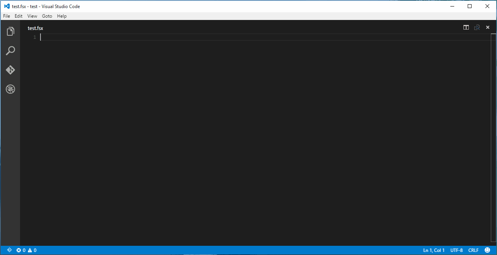
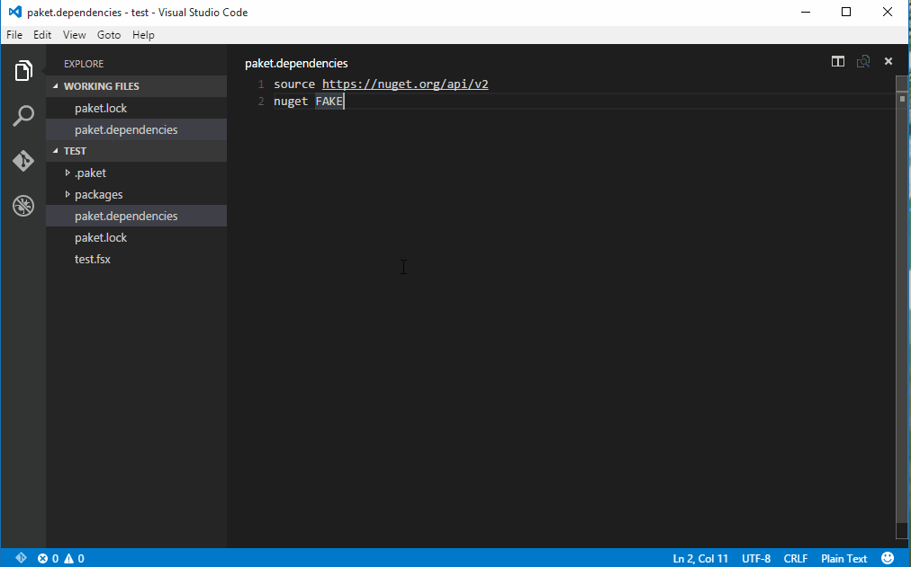
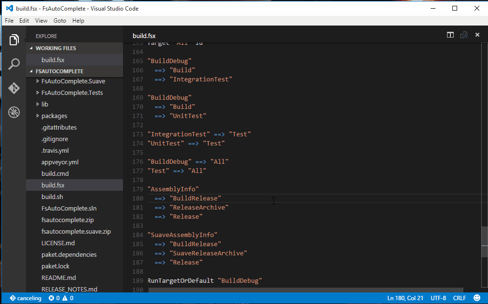

# [Guest Post] Announcing F# Support in Visual Studio Code with Ionide
* This is a guest post by [Krzysztof Cieślak](https://twitter.com/k_cieslak), an F# community developer and contributor to the Ionide project including its Visual Studio Code extension. To learn more about F# and engage with the community, head to [fsharp.org](fsharp.org). To learn more about the Ionide project, head to [ionide.io](ionide.io). *

[Ionide](http://ionide.io) is a suite of packages for the [Atom](https://atom.io/) editor that aims to provide a fully-featured, modern, cross-platform, open-source IDE for F# development. It's available via download using the Atom Package Manager.

At Connect, we announced the release of a set of Ionide extensions for [Visual Studio Code](https://code.visualstudio.com/), adding F#, Paket and FAKE support to this newly open-sourced, cross-platform editor.

## What is Ionide?

Ionide provides the option of a lightweight cross-platform editor for programmers who don’t want to rely on Visual Studio or Xamarin Studio for every project. While both are full-featured IDEs with very good F# support - much better in terms of plain language support features - there are many programmers, especially those coming from a functional programming background, who prefer a different style of tools.

Another important feature of the Ionide project is its integration with popular tools used by the F# community - such as [Paket](http://fsprojects.github.io/Paket/) (alternative NuGet client), [FAKE](http://fsharp.github.io/FAKE/) (F# Make), and the F# yeoman generator. Ionide enables developers to use this unique, integrated, open source tooling workflow from the comfort of their editor.

Ionide is an eight month-old project with almost 500 commits, 120 versioned releases, and 13 contributors for the core Atom F# support plugin. And now, we're excited to start a new pillar of the Ionide project - Ionide for Visual Studio Code.

## Ionide for Visual Studio Code

Visual Studio Code is new, cross-platform text editor created by Microsoft that combines the streamlined UI of a modern editor with rich code assistance and navigation, and an integrated debugging experience – without the need for a full IDE. As such, it has an aim similar to the Ionide project, and the decision to create a set of Visual Studio Code plug-ins was simple and natural.

### How to start

Ionide plugins for Visual Studio Code can be installed using the new [Visual Studio Code extension gallery](https://marketplace.visualstudio.com/#VSCode) - [Ionide-fsharp](https://marketplace.visualstudio.com/items/Ionide.Ionide-fsharp) is one of the featured extensions there, and there are also individual plugins for [Paket](https://marketplace.visualstudio.com/items/Ionide.Ionide-Paket) and [FAKE](https://marketplace.visualstudio.com/items/Ionide.Ionide-FAKE).

### F# support

Ionide-fsharp provides an F# IDE-like experience in Visual Studio Code, with features like
 * Better syntax highlighting
 * Auto-completion
 * Error highlighting and error list
 * F# Interactive integration
 * Tooltips
 * Go to Declaration
 * Show symbols in file

 

### Paket support

Paket is package dependency manager for .NET with support for NuGet packages and GitHub repositories. Ionide-Paket allows users to use Paket commands and manage packages without leaving the editor.

 

### FAKE support

FAKE (F# Make) is a build automation system with similar capabilities to make and rake. It uses a domain-specific language (DSL) to make it easy to start using FAKE without needing to learn F#. Ionide-FAKE allows the user to run any build target defined in a FAKE build script, define default targets to run using keyboard shortcuts, and cancel any task in progress.

 

### What's next?

In the near future, we hope to add integration with [F# yeoman generator](https://www.npmjs.com/package/generator-fsharp) to Visual Studio code to provide scaffolding for different types of F# projects. We will also work to offer integrations with other popular tools created by community such as [FSharpLint](http://fsprojects.github.io/FSharpLint/) and [Fantomas](https://github.com/dungpa/fantomas). There are also many possible expansions of the core language services - finding references and symbols across an eniter project, or adding support for CodeLens feature of VS Code. Together, we will build and grow a more vibrant and powerful F# cross-platform ecosystem.

## Contributing to Ionide

Ionide is open source project hosted on [GitHub](https://github.com/ionide) under an MIT license. We accept pull qequests, new feature proposals, and any suggestions on how we can make Ionide better!