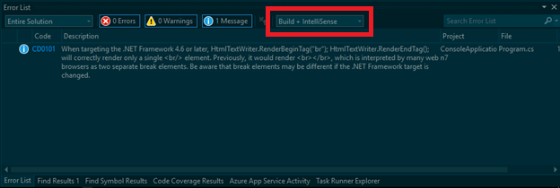
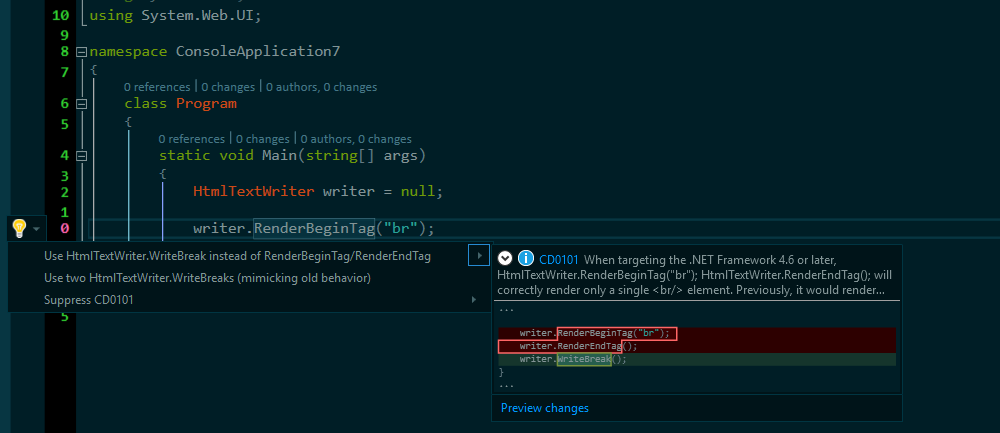
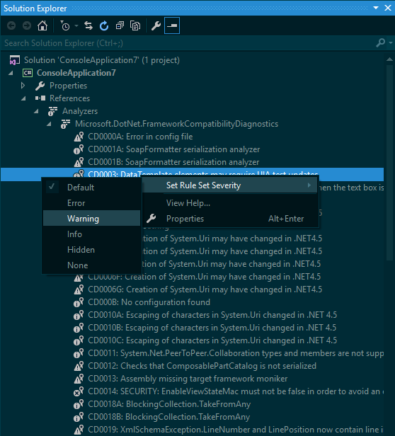

.NET Framework Compatibility Diagnostics
==============================

This post was written by **Taylor Southwick**, a software engineer on the .NET team.

Introduction
------------

Updates to the .NET Framework 4 are delivered as highly-compatible in-place updates, which helps keep users' applications running on the latest and most secure versions of the .NET Framework. Some deviation from previous behavior has beeen seen when applications depend on specific behaviors that are not guaranteed or documented. Historically, these differences have been difficult to find, and so we are introducing the .NET Compatibility Diagnostics to help identify these changes during .NET version upgrades. 

.NET Compatibility Diagnostics
------------------------------

Until now, the only options available to understand what changes were introduced in a specific version were to look at the [MSDN documentation](https://msdn.microsoft.com/en-US/library/dn458358(v=vs.110).aspx) or run the [ApiPort tool](https://github.com/microsoft/dotnet-apiport/releases). We needed a tool that is tailored for the scenario of bringing existing applications to a higher version of the .NET Framework. We wanted to make sure that it would have detailed information on how the usage of particular APIs can impact the ability of the selected applications to work flawlessly on the higher version of the .NET Framework so that you can better understand the impact of upgrades and which changes are necessary.

Since these diagnostics are built on Roslyn, they require VS2015 and will be run as part of the normal compilation process. The intent of these diagnostics is to flag API usage or patterns that are known or suspected to have unintended behavior changes when migrating to a newer version of the framework. Many of these will be corner-cases that most people will never encounter, although some of them are more likely in certain kinds of code than others. We have done our best to determine general use cases that exhibit the compatibility issue being analyzed and attempt to find those within the projects. However, please consider these to be more suggestions rather than absolutes as there may be many factors that play into compatibility issues. We strongly encourage users to use this as another tool in their risk analysis and mitigation process.

These diagnostics are designed to provide information coming from a version in the .NET Framework 4.x line of releases, i.e. .NET Framework 4.0 to .NET Framework 4.6.1, or .NET Framework 4.5 to .NET Framework 4.5.2. This tool does not help migrate from other versions of the .NET Framework at the current time.

Setup
-----

The .NET Compatibility Diagnostics are available on nuget.org and can be installed in any project targeting .NET 4.0+ using the normal NuGet installation method. In order to add these diagnostics to your project, do the following:

1.	Open your solution in VS 2015
2.	Right click the project node and click **Manage NuGet Packages**
3.	In the search box, search for **Microsoft.DotNet.FrameworkCompatibilityDiagnostics**
4.	Click *Install* then read and accept the license and terms of use

At this point the analyzers have been installed into your project and will begin analyzing your code during the normal compilation process. You will notice a new file `dotnet_compatibility.json` that has been added to your project. This file informs the analyzers what migration you are planning on performing. The default file looks like this:

```json
{
  "TargetFramework": {
    "Current": "4.0",
    "Planned": "4.0"
  },
  "RuntimeFramework": {
    "Current": "4.0",
    "Planned": "4.6.1"
  }
}
```

This configuration is a key part of removing much of the noise that can come from looking at possible breaking changes. There are two main sections: `TargetFramework` and `RuntimeFramework`. When migrating a codebase to a new version of .NET, it is important to understand what framework you are targeting versus what framework you are running on (for more details, please read [Targeting and Running .NET Framework apps for versions 4.5 and later](https://msdn.microsoft.com/en-US/library/bb822049(v=vs.110).aspx#Anchor_0)). The recommended migration path is to not change the targeted framework, but only change the runtime. This is to ensure that you don't unintentionally opt into any quirking by declaring you are compiling against a later framework. Many changes that are introduced in later versions of the runtime are hidden behind this quirking mechanism so that by targeting the earlier version, you will bypass the changes and retain the old behavior. 

You will see that the above example has 4.0 as its current and planned TargetFramework, as well as the current Runtime framework. The only item that has changed is the `RuntimeFramework:Planned`. This way, the analyzers will only alert you to possible changes that may impact your code when upgrading from the 4.0 runtime to the 4.6.1 runtime (the current latest version) while continuing to target .NET 4.0. These settings are stored on a per-project basis in this `dotnet_compatibility.json` file.

Usage
-----

Now that the analyzers are installed and the configuration is set, issues will start populating the Visual Studio Error List. In order to view all issues, ensure that the filter drop down is set to 'Build + Intellisense' as the informational diagnostics will only show if that is set.



Each listed issue may potentially affect the behavior of your application when migrated to the new runtime or target framework. We highly encourage targeted testing of these areas to ensure the behavior you intend has not been changed.

A few of the changes require a pattern or API change that we can actually provide via the light-bulb helper in Visual Studio. For example, a change in 4.6.1 affects HtmlTextWriter when writing the `<br />` token. For this, there is an option to switch to the new pattern that will mimic the old behavior and be resilient to version change:



This is only available for a subset of the issues identified by the .NET Compatibility Diagnostics. Most of the changes detected require information unavailable to the analyzers to make an informed decision. Therefore, resolution requires informations information only you as the developer have access to. Sometimes this will be to refactor; other times, it may be to ignore the suggestion (see below on how to do this). Please keep in mind that this tool will provide suggestions of places in your code that may be affected and thus they are not completely prescriptive. The suggestions, combined with your knowledge of the code, should help lead you to the best decisions to successfully migrate to a newer version of the framework.

Customizing Analyzer Alerts
---------------------------

During compilation, various messages will be emitted to the Visual Studio Error List (ensure the . The level of severity is determined by what we perceive the impact to code to be:

| SEVERITY | MEANING |
|----------|---------|
| INFORMATIONAL | The change is good to know but most likely won’t affect your code. More investigation is recommended to ensure no unintended side effects. |
| WARNING | The change appears to affect your code in such a way that unintended behavior change may occur. More investigation is needed. |
| ERROR | The change appears to affect your code in such a way that it will cause unintentional change to behavior. More investigation is needed. |
| None | The analyzer will not show any alerts for this diagnostic |

We understand that the severity level is subjective, so if an issue has the wrong severity for your application, it can be changed by opening the analyzer node in the Visual Studio Solution Explorer for the project you want to change. Right click on the analyzer one of the `Microsoft.DotNet.FrameworkCompatibilityDiagnostics(.CSharp|.VisualBasic)` analyzers listed and find the issue whose severity you want to change:



This will create a file `{ProjectName}.ruleset` in the project that can then be persisted to version control to ensure others opening the project will have the same experience.

Summary
----------

The .NET Compatibility Diagnostics provide insight into areas that may encounter compatibility issues when upgrading to new versions of the .NET Framework. These diagnostics highlight possible issues, but do not guarantee that it can find all issues nor that the issues found will absolutely experience behavior changes. The goal of these diagnostics is to provide help in the risk analysis and mitigation process of migrating a code base from one 4.x version of .NET Framework to another. Please download [this tool](https://www.nuget.org/packages/Microsoft.DotNet.FrameworkCompatibilityDiagnostics) and provide feedback via netfxcompat@microsoft.com.
