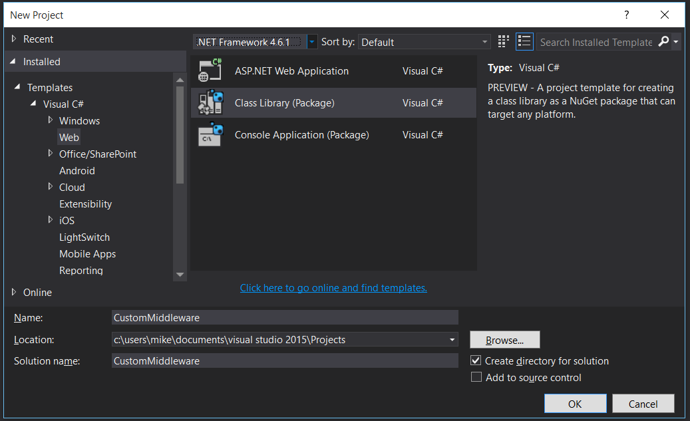
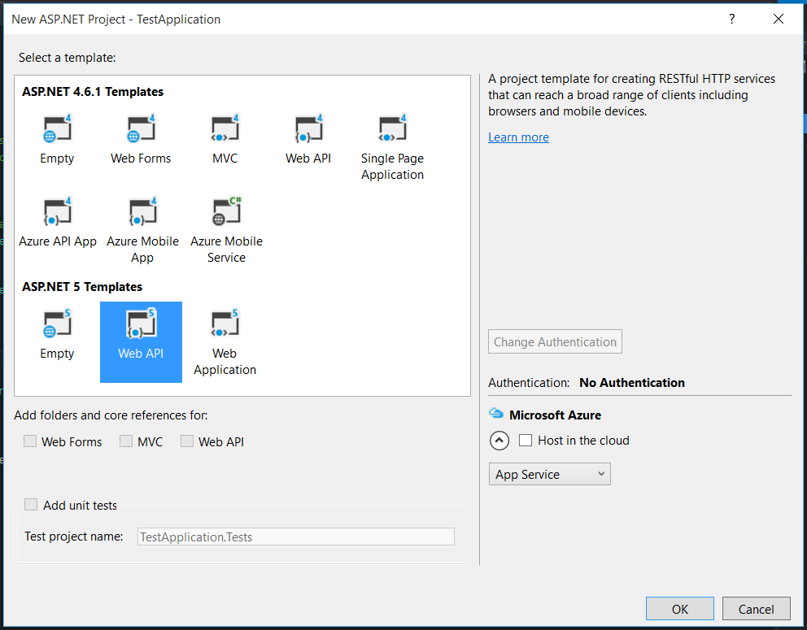
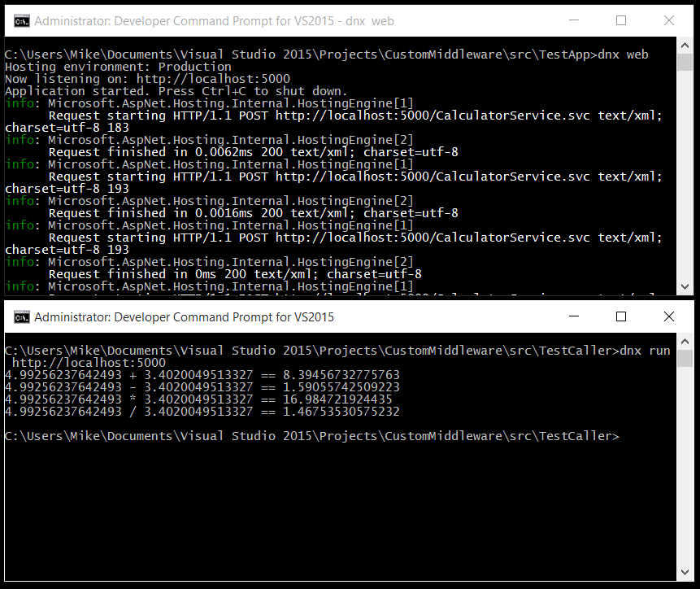

Custom ASP.NET Core Middleware for SOAP Requests
================================================

This post was written by **Mike Rousos**, a software engineer on the .NET team.

Introduction
------------

One of the great things about ASP.NET Core is its extensibility. The behavior of an ASP.NET Core app's HTTP request handling pipeline can be easily customized by specifying different [middleware](https://docs.asp.net/en/latest/fundamentals/middleware.html) components. This allows developers to plug in request handlers like MVC middleware, static file providers, authentication, error pages, or even their own custom middleware. In this article, I walk though how to create custom middleware to handle requests with simple SOAP payloads (similar to what would have been handled by WCF services previously).

### A Disclaimer ###
Hopefully this article provides a useful demonstration of creating custom middleware for ASP.NET Core in a real-world scenario. Some users might also find the SOAP handling itself useful for processing requests from old clients that previously communicated with a WCF endpoint. Be aware, though, that **this sample does not provide general WCF host support for ASP.NET Core**. Among other things, it has no support for message security, WSDL generation, duplex channels, non-HTTP transports, etc. The recommended way of providing web services with ASP.NET Core is via RESTful web API solutions. The ASP.NET [MVC](https://github.com/aspnet/Mvc) framework provides a powerful and flexible model for routing and handling web requests with controllers and actions. 

Getting Started
---------------

To start, create a .NET Core library (the project type is under web templates and is called `Class Library (package)`). Throughout this article I will be using the RC1 Update 1 version of the [ASP.NET web tools](https://docs.asp.net/en/latest/getting-started/installing-on-windows.html).


ASP.NET Core middleware uses the [explicit dependencies principle](http://deviq.com/explicit-dependencies-principle/), so all dependencies should be provided through dependency injection via arguments to the middleware's constructor. The one dependency common to most middleware is a `RequestDelegate` object representing the next delegate in the HTTP request processing pipeline. If our middleware does not completely handle a request, the request's context should be passed along to this next delegate. Later, we'll specify more dependencies in our constructor but, for now, let's add a basic constructor to our middleware class.

Add a dependency to `Microsoft.AspNet.Http.Abstractions` to your project.json (since that's the contract containing `RequestDelegate`) and create a constructor for the middleware class like this:

```C#
// The middleware delegate to call after this one finishes processing
private readonly RequestDelegate _next;

public SOAPEndpointMiddleware(RequestDelegate next)
{
    _next = next;
}
```

Next, we need to handle incoming HTTP request contexts. For this, middleware is expected to have an `Invoke` method taking an `HttpContext` parameter. This method should take whatever actions are necessary based on the `HttpContext` being processed and then call the next middleware in the HTTP request processing pipeline (unless no further processing is needed). For the moment, add this trivial `Invoke` method (as well as a dotnet5.4 dependency for `System.Console` in your project.json file):

```C#
public async Task Invoke(HttpContext httpContext)
{
    Console.WriteLine($"Request for {httpContext.Request.Path} received with {httpContext.Request.ContentLength ?? 0} bytes of content");
    
    // Call the next middleware delegate in the pipeline 
    await _next.Invoke(httpContext);
}
```

To try out our middleware as we create it, we will need a test ASP.NET Core app. Add an ASP.NET Core web API project to your solution and set it as the startup project.
 

ASP.NET Core middleware (custom or otherwise) can be added to an application's pipeline with the `IApplicationBuilder.UseMiddleware<T>` extension method. After adding a project reference to your middleware project (`"CustomMiddleware": ""`), add the middleware to your test app's pipeline in the `Configure` method of its Startup.cs file:

```C#
public void Configure(IApplicationBuilder app, IHostingEnvironment env, ILoggerFactory loggerFactory)
{
    loggerFactory.AddConsole(Configuration.GetSection("Logging"));
    loggerFactory.AddDebug();

    app.UseMiddleware<SOAPEndpointMiddleware>();
}
```

You may notice that the other middleware components (MVC, static files, etc.) all have custom extension methods to make adding them easy. Let's add an extension method for our custom middleware, too (notice the Microsoft.AspNet.Builder namespace so that IApplicationBuilder users can easily call the method):

```C#
namespace Microsoft.AspNet.Builder
{
    // Extension method used to add the middleware to the HTTP request pipeline.
    public static class SOAPEndpointExtensions
    {
        public static IApplicationBuilder UseSOAPEndpoint(this IApplicationBuilder builder)
        {
            return builder.UseMiddleware<SOAPEndpointMiddleware>();
        }
    }
}
```

The call to register the middleware in the test app then simplifies to `app.UseSOAPEndpoint()` instead of `app.UseMiddleware<SOAPEndpointMiddleware>()`.

At this point, we have successfully created a basic piece of custom middleware and injected it into our test app's HTTP request processing pipeline. 

Launch your test app (using Kestrel so that you can easily see Console output) and navigate to the hosted site with your web browser. Notice that the custom middleware logs messages as requests are received!

Specifying a Service Type
-------------------------

Now that we have a simple custom middleware component working, let's have it start actually processing SOAP requests! The middleware should listen for SOAP requests to come in to a particular endpoint (URL) and then dispatch the calls to the appropriate service API based on the SOAP action specified. For this to work, our custom middleware will need a few more things specified when it is created:

1. The path it should listen on for requests
2. The type of the service to invoke methods from
3. The [MessageVersion](https://msdn.microsoft.com/en-us/library/system.servicemodel.channels.messageversion%28v=vs.110%29.aspx) or [MessageEncoder](https://msdn.microsoft.com/en-us/library/system.servicemodel.channels.messageencoder%28v=vs.110%29.aspx) used to encode the incoming SOAP payloads
	1. Ideally, a `MessageEncoder` implementation (similar to the [TextMessageEncoder](http://referencesource.microsoft.com/#System.ServiceModel/System/ServiceModel/Channels/TextMessageEncoder.cs) used by the .NET Framework's `BasicHttpBinding`) would be provided to our middleware, but implementing a whole `MessageEncoder` is outside the scope of this blog post. For demonstration purposes, we will create a simpler SOAP-processing middleware component that just takes the `MessageVersion` used in incoming messages.

These arguments will all need to be provided when an app registers our middleware as part of its processing pipeline, so let's add them to the constructor like this (note that `MessageVersion` and `MessageEncoder` classes are in the `System.ServiceModel.Primitives` contract in .NET Core, and in the `System.ServiceModel` framework assembly on desktop):

```C#
// The middleware delegate to call after this one finishes processing
private readonly RequestDelegate _next;
private readonly Type _serviceType;
private readonly string _endpointPath;
private readonly MessageVersion _messageVersion;
// private readonly MessageEncoder _messageEncoder; // This could be used instead of _messageVersion

public SOAPEndpointMiddleware(RequestDelegate next, Type serviceType, string path, MessageVersion version)
{
    _next = next;
    _serviceType = serviceType;
    _endpointPath = path;
    _messageVersion = version;
}
```

The `UseSOAPEndpoint` extension method will also need updated (and can be made generic to capture the service type parameter):

```C#
public static IApplicationBuilder UseSOAPEndpoint<T>(this IApplicationBuilder builder, string path, MessageVersion messageVersion)
{
    return builder.UseMiddleware<SOAPEndpointMiddleware>(typeof(T), path, messageVersion);
}
```

Discovering Service Type Operations
--------------------------------

Requests handled by our SOAP-handling middleware will be requests to invoke some operation on the specified service type. We can use reflection to find methods on the given service type which correspond to contract operations.

Let's create a new type (`ServiceDescription`) to store this metadata. It should take the service type as an input to its constructor and then should walk the type with reflection to discover implemented contracts and operations according to the following heuristic:

1. Contracts should be discovered by finding `ServiceContractAttribute` elements on interfaces that the type implements
	1. Contract name and namespace information is taken from the attribute
2. Operations should be discovered by finding `OperationContractAttribute` elements on methods within the contract interfaces
	1. Operation name, properties, and action name are taken from the attribute; the method to invoke is the service type's implementation of the interface method

So, the `ServiceDescription` type should end up looking something like this:

```C#
public class ServiceDescription
{
    public Type ServiceType { get; private set; }
    public IEnumerable<ContractDescription> Contracts { get; private set; }
    public IEnumerable<OperationDescription> Operations => Contracts.SelectMany(c => c.Operations);

    public ServiceDescription(Type serviceType)
    {
        ServiceType = serviceType;

        var contracts = new List<ContractDescription>();

        foreach (var contractType in ServiceType.GetInterfaces())
        {
            foreach (var serviceContract in contractType.GetTypeInfo().GetCustomAttributes<ServiceContractAttribute>())
            {
                contracts.Add(new ContractDescription(this, contractType, serviceContract));
            }
        }

        Contracts = contracts;
    }
}
```

The `ContractDescription` type is similar:

```C#
public class ContractDescription
{
    public ServiceDescription Service { get; private set; }
    public string Name { get; private set; }
    public string Namespace { get; private set; }
    public Type ContractType { get; private set; }
    public IEnumerable<OperationDescription> Operations { get; private set; }

    public ContractDescription(ServiceDescription service, Type contractType, ServiceContractAttribute attribute)
    {
        Service = service;
        ContractType = contractType;
        Namespace = attribute.Namespace ?? "http://tempuri.org/"; // Namespace defaults to http://tempuri.org/
        Name = attribute.Name ?? ContractType.Name; // Name defaults to the type name
        
        var operations = new List<OperationDescription>();
        foreach (var operationMethodInfo in ContractType.GetTypeInfo().DeclaredMethods)
        {
            foreach (var operationContract in operationMethodInfo.GetCustomAttributes<OperationContractAttribute>())
            {
                operations.Add(new OperationDescription(this, operationMethodInfo, operationContract));
            }
        }
        Operations = operations;
    }  
}
```

The `OperationDescription` class looks much the same except that it also contains metadata about how the operation should be invoked:

```C#
public class OperationDescription
{
    public ContractDescription Contract { get; private set; }
    public string SoapAction { get; private set; }
    public string ReplyAction { get; private set; }
    public string Name { get; private set; }
    public MethodInfo DispatchMethod { get; private set; }
    public bool IsOneWay { get; private set; }

    public OperationDescription(ContractDescription contract, MethodInfo operationMethod, OperationContractAttribute contractAttribute)
    {
        Contract = contract;
        Name = contractAttribute.Name ?? operationMethod.Name;
        SoapAction = contractAttribute.Action ?? $"{contract.Namespace.TrimEnd('/')}/{contract.Name}/{Name}";
        IsOneWay = contractAttribute.IsOneWay;
        ReplyAction = contractAttribute.ReplyAction;
        DispatchMethod = operationMethod;
    }
}
```

Once these types exist, the middleware's constructor can be updated to store a `ServiceDescription` created from the specified `Type` instead of storing the `Type` itself:

```C#
private readonly ServiceDescription _service;

public SOAPEndpointMiddleware(RequestDelegate next, Type serviceType, string path, MessageVersion version)
{
    _next = next;
    _endpointPath = path;
    _messageVersion = version;
    _service = new ServiceDescription(serviceType);
}
```


Note that this could all be simplified by just having a dictionary of action names and `OperationDescription` or `MethodInfo` dispatch methods. I've opted to have the whole service/contract/operation structure stored, though, because it will allow expanding the sample with more complex functionality (such as supporting message inspectors) in a future blog post.

Invoking the Operations
-----------------------

At this point, you should have a custom middleware class that takes a service type as input and discovers available operations. Now it's time to update the middleware's `Invoke` method to actually call those operations.

The first thing to check in the `Invoke` method is whether or not the incoming request's path equals the path our service is listening on. If not, then we need to pass the request along to other pipeline members.

```C#
public async Task Invoke(HttpContext httpContext)
{
    if (httpContext.Request.Path.Equals(_endpointPath, StringComparison.Ordinal))
    {
        // TODO : Reading message goes here
    }
    else
    {
        await _next(httpContext);
    }
}
```
If the the request's path *does* equal the expected path for our service endpoint, we need to read the message and compose a response. If the caller had provided a `MessageEncoder`, you would just call `MessageEncoder.ReadMessage`. With a `MessageVersion` instead, we will just create the message directly from an `XmlReader`. Note that `XmlReader` exists in the `System.Xml.ReaderWriter` contract in .NET Core and in the `System.Xml` framework assembly in the desktop .NET Framework.

```C#
Message responseMessage;

// Read request message
using (var reader = XmlReader.Create(httpContext.Request.Body))
{
    var requestMessage = Message.CreateMessage(reader, 0x10000, _messageVersion);

	// TODO : Get requested action and invoke
}
```

To get the requested action, we need to look for a 'SOAPAction' header (which is how SOAP actions are usually communicated).

```C#
var soapAction = httpContext.Request.Headers["SOAPAction"].ToString().Trim('\"');
if (!string.IsNullOrEmpty(soapAction))
{
    requestMessage.Headers.Action = soapAction;
}

// TODO : Lookup operation and invoke
```

Knowing the requested action, we can find the correct `OperationDescription` to invoke.

```C#
var operation = _service.Operations.Where(o => o.SoapAction.Equals(requestMessage.Headers.Action, StringComparison.Ordinal)).FirstOrDefault();
if (operation == null)
{
    throw new InvalidOperationException($"No operation found for specified action: {requestMessage.Headers.Action}");
}

// TODO : Invoking the operation goes here
```

Now that we have a `MethodInfo` to invoke, we need to extract the arguments to pass to the operation from the request's body. This can be done in a helper method with an `XmlReader` and `DataContractSerializer`.

```C#
private object[] GetRequestArguments(Message requestMessage, OperationDescription operation)
{
    var parameters = operation.DispatchMethod.GetParameters();
    var arguments = new List<object>();

    // Deserialize request wrapper and object
    using (var xmlReader = requestMessage.GetReaderAtBodyContents())
    {
        // Find the element for the operation's data
        xmlReader.ReadStartElement(operation.Name, operation.Contract.Namespace);
        
        for (int i = 0; i < parameters.Length; i++)
        {
            var parameterName = parameters[i].GetCustomAttribute<MessageParameterAttribute>()?.Name ?? parameters[i].Name;
            xmlReader.MoveToStartElement(parameterName, operation.Contract.Namespace);
            if (xmlReader.IsStartElement(parameterName, operation.Contract.Namespace))
            {
                var serializer = new DataContractSerializer(parameters[i].ParameterType, parameterName, operation.Contract.Namespace);
                arguments.Add(serializer.ReadObject(xmlReader, verifyObjectName: true));
            }
        }
    }

    return arguments.ToArray();
}
```

Note that this argument reading helper assumes the arguments are provided in order in the message body. This is true for messages coming from .NET WCF clients, but may not be true for all SOAP clients. If needed, this method could be replaced with a slightly more complex variant that allows for re-ordered arguments and fuzzier parameter name matching.

With the operation and arguments are known, all that remains is to retrieve an instance of the service type to call the operation method on. This can be done with ASP.NET Core's built-in dependency injection.

Change the middleware's `Invoke` method signature to take an `IServiceProvider` parameter (`IServiceProvider serviceProvider`). Then, we can use the `IServiceProver.GetService` API to retrieve service types that the user has registered in the `ConfigureServices` method of their Startup.cs file.

All together, the call to invoke the operation should look something like this:

```C#
// Get service type
var serviceInstance = serviceProvider.GetService(_service.ServiceType);

// Get operation arguments from message
var arguments = GetRequestArguments(requestMessage, operation);

// Invoke Operation method
var responseObject = operation.DispatchMethod.Invoke(serviceInstance, arguments.ToArray());

// TODO : Encode responseObject into the response message
```

Encoding the Response
---------------------

Finally, with a response in hand, we can use either the `MessageEncoder` or `MessageVersion` specified by the user to send the object back to the caller in the HTTP response. [Message.CreateMessage](https://msdn.microsoft.com/en-us/library/ms195450%28v=vs.110%29.aspx) requires an implementation of `BodyWriter` to output the body of the message with correct element names. So, add a class like the one below that implements `BodyWriter`.

```C#
public class ServiceBodyWriter : BodyWriter
{
    string ServiceNamespace;
    string EnvelopeName;
    string ResultName;
    object Result;
    
    public ServiceBodyWriter(string serviceNamespace, string envelopeName, string resultName, object result) : base(isBuffered: true)
    {
        ServiceNamespace = serviceNamespace;
        EnvelopeName = envelopeName;
        ResultName = resultName;
        Result = result;
    }

    protected override void OnWriteBodyContents(XmlDictionaryWriter writer)
    {
        writer.WriteStartElement(EnvelopeName, ServiceNamespace);
        var serializer = new DataContractSerializer(Result.GetType(), ResultName, ServiceNamespace);
        serializer.WriteObject(writer, Result);
        writer.WriteEndElement();
    }
}
```

Then we can update the middleware's `Invoke` method to create a response message (if the operation isn't one way) and write it to the HTTP context's response.

```C#
// Create response message
var resultName = operation.DispatchMethod.ReturnParameter.GetCustomAttribute<MessageParameterAttribute>()?.Name ?? operation.Name + "Result";
var bodyWriter = new ServiceBodyWriter(operation.Contract.Namespace, operation.Name + "Response", resultName, responseObject);
responseMessage = Message.CreateMessage(requestMessage.Version, operation.ReplyAction, bodyWriter);

httpContext.Response.ContentType = httpContext.Request.ContentType; // _messageEncoder.ContentType;
httpContext.Response.Headers["SOAPAction"] = responseMessage.Headers.Action;

// Use _messageEncoder.WriteMessage if a MessageEncoder is available, otherwise use XmlWriter
using (var writer = XmlWriter.Create(httpContext.Response.Body))
{
    responseMessage.WriteMessage(writer);
}
```

And that's it! You have written custom ASP.NET Core middleware for handling SOAP requests.

Testing it Out
--------------

Now that our custom middleware actually works with service types, the simple test app we created before will need updated. We'll need a simple WCF-style service type to call into. If you don't have one on-hand to test with, you can use this sample:

```C#
using System.ServiceModel;

namespace TestApp
{
    public class CalculatorService : ICalculatorService
    {
        public double Add(double x, double y) => x + y;
        public double Divide(double x, double y) => x / y;
        public double Multiply(double x, double y) => x * y;
        public double Subtract(double x, double y) => x - y;
    }

    [ServiceContract]
    public interface ICalculatorService
    {
        [OperationContract] double Add(double x, double y);
        [OperationContract] double Subtract(double x, double y);
        [OperationContract] double Multiply(double x, double y);
        [OperationContract] double Divide(double x, double y);
    }
}
```

The `UseSOAPEndpoint` call we added to the `Configure` method in our test host's Startup.cs file will need updated to point to this new type: `app.UseSOAPEndpoint<CalculatorService>("/CalculatorService.svc", MessageVersion.Soap11);`.

Also, since the instance of our service is created with dependency injection, the following line will need added to the `ConfigureServices` method in our host's startup.cs file: `services.AddSingleton<CalculatorService>();` 

If you have a WSDL for your test service, you can create a client directly from that using WCF tools. Otherwise, create a client directly using `ClientBase<T>`.

Here is a simple client I created (as an ASP.NET Core console application) to test the middleware and host:

```C#
using System;
using System.ServiceModel;
using System.ServiceModel.Channels;

namespace TestApp
{
    public class Program
    {
        public static void Main(string[] args)
        {
            if (args.Length < 1)
            {
                Console.WriteLine("Please provide the remote URL of the calculator service");
                return;
            }

            // Create random inputs
            Random numGen = new Random();
            double x = numGen.NextDouble() * 20;
            double y = numGen.NextDouble() * 20;

            var serviceAddress = $"{args[0]}/CalculatorService.svc";

            var client = new CalculatorServiceClient(new BasicHttpBinding(), new EndpointAddress(serviceAddress));
            Console.WriteLine($"{x} + {y} == {client.Add(x, y)}");
            Console.WriteLine($"{x} - {y} == {client.Subtract(x, y)}");
            Console.WriteLine($"{x} * {y} == {client.Multiply(x, y)}");
            Console.WriteLine($"{x} / {y} == {client.Divide(x, y)}");
        }
    }
    class CalculatorServiceClient : ClientBase<ICalculatorService>
    {
        public CalculatorServiceClient(Binding binding, EndpointAddress remoteAddress) : base(binding, remoteAddress) { }
        public double Add(double x, double y) => Channel.Add(x, y);
        public double Subtract(double x, double y) => Channel.Subtract(x, y);
        public double Multiply(double x, double y) => Channel.Multiply(x, y);
        public double Divide(double x, double y) => Channel.Divide(x, y);
    }

    [ServiceContract]
    public interface ICalculatorService
    {
        [OperationContract]
        double Add(double x, double y);
        [OperationContract]
        double Subtract(double x, double y);
        [OperationContract]
        double Multiply(double x, double y);
        [OperationContract]
        double Divide(double x, double y);
    }
}
```

Launch the test host and point a test client (like the one pasted above) at it to see ASP.NET Core handle a SOAP request with our custom middleware!



Using a tool like [Fiddler](http://www.telerik.com/fiddler), we can observe the requests and responses.

Request from sample:

```xml
POST http://localhost:5000/CalculatorService.svc HTTP/1.1
Cache-Control: no-cache, max-age=0
Content-Type: text/xml; charset=utf-8
Accept-Encoding: gzip, deflate
SOAPAction: "http://tempuri.org/ICalculatorService/Add"
Connection: Keep-Alive
Content-Length: 183
Host: localhost:5000

<s:Envelope xmlns:s="http://schemas.xmlsoap.org/soap/envelope/">
  <s:Body>
    <Add xmlns="http://tempuri.org/">
      <x>17.078485198821166</x>
      <y>12.667884180633298</y>
    </Add>
  </s:Body>
</s:Envelope>
```

Response from sample:

```xml
HTTP/1.1 200 OK
Date: Tue, 15 Mar 2016 19:39:05 GMT
Content-Type: text/xml; charset=utf-8
Server: Kestrel
Content-Length: 231

<?xml version="1.0" encoding="utf-8"?>
<s:Envelope xmlns:s="http://schemas.xmlsoap.org/soap/envelope/">
  <s:Body>
    <AddResponse xmlns="http://tempuri.org/">
      <AddResult>30.589212379692686</AddResult>
    </AddResponse>
  </s:Body>
</s:Envelope>
```

Conclusion
----------

I hope that this article has been helpful in demonstrating a real-world case of custom middleware expanding ASP.NET Core's request processing capabilities. By creating a constructor that took the middleware's dependencies as parameters and creating an `Invoke` method with the logic of deserializing and dispatching SOAP requests, we were able to serve responses to a WCF client from ASP.NET Core! SOAP handling middleware is just one example of how custom middleware can be used. More details on middleware are available in the [ASP.NET Core documentation](https://docs.asp.net/en/latest/fundamentals/middleware.html).