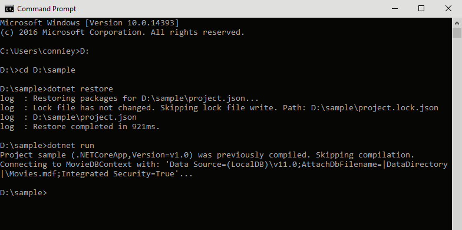

# Reusing Configuration Files in ASP.NET Core

## Introduction

The release of [ASP.NET Core 1.0](https://blogs.msdn.microsoft.com/dotnet/2016/06/27/announcing-net-core-1-0/) has enticed existing ASP.NET customers to migrate their projects to this new platform.  While working with a customer to move their assets to ASP.NET Core, we encountered an obstacle.  Our customer had a many configuration files (`*.config`) they used regularly.  They had hundreds of configuration files that would take time to transform into a format that could be consumed by the existing configuration providers.  In this post, we'll show how to tackle this hurdle by utilizing ASP.NET Core's configuration extensibility model.  We will write our own configuration provider to reuse the existing `*.config` files.

The new [configuration model](https://docs.asp.net/en/latest/intro.html#configuration) handles configuration values as a series of name-value pairs.  There are built-in configuration providers to parse (XML, JSON, INI) files. It also enables developers to create [their own providers](http://docs.asp.net/en/latest/fundamentals/configuration.html#writing-custom-providers) if the current providers do not suit their needs. 

## Creating the ConfigurationProvider
By following the documentation outlined in [Writing custom providers](https://docs.asp.net/en/latest/fundamentals/configuration.html#writing-custom-providers), we created a class that inherited from `ConfigurationProvider`. Then, it was a matter of overriding the `public override void Load()` function to parse the data we wanted from the configuration files!  Here's a little snippet of that code below.

```csharp
using Microsoft.Extensions.Configuration;

public class ConfigFileConfigurationProvider : ConfigurationProvider
{
  public override void Load()
  {
    // Logic to load the *.config file as an XDocument

    Data = new SortedDictionary<string, string>(StringComparer.OrdinalIgnoreCase);

    // Add all the key/values that we get from the config file into Data
  }
}
```

## The ConfigurationProvider in Action
Consider the following [Web.config](http://www.asp.net/mvc/overview/getting-started/introduction/creating-a-connection-string):

```xml
<?xml version="1.0"?>
<configuration>
  <appSettings>
    <add key="PreserveLoginUrl" value="true" />
    <add key="ClientValidationEnabled" value="true" />
    <add key="UnobtrusiveJavaScriptEnabled" value="true" />
  </appSettings>
  <connectionStrings>
    <add name="DefaultConnection" connectionString="Data Source=(LocalDb)\v11.0;AttachDbFilename=|DataDirectory|\aspnet-MvcMovie-20130603030321.mdf;Initial Catalog=aspnet-MvcMovie-20130603030321;Integrated Security=True" providerName="System.Data.SqlClient" />
    <add name="MovieDBContext"    connectionString="Data Source=(LocalDB)\v11.0;AttachDbFilename=|DataDirectory|\Movies.mdf;Integrated Security=True" providerName="System.Data.SqlClient" />
  </connectionStrings>
  <sampleSection>
    <add key="setting1" value="This is the setting1 value" />
    <add key="setting2" value="This is the setting2 value" />
  </sampleSection>
  <configNode>
    <nestedNode>
      <add key="DummyKey"   value="DummyValue" />
      <add key="NestedKey"  value="ValueA" />
      <remove key="DummyKey" />
    </nestedNode>
  </configNode>
</configuration>
```

to reuse this file, all we have to do is use our new provider like below and run `dotnet run` to see the code in action.

```csharp
using System;
using System.Data.SqlClient;
using Microsoft.Extensions.Configuration;

public class Program 
{
  public static void Main()
  {
    var builder = new ConfigurationBuilder().AddConfigFile("Web.config");
    var configuration = builder.Build();
    var movieDB = configuration.GetValue("ConnectionStrings", "MovieDBContext");

    Console.WriteLine($"Connecting to MovieDBContext with: '{movieDB}'...");

    using (var sqlConnection = new System.Data.SqlClient.SqlConnection(movieDB))
    {
      // Perform database actions with SQL connection
    }
  }
}
```



Our configuration provider code is on [GitHub](https://github.com/aspnet/Entropy/tree/dev/samples/Config.CustomConfigurationProviders.Sample) so you can check it out yourself and see how easy it is to use the ASP.NET configuration model.

# References
* [Why build for ASP.NET Core?](https://docs.asp.net/en/latest/conceptual-overview/aspnet.html#why-build-asp-net-5)
* [ASP.NET Documentation - Configuration](https://docs.asp.net/en/latest/intro.html#configuration)
* [GitHub - ConfigurationProvider Code](https://github.com/aspnet/Entropy/tree/dev/samples/Config.CustomConfigurationProviders.Sample)
