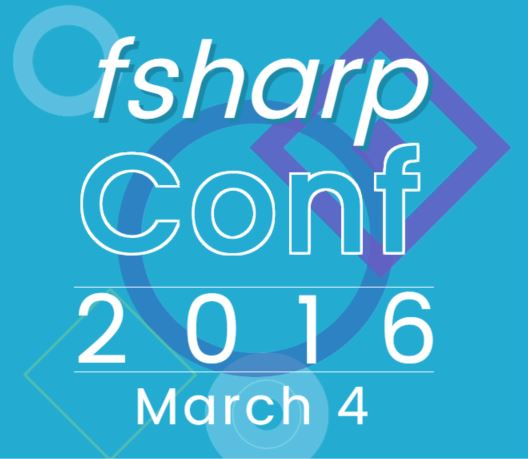

fsharpConf 2016
===========================

Join us this Friday, March 4th on [Channel 9](https://channel9.msdn.com/) for the first ever fsharpConf! Tune in starting at 8:30am PST (16:30 GMT).

Inspired by dotNetConf, fsharpConf is a free, online-only, day-long conference featuring an awesome lineup of talks from the F# community. Check out the [fsharpConf site](http://fsharpconf.com/) for more details, and follow [@fsharpConf](https://twitter.com/fsharpconf) on Twitter.

See you there! And if you miss it, the sessions will be recorded. :)

Speakers & Talks
------
* Don Syme and Tomas Petricek - Welcome to fsharpConf
* Evelina Gabasova - The F#orce Awakens
* Rachel Reese - Patterns and Practices for Real-World Event-Driven Microservices; Using F# at Jet.com
* Sean Trelford and Phil Trelford - Fun and Games with F#
* Goswin Rothenthal - The 3D Geometry of Louvre Abu Dhabi
* Mark Seemann - Types + Properties = Software
* Krzysztof Cieślak - Ionide & Cross-Platform F# Tools
* Henrik Feldt - F# Microservices with Logging, Tracing, and More on Docker
* Chris Holt - Web UI Automation with F# and Canopy
* Faisal Waris - Android Watch Gesture Recognition with Functional State Machines
* Alena Hall - Cassandra, Docker, and F# Awesomeness
* Yukitoshi Suzuki - F# Community in Japan
* Felienne Hermans - A Boardgame Night with Geeks
* David Stephens and Tomas Petricek - Q&A with the Visual F# Team and Community
