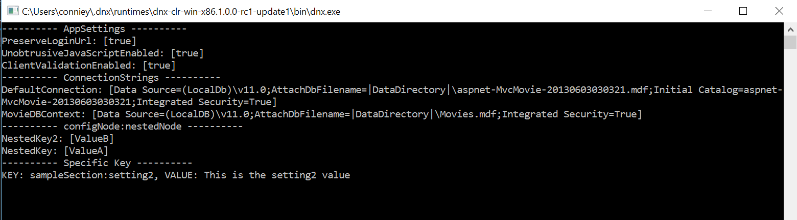

# Reusing Configuration Files in ASP.NET Core

## Introduction
There have been some very exciting changes in the .NET world, especially in the world of ASP.NET! [ASP.NET Core](https://docs.asp.net/en/latest/) is a .NET platform that has been created from the ground up, is open-source, and supports cross-platform user experiences.  These exciting features have enticed existing ASP.NET customers to migrate their existing assets.  One obstacle customers may encounter while trying to migrate their assets to ASP.NET Core is how to deal with their Configuration (`*.config`) files.

Since this is a new platform, the ASP.NET team was able to reengineer the existing [System.Configuration](https://msdn.microsoft.com/en-us/library/system.configuration.configuration(v=vs.110).aspx) model into a [very flexible configuration model](http://docs.asp.net/en/latest/conceptual-overview/aspnet.html#configuration).  This new configuration model allows customers to write their own [`ConfigurationProviders`](http://docs.asp.net/en/latest/fundamentals/configuration.html#writing-custom-providers) that will parse their configuration files.  The goal of this post is to demonstrate how easy it is to reuse your existing `*.config` files. 

While working with a customer to move their assets to ASP.NET Core, we encountered this issue.  Our customer had a lot of configuration files that they used regularly.  We decided that it would be easier to create a `ConfigurationProvider` to parse the same files rather than transform their files into a format that could be consumed by the existing providers.

## Creating the ConfigurationProvider
By following the documentation outlined in [Writing custom providers](https://docs.asp.net/en/latest/fundamentals/configuration.html#writing-custom-providers), we created a class that inherited from `ConfigurationProvider`. Then, it was a matter of overriding the `public override void Load()` function to parse the data we wanted from the configuration files!  Here's a little snippet of that code below.

```csharp
using Microsoft.Extensions.Configuration;

public class ConfigFileConfigurationProvider : ConfigurationProvider
{
  public override void Load()
  {
    // Logic to load the *.config file as an XDocument

    Data = new SortedDictionary<string, string>(StringComparer.OrdinalIgnoreCase);

    // Add all the key/values that we get from the config file into Data
  }
}
```

## The ConfigurationProvider in Action
Consider the following [Web.config](http://www.asp.net/mvc/overview/getting-started/introduction/creating-a-connection-string):
```xml
<?xml version="1.0"?>
<configuration>
  <appSettings>
    <add key="PreserveLoginUrl" value="true" />
    <add key="ClientValidationEnabled" value="true" />
    <add key="UnobtrusiveJavaScriptEnabled" value="true" />
  </appSettings>
  <connectionStrings>
    <add name="DefaultConnection" connectionString="Data Source=(LocalDb)\v11.0;AttachDbFilename=|DataDirectory|\aspnet-MvcMovie-20130603030321.mdf;Initial Catalog=aspnet-MvcMovie-20130603030321;Integrated Security=True" providerName="System.Data.SqlClient" />
    <add name="MovieDBContext"    connectionString="Data Source=(LocalDB)\v11.0;AttachDbFilename=|DataDirectory|\Movies.mdf;Integrated Security=True" providerName="System.Data.SqlClient" />
  </connectionStrings>
  <sampleSection>
    <add key="setting1" value="This is the setting1 value" />
    <add key="setting2" value="This is the setting2 value" />
  </sampleSection>
  <configNode>
    <nestedNode>
      <add key="DummyKey"   value="DummyValue" />
      <add key="NestedKey"  value="ValueA" />
      <remove key="DummyKey" />
    </nestedNode>
  </configNode>
</configuration>
```

to reuse this file, all we have to do is use our new provider like below:

```csharp
public static void Main(string[] args)
{
    var configuration = new ConfigurationBuilder().AddConfigFile("Web.config").Build();
    var configurationManager = new ConfigurationManager(configuration);

    Console.WriteLine("---------- AppSettings ----------");
    foreach (var kvp in configurationManager.AppSettings)
        Console.WriteLine($"{kvp.Key}: [{kvp.Value}]");

    Console.WriteLine("---------- ConnectionStrings ----------");
    foreach (var kvp in configurationManager.ConnectionStrings)
        Console.WriteLine($"{kvp.Key}: [{kvp.Value}]");

    Console.WriteLine("---------- configNode:nestedNode ---------- ");
    foreach (var kvp in configurationManager.GetSection("configNode", "nestedNode"))
        Console.WriteLine($"{kvp.Key}: [{kvp.Value.Value}]");

    Console.WriteLine("---------- Specific Key ---------- ");
    var value = configurationManager.GetValue("sampleSection", "setting2");
    Console.WriteLine($"KEY: sampleSection:setting2, VALUE: {value}");
}
```

Then just run our project to get this!


Lastly, our configuration provider code is on [GitHub](https://github.com/aspnet/entropy) for you to view/use/modify.

# References
* [Why build for ASP.NET Core?](https://docs.asp.net/en/latest/conceptual-overview/aspnet.html#why-build-asp-net-5)
* [ASP.NET Documentation - Configuration](http://docs.asp.net/en/latest/fundamentals/configuration.html)
* [GitHub - ConfigurationProvider Code](https://github.com/aspnet/entropy)
