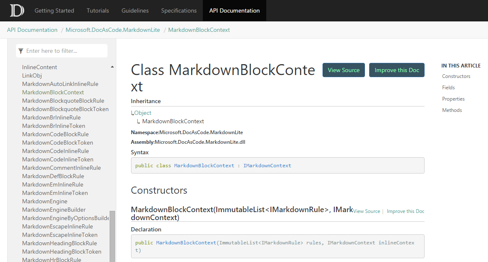

The week in .NET - 3/1/2016
===========================

To read last week's post, see [The week in .NET – 2/23/2016](https://blogs.msdn.microsoft.com/dotnet/2016/02/23/the-week-in-net-2232016/).

On.NET
------

Last week, we had a [fun, chaotic discussion with Scott Hanselman](https://www.youtube.com/watch?v=5ZpDBr9MOos).
This week, our guest is Rachel Reese, and we'll talk about Jet.com and F#.

Package of the week: SkiaSharp
------------------------------

Xamarin released a new 2D drawing API based on [Google's powerful Skia library](http://skia.org/) that powers Chrome, Firefox, and Android's graphic stack. [SkiaSharp](https://developer.xamarin.com/guides/cross-platform/drawing/) is a portable library with support for OSX, Android, iOS, Mono, and .NET Framework.

```csharp
Stream fileStream = File.OpenRead ("MyImage.png");

// clear the canvas / fill with white
canvas.DrawColor (SKColors.White);

// decode the bitmap from the stream
using (var stream = new SKManagedStream(fileStream))
using (var bitmap = SKBitmap.Decode(stream))
using (var paint = new SKPaint()) {
  // create the image filter
  using (var filter = SKImageFilter.CreateBlur(5, 5)) {
    paint.ImageFilter = filter;

    // draw the bitmap through the filter
    canvas.DrawBitmap(bitmap, SKRect.Create(width, height), paint);
  }
}
```

Tool of the week: Docfx
-----------------------

Since its inception, .NET has included the ability for developers to include documentation in the form of XML doc comments. Going from those comments to a great web site serving readable documentation with a good table of contents was often a clunky experience however. [Docfx](http://dotnet.github.io/docfx/) brings a modern solution to this problem, that leverages the power of [Markdown](http://dotnet.github.io/docfx/spec/docfx_flavored_markdown.html) and [YAML](http://dotnet.github.io/docfx/spec/metadata_format_spec.html#3-work-with-metadata-in-markdown-), and enables both conceptual and reference documentation in the same place, with [a simple cross-reference system](http://dotnet.github.io/docfx/spec/docfx_flavored_markdown.html#cross-reference) between them. It's also possible to [include code samples as partial views of code files on disk](http://dotnet.github.io/docfx/spec/docfx_flavored_markdown.html#code-snippet). This is extremely useful if you believe that the code samples in your documentation should be part of your test suites, in order to maintain their accuracy.



User group of the week: TRINUG
------------------------------

[TRINUG](http://www.meetup.com/TRINUG/) holds its [weekly meetup this week on Wednesday, March 2](http://www.meetup.com/TRINUG/events/228758891/) with a talk from Kip Streithorst on high level web application architecture. 

.NET
----

* You've heard the news: [Scott Guthrie welcomes the Xamarin team to Microsoft](https://weblogs.asp.net/scottgu/welcoming-the-xamarin-team-to-microsoft), and [Nat Friedman gives the Xamarin point of view](https://blog.xamarin.com/a-xamarin-microsoft-future).
* [New Toolchain For .NET – Dotnet CLI](http://bleedingnedge.com/2016/02/04/new-toolchain-dotnet-cli/) by Paweł Grudzień.
* Vance Morrison's legendary multithreading papers [What Every Dev Must Know About Multithreaded Apps](http://blogs.msdn.com/b/vancem/archive/2016/02/27/encode-presentation-what-every-dev-must-know-about-multithreaded-apps.aspx) and [Understand the Impact of Low-Lock Techniques in Multithreaded Apps](http://blogs.msdn.com/b/vancem/archive/2016/02/27/encore-presentation-understand-the-impact-of-low-lock-techniques-in-multithreaded-apps.aspx) are available again as PDF from his blog.
* [NBench testing garbage collection](http://www.dotnetalgorithms.com/2016/02/nbench-testing-garbage-collection/) by Andrea Angella.
* [ConditionalWeakTable and dynamic properties in .NET 4+](https://www.simple-talk.com/blogs/2016/02/26/conditionalweaktable-and-dynamic-properties-in-net-4/) by Chris Whitworth.
* [Fun async tricks for getting better performance](https://ayende.com/blog/173473/fun-async-tricks-for-getting-better-performance) and [Dependency management in a crisis](https://ayende.com/blog/173377/dependencies-management-in-a-crisis?Key=1d4d9b27-fc86-451d-bd4f-2da16b5cfad3) by Ayende Rahien.

ASP.NET
-------

* [David Paquette, James Chambers, and Simon Timms have a new show on Channel 9 called ASP.NET Monsters](https://channel9.msdn.com/Series/aspnetmonsters?sort=recent#tab_sortBy_recent) about building apps with ASP.NET Core.
* [Keeping POST and GET Separated](https://www.simple-talk.com/dotnet/asp.net/keeping-post-and-get-separated/) by Dino Esposito.
* [Using Let's Encrypt with IIS on Windows](http://weblog.west-wind.com/posts/2016/Feb/22/Using-Lets-Encrypt-with-IIS-on-Windows) by Rick Strahl.

F#
--

* This Friday, March 4th! fsharpConf 2016 will be live on Channel 9. [Check out the lineup of speakers.](http://fsharpconf.com/)
* [F# on the Desktop](https://www.youtube.com/watch?v=T8R-g_E1VFg), by Phil Trelford.
* [Type Providers from the Ground Up](https://www.youtube.com/watch?v=pXT0li6zxKQ), by Michael Newton.
* [.NET: A Look Through F# Lenses](https://www.pluralsight.com/blog/software-development/tutorial-f-sharp?utm_medium=affiliate&utm_source=314743), by Jacqueline Homan.
* [Converting a DSL to Executable F# Code On-the-Fly](http://brandewinder.com/2016/02/20/converting-dsl-to-fsharp-code-part-1/), by Mathias Brandewinder.
* [Double Cone Design](https://medium.com/@bryanedds/double-cone-design-ddc8e5f23432#.yekr1a8zw), by Bryan Edds.

Check out [F# Weekly](https://sergeytihon.wordpress.com/category/f-weekly/) for more great content from the F# community.

And this is it for this week!

Contribute to the week in .NET
------------------------------

As always, this weekly post couldn't exist without community contributions,
and I'd like to thank all those who sent links and tips.
You can participate too. Did you write a great blog post, or just read one?
Do you want everyone to know about an amazing new contribution or a useful library?
Did you make or play a great game built on .NET?
We'd love to hear from you, and feature your contributions on future posts:

* Send an email to beleroy at Microsoft,
* [comment on this gist](xx)
* Leave us a pointer in the comments section below.
* [Send Stacey (@yecats131) tips on Twitter about .NET games](https://twitter.com/yecats131).

This week's post (and future posts) also contains news I first read on
[ASP.NET's community spotlight](http://www.asp.net/),
on [F# weekly](https://sergeytihon.wordpress.com/category/f-weekly/),
on [ASP.NET Weekly](http://www.aspnetweekly.com/),
and on [Chris Alcock's The Morning Brew](http://themorningbrew.net/).
