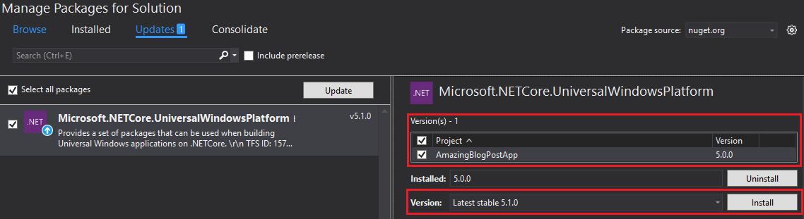

#What’s new for the .NET Native Compiler in Visual Studio 2015 Update 2

Earlier this week we released an update to the [Visual Studio 2015 Tools for Universal Windows Apps (UWA)](https://blogs.msdn.microsoft.com/visualstudio/2016/04/11/whats-new-in-vs-2015-update-2-for-universal-windows-developers/). The release includes improvements across the libraries, runtime, and compiler. This means that development is faster and applications will more responsive and easier to maintain. Applications such as [NCAA March Madness Live](https://www.microsoft.com/en-us/store/apps/ncaa-march-madness-live/9wzdncrfjcmh) and [TuneIn Radio](https://www.microsoft.com/en-us/store/apps/tunein-radio/9wzdncrfj3sf) are already available in the Store built using our new .NET Native tools!

##Get the Universal Windows Platform Tools
The latest version for Visual Studio 2015 Tools for Universal Windows Apps has been released as an update for Visual Studio 2015 Update 2. It can be obtained by installing [Visual Studio 2015 Update 2](http://go.microsoft.com/fwlink/?LinkId=691129) or modifying Visual Studio 2015 Update 2 if it is already installed. When prompted with the list of features to install, validate that **Tools (1.3.1) and Windows 10 SDK (10.0.10586)** has been checked, which is located under the **Universal Windows App Development Tools** section. Once the Visual Studio 2015 Tools for UWA update has been installed, existing projects will use the latest compiler and runtime after they have been recompiled.

The following steps can be taken to modify Visual Studio 2015 Update 2 and install the latest UWA tools:

1. Open the Visual Studio 2015 Setup, which can be found through Control Panel\Programs\Programs and Features.
2. Select Modify.
3. Ensure that Tools (1.3.1) and Windows 10 SDK (10.0.10586) has been checked, which is located under the Universal Windows App Development Tools section.

4. Select Next and validate the Selected Features are correct.
5. Select Update.

The .NET Core libraries are distributed as NuGet packages at NuGet.org. Here's how you can get the latest .NET Core packages:

1. Navigate to the NuGet Package Manager which can be found by going to Tools\NuGet Package Manager\Manage NuGet Packages for Solution.
2. Select the Updates tab.
3. Select the Microsoft.NETCore.UniversalWindowsPlatform NuGet package (the UWP metapackage for .NET Core) on the left and check the projects that are being upgraded.
4. Ensure that the Version is listed as Latest Stable 5.1.0.
5. Select Install.

##What's New in the .NET Native Compiler and Runtime

###Better Reflection Support - Universal Shared Generics

.NET apps use reflection a lot, either directly or as part of a library that they use. Reflection will now work "out of the box" for many more apps. We love reflection as much as you do and want you to enjoy using it with .NET Native!

Reflection enables you to inspect or instantiate types in a late-bound fashion (e.g. not using new). That's very useful for loosely coupled architectures or for dynamic scenarios. Dynamism is a challenge when compiling to native code, since all of the code must be known and compiled at compile-time. One dynamic scenario is making new generic types at runtime.

We call List<T> an open type since it needs the T defined. We call List`<MyValueType>` a closed type since T has been defined. Within a program, we call these closed types generic instantiations. List`<MyValueType>` can be thought of as a third type, neither List`<T>` or MyValueType, but the generic instantiation of that combination.

Generic types are a combination of shape (members) and behavior (method bodies). The shape and behavior is compiled to native code. The native code for List`<MyValueType>` and List`<MyReferenceType>` are not the same. That means that the .NET Native compiler must find all generic instantiations so that there is code to execute for each generic at runtime. The wonderful expressiveness of the reflection APIs makes finding all of the generic instantiations via static analysis quite difficult. In particular, code using Type.MakeGenericType and MethodInfo.MakeGenericMethod can be arbitrarily complex.

This challenge led us to adopt a new path for native compiling generics. We came to the conclusion that we needed a more general purpose way to compose generics at runtime. We call this new feature Universal Shared Generics (USG). Most generics will still have highly optimized code that is specific to their composition. However, in the case where type specific code has not been generated, a USG version will be available.

###Better Stack Traces with HockeyApp
With this release and [HockeyApp](http://hockeyapp.net/features/), you can now get high fidelity, actionable stack traces from their applications in production. We've done work to ensure client side collection is more robust and that the HockeyApp back end can properly generate human readable stacks. This functionality was announced at [//build](https://channel9.msdn.com/Events/Build/2016/P463) and is now available. It's fast and easy to get started with  [HockeyApp for UWP](http://support.hockeyapp.net/kb/client-integration-windows-and-windows-phone/crash-reporting-for-uwp). 

###Faster WinRT Interop
We've made WinRT interop faster and have seen speedups as high as 8x in our lab compared to the UWP 1.2 tools. This will be particularly useful for applications that have pages with a high number of XAML elements as well as IoT stream processing scenarios.

###Faster Native Code 
A number of incremental and feature-level improvements to code quality are included in this release. Targeted improvements include, but aren’t limited to:
* Improved [auto-vectorization](https://blogs.msdn.microsoft.com/nativeconcurrency/2012/04/12/what-is-vectorization/)
* Reduced overhead of enumeration of `IEnumerable<T>` collections
* Whole program inlining analysis
* [Profile Guided Optimization](https://msdn.microsoft.com/en-us/library/e7k32f4k.aspx) (PGO) of the [SharedFramework](https://blogs.msdn.microsoft.com/dotnet/2015/09/28/whats-new-for-net-and-uwp-in-win10-tools-1-1/)
Together, these features lead to reduced working set, smaller code size, and better generated code quality for .NET UWP applications.

Previous releases of the .NET Native compiler utilized the same inlining optimizer as the CLR JIT compiler. Because the JIT compiler is tuned to generate code quickly, it makes local decisions about which methods to inline. Ahead-of-time compilation allows the .NET Native compiler to evaluate inlining decisions while considering the full scope of your application. With 1.3.1 this is now done using the same whole program inlining engine used for high performance C++ applications, enabling significant improvement for many scenarios.

[Profile-Guided Optimizations](https://msdn.microsoft.com/en-us/library/e7k32f4k.aspx) allows the compiler make better code generation decisions by giving it information about what happens in an application at runtime. We have applied PGO optimizations to the SharedLibrary component using data we've collected from a variety of UWP applications. We're excited to enable this class of optimizations for general usage in a future version of the UWP tools.

Sharing the same optimizing backend as the C++ compiler allows .NET Native to use the advanced optimizing technologies that have been developed for high performance C++ code. We will continue to light up features that this integration allows. 

###Development Time Compiler Improvements
Many of the internal data structures and algorithms of the .NET Native compiler are now much more efficient. Most apps will see a reduction in the memory used by the compiler and a small reduction in compile time. For a subset of applications and libraries, these improvements are the difference between compiling successfully and taking [hours and hours to build](https://github.com/mathnet/mathnet-numerics/issues/361). We'll continue to make optimizations and improvements to accommodate the wide variety and scale of code in the growing UWP ecosystem.

##Provide Feedback
We want to thank you for your feedback as it has been instrumental in guiding our work! Please continue to send questions and suggestions to [dotnetnative@microsoft.com](mailto:dotnetnative@microsoft.com). We look forward to hearing from you and seeing what great things you will build.

*This post was written by Matthew Whilden, Software Engineer and Stacey Haffner, Program Manager on the .NET team.*
