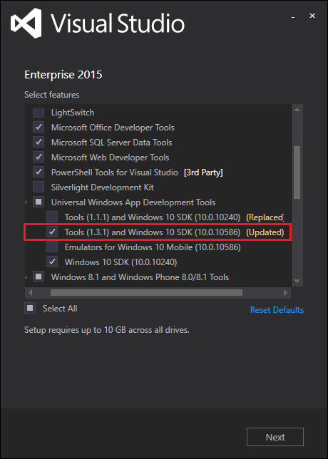

#What’s new for the .NET Native Toolchain in the Universal Windows Platform Tools 1.3.1

Earlier this week we released an [update to the Visual Studio Tools for Universal Windows Apps](https://blogs.msdn.microsoft.com/visualstudio/2016/04/11/whats-new-in-vs-2015-update-2-for-universal-windows-developers/). The release included an update to Microsoft.NETCore.UniversalWindowsPlatform, version 5.1.0, and the .NET Native Toolchain. The .NET Native Toolchain has undergone many improvements which we would like to share with you. 

##Get the Universal Windows Platform Tools
The Universal Windows Platform tools can be updated via the Visual Studio Setup. To do this, open the Visual Studio Setup (found through program files or the notification system in Visual Studio) and check the **Tools (1.3.1) and Windows 10 SDK (10.0.10586)** line item located under **Universal Windows App Development Tools**.

Installing the UWP Tools version 1.3.1 will automatically change your existing projects over to the latest compiler and runtime. However, the .NET Core libraries are updated just like any other Nuget package. If you would like to take advantage of the bug fixes and feature work available in version 5.1.0, you'll need to take the following steps: 

1. Navigate to the NuGet Package Manager (Tools --> NuGet Package Manager --> Manage NuGet Packages for Solution).
2. Select the Updates tab.
3. Select the Microsoft.NETCore.UniversalWindowsPlatform NuGet Package on the left and check the projects that are being upgraded.
4. Ensure that the Version is listed as Latest Stable 5.1.0.
5. Select Install.

##What's New in the .NET Native Toolchain

###Universal Shared Generics

To support highly dynamic scenarios better, we’ve done work we call Universal Shared Generics (USG). With USG, all generic instantiations can be inspected and activated via reflection. This will allow much greater flexibility to compose generics at runtime and you should never have to deal with another [MissingTemplateException](http://stackoverflow.com/questions/34456986/missingtemplateexception-in-uwp-compiled-for-release/34457993#34457993) again!

As you may expect, the native code for `List<DateTime>` and `List<MyRefernceType>` aren’t identical. One of the challenges with ahead of time compilation is identifying all of the different generic instantiations that will require code at runtime. The expressiveness allowed by the Reflection APIs make static analysis quite difficult. In particular, code using Type.MakeGenericType and MethodInfo.MakeGenericMethod can be arbitrarily complex, so having a more general purpose way to compose generics at runtime is necessary.

The availability of USG allows the .NET Native compiler to make better tradeoffs to balance compile time, binary size, and code quality. The current tuning is setup so that your compile time and application size will be improved at a small cost to runtime throughput for some scenarios.

For most developers, this feature can be considered an interesting implementation detail but, for code that makes heavy use of Reflection this work goes a long way to making it work “out of the box”.

###Better Stack Traces in Telemetry 
With .NET Native 1.3.1 and HockeyApp, developers can now get high fidelity, actionable stack traces from their applications in the wild. We've done work to ensure client side collection is more robust and that the HockeyApp back end can properly generate human readable stacks given your application pdbs. This functionality was announced at [//build](https://channel9.msdn.com/Events/Build/2016/P463) and is available [now](http://support.hockeyapp.net/kb/client-integration-windows-and-windows-phone/crash-reporting-for-uwp). 

###Reduction in Interop Overhead
Workloads that involve a high amount of interop can see dramatic speedups with UWP 1.3.1. This will be particularly useful for applications that have pages with a high number of XAML elements as well as IoT stream processing scenarios. Our benchmarks show a 2-8x throughput improvement compared to the UWP 1.2 tools. These improvements are caused by a huge reduction in the amount of ephemeral objects generated  as well as analysis to reduce unnecessary COM calls, in particular, QueryInterface.

###Code Generation 
A number of incremental and feature-level improvements to code quality are included in the 1.3.1 release of the .NET Native compiler. Targeted improvements include, but aren’t limited to, improved [auto-vectorization](https://blogs.msdn.microsoft.com/nativeconcurrency/2012/04/12/what-is-vectorization/) and reduced overhead of enumeration of `IEnumerable<T>` collections. Additionally, work has been done to enable the whole program C++ inlininer as well as laying the ground work for enabling [Profile Guided Optimization](https://msdn.microsoft.com/en-us/library/e7k32f4k.aspx) (PGO) of UWP applications. Together, these features lead to reduced working set, smaller overall code size, and overall better generated code quality for .NET UWP applications.

Previous releases of the .NET Native compiler utilized the same inlining optimizer as the CLR JIT compiler. Because the JIT compiler is tuned to generate code quickly, it makes local decisions about which methods to inline. Ahead of time compilation allows the .NET Native compiler to evaluate inlining decisions while considering the full scope of your application. With 1.3.1 this is now done using the same whole program inlining engine used for high performance C++ applications, enabling significant improvement for many scenarios.

[Profile-Guided Optimizations](https://msdn.microsoft.com/en-us/library/e7k32f4k.aspx) allows the compiler make better code generation decisions by giving it a view of your what happens with your application at runtime. With 1.3.1 we've done the initial plumbing to enable this class of optimizations on .NET Native. Using data we've collected from a variety of UWP applications in the store we have applied PGO optimizations to the SharedLibrary component. We're excited to enable this class of optimizations for general usage in a future version of the UWP tools.

Sharing the same optimizing backend as the C++ compiler allows .NET Native to use the advanced optimizing technologies that have been developed for high performance C++ code. We will continue to light up features that this integrations allows. 

###Binary Size
There have been a number of changes made to the .NET Native compiler to make it better at figuring out which types and members are actually needed by an application, and which can be safely thrown away. This will result in smaller native binaries which is great for running on a wide range of devices, such as [HoloLens](https://www.microsoft.com/microsoft-hololens).

###Compiler Memory Usage
Many of the internal data structures of the .NET Native compiler have been optimized to use space more efficiently. As a result, most apps will see a reduction in the memory used by the compiler and a small reduction in compile time. For a subset of applications, this reduction is the difference between compiling successfully and causing the compiler to hit out-of-memory errors. We'll continue to make optimizations and improvements to accommodate the wide variety and scale of the growing UWP ecosystem.

###Provide Feedback
We want to thank you for your feedback as it has been instrumental in paving the future of the .NET Native toolchain! Please continue to send questions and suggestions to [dotnetnative@microsoft.com](mailto:dotnetnative@microsoft.com).

