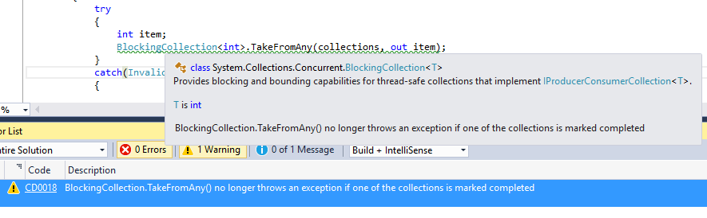
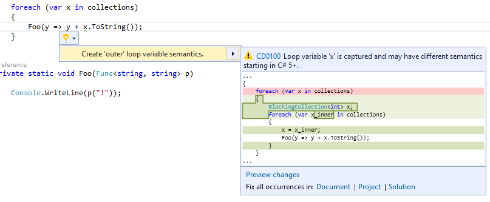
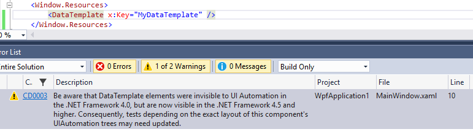

Tooling to Facilitate Framework Migrations
==========================================

This post was written by **Mike Rousos**, a software engineer on the .NET team.

Introduction
------------

In [this recent post](TODO), Taylor introduced the [.NET Framework Compatibility Diagnostics](https://www.nuget.org/packages/Microsoft.DotNet.FrameworkCompatibilityDiagnostics/), a set of [Roslyn](http://github.com/dotnet/roslyn/)-based code analyzers for detecting when code is likely to encounter compatibility issues between two versions of the .NET Framework.

This article gives a little behind-the-scenes look into why we chose to use Roslyn for those tools (and the benefits it gives compared to just walking IL).

Binary Scanning, False Positives, and False Negatives
-----------------------------------------------------

The [.NET Framework Compatibility Diagnostics](https://www.nuget.org/packages/Microsoft.DotNet.FrameworkCompatibilityDiagnostics/) library is the second tool recently released to help developers gauge compatibility risk when migrating between .NET Framework versions. The first tool (and still a very useful one) is the [API Portability Analyzer](https://github.com/microsoft/dotnet-apiport). ApiPort (as it is known, for short) works by scanning .NET Framework APIs used in a binary and flagging any which have known behavioral changes between two 4.x versions of the .NET Framework. 

This tool has the advantages of being fast, easy to update, and able to work with any .NET IL assemblies. A great first step in evaluating a potential .NET Framework migration is to run ApiPort on the binaries and understanding the resulting report.

ApiPort has drawbacks as well, though. Its analysis is very coarse-grained and compatibility issues usually only affect very narrow use cases, so ApiPort reports a lot of false positives. For example, there is a [4.5 issue](https://github.com/Microsoft/dotnet-apiport/blob/master/docs/BreakingChanges/018%20BlockingCollection.TryTakeFromAny%20does%20not%20throw%20anymore.md) where `BlockingCollection<T>.TakeFromAny` no longer throws if one of the input collections is completed. This change is unlikely to affect most callers of `BlockingCollection<T>.TakeFromAny` (the common non-exceptional code path is unchanged). However, binary scanners like ApiPort are only able to view .NET references, so the decision to report an issue must be binary: either `BlockingCollection<T>.TakeFromAny` is called or it isn’t. The end result is that ApiPort includes many ‘possible’ issues (false positives) in its reports that would never actually manifest themselves. Customers need to investigate the compatibility issues to understand the true impact to their code.

Another limitation of ApiPort is that because it can only scan .NET binaries, it misses compatibility issues that could be detected only from non-code sources. Examples of this include a number of [WPF changes](https://github.com/Microsoft/dotnet-apiport/blob/master/docs/BreakingChanges/003%20WPF%20DataTemplate%20elements%20are%20now%20visible%20to%20UIA.md) (whose applicability could be detected in XAML, but not in IL) or [changes in how XSD files are applied](https://github.com/Microsoft/dotnet-apiport/blob/master/docs/BreakingChanges/002%20XML%20schema%20validation%20is%20stricter.md).

ApiPort is a great starting point to get a sense of whether an application is likely to run into compatibility issues, but we wanted to find ways to more accurately pin-point *real* issues instead of just possible ones.

The Value of Roslyn
-------------------

To provide more accurate compatibility issue impact detection, we started using [Roslyn](https://github.com/dotnet/roslyn/) (open-source, next-generation C# and VB compilers). Unlike traditional compilers, Roslyn exposes various compilation artifacts (syntax trees, semantic models and symbols, etc.) through APIs. Using this technology, we wrote ‘rules’ (in the form of code analyzers) that detect not just a certain .NET Framework API being called, but that understand some of the context from which the call is made. This allows us to more accurately detect potential issues due to compatibility-affecting changes.

### The Power of Semantic Analysis ###
To explain the advantages of Roslyn’s source-based analysis, consider the `BlockingCollection<T>.TakeFromAny` example from earlier. Using Roslyn, it is possible to scan all method calls (invocation expressions) in the user’s source code for calls to `BlockingCollection<T>.TakeFromAny` (using the compilation’s semantic model to match the API even in light of possible aliasing, etc.) and then walk the code’s syntax tree to find out if that call is within a try statement. If the call is within a try statement, Roslyn can further determine what kind of exception is caught by any catch clauses.

With this sort of analysis, reporting about the TakeFromAny change can be limited to cases in which the user is calling the API within a try block and catching an InvalidOperationException (or one of its ancestors). These are cases in which code flow in the user’s application may be changed by the TakeFromAny issue, so these are the only cases where reporting the issue is valuable. By filtering out the other uses of TakeFromAny, we save the customer time by only showing them issues which are likely to meaningfully impact their app.

Even with our approach of using analyzers, there will still be some false positives and false negatives. If the user’s catch block doesn’t affect later behavior of the application, the analyzer will still flag their code with a diagnostic. Similarly, if the user catches the InvalidOperationException in an up-stack caller of the method calling TakeFromAny, the analyzer would not generate any diagnostics for their code. Despite these cases of ‘not getting it quite right,’ we found that the accuracy of source analyzers is better than simple binary analysis.

The Roslyn analyzer APIs offer a broad set of tools to make this analysis simple. Most of our compatibility issue detection rules are less than 150 lines of C#.

### Analyzer/MSBuild Integration ###
Another benefit of using Roslyn’s diagnostic analyzer model is integration with Visual Studio and MSBuild (and the CSC and VBC compilers directly). Analyzers can be referenced from projects (or NuGet packages), or loaded as Visual Studio extensions (which apply to all loaded projects). Once loaded, diagnostics raised by analyzers will be treated exactly as errors or warnings from the CSC or VBC compilers, themselves.

Issues raised by the analyzers are underlined in Visual Studio (in real-time, thanks to automatic background builds) and appear in MSBuild output and Visual Studio’s error list. This means that developers working on projects targeting the new .NET Framework versions can use our analyzers with no change to their current engineering processes. Any place in the build process where compiler warnings are raised, compatibility diagnostics will automatically show up.

Analyzers also benefit from Visual Studio’s more advanced diagnostic features (such as customizing severity or visibility of issues through rule sets), as Taylor mentioned in his post introducing the compatibility analyzers.

### Code Fixes in Visual Studio ###
One of the coolest parts of Roslyn is that, in addition to understanding code, it can also make fine-grained changes to the user’s source code. When creating a Roslyn analyzer, it is possible to create a [code fix](https://msdn.microsoft.com/en-us/magazine/dn904670.aspx) that fixes the user’s code on their behalf. 

Taylor discussed compatibility code fixes in his initial post about the .NET Framework Compatibility Diagnostics, but I wanted to mention them again here because they're such a powerful features and an important reason for using Roslyn to create our compatibility tooling. In cases where the fix for a compatibility issue is predictable, we were able to create code fixes that can apply that change automatically to users' code through the light bulb menu in Visual Studio. In this way, our analyzers help users not only know about compatibility issues, but easily fix their code to avoid them.

### Extensibility to Other Project Source ###
In addition to deeply understanding C# and VB.NET source, Roslyn analyzer APIs have access to non-code files in the user’s project which have been marked as ‘additional files’. This means we can author compatibility analyzers that operate on XAML files, configuration files, and other non-code structured assets. The analysis is limited to parsing the files and reasoning about the contents, but enables some coverage for non-code assets that ApiPort does not provide.

Conclusion
----------

Roslyn’s rich API surface area and ability to deeply understand source code made it easy for us to create tools (analyzers) to accurately identify whether users’ code is likely to be affected by .NET compatibility issues. To do that sort of analysis well requires deep knowledge of the C# and VB languages, and would have been difficult or impossible for us to do without help from the compiler. Because Roslyn opens the black box of the compiler and allows easy interactions with the previously-hidden syntax trees and semantic models, it was the perfect fit for us to reason about our users’ source code.

In addition to the Roslyn analyzer APIs themselves, first-class Visual Studio 2015 and MSBuild 2015 integration make it easy to create tools that provide a seamless end-to-end user experience while reporting on compatibility-sensitive code patterns.

Resources
---------

* [.NET API Portability Analyzer](https://github.com/microsoft/dotnet-apiport)
* [.NET Framework Compatibility Diagnostics](https://www.nuget.org/packages/Microsoft.DotNet.FrameworkCompatibilityDiagnostics/)
  * [Introduction to .NET Framework Compatibility Diagnostics](TODO) 
* [Roslyn](https://github.com/dotnet/roslyn/)
  * Introduction to Roslyn [Code Analyzers](https://msdn.microsoft.com/en-us/magazine/dn879356.aspx) and [Code Fixes](https://msdn.microsoft.com/en-us/magazine/dn904670.aspx)
* [Introduction to .NET Framework Compatibility](TODO)

