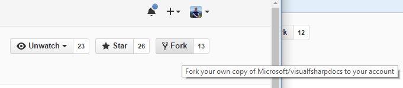
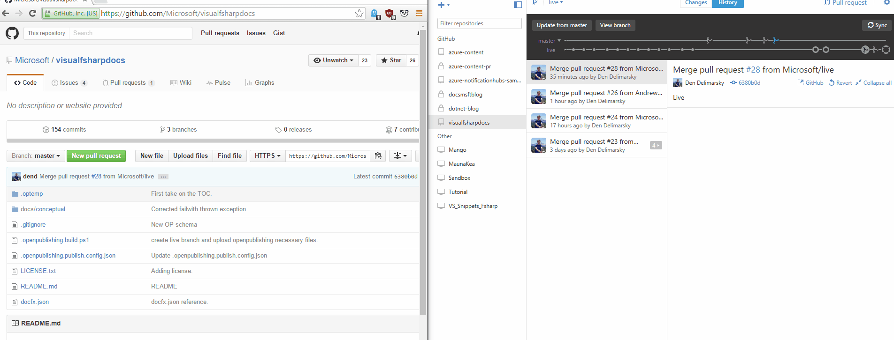
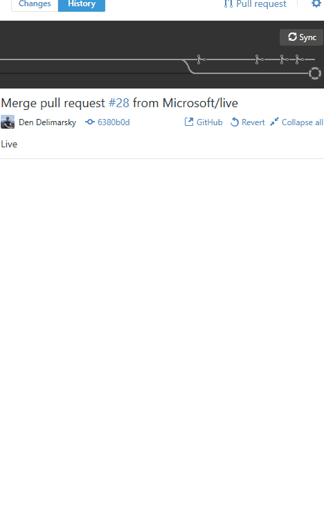

*Guest post by [Den Delimarsky](https://twitter.com/DennisCode), Program Manager, Cloud & Enterprise*

Continuing our efforts to make our documentation more flexible and open, we are releasing the [F# language documentation](https://msdn.microsoft.com/visualfsharpdocs/conceptual/visual-fsharp) as open-source. This means that starting today you can both easily download the most up-to-date documents for offline consumption, as well as contribute to sections that you feel require work.

##What changed?
Here is a list of things that changed that you should be aware of. While we are still working on improving and adding features, these are live today.
###Friendly URLs
Forget about the ugly MSDN shortlinks. Instead you are now able to see friendly URLs that clearly indicate what page you are linking to. This is something that we will be transitioning to long-term for all MSDN docs. Worth mentioning that none of the old links to F# documents are broken - we worked on setting up graceful redirection, so any references you might have to the old doc pages will automatically point to the new pages with zero effort on your side.

###Documentation entirely hosted on GitHub
We converted the entire F# documentation stack from an older format to a modern and widely-adopted [Markdown format](http://daringfireball.net/projects/markdown/syntax). Every single markdown file is now hosted in a single repository where you can download them, edit them and suggest modifications as you see fit. Go to the [official repo](https://github.com/Microsoft/visualfsharpdocs) and see what it's all about!

###Changes to docs happen within minutes and not days
Gone are the days when we need to wait days before the entire documentation set is rebuilt. Our engineers worked hard on optimizing the publishing system performance - today, once the fix to a doc is in, it is live within minutes, available to user worldwide with no exceptions.

###Docs that accept contributions have a 'Contribute' button
You don't have to sift through [the GitHub repo](https://github.com/Microsoft/visualfsharpdocs) to find the doc that you want to download or fix. Simply click on the `Contribute` button in the right corner of the documentation page.

##How to contribute?
Here is the breakdown of steps you need to take to contribute to the docs:

1. Fork [the visualfsharpdocs repo](https://github.com/Microsoft/visualfsharpdocs). You can do so from the GitHub web UI.

2. Clone the newly-forked repo locally. The easiest way to do it is through the [GitHub Desktop client](https://desktop.github.com/) - just drag the URL from the address bar in the client. 

3. Work on the modifications to the document (e.g. fix links, wording, etc.).
4. Create a new pull request into the `live` branch in the `visualfsharpdocs` repo. This branch propagates directly to the public MSDN docs.

That is as simple as it gets! Once the PR is submitted, the automated build system will ensure that there are no issues (and if there are any - you will be alerted about it). Once we validate the change, we will merge the changes and your contributions will be publicly recorded and published.

If you simply would like to report problems with the docs, you can report them by going to the [Issues page](https://github.com/Microsoft/visualfsharpdocs/issues) within the same [documentation repo](https://github.com/Microsoft/visualfsharpdocs).

##Feedback
As this is our first attempt to mass-migrate more than 1700 pages to Markdown through an automated process, we expect that there might be some issues in the new docs. If you find them - [report them to us](https://github.com/Microsoft/visualfsharpdocs/issues). We are listening to your feedback daily and will be issuing fixes as soon as we diagnose them.