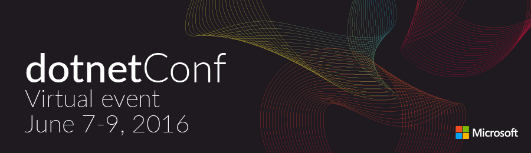

The week in .NET - 5/31/2016
============================

To read last week's post, see [The week in .NET – 5/24/2016](https://blogs.msdn.microsoft.com/dotnet/2016/05/24/the-week-in-net-5242016/).

DotNetConf 7-9 June
-------------------

Are you ready to rediscover .NET? Well, dotnetConf is back!



Immerse yourself in the world of .NET and join our live stream for 3 days of free online content June 7 - 9 featuring speakers from the .NET Community and Microsoft product teams. Watch and ask questions after each session for a live Q&A. The live stream will be broadcasted on [Channel9](http://channel9.msdn.com/). 

There's never been a better time to be a .NET developer. Learn to develop for web, mobile, desktop, games, services, libraries and more for a variety of platforms and devices all with .NET! We'll have presentations on .NET Core and ASP.NET Core, C#, F#, Roslyn, Visual Studio, Xamarin, and much more. Take a look at our lineup of great [speakers and sessions](https://channel9.msdn.com/Events/dotnetConf/2016). We'll have keynotes from Miguel de Icaza, Scott Hunter, and Scott Hanselman and a lot of great content from our community.

For more information, check out [our website](http://www.dotnetconf.net/) and stay tuned to [#dotnetconf](https://twitter.com/search?q=%23dotNetConf) & [@dotnet](https://twitter.com/dotnet) on Twitter. 

See you on the live stream! 

On.NET
------

Last week on the show, we had Maoni Stephens to talk about .NET garbage collection. It was a fascinating journey into this crucial subsystem, with many great insights:

<iframe width="560" height="315" src="https://www.youtube-nocookie.com/embed/Ue8D1ga1Nhw?rel=0" frameborder="0" allowfullscreen></iframe>

[This week we speak](https://www.youtube.com/watch?v=5MnfrL7gfEs) with [Lucian Wischik](https://twitter.com/lwischik), Program Manager on Managed Languages at Microsoft, and concurrency expert.

Package of the week: FluentAssertions
-------------------------------------

Preferences in assertion API styles vary. [FluentAssertions](http://www.fluentassertions.com/) allows for assertions that are very readable:

```csharp
"ABCDEFGHI"
    .Should().StartWith("AB")
    .And.EndWith("HI")
    .And.Contain("EF")
    .And.HaveLength(9);
xDocument
    .Should().HaveElement("child")
    .Which.Should().BeOfType<XElement>()
    .And.HaveAttribute("attr", "1");
```

The library supports MSTest, NUnit, xUnit, and more, and runs on both .NET Framework and .NET Core.

Xamarin App of the week: Haven Holidays
---------------------------------------

[Haven Holidays](http://www.haven.com) is one of the UK's largest family holiday parks with 36 locations across the countries most beautiful coastline. [Rarely Impossible](http://www.rarelyimpossible.com) delivered two beautifully designed apps that enhance the  guest experience built entirely with Xamarin.Forms and in only 4 months! 

You can read more about the development process of this fantastic app on the Rarely Impossible [blog](http://www.rarelyimpossible.com/blog/2016/3/31/rarely-impossible-launch-haven-holidays-guest-mobile-app-built-with-xamarin). 


 
Game of the week: ElemenTales
-----------------------------

[ElemenTales](http://madewith.unity.com/games/elementales) follows four brothers who have been cursed to exist in the form of one of the four elements: Fire, Earth, Air and Water. Players must navigate a series of 3D puzzles while using the unique abilities tied to each brother to move on to the next level. ElemenTales has 24 levels that increase in complexity and feature a low-poly graphics style.


ElemenTales was created by [Total Monkery](http://madewith.unity.com/profiles/total-monkery) using [Unity](http://unity3d.com/) and [C#](https://channel9.msdn.com/Series/C-Sharp-Fundamentals-Development-for-Absolute-Beginners). It is currently available on the Windows Store. More information can be found on their [Made With Unity](http://madewith.unity.com/games/elementales) page. 

User group meeting of the week: Shawn Wildermuth & Miguel de Icaza at Microsoft DevBoston
-----------------------------------------------------------------------------------------

Don't miss [Shawn Wildermuth and Miguel de Icaza tonight Tuesday, May 31, at 6:30PM](http://www.meetup.com/DevBoston/events/231215096/) at the Microsoft NERD Center in Cambridge, MA. You'll attend the recording of the Hello World podcast, and an hour-long technical talk on ASP.NET Core.

.NET
----

* [Making it easier to port to .NET Core](https://blogs.msdn.microsoft.com/dotnet/2016/05/27/making-it-easier-to-port-to-net-core/) by Immo Landwerth.
* [Announcing MSTest Framework support for .NET Core RC2 / ASP.NET Core RC2](https://blogs.msdn.microsoft.com/visualstudioalm/2016/05/30/announcing-mstest-framework-support-for-net-core-rc2-asp-net-core-rc2/) by Pratap Lakshman.
* [Mads Torgersen and Dustin Campbell on the future of C#](http://www.theregister.co.uk/2016/05/19/mads_torgersen_and_dustin_campbell_on_the_future_of_c/) by Tim Anderson.
* [Tuple Tuesday!](https://blogs.msdn.microsoft.com/dotnet/2016/05/31/tuple-tuesday/) by Anthony D. Green.
* [TPL Dataflow Is The Best Library You're Not Using](http://blog.i3arnon.com/2016/05/23/tpl-dataflow/) by Bar Arnon.
* [Rethinking IEnumerable](http://blog.paranoidcoding.com/2014/08/19/rethinking-enumerable.html) by Jared Parsons.
* [Using Windows Runtime in a .NET desktop application](https://github.com/jbe2277/waf/wiki/Using-Windows-Runtime-in-a-.NET-desktop-application) by jbe2277.
* [Running .NET Core RC2 on Fedora 23](https://nmilosev.svbtle.com/running-net-core-rc2-on-fedora-23) by Nemanja Milosevic.
* [Installing .NET Core RC2 on Ubuntu 16.04](http://donovanbrown.com/post/2016/05/29/Installing-NET-Core-RC2-on-Ubuntu-1604) by Donovan Brown.
* [Write your first .NET Core Library](http://tstringer.github.io/dotnet/dotnet-core/2016/05/24/dotnet-core-library.html) by Thomas Stringer.
* [Introduction to Composition](http://blog.robmikh.com/xaml/uwp/composition/2016/04/14/introduction-to-composition.html) by Robert Mikhayelyan.
* [Builder: C#](http://blogs.tedneward.com/patterns/Builder-CSharp/) by Ted Neward.
* [Reset Entity Framework migrations](http://www.mortenanderson.net/reset-entity-framework-migrations) by Morten Anderson.
* [RavenDB 4.0 on .NET Core RC2](https://ayende.com/blog/174209/ravendb-4-0-on-dotnetcore-rc2) by Ayende Rahien.

ASP.NET
-------

* [Setting up Ubuntu 14.04 for ASP.NET Core RC2 with PostgreSQL](http://totaltechware.blogspot.com/2016/05/setting-up-ubuntu-1404-for-aspnet-core.html) by Joshua Hardy.
* [A deep dive into the ASP.NET Core CORS library](https://andrewlock.net/a-deep-dive-in-to-the-asp-net-core-cors-library/) by Andrew Lock.
* [ASP.NET Core : Getting Clean with SOAP](http://tattoocoder.com/asp-net-core-getting-clean-with-soap/) by Shayne Boyer.
* [Running multiple ASP.NET Web API pipelines side by side](http://www.strathweb.com/2016/05/running-multiple-asp-net-web-api-pipelines-side-by-side/) by Filip W.
* [Getting the Web Root Path and the Content Root Path in ASP.NET Core](https://blog.mariusschulz.com/2016/05/22/getting-the-web-root-path-and-the-content-root-path-in-asp-net-core) by Marius Schulz.
* [Dotnet EF Migrations for ASP.NET Core](http://benjii.me/2016/05/dotnet-ef-migrations-for-asp-net-core/) by Ben Cull.
* [Storing ASP.NET session outside webserver – SQL Server vs Redis vs Couchbase](http://www.codeproject.com/Articles/1103601/Storing-ASP-NET-session-outside-webserver-SQL-Serv) by Omar Al Zabir.
* [How To Specify Framework When Running ASPNET Core Apps](http://ardalis.com/how-to-specify-framework-when-running-aspnet-core-apps) by Steve Smith.
* [How to Build a Search Page with Elasticsearch and .NET](https://www.simple-talk.com/dotnet/development/how-to-build-a-search-page-with-elasticsearch-and-.net/) by Ryszard Seniuta.
* [3 ways to keep your ASP.NET MVC sontrollers thin](https://jonhilton.net/2016/05/23/3-ways-to-keep-your-asp-net-mvc-controllers-thin/) by Jon Hilton.

F#
--

* [Fable: F# to JavaScript Transpiler](http://fsprojects.github.io/Fable/).
* [Login with WebSharper](https://www.youtube.com/watch?v=p4yfP1mNaec), by FSharpTV & Adam Granicz.
* [F# for Python Programmers](https://t.co/l0mfex3MUS), by Darren Platt.
* [Having Fun with Computation Expressions](https://yaaf.de/blog/post/2016-05-28/Having%20Fun%20with%20Computation%20Expressions), by Matthias Dittrich.

Check out [F# Weekly](https://sergeytihon.wordpress.com/category/f-weekly/) for more great content from the F# community.

Xamarin
-------

* [Xamarin DevOps with VSTS - Setup iOS CI Builds with MacinCloud](http://www.blogaboutxamarin.com/xamarin-dev-ops-with-vsts-setup-ios-ci-builds-with-macincloud/), [Xamarin DevOps with VSTS - Setup Android CI Builds](http://www.blogaboutxamarin.com/xamarin-dev-ops-with-vsts-setup-android-ci-builds/), [Xamarin DevOps with VSTS - Versioning Apps For HockeyApp](http://www.blogaboutxamarin.com/xamarin-dev-ops-with-vsts-versioning-apps-for-hockeyapp/), [Xamarin DevOps with VSTS - Deploying To HockeyApp](http://www.blogaboutxamarin.com/xamarin-dev-ops-with-vsts-deploying-to-hockeyapp-and-devices/), and [Xamarin DevOps with VSTS - Deploying To Devices From HockeyApp](http://www.blogaboutxamarin.com/xamarin-dev-ops-with-vsts-deploying-to-devices-from-hockeyapp-2/) by Richard Woolcott.
* [Bluetooth LE plugin for Xamarin released](http://smstuebe.de/2016/05/13/blev1.0/), and [Swipe to dismiss with MvvmCross](http://smstuebe.de/2016/05/22/mvvmcross-swipe2dismiss/) by Sven-Michael Stübe.
* [Xamarin.Forms XAML Previewer Design Time Data](http://motzcod.es/post/143702671962/xamarinforms-xaml-previewer-design-time-data) by James Montemagno.
* [Cross-Platform Development with Xamarin.Forms and Realm](https://blog.xamarin.com/cross-platform-development-with-xamarin-forms-and-realm/) by the Realm Team.

Games
-----

* [Unite Europe 2016 Keynote - Video](https://unite.unity.com/2016/europe/#live).
* [Unity UI Healthbar Script C# Tutorial - Video](https://www.youtube.com/watch?v=xv2e3RtTPVQ&feature=share), by Jay AnAm.
* [Unity 5 Tutorial 2D Fighting Game Redux Introduction - Video](https://www.youtube.com/watch?v=K581J4JUGPc&list=PL1bPKmY0c-wmOi4Ki-6ryydPeHEcQpul0&index=1), by C Sharp Accent Tutorials.

And this is it for this week!

Contribute to the week in .NET
------------------------------

As always, this weekly post couldn't exist without community contributions, and I'd like to thank all those who sent links and tips.

You can participate too. Did you write a great blog post, or just read one? Do you want everyone to know about an amazing new contribution or a useful library? Did you make or play a great game built on .NET?
We'd love to hear from you, and feature your contributions on future posts:

* Send an email to beleroy at Microsoft,
* [comment on this gist](https://gist.github.com/bleroy/135d338075a7fa190bcea1f3aa3211d2)
* Leave us a pointer in the comments section below.
* [Send Stacey (@yecats131) tips on Twitter about .NET games](https://twitter.com/yecats131).

This week's post (and future posts) also contains news I first read on [The ASP.NET Community Standup](https://blogs.msdn.microsoft.com/webdev/tag/communitystandup/), on [Weekly Xamarin](http://weeklyxamarin.com/), on [F# weekly](https://sergeytihon.wordpress.com/category/f-weekly/), on [ASP.NET Weekly](http://www.aspnetweekly.com/), and on [Chris Alcock's The Morning Brew](http://themorningbrew.net/).
