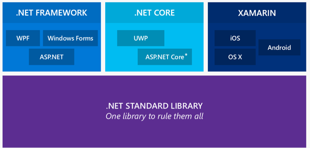

# Making .NET Core easier to port to

In my last post, I've [talked about porting to .NET Core][porting-to-core]. Included in that post was a call to action that I wanted to chat with people that went through the porting exercise in order to gather feedback on what we can improve. Many of you reached out to me and we had many wonderful and insightful phone conversations. Thanks a lot to everyone I talked to -- and apologies to those I missed; I'm sure more opportunies will come. 

Based on these conversations as well our experience working with first- and third-party partners, we've decided to drastically simplify the porting effort by unifying the core APIs with other .NET platforms, specifically the .NET Framework and Mono/Xamarin.

In this blog post, I'll talk about our plans, how and when this work will happen, and what this means for existing .NET Core customers.

## Reflecting on .NET Core

The [.NET Core platform][net-core] evolved from a desire to create a modern, modular, and app-local .NET stack. The business goals that drove its creation were focused on providing a stack for brand new application types (such as touch-based UWP apps) or modern cross-platform applications (such as ASP.NET Core web sites and services). Based on the chats that I had, it seems quite clear that .NET Core works well for those scenarios. However, it's also pretty clear that it isn't particularly easy to help you with migrating existing code onto the new .NET Core platform.

For one, .NET Core provides access to fewer technologies than other .NET platforms, especially the .NET Framework. On top of that, the .NET Core stack aggressively trimmed core types in order to remove legacy concepts and remove duplication. While there is certainly some value in presenting new customers with a cleaner API, it disproportionally penalizes our existing loyal customers who have invested over many years in using the APIs and technologies we advertised to them. Of course, we want to extend the reach of the .NET platform and gain new customers, but we can’t do so at the expense of existing customers.

Xamarin is a great role model in this regard. They allow .NET developers to build mobile applications for the iOS and Android platform. iOS shares many of the characteristics of the UWP platform, such as the high-focus on end-user experience and the banning of a just-in-time compiler. However, in contrast to .NET Core, Xamarin haven’t started with reimagining the .NET stack. They basically took Mono as-is, removed the application models, added a new one for iOS, and made minimal changes so that the resulting footprint is appropriate. Since Mono is virtually identical to the .NET Framework, the resulting API set is fairly comprehensive and makes porting existing code to Xamarin substantially easier.

Since its inception the key value prop of .NET is productivity. A big part of that is that the .NET platform has always been about supporting developers for all the areas and scenarios that the business requires. Initially, this has been about desktop applications and web servers. Now we’re pushing the envelope to also include mobile scenarios and microservices. We also extend the set of supported operating systems and execution environments. We live in an increasingly diverse world and to an extent, we don’t want to abstract this away entirely as leveraging the diversity is part of the business opportunity.

However, in order to deliver on our core value prop, it’s critical that we provide a unified core API so that developers don’t have to reason about different .NET flavors. Instead, we want to make sure they can focus on the differences in user experiences and platforms.

## .NET Core moving forward

At Build 2016, [Scott Hunter presented the following slide][build-talk]:

Here is the promise we want to make to you:

*Whether you need to build a desktop application, a mobile app, a web site, or a micro service: you can rely on .NET to get you there. Code sharing is as easy as possible because we provide a unified BCL. As a developer, you can focus on the features and technologies that are specific to the user experiences and platforms you're targeting.*

This is how we want to realize this promise: our goal is to have a set of "core" assemblies, which includes `mscorlib`, `System`, `System.Core`, that are unified across all our platforms, specifically the .NET Framework, .NET Core, and Xamarin. The set of assemblies will be chosen by what developers think of the “base class library” (BCL) and thus expect to be unified. Intuitively speaking, these are all of the APIs contained in the `System` and `Microsoft` namespaces that are app-model- and operating system agnostic and thus potentially applicable to any application. 

Unified means we’ll provide:

* 100% binary and source compatibility
* Extremely high degree of behavioral compatibility so that writing portable code is trivial

It's worth pointing out that we look at the convergence from the perspective of a Mono/Xamarin developer, i.e. we focus on APIs that Mono has implemented that we don’t have in .NET Core yet. The set of APIs in the .NET Framework is much larger; we’re looking at Mono because it provides a starting point for what our ecosystem needs outside of the Windows desktop scenarios. Of course, we can add even more APIs later.

The promise of making it easier to bring existing code extends to libraries and NuGet packages. Obviously this includes portable class libraries, regardless of whether they used `mscorlib` or `System.Runtime`.

Here are a few examples of the additions that will make your life easier when targeting to .NET Core:

* Reflection will become the same as the .NET Framework, no need for `GetTypeInfo()`
* Types will no loner miss members we've removed for clean up reasons (`Clone()`, `Close()` vs `Dispose()`, old APM APIs)

A full list of the planned additions will be made available in our [corefx] GitHub repo.

## What does this mean for .NET Core?

From talking to our community on social media it seems there is a concern that these API additions degrade the .NET Core experience. Nothing could be further from the truth. The vast majority of investments we made for .NET Core, be it that it can be deployed in an app-local fashion, that we have an ahead-of-time (AOT) compiler tool chain, that it's open source and cross-platform, are unchanged. The same is true for all the additional features and performance improvements we made, such as the new networking component called Kestrel.

Originally, when we designed .NET Core we've talked heavily about modularization and pay for play, meaning you only have to pay for the features you end up using. We believe we can still realize these goals without compromising so heavily on compatibility. For one, .NET Core can still be deployed in XCOPY style. With AOT, we've also started to invest in smarter tool chains. We see room for evolving that by, for instance, extracting the linker portion to allow JIT based deployments that can further optimize the disk footprint. That's similar to what Xamarin does for Android.

## Timelines and process

We'll deliver the API additions after we shipped .NET Core 1.0 RTM. This way, customers that don't need to bring in existing code don't have to wait and can start using .NET Core much earlier.

You can expect to see more details and plans over the next couple of weeks published in our [corefx] GitHub repository. One of first thing we'll do is publish a set of API refs that list which APIs we're planning to bring. So when porting code today, you're able to tell whether it's wise to use .NET Core 1.0 RTM or wait for our updates in case there is a large number of APIs you heavily depend on and .NET Core doesn't have yet. We'll also call out which APIs we don't plan on bringing.

In order to allow you to track our progress in realtime we're thinking of providing a dashboard, similar to our previous corefx-progress repository that showed which parts we were working on open sourcing.

Lastly, we're planning on releasing incremental updates to .NET Core on NuGet that extends the set of available APIs. This way, you don't have to wait until all the API additions are done in order to take advantage of them. This also allows us to incorporate your feedback on behavioral compatibility.

Stay tuned for more details!

## Summary

The .NET platform is used to build for many different user experiences and platforms. We don't want you having to reason about different flavors of .NET. Instead, we want you to provide with a much large set of core APIs that are familiar and work the same everywhere so that you can focus on differences in user experience leveraging platform specific capabilities.

Over the next weeks we publish more details in the [corefx] repo. You can expect this blog to communicate the status and all major decisions.

[porting-to-core]: https://blogs.msdn.microsoft.com/dotnet/2016/02/10/porting-to-net-core/
[net-core]: https://blogs.msdn.microsoft.com/dotnet/2014/12/04/introducing-net-core/
[build-talk]: https://channel9.msdn.com/Events/Build/2016/B891
[corefx]: https://github.com/dotnet/corefx