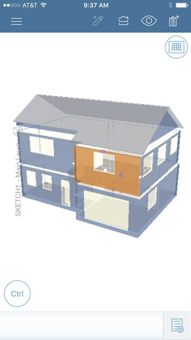

The week in .NET - 5/16/2016
============================

To read last week's post, see [The week in .NET – 5/10/2016](https://blogs.msdn.microsoft.com/dotnet/2016/05/10/the-week-in-net-5102016/).

We shipped!
-----------

Yesterday, we released [ASP.NET Core RC2](https://blogs.msdn.microsoft.com/webdev/2016/05/16/announcing-asp-net-core-rc2/), [.NET Core RC2, and the preview 1 of the associated SDK](https://blogs.msdn.microsoft.com/dotnet/2016/05/16/announcing-net-core-rc2/). [We also released Entity Framework Core RC2](https://blogs.msdn.microsoft.com/dotnet/2016/05/16/announcing-entity-framework-core-rc2/).

* [.NET Core RC2 SDK Preview 1 download](https://www.microsoft.com/net/core)
* [.NET Core RC2 Announcement](https://blogs.msdn.microsoft.com/dotnet/2016/05/16/announcing-net-core-rc2/)
* [ASP.NET Core RC2 Announcement](https://blogs.msdn.microsoft.com/webdev/2016/05/16/announcing-asp-net-core-rc2/) 
* [Release notes](https://github.com/dotnet/core/blob/master/release-notes/Release-Notes-RC2.md)

We also have [a new .NET web site](https://www.microsoft.com/net/) that you can reach using the simple [dot.net](http://dot.net) URL.

On.NET
------

Last week on the show, we talked about what we shipped yesterday:
<iframe width="560" height="315" src="https://www.youtube.com/embed/N9MteJH-HsQ" frameborder="0" allowfullscreen></iframe>

This week, our very first guest on the show, [Miguel de Icaza, is coming back](https://www.youtube.com/watch?v=dz-O3vcSq_U).

Tool of the week: Web Accessibility Checker
-------------------------------------------

It's not always easy to keep track of the accessibility of our web sites. Wouldn't it be nice if our code could be automatically checked against accessibility standards, and if we could get error messages for violations in Visual Studio, in the error list window? Mads Kristensen's [Web Accessibility Checker](https://visualstudiogallery.msdn.microsoft.com/3aabefab-1681-4fea-8f95-6a62e2f0f1ec) does exactly that.

Mads has [a blog post](https://blogs.msdn.microsoft.com/webdev/2016/05/02/building-accessible-websites-just-got-a-lot-easier/) going through the details of the tool.

Xamarin App of the week: Xactware
---------------------------------

Xactware processes 80% of U.S. home property claims, worth over $340 billion per year. Using Xamarin, Xactware mobilized existing C# code to build Xactimate Mobile for iOS and Android. Claims adjusters receive assignments, build 3D models, estimate costs, settle onsite, and instantly upload all materials for processing.

Game of the Week: Dex
---------------------

*Disclaimer: Dex has a Mature 17+ ESRB rating.*

[Dex](http://madewith.unity.com/games/dex-1) is a tip of the hat towards 2D pixelated style graphics, but with a modern feel. It is a side scrolling action/RPG game with beautiful graphics and engaging dialog. In fact, the style of the cut scenes reminded me of reading a comic book and fit perfectly with the overall game!

Players are dropped into the cyberpunk city of Harbor Prime and allowed to roam around exploring and completing missions. As players level, they are given the opportunity to align their character with the play style that suits them. For example, when encountering an enemy you have the choice of silently taking them out or going in guns blazing (literally). Dex also incorporates the ability to hack the world by transferring your consciousness to defensive electronics such as turrets and enemies with implants.

Dex was created by [Dreadlocks LTD](http://madewith.unity.com/profiles/dreadlocks-ltd) using [Unity](http://unity3d.com/) and [C#](https://channel9.msdn.com/Series/C-Sharp-Fundamentals-Development-for-Absolute-Beginners). It is currently available on Linux, Mac and Windows. Dex will be coming to Good Old Games (GoG), Xbox One and PlayStation 4 soon. More information can be found on their [Made With Unity](http://madewith.unity.com/games/dex-1) page.

User group meeting of the week: Roslyn - Refactorings, Analyzers and Codefixes
------------------------------------------------------------------------------

[Robin Sedlaczek will be giving a talk about Roslyn, refactorings, analyzers, and codefixes on Thursday, May 19, at 6:00PM in Luzern, Switzerland](http://www.meetup.com/NET-Usergroup-Zentralschweiz/events/229938801/), with [.NET Usergroup Zentralschweiz](http://www.meetup.com/NET-Usergroup-Zentralschweiz/). The talk will be given in German.

.NET
----

* [.NET Core RC2 Announcement](https://blogs.msdn.microsoft.com/dotnet/2016/05/16/announcing-net-core-rc2/)
* [A billion is cool](http://haacked.com/archive/2016/05/11/billion-downloads/) by Phil Haack, and [Nuget's post on the same topic with some cool stats](http://blog.nuget.org/20160510/The-1st-Billion.1.html).
* [Visual Studio “15” Preview 2](https://blogs.msdn.microsoft.com/visualstudio/2016/05/10/visual-studio-15-preview-2/) by John Montgomery
* [All Together Now: .NET, RHEL, Hyper-V and VSCode](http://developers.redhat.com/blog/2016/05/16/all-together-now-net-rhel-hyper-v-and-vscode/) by Don Schenck.
* [ServiceStack, a journey into the madness of microservices, part 3](http://www.wwwlicious.com/2016/05/11/servicestack-microservices-discovery-routing-3/) by Scott Mackay.
* [Automated Testing of Message Based Systems](https://jeremydmiller.com/2016/05/16/automated-testing-of-message-based-systems/), and [How we do Semantic Logging](https://jeremydmiller.com/2016/05/12/how-we-do-semantic-logging/) by Jeremy Miller.
* [Announcing MSBuild Structured Log: record and visualize your builds](https://blogs.msdn.microsoft.com/kirillosenkov/2016/05/13/announcing-msbuild-structured-log-record-and-visualize-your-builds/) by Kirill Osenkov.
* [Welcoming Protobuild to the .NET Foundation](http://www.dotnetfoundation.org/blog/protobuild-welcome) by the .NET Foundation.
* [The Business Case for Actors and Akka.NET](https://petabridge.com/blog/akkadotnet-business-case/) by Aaron Stannard.
* [Fun with Expressions](http://blog.robmikh.com/xaml/uwp/composition/2016/04/28/fun-with-expressions.html) by robmikh.

ASP.NET
-------

* [ASP.NET Core RC2 Announcement](https://blogs.msdn.microsoft.com/webdev/2016/05/16/announcing-asp-net-core-rc2/) 
* [Notes from the ASP.NET Community Standup – May 10, 2016](https://blogs.msdn.microsoft.com/webdev/2016/05/11/notes-from-the-asp-net-community-standup-may-10-2016/) by Jeffrey T. Fritz.
* [Upgrading from ASPNET Core RC1 to RC2 Guide](http://ardalis.com/upgrading-from-aspnet-core-rc1-to-rc2-guide) by Steve Smith.
* [Getting Ready for ASP.NET Core RC2](https://wildermuth.com/2016/05/13/Getting-Ready-for-ASP-NET-Core-RC2), [Converting an ASP.NET Core RC1 Project to RC2](https://wildermuth.com/2016/05/17/Converting-an-ASP-NET-Core-RC1-Project-to-RC2), and [Writing API Controllers in ASP.NET MVC 6](https://wildermuth.com/2016/05/10/Writing-API-Controllers-in-ASP-NET-MVC-6) by Shawn Wildermuth.
* [ASP.NET Core RC2, Docker and HipChat Connect add-on](http://laurentkempe.com/2016/05/16/ASP-NET-Core-RC2-Docker-and-HipChat-Connect-add-on/)
  by Laurent Kempé.
* [5 Factors to Consider When Converting a WebForms App to ASP.NET MVC Core](http://www.danylkoweb.com//Blog/5-factors-to-consider-when-converting-a-webforms-app-to-aspnet-mvc-core-ED) by Jonathan Danylko.
* [NDC Oslo Web API sample updated to ASP.NET Core RC2](http://www.strathweb.com/2016/05/ndc-oslo-web-api-sample-updated-to-asp-net-core-rc2/), and [IP Filtering in ASP.NET Web API](http://www.strathweb.com/2016/05/ip-filtering-in-asp-net-web-api/) by Filip W.
* [Modulus: Commercial Docker Containers for running ASP.NET Core Applications](https://telerikhelper.net/2016/05/10/modulus-commercial-docker-containers-for-running-asp-net-core-applications/) by Lohith.
* [Microservice with ASP.NET Core & MVC 6 on Linux](http://michalogluszka.pl/daj-sie-poznac/microservice-with-asp-net-core-mvc-6/) by Michał Ogłuszka.
* [Using the C# 6.0 nameof Operator in ASP.NET MVC Razor Views](http://dontcodetired.com/blog/post/Using-the-C-60-nameof-Operator-in-ASPNET-MVC-Razor-Views.aspx) by Jason Roberts.

Xamarin
-------

* [Xamarin.iOS, the garbage collector and me](https://krumelur.me/2015/04/27/xamarin-ios-the-garbage-collector-and-me/) by Krumelur.
* [Realm Xamarin, a reactive database for .NET developers](https://realm.io/news/introducing-realm-xamarin/).
* [The first ever pull request to Xamarin Forms](https://github.com/xamarin/Xamarin.Forms/pull/144) by thebeekeeper.
* [Jason Smith's Xamarin Forms Performance Tips](http://kent-boogaart.com/blog/jason-smith's-xamarin-forms-performance-tips) by Kent Boogaart.
* [MvvmCross Hamburger menu for iOS](http://www.marcbruins.nl/xamarin-ios-hamburger-menu-mvvmcross/) by Marc Bruins.
* [Xamarin Dev Ops with VSTS - Getting Started](http://www.thexamarinjournal.com/xamarin-dev-ops-with-vsts-getting-started/) by Richard Woollcott.

F#
--

* [Releasing F# Language Documentation as Open-Source](https://blogs.msdn.microsoft.com/dotnet/2016/05/17/releasing-f-language-documentation-as-open-source/) by Den Delimarsky.
* New [Visual F# Portal](https://msdn.microsoft.com/en-us/visualfsharpdocs/conceptual/visual-fsharp-development-portal) with [Open Source content](https://github.com/Microsoft/visualfsharpdocs).
* [Functional Web Applications using F# and Suave](https://vimeo.com/166174201), by Tomas Jansson.
* [Functions Composition in F# and Scala](https://vba.github.io/posts/20160503-functions-composition-in-fsharp-and-scala.html#functions-composition-in-f-and-scala), by Victor Michaïlovich.
* [Exploring Azure with F# Azure Storage Type Provider](http://www.infoq.com/news/2016/05/fsharp-azure-storage), by Pierre-Luc Mahe.

Check out [F# Weekly](https://sergeytihon.wordpress.com/category/f-weekly/) for more great content from the F# community.

Games
-----

* [Build A Unity Game Part 2 - Video](https://channel9.msdn.com/Shows/Visual-Studio-Toolbox/Build-A-Unity-Game-Part-2), by Stacey Haffner
* [Unity and IPv6 Support](http://blogs.unity3d.com/2016/05/10/unity-and-ipv6-support/), by Mantas Puida.

And this is it for this week!

Contribute to the week in .NET
------------------------------

As always, this weekly post couldn't exist without community contributions,
and I'd like to thank all those who sent links and tips.
You can participate too. Did you write a great blog post, or just read one?
Do you want everyone to know about an amazing new contribution or a useful library?
Did you make or play a great game built on .NET?
We'd love to hear from you, and feature your contributions on future posts:

* Send an email to beleroy at Microsoft,
* [comment on this gist](https://gist.github.com/bleroy/646ee9dabe9e6f3424e3dc80dd755abc)
* Leave us a pointer in the comments section below.
* [Send Stacey (@yecats131) tips on Twitter about .NET games](https://twitter.com/yecats131).

This week's post (and future posts) also contains news I first read on
[The ASP.NET Community Standup](https://blogs.msdn.microsoft.com/webdev/tag/communitystandup/),
on [WeeklyXamarin](http://weeklyxamarin.com/),
on [F# weekly](https://sergeytihon.wordpress.com/category/f-weekly/),
on [ASP.NET Weekly](http://www.aspnetweekly.com/),
and on [Chris Alcock's The Morning Brew](http://themorningbrew.net/).
