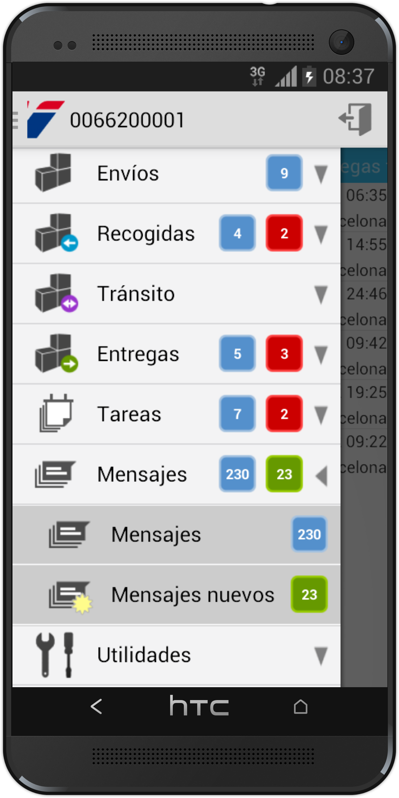

The week in .NET - 5/24/2016
============================

To read last week's post, see [The week in .NET – 5/16/2016](https://blogs.msdn.microsoft.com/dotnet/2016/05/17/the-week-in-net-5162016/).

On.NET
------

Last week on the show, we had Miguel de Icaza:

<iframe width="560" height="315" src="https://www.youtube.com/embed/dz-O3vcSq_U" frameborder="0" allowfullscreen></iframe>

This week, [we'll speak with Maoni Stephens](https://www.youtube.com/watch?v=Ue8D1ga1Nhw), who works on .NET's GC.

Package of the week: Math.NET Symbolics
---------------------------------------

Math.NET is an impressive project. [We've covered Math.NET's numeric package before](https://blogs.msdn.microsoft.com/dotnet/2016/04/12/the-week-in-net-4122016/). Today, we're looking at [its symbolic package](http://symbolics.mathdotnet.com/), that deals with the manipulation of symbolic mathematical expressions. With it, you can parse, format, and evaluate expressions, but also develop them, simplify them, differentiate them, etc.

Here's an example that uses symbolic differentiation to build the Taylor expansion of an expression to a given degree:  

```csharp
Expr Taylor(int k, Expr symbol, Expr a, Expr x)
{
    int factorial = 1;
    Expr accumulator = Expr.Zero;
    Expr derivative = x;
    for(int i=0; i<k; i++)
    {
        var subs = Structure.Substitute(symbol, a, derivative);
        derivative = Calculus.Differentiate(symbol, derivative);
        accumulator = accumulator + subs/factorial*Expr.Pow(symbol-a,i);
        factorial *= (i+1);
    }
    return Algebraic.Expand(accumulator);
}

// Returns 1 + x - (1/2)*x^2 - (1/6)*x^3
Infix.Print(Taylor(4, x, 0, Expr.Sin(x)+Expr.Cos(x)));
```

Xamarin App of the week: MRW
----------------------------

Delivery drivers for [Spain’s leading international transport company MRW](http://www.mrw.es/) use its Android app for proof of pick up, receiving orders, and scheduling. The app’s features include offline work, local storage, multi-threading, barcodes, geolocation, and payment. This complexity created time-to-market challenges that Xamarin solved.



User group meeting of the week: Introduction to F# with Nikhil Bartwhal
-----------------------------------------------------------------------

Tonight, May 24, at 6:30PM at the Empire State Building in NYC, [Nikhil Barthwal will give an introduction to F#](http://www.meetup.com/nyc-fsharp/events/231231347/). The meeting is hosted by the [New York City F# Group](http://www.meetup.com/nyc-fsharp/).


.NET
----

* [Changes to project.json](https://blogs.msdn.microsoft.com/dotnet/2016/05/23/changes-to-project-json/) by Scott Hunter.
* [Happy 25th birthday, VB](https://blogs.msdn.microsoft.com/dotnet/2016/05/20/happy-25th-birthday-vb/) by Anthony D. Green.
* [JSON.NET now works with RC2 without "import" directives](https://www.nuget.org/packages/Newtonsoft.Json/8.0.4-beta1).
* [Updating to RC2: Changes to EFCore, ASPNETCore, PostgreSQL driver & XUnit](http://thedatafarm.com/data-access/updating-to-rc2-changes-to-efcore-aspnetcore-postgresql-driver-xunit/) by Julie Lerman.
* [.NET Core goes RC2](http://developer.telerik.com/featured/net-core-goes-rc2/) by Ed Charbeneau.
* [How to debug .NET Core RC2 app with Visual Studio Code on Windows](http://codeclimber.net.nz/archive/2016/05/20/How-to-debug-NET-Core-RC2-app-with-Visual-Studio.aspx) by Simone Chiaretta.
* [.NET Core, a call to action](https://blog.rendle.io/net-core-a-call-to-action/) by Mark Rendle.
* [Using Windows Runtime in a .NET desktop application](https://github.com/jbe2277/waf/wiki/Using-Windows-Runtime-in-a-.NET-desktop-application) by jbe2277.

ASP.NET
-------

* [Migrating ASP.NET 5 RC1 apps to ASP.NET Core](https://chsakell.com/2016/05/21/migrating-asp-net-5-rc1-apps-to-asp-net-core/) by Christos Sakell.
* [Converting an ASP.NET Core RC1 Project to RC2](https://wildermuth.com/2016/05/17/Converting-an-ASP-NET-Core-RC1-Project-to-RC2) by Shawn Wildermuth.
* [Using EF6 with ASP.NET MVC Core 1.0](https://blog.tonysneed.com/2016/01/22/ef6-asp-net-core-mvc6/) by Tony Sneed.
* [Strongly Typed Configuration Settings in ASP.NET Core](http://weblog.west-wind.com/posts/2016/May/23/Strongly-Typed-Configuration-Settings-in-ASPNET-Core) by Rick Strahl.
* [How to use the IOptions pattern for configuration in ASP.NET Core RC2](http://andrewlock.net/how-to-use-the-ioptions-pattern-for-configuration-in-asp-net-core-rc2/), and [How to add default security headers in ASP.NET Core using custom middleware](http://andrewlock.net/adding-default-security-headers-in-asp-net-core/) by Andrew Lock.
* [Building a Static File Server in ASP.NET Core RC2 with the CLI](http://iamnotmyself.com/blog/2016/05/19/building-a-static-file-server-in-asp-net-core-rc2-with-the-cli) by Bobby Johnson.
* [Templates for building React.js front-ends in ASP.NET Core and MVC5](http://www.thereformedprogrammer.net/templates-for-building-react-front-ends-in-asp-net-core-and-mvc5/) by Jon Smith.
* [ASP.NET Core: Watching Code](http://tattoocoder.com/asp-net-core-watching-code/) by Shane Boyer.
* [ASP.NET Core distributed cache tag helper](http://aspnetmonsters.com/2016/05/2016-05-22-ASP-NET-Core-Distributed-Cache-Tag-Helper/) by David Paquette.

F#
--

* [A Dive into ```Cloud<`T>```](http://eiriktsarpalis.github.io/mbrace-msrc/index.html#/) by Eirik Tsarpalis
* [Getting Started with Fable and Webpack](http://kcieslak.io/Getting-Started-with-Fable-and-Webpack/), by Krzysztof Cieślak
* [Setting up your environment to build an Android app with Xamarin.Forms](https://kimsereyblog.blogspot.com.by/2016/05/setup-your-environment-to-build-android.html), by Kimserey Lam
* [Dynamic Recursive API with F#](http://www.taimila.com/blog/dynamic-recursive-api-with-fsharp/), by Lauri Taimila

Check out [F# Weekly](https://sergeytihon.wordpress.com/category/f-weekly/) for more great content from the F# community.

Xamarin
-------

* [10 Developer Takeaways from Xamarin Evolve](http://developer.telerik.com/featured/10-developer-takeaways-xamarin-evolve/) by Sam Basu.
* [James Montemagno interviews Joseph Hill, Xamarin co-founder, and VP of developer relations, on the Xamarin Podcast](https://blog.xamarin.com/podcast-xamarin-evolve-2016-recap-with-joseph-hill/).
* [The many flavors of HttpClient](http://kerry.lothrop.de/httpclient-flavors/) by Kerry W. Lothrop.
* [Embedding Native Controls into Xamarin.Forms](https://blog.xamarin.com/embedding-native-controls-into-xamarin-forms/) by James Montemagno.
* [Xamarin.Forms Workbooks](http://conceptdev.blogspot.com.au/2016/05/xamarinforms-workbooks.html), and [Xamarin Workbooks with Nugets](http://conceptdev.blogspot.com.au/2016/05/xamarin-workbooks-with-nugets.html) by Craig Dunn.

And this is it for this week!

Contribute to the week in .NET
------------------------------

As always, this weekly post couldn't exist without community contributions, and I'd like to thank all those who sent links and tips.

You can participate too. Did you write a great blog post, or just read one? Do you want everyone to know about an amazing new contribution or a useful library? Did you make or play a great game built on .NET?
We'd love to hear from you, and feature your contributions on future posts:

* Send an email to beleroy at Microsoft,
* [comment on this gist](https://gist.github.com/bleroy/80be2e1cb802179e48b9199019c9ab2c)
* Leave us a pointer in the comments section below.
* [Send Stacey (@yecats131) tips on Twitter about .NET games](https://twitter.com/yecats131).

This week's post (and future posts) also contains news I first read on [The ASP.NET Community Standup](https://blogs.msdn.microsoft.com/webdev/tag/communitystandup/), on [Weekly Xamarin](http://weeklyxamarin.com/), on [F# weekly](https://sergeytihon.wordpress.com/category/f-weekly/), on [ASP.NET Weekly](http://www.aspnetweekly.com/), and on [Chris Alcock's The Morning Brew](http://themorningbrew.net/).
