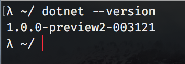

Announcing .NET Core 1.0
========================

We are excited to announce the release of .NET Core 1.0, ASP.NET Core 1.0 and Entity Framework 1.0 today! .NET Core is a cross-platform, open source, and modular .NET platform for creating modern web apps, microservices, libraries and console applications. This release includes the .NET Core runtime, libraries and tools and the ASP.NET Core libraries. We are also releasing Visual Studio and Visual Studio Code extensions that enable you to create .NET Core projects. You can get started at [https://dot.net/core](https://dot.net/core).

Today we are at the [Red Hat DevNation](http://www.devnation.org) conference showing the release and our partnership with Red Hat. [Watch the live stream via Channel 9](https://aka.ms/redhatdotnet) where Scott Hanselman will demonstrate .NET Core 1.0. .NET Core is now available on Red Hat Enterprise Linux and OpenShift via certified containers. In addition, .NET Core is fully supported by Red Hat and extended via the integrated hybrid support partnership between Microsoft and Red Hat. See the Red Hat Blog for more details.

About two years ago, we started receiving requests from some ASP.NET customers for ".NET on Linux". Around the same time, we were talking to the Windows Server Team about Windows Nano, their future, much smaller server product. As a result, we started a new .NET project, which we codenamed "Project K", to target these new platforms. It's great to see this project finally broadly available as .NET Core and ASP.NET Core 1.0. 

We'd like to express our gratitude for everyone that has tried .NET Core and ASP.NET Core and given us feedback. We know that tens of thousands of you have been using the pre-1.0 product. Thanks! We've received a lot of feedback about design choices, user experience, performance, communication and other topics. We've tried our best to apply all of that feedback. The release is much better for it. We couldn't have done it without you. Thanks!

Getting Started
===============

It's really easy to try out .NET Core and ASP.NET on Windows, OS X or Linux. You can have an app up and running in a few minutes. You only need the .NET Core SDK to get started.

The best place to start is the [.NET Core](https://dot.net/core) home page. It will offer you the correct .NET Core SDK for the Operating System (OS) that you are using and the 3-4 steps you need to following to get started. It's pretty straightforward.

To give you an idea, once you have the SDK installed, you can type these three simple commands for your first "Hello World" app.

````
dotnet new
dotnet restore
dotnet run
```

You'll see (no surprise!):

```
Hello World!
```

You'll likely get bored of "Hello World" quite quickly. You can read more in-depth tutorials at [.NET Core Tutorials](https://docs.microsoft.com/dotnet/articles/core/tutorials) and [ASP.NET Core Tutorials](https://docs.asp.net/en/latest/tutorials/index.html).

Check out the [Announcing EF Core 1.0](https://blogs.com) to find out how to get started with Entity Framework Core 1.0.

Community Contribution
======================

This is a huge milestone and accomplishment for the entire .NET ecosystem – with more than 18,000 developers representing more than 1,300 companies contributing to .NET Core 1.0. Nearly half of all pull requests for .NET Core projects (e.g. corefx, coreclr) came from the community - up from 20% one year ago, which felt like a milestone at the time. The momentum has been incredible.

*".NET is a great technology that dramatically boosts developer productivity. Samsung has been contributing to .NET Core on GitHub – especially in the area of ARM support – and we are looking forward to contributing further to the .NET open source community. Samsung is glad to join the .NET Foundation's Technical Steering Group and help more developers enjoy the benefits of .NET."* Hong-Seok Kim, Vice President, Samsung Electronics.

Increased interest in .NET Core has also driven deeper engagement in the .NET Foundation, which now manages more than 60 projects. In April, Red Hat, Jet Brains and Unity were welcomed to the .NET Foundation Technical Steering Group. Today we are announcing a new member, Samsung. 

See the [.NET Foundation blog](https://www.dotnetfoundation.org/blog) for more details. 

.NET Core Usage
===============

Some customers couldn't wait until the final 1.0 release and have been using preview versions of .NET Core in production, on Windows and Linux. We guess that tens of customers have been doing this and that thousands are only one step away, based on direct customer conversations. Thanks! These customers tell us that .NET Core has had a significant impact for their businesses. We look forward to seeing many of the applications that will get built over the next year. Please keep the feedback coming so that we can decide what to add next.

Illyriad Games, the team behind Age of Ascent, reported a [10-fold increase in performance](http://web.ageofascent.com/video-microsoft-cloud-age-ascent-browser-game-handle-50000-players/) using ASP.NET Core with Azure Service Fabric. We are also extremely greatful for their code contributions to this performance. Thanks [@benaadams](https://github.com/benaadams)!

NetEase, a leading IT company in China, provides online services for content, gaming, social media, communications and commerce, needed to stay on the leading edge of the ever-evolving mobile games space and chose .NET Core for their back end services. When compared to their previous Java back-end architecture: *“.NET Core has reduced our release cycle by 20% and cost on engineering resources by 30%.”* When speaking about the throughput improvements and cost savings: *“Additionally, it has made it possible to reduce the number of VMs needed in production by half.”*

We used industry benchmarks for web platforms on Linux as part of the release, including [TechEmpower Benchmarks](http://www.techempower.com/benchmarks/). We've been [sharing our findings](https://github.com/aspnet/benchmarks) as demonstrated in our own labs, starting several months ago. We're hoping to see official numbers from TechEmpower soon after our release. 

Our lab runs show that ASP.NET Core is faster than some of our industry peers. We see throughput that is 8x better than Node.js and almost 3x better than Go, on the same hardware. We're also not done! These are the changes that we were able to get into the 1.0 product. 

.NET developers know that the platform is a great choice for productivity. We want them to know that it's also a great choice for performance.

.NET Core 1.0
=============

.NET Core is a new cross-platform .NET product. It is very similar to the .NET Framework, but is a different product. The primary selling points of .NET Core are:

- **Flexible deployment:** app-local or side-by-side user- or machine-wide installation.
- **Cross-platform:** Runs on Windows, macOS and Linux.
- **Compatibility:** .NET Core is compatible with .NET Framework and Xamarin platforms, via the [.NET Standard Library](../standard/library.md).
- **Open source:** The .NET Core platform is open source (MIT). 

Using .NET Core 1.0
===================

Show the experience you get with .NET Core 1.0 via the CLI.

Using Visual Studio Code
========================

Show the experience using Visual Studio Code.

To get started with .NET Core on Visual Studio Code, make sure you have downloaded and installed:

* [.NET Core](http://dot.net/core)
* [Visual Studio Code](https://code.visualstudio.com)

You can verify that you have the latest version of .NET Core installed by opening a command prompt and typing `dotnet --version`.  Your output should look like this:



Next, you can create a new folder, scaffold a new "Hello World" C# application inside of it with the command line via `dotnet new`, then open Visual Studio Code in that directory with the `code .` command.  If you don't have `code` on your PATH, you'll have to set it.

If you don't have [C# language plugin for Visual Studio Code](https://marketplace.visualstudio.com/items?itemName=ms-vscode.csharp) it installed already, you'll want to do that.

Next, you'll need to create and configure the `launch.json` and `tasks.json` files.  Visual Studio Code will have asked if it can create these files for you.  If you didn't allow it to do that, you will have to create these files yourself.  Here's how:

1. Create a new folder at the root level called `.vscode` and create the `launch.json` and `tasks.json` files inside of it.

2. Open `launch.json` and configure it like this:

<script src="https://gist.github.com/cartermp/b2fea9ea7e0d2379e5a4d4a1bb0406cb.js"></script>

3. Open the `tasks.json` file and configure it like this:

<script src="https://gist.github.com/cartermp/2db7148c6618c758b59e34343741f0f1.js"></script>

4. Navigate to the Debug menu, click the Play icon, and now you can run your .NET Core applications!

IMAGE OR GIF HERE

Note that if you open Visual Studio code from a different directory, you may need to change the values of `cwd` and `program` in `launch.json` and `tasks.json` to point to your application output folders.

You can also debug your application by setting a breakpoint in the code and clicking the Play icon.

IMAGE OR GIF HERE

Using Visual Studio
===================

Show the experience using Visual Studio.

Roadmap
=======

We've shipped 1.0 and we've got a plan for future releases. Make reference to the blog posts. Point to the new .NET Core project.

Closing
=======

Thanks for all the feedback and usage.
