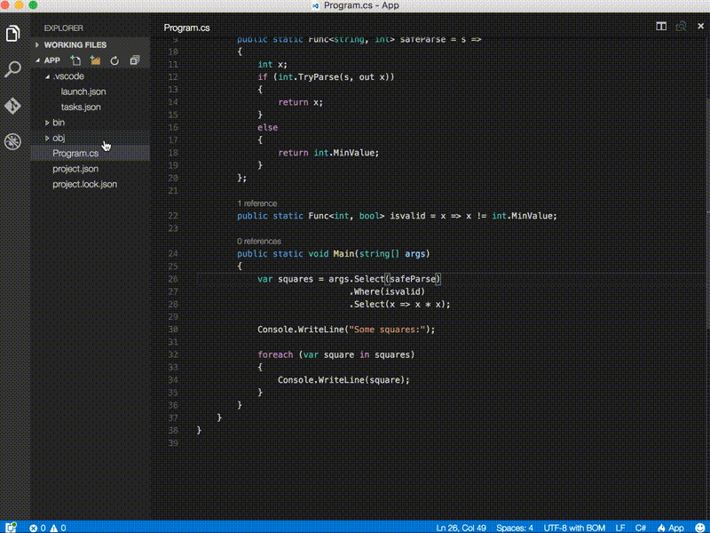
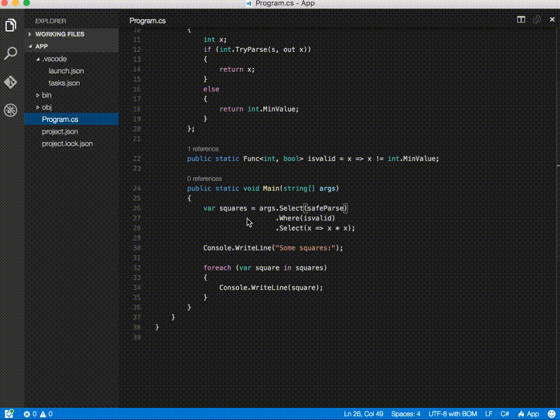

Announcing .NET Core 1.0
========================

We are excited to announce the release of .NET Core 1.0, [ASP.NET Core 1.0](https://blogs.msdn.microsoft.com/webdev/2016/06/27/announcing-asp-net-core-1-0/) and [Entity Framework 1.0](https://blogs.msdn.microsoft.com/dotnet/2016/06/27/entity-framework-core-1-0-0-available), available on Windows, OS X and Linux! .NET Core is a cross-platform, open source, and modular .NET platform for creating modern web apps, microservices, libraries and console applications. 

This release includes the .NET Core runtime, libraries and tools and the ASP.NET Core libraries. We are also releasing Visual Studio and Visual Studio Code extensions that enable you to create .NET Core projects. You can get started at [https://dot.net/core](https://dot.net/core).

We are also releasing [.NET documentation](https://docs.microsoft.com/dotnet) today at [docs.microsoft.com](https://docs.microsoft.com/), the new documentation service for Microsoft. The documentation you see there is just a start. You can follow our progress at [core-docs](https://github.com/dotnet/core-docs) on GitHub. [ASP.NET Core documentation](https://docs.asp.net/) is also available and [open source](https://github.com/aspnet/docs).

Today we are at the [Red Hat DevNation](http://www.devnation.org) conference showing the release and our partnership with Red Hat. [Watch the live stream via Channel 9](https://aka.ms/redhatdotnet) where Scott Hanselman will demonstrate .NET Core 1.0. .NET Core is now available on Red Hat Enterprise Linux and OpenShift via certified containers. In addition, .NET Core is fully supported by Red Hat and extended via the integrated hybrid support partnership between Microsoft and Red Hat. See the Red Hat Blog for more details.

This is the biggest transformation of .NET since its inception and will define .NET for the next decade. We’ve rebuilt the foundation of .NET to be targeted at the needs of today’s world: highly distributed cloud applications, micro services and containers. 

The .NET Framework and traditional ASP.NET will continue to be relevant for your existing workloads. You can share code and reuse your skills across the entire .NET family so you can decide what to use and when, including mobile apps with Xamarin. And because we designed .NET to share a common library (the .NET standard library) .NET Framework, .NET Core and Xamarin apps will share new common capabilities in the future.

Getting Started
===============

It's really easy to try out .NET Core and ASP.NET Core on Windows, OS X or Linux. You can have an app up and running in a few minutes. You only need the .NET Core SDK to get started.

The best place to start is the [.NET Core](https://dot.net/core) home page. It will offer you the correct .NET Core SDK for the Operating System (OS) that you are using and the 3-4 steps you need to following to get started. It's pretty straightforward.

To give you an idea, once you have the SDK installed, you can type these three simple commands for your first "Hello World" app. The first generates a template for you for a console app, the second restores package dependencies and the last builds and runs the app.

````
dotnet new
dotnet restore
dotnet run
```

You'll see (no surprise!):

```
Hello World!
```

You'll likely get bored of "Hello World" quite quickly. You can read more in-depth tutorials at [.NET Core Tutorials](https://docs.microsoft.com/dotnet/articles/core/tutorials) and [ASP.NET Core Tutorials](https://docs.asp.net/en/latest/tutorials/index.html).

Check out the [Announcing EF Core 1.0](https://blogs.msdn.microsoft.com/dotnet/2016/06/27/entity-framework-core-1-0-0-available) to find out how to get started with Entity Framework Core 1.0.

The .NET Core Journey
=====================

About two years ago, we started receiving requests from some ASP.NET customers for ".NET on Linux". Around the same time, we were talking to the Windows Server Team about Windows Nano, their future, much smaller server product. As a result, we started a new .NET project, which we codenamed "Project K", to target these new platforms. We changed the name, shape and experience of the product a few times along the way, at every turn trying to make it better and applicable to more scenarios and a broader base of developers. It's great to see this project finally available as .NET Core and ASP.NET Core 1.0.

Open source is another important theme of this project. Over time, we noticed that all of the major web platforms were open source. ASP.NET MVC has been open source for a long time, but the platform underneath it, the .NET Framework, was not. We didn't have an answer for web developers who cared deeply about open source, and MVC being open wasn't enough. With today's releases, ASP.NET Core is now an open source web platform, top to bottom. Even the documentation is open source. ASP.NET Core is a great candidate for anyone who has open source as a requirement for their web stack.

We'd like to express our gratitude for everyone that has tried .NET Core and ASP.NET Core and has given us feedback. We know that tens of thousands of you have been using the pre-1.0 product. Thanks! We've received a lot of feedback about design choices, user experience, performance, communication and other topics. We've tried our best to apply all of that feedback. The release is much better for it. We couldn't have done it without you. Thanks!

If you are not a .NET developer or haven't used .NET in a while, now is a great moment to try it. You can enjoy the productivity and power of .NET with no constraints, on any OS, with any tool and for any application. All of that fully open source, developed with the community and with Microsoft’s support. Check out [dot.net](https://dot.net) to see the breadth of .NET options.

Community Contribution
======================

This is a huge milestone and accomplishment for the entire .NET ecosystem. Nearly 10k developers contributed to .NET Core 1.0. We never imagined that many folks contributing to the product. We've also been impressed by the quality of the contributions. There are significant components that the community is driving forward. Nice work, folks! 

We also found that another 8k developers are watching these same repos, which effectively doubles the count. We believe that these developers watch these repos to either find that first opportunity to contribute or want to stay up-to-date on the project as part of their approach to .NET Core adoption.

At this point, nearly half of all pull requests for .NET Core related projects (e.g. corefx, coreclr) come from the community. That's up from 20% one year ago. The momentum has been incredible.

Here's the breakdown of developers that created pull requests, created issues or made comments in any one of the .NET Core related repos, per organization, as determined by using the GitHub API:

| User Count | Organization | Example repo |
| :--------: | :-----------:| :----------: |
| 5176 | aspnet | [mvc](https://github.com/aspnet/Mvc) |
| 3804 | dotnet | [corefx](https://github.com/dotnet/corefx) |
| 2124 | nuget  | [NuGet.Client](https://github.com/NuGet/NuGet.Client) |
| 560 | microsoft | [visualfsharp](https://github.com/microsoft/visualfsharp) |

**Total unique users:** 9723

Note: The counts don't sum to the total because some users contribute to multiple organizations (thanks!) and we've tried to avoid double-counting.  

Note: The counts from the Microsoft org are specific to the few .NET Core-related repos that exist there, such as visualfsharp. 

Note: These numbers include Microsoft employees, which are (at most) 10% of the count.

Samsung joins the .NET Foundation
---------------------------------

Increased interest in .NET Core has also driven deeper engagement in the [.NET Foundation](https://www.dotnetfoundation.org), which now manages more than 60 projects. Today we are [announcing Samsung as the newest member](http://www.dotnetfoundation.org/blog/samsung-join-tsg). In April, Red Hat, Jet Brains and Unity were welcomed to the .NET Foundation Technical Steering Group.  

*".NET is a great technology that dramatically boosts developer productivity. Samsung has been contributing to .NET Core on GitHub – especially in the area of ARM support – and we are looking forward to contributing further to the .NET open source community. Samsung is glad to join the .NET Foundation's Technical Steering Group and help more developers enjoy the benefits of .NET."* Hong-Seok Kim, Vice President, Samsung Electronics.

The contributions from Samsung have been impressive. They have a great team of developers that have taken an interest in .NET Core. We're glad to have them as part of the larger team.

.NET Core Usage
===============

Some customers couldn't wait until the final 1.0 release and have been using preview versions of .NET Core in production, on Windows and Linux. These customers tell us that .NET Core has had a significant impact for their businesses. We look forward to seeing many of the applications that will get built over the next year. Please keep the feedback coming so that we can decide what to add next.

Illyriad Games, the team behind Age of Ascent, reported a [10-fold increase in performance](http://web.ageofascent.com/video-microsoft-cloud-age-ascent-browser-game-handle-50000-players/) using ASP.NET Core with Azure Service Fabric. We are also extremely greatful for their code contributions to this performance. Thanks [@benaadams](https://github.com/benaadams)!

NetEase, a leading IT company in China, provides online services for content, gaming, social media, communications and commerce, needed to stay on the leading edge of the ever-evolving mobile games space and chose .NET Core for their back end services. When compared to their previous Java back-end architecture: *“.NET Core has reduced our release cycle by 20% and cost on engineering resources by 30%.”* When speaking about the throughput improvements and cost savings: *“Additionally, it has made it possible to reduce the number of VMs needed in production by half.”*

We used industry benchmarks for web platforms on Linux as part of the release, including the [TechEmpower Benchmarks](http://www.techempower.com/benchmarks/). We've been [sharing our findings](https://github.com/aspnet/benchmarks) as demonstrated in our own labs, starting several months ago. We're hoping to see official numbers from TechEmpower soon after our release. 

Our lab runs show that ASP.NET Core is faster than some of our industry peers. We see throughput that is 8x better than Node.js and almost 3x better than Go, on the same hardware. We're also not done! These improvements are from the changes that we were able to get into the 1.0 product. 

.NET developers know that the platform is a great choice for productivity. We want them to know that it's also a great choice for performance.

.NET Core 1.0
=============

We've been talking about .NET Core for about two years now, although it has changed significantly over that time. It's good to recap in this post what defines and is included in .NET Core 1.0.

.NET Core is a new cross-platform .NET product. The primary selling points of .NET Core are:

- **Cross-platform:** Runs on Windows, macOS and Linux.
- **Flexible deployment:** Can be included in your app or installed side-by-side user- or machine-wide.
- **Command-line tools:**  All product scenarios can be exercised at the command-line. 
- **Compatible:** .NET Core is compatible with .NET Framework, Xamarin and Mono, via the [.NET Standard Library](https://docs.microsoft.com/dotnet/articles/standard/library.md).
- **Open source:** The .NET Core platform is open source, using MIT and Apache 2 licenses. Documentation is licensed under [CC-BY](http://creativecommons.org/licenses/by/4.0/). .NET Core is a [.NET Foundation](http://www.dotnetfoundation.org/) project.
- **Supported by Microsoft:** .NET Core is supported by Microsoft, per [.NET Core Support](https://www.microsoft.com/net/core/support/)

Composition
-----------

.NET Core is composed of the following parts:

- A [.NET runtime](https://github.com/dotnet/coreclr), which provides a type system, assembly loading, a garbage collector, native interop and other basic services. 
- A set of [framework libraries](https://github.com/dotnet/corefx), which provide primitive data types, app composition types and fundamental utilities. 
- A [set of SDK tools](https://github.com/dotnet/cli) and [language compilers](https://github.com/dotnet/roslyn) that enable the base developer experience, available in the [.NET Core SDK](https://docs.microsoft.com/dotnet/articles/core/sdk.md).
- The ['dotnet' app host](https://docs.microsoft.com/en-us/dotnet/articles/core/tools/dotnet), which is used to launch .NET Core apps. It selects the runtime and hosts the runtime, provides an assembly loading policy and launches the app. The same host is also used to launch SDK tools in the same way.

Workloads
---------

By itself, .NET Core includes a single application model -- console apps -- which is useful for tools, local services and text-based games. Additional application models have been built on top of .NET Core to extend its functionality, such as:

- [ASP.NET Core](http://asp.net)
- [Windows 10 Universal Windows Platform (UWP)](https://developer.microsoft.com/windows)
- [Xamarin.Forms](https://www.xamarin.com/forms)

.NET Core Tools
---------------

You typically start .NET Core development by installing the .NET Core SDK. The SDK includes enough software to build an app. The SDK gives you both the .NET Core Tools and a copy of .NET Core. As new versions of .NET Core are made available, you can download and install them without needing to get a new version of the tools.

Apps specify their dependence on a particular .NET Core version via the project.json project file. The tools help you acquire and use that .NET Core version. You can switch between multiple apps on your machine in Visual Studio, Visual Studio Code or at a command prompt and the .NET Core tools will always pick the right version of .NET Core to use within the context of each app.

You can also have multiple versions of the .NET Core tools on your machine, too, which can be important for continuous integration and other scenarios. Most of the time, you will just have one copy of the tools, since doing so provides a simpler experience.

### The dotnet Tool

Your .NET Core experience will start with the [dotnet tool](https://docs.microsoft.com/en-us/dotnet/articles/core/tools/dotnet). It exposes a set of commands for common operations, including restoring packages, building your project and unit testing. It also includes a command to create an empty new project to make it easy to get started.

The following is a partial list of the commands.

- [dotnet new](https://docs.microsoft.com/dotnet/articles/core/tools/dotnet-new) – Initializes a sample console C# project.
- [dotnet restore](https://docs.microsoft.com/dotnet/articles/core/tools/dotnet-restore) – Restores the dependencies for a given application.
- [dotnet build](https://docs.microsoft.com/dotnet/articles/core/tools/dotnet-build) – Builds a .NET Core application.
- [dotnet publish](https://docs.microsoft.com/dotnet/articles/core/tools/dotnet-publish) – Publishes a .NET portable or self-contained application.
- [dotnet run](https://docs.microsoft.com/dotnet/articles/core/tools/dotnet-run) – Runs the application from source.
- [dotnet test](https://docs.microsoft.com/dotnet/articles/core/tools/dotnet-test) – Runs tests using a test runner specified in the project.json.
- [dotnet pack](https://docs.microsoft.com/dotnet/articles/core/tools/dotnet-pack) – Creates a NuGet package of your code.

dotnet works great with C# projects. F# and VB support is coming.

.NET Standard Library
---------------------

[The .NET Standard Library](https://docs.microsoft.com/dotnet/articles/standard/library) is a formal specification of .NET APIs that are intended to be available on all .NET runtimes. The motivation behind the Standard Library is establishing greater uniformity in the .NET ecosystem. [ECMA 335](https://github.com/dotnet/coreclr/blob/master/Documentation/project-docs/dotnet-standards.md) continues to establish uniformity for .NET runtime behavior, but there is no similar spec for the .NET Base Class Libraries (BCL) for .NET library implementations.

The .NET Standard Library enables the following key scenarios:

- Defines uniform set of BCL APIs for all .NET platforms to implement, independent of workload.
- Enables developers to produce portable libraries that are usable across .NET runtimes, using this same set of APIs.
- Reduces and hopefully eliminates conditional compilation of shared source due to .NET APIs, only for OS APIs.

.NET Core 1.0 implements the standard library, as does the .NET Framework and Xamarin. We see the standard library as a major focus of innovation and that benefits multiple .NET products.

Support
-------

.NET Core is [supported by Microsoft](https://www.microsoft.com/net/core/support). You can use .NET Core in a development and deploy it in production and request support from Microsoft, as needed. Each release also has a defined lifecycle, where Microsoft will provides fixes, updates, or online technical assistance.

The team adopted a new servicing model for .NET Core, with two different release types:

- Long Term Support (LTS) releases
   - Typically a major release, such as "1.0" or "2.0"
   - Supported for three years after the general availability date of a LTS release
   - And one year after the general availability of a subsequent LTS release
- Fast Track Support (FTS) releases
   - Typically a minor release, such as "1.1" or "1.2"
   - Supported within the same three-year window as the parent LTS release
   - And three months after the general availability of a subsequent FTS release
   - And one year after the general availability of a subsequent LTS release

Some customers want to deploy apps on very stable releases and do not want new features  until the app is developed again. Those customers should consider LTS releases.

Other customers want to take advantage of new features as soon as possible, particularly for apps that are almost always in development. Those customers should consider FTS releases.

Note: We haven't released an FTS verion yet. .NET Core 1.0 is an LTS version.

.NET Core Tools Telemetry
-------------------------

The .NET Core tools include a [telemetry feature](https://github.com/dotnet/cli/pull/2145) so that we can collect usage information about the .NET Core Tools. It’s important that we understand how the tools are being used so that we can improve them. Part of the reason the tools are in Preview is that we don’t have enough information on the way that they will be used. The telemetry is only in the tools and does not affect your app.

### Behavior

The telemetry feature is on by default. The data collected is anonymous in nature and will be published in an aggregated form for use by both Microsoft and community engineers under a Creative Commons license.

You can opt-out of the telemetry feature by setting an environment variable DOTNET_CLI_TELEMETRY_OPTOUT (e.g. export on OS X/Linux, set on Windows) to true (e.g. “true”, 1). Doing this will stop the collection process from running.

### Data Points

The feature collects the following pieces of data:

- The command being used (e.g. “build”, “restore”)
- The ExitCode of the command
- For test projects, the test runner being used
- The timestamp of invocation
- The framework used
- Whether runtime IDs are present in the “runtimes” node
- The CLI version being used

The feature will not collect any personal data, such as usernames or emails. It will not scan your code and not extract any project-level data that can be considered sensitive, such as name, repo or author (if you set those in your project.json). We want to know how the tools are used, not what you are using the tools to build. If you find sensitive data being collected, that’s a bug. Please [file an issue](https://github.com/dotnet/cli/issues) and it will be fixed.

We use the [MICROSOFT .NET LIBRARY EULA](http://go.microsoft.com/fwlink/?LinkId=329770) for the .NET Core Tools, which we also use for all .NET NuGet packages. We recently added a “DATA” section re-printed below, to enable telemetry from the tools. We want to stay with one EULA for .NET Core and only intend to collect data from the tools, not the runtime or libraries.

Using .NET Core 1.0
===================

.NET Core 

Using Visual Studio Code
========================

Show the experience using Visual Studio Code.

To get started with .NET Core on Visual Studio Code, make sure you have downloaded and installed:

* [.NET Core](http://dot.net/core)
* [Visual Studio Code](https://code.visualstudio.com)

You can verify that you have the latest version of .NET Core installed by opening a command prompt and typing `dotnet --version`.  Your output should look like this:


Next, you can create a new folder, scaffold a new "Hello World" C# application inside of it with the command line via the `dotnet new` command, then open Visual Studio Code in that directory with the `code .` command.  If you don't have `code` on your PATH, you'll have to set it.

If you don't have [C# language plugin for Visual Studio Code](https://marketplace.visualstudio.com/items?itemName=ms-vscode.csharp) it installed already, you'll want to do that.

Next, you'll need to create and configure the `launch.json` and `tasks.json` files.  Visual Studio Code will have asked if it can create these files for you.  If you didn't allow it to do that, you will have to create these files yourself.  Here's how:

1. Create a new folder at the root level called `.vscode` and create the `launch.json` and `tasks.json` files inside of it.

2. Open `launch.json` and configure it like this:

<script src="https://gist.github.com/cartermp/b2fea9ea7e0d2379e5a4d4a1bb0406cb.js"></script>

3. Open the `tasks.json` file and configure it like this:

<script src="https://gist.github.com/cartermp/2db7148c6618c758b59e34343741f0f1.js"></script>

4. Navigate to the Debug menu, click the Play icon, and now you can run your .NET Core applications!



Note that if you open Visual Studio code from a different directory, you may need to change the values of `cwd` and `program` in `launch.json` and `tasks.json` to point to your application output folders.

You can also debug your application by setting a breakpoint in the code and clicking the Play icon.



Using Visual Studio
===================

Show the experience using Visual Studio.

Comparison with .NET Framework
==============================

The major differences between .NET Core and the .NET Framework: 

- **App-models** -- .NET Core does not support all the .NET Framework app-models, in part because many of them are built on Windows technologies, such as WPF (built on top of DirectX). The console and ASP.NET Core app-models are supported by both .NET Core and .NET Framework. 
- **APIs** -- .NET Core contains many of the same, but fewer, APIs as the .NET Framework, and with a different factoring (assembly names are different; type shape differs in key cases). These differences currently typically require changes to port source to .NET Core. .NET Core implements the [.NET Standard Library](https://docs.microsoft.com/dotnet/articles/standard/library.md) API, which will grow to include more of the .NET Framework BCL APIs over time.
- **Subsystems** -- .NET Core implements a subset of the subsystems in the .NET Framework, with the goal of a simpler implementation and programming model. For example, Code Access Security (CAS) is not supported, while reflection is supported.
- **Platforms** -- The .NET Framework supports Windows and Windows Server while .NET Core also supports macOS and Linux.
- **Open Source** -- .NET Core is open source, while a [read-only subset of the .NET Framework](https://github.com/microsoft/referencesource) is open source.

While .NET Core is unique and has significant differences to the .NET Framework and other .NET platforms, it is straightforward to share code, using either source or binary sharing techniques.

Roadmap
=======

We've shipped 1.0 and we've got a plan for future releases. Make reference to the blog posts. Point to the new .NET Core project.

Closing
=======

Thanks for all the feedback and usage.
