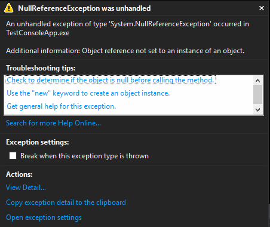
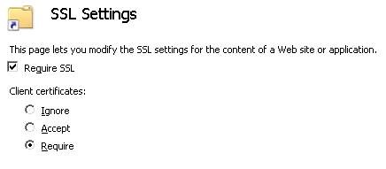
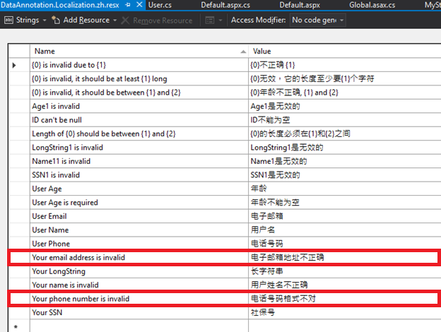

#Announcing .NET Framework 4.6.2

Today we are excited to announce the availability of the [.NET Framework 4.6.2](http://go.microsoft.com/fwlink/?LinkId=780597)! Many of the changes are based on your [feedback](#your-feedback), including those submitted on [UserVoice](https://visualstudio.uservoice.com/forums/121579-visual-studio-2015/category/31481--net) and [Connect](https://connect.microsoft.com/VisualStudio/Feedback). Thanks for your continued help and engagement! 

The release is packed with lots of great improvements in the following areas:

* [Base Class Library](#base-class-library)
* [Common Language Runtime](#common-language-runtime)
* [ClickOnce](#clickonce)
* [ASP.NET](#asp.net)
* [SQL](#sql)
* [Windows Presentation Foundation](#windows-presentation-foundation)
* [Windows Communication Foundation](#windows-communication-foundation)

You can see the full set of changes in the [.NET Framework 4.6.2 change list](xxx) and [API diff](xxx). The set of [supported Windows versions](xxx) is included in the change list.

##Download Now

You can download the .NET Framework 4.6.2 now:

* [.NET Framework 4.6.2 Web Installer](http://go.microsoft.com/fwlink/?LinkId=780597) - Quickest Install. Requires an internet connection.
* [.NET Framework 4.6.2 Offline Installer](http://go.microsoft.com/fwlink/?LinkId=780601) - All-inclusive installer (includes all language packs). Does not require an internet connection.
* [.NET Framework 4.6.2 Developer Pack](http://go.microsoft.com/fwlink/?LinkId=780617) - For development and build environments (includes Offline Installer and the 4.6.2 targeting pack). Does not require an internet connection.

#Base Class Library (BCL)

The following improvements have been made in the BCL.

##Long Path Support (`MAXPATH`)

We [fixed the 260 character (MAXPATH) file name length limitation](https://visualstudio.uservoice.com/forums/121579-visual-studio-2015/suggestions/4954037-fix-260-character-file-name-length-limitation) in the System.IO APIs. Over 4500 of you voted for this issue on UserVoice! 

This limitation doesn't usually affect consumer applications (for example, loading files out of "My Documents"), but is more common on developer machines that build deeply nested source trees or use specialized tools that also run on Unix (where long paths are much more common).

This new capability is enabled for applications that target the .NET Framework 4.6.2 (or later). You can [configure an application](https://msdn.microsoft.com/library/1fk1t1t0.aspx) to target the .NET Framework 4.6.2 with the following app.config or web.config configuration file:

```xml
<?xml version="1.0" encoding="utf-8" ?>
<configuration>
  <startup>
    <supportedRuntime version=".NETFramework,Version=v4.6.2"/>
  </startup>
</configuration>
```
You can opt applications that target an earlier version of the .NET Framework into using this functionality by setting an AppContext switch, as demonstrated in the following configuration file. The switch will only be honored when an application in running on the .NET Framework 4.6.2 (or later). 

```xml
<?xml version="1.0" encoding="utf-8" ?>
<configuration>
  <startup>
    <supportedRuntime version=".NETFramework,Version=v4.5.2"/>
  </startup>
  <runtime>
    <AppContextSwitchOverrides value="Switch.System.IO.UseLegacyPathHandling=false" />
  </runtime>
</configuration>
```

The absence of targeting the .NET Framework 4.6.2 or setting the AppContext switch results in the existing behavior of being blocked from using paths longer than `MAXPATH`. The behavior is opt-in to maintain backwards compatibility for existing applications.

The following improvements were made to enable long paths:

* **Allow paths that are greater than 260 character (MAX_PATH)**. Paths that are longer than [`MAX_PATH`](https://msdn.microsoft.com/library/windows/desktop/aa365247.aspx#maxpath) are allowed by the BCL. The BCL APIs rely on the underlying Win32 file APIs for limitation checks. 

* **Enable extended path syntax and file namespaces (`\\?\`, `\\.\`)**. Windows exposes multiple [file namespaces](https://msdn.microsoft.com/library/windows/desktop/aa365247.aspx#namespaces) that enable alternate path schemes, such as the *extended path* syntax, which allows paths to just over 32k characters. The BCL now supports these paths, such as the following: `\\?\very long path`. The .NET Framework now primarily relies on Windows for path normalization, treating it as the "source of truth", to avoid inadvertently blocking legitimate paths. The extended path syntax is a good workaround for Windows versions that don't support long paths using the regular form (for example, `C:\very long path').

* **Performance Improvements**. The adoption of Windows path normalization and the reduction of similar logic in the BCL has resulted in overall performance improvements for logic related to file paths. Other related performance improvements have also been made.

More details on these changes can be found on [Jeremy Kuhne’s blog](https://blogs.msdn.microsoft.com/jeremykuhne/2016/06/21/more-on-new-net-path-handling/).

### X509 Certificates Now Support FIPS 186-3 Digital Signature Algorithm

The .NET Framework 4.6.2 adds support for [FIPS 186-3](http://csrc.nist.gov/publications/fips/fips186-3/fips_186-3.pdf) Digital Signature Algorithm (DSA). This support enables X509 certificates with keys that exceed 1024-bit. It also enables computing signatures with the SHA-2 family of hash algorithms (SHA256, SHA384, and SHA512). 

The .NET Framework 4.6.1 supports [FIPS 186-2](http://csrc.nist.gov/publications/fips/archive/fips186-2/fips186-2.pdf), which is limited to keys no greater than 1024-bit. 

You can take advantage of FIPS 186-3 support by using the new [DSACng class](https://msdn.microsoft.com/library/system.security.cryptography.dsacng), as you can see in the example below.

<script src="https://gist.github.com/staceyhaffner/e214f78ff29adf165fb4.js"></script>

The [DSA base class](https://msdn.microsoft.com/library/system.security.cryptography.dsa) has also been updated so you can you use FIPS 186-3 support without casting to the new DSACng class. This is the same as the approach that was used for updating RSA and ECDsa implementations, in the two previous .NET Framework releases.

###Improved Usability of Elliptic Curve Diffie-Hellman Key Derivation Routines

The usability of the [ECDiffieHellmanCng class](https://msdn.microsoft.com/library/system.security.cryptography.ecdiffiehellmancng.aspx) has been improved. The .NET Framework Elliptic Curve Diffie-Hellman (ECDH) Key Agreement implementation  includes three different Key Derivation Function (KDF) routines. These KDF routines are now represented and supported by three different methods, as you can see in the example below. 

<script src="https://gist.github.com/staceyhaffner/71710b339cca406629ad.js"></script>

In previous .NET Framework versions, you had to know which subset of properties to set on the [ECDiffieHellmanCng class](https://msdn.microsoft.com/library/system.security.cryptography.ecdiffiehellmancng.aspx) for each of the three different routines.

### Support for Persisted-Key Symmetric Encryption

The Windows Cryptography Library (CNG) supports storing persisted symmetric keys on software and hardware devices. The .NET Framework now exposes this CNG capability, as you can see demonstrated in the example below.

<script src="https://gist.github.com/staceyhaffner/96ed50b66ea27cc14ac2.js"></script>

You need to use the concrete implementation classes, such as [AesCng](https://msdn.microsoft.com/library/system.security.cryptography.aescng.aspx) to use this new capability, as opposed to the more common factory approach, [Aes.Create()](https://msdn.microsoft.com/library/bb337875.aspx). This requirement is due to key names and key providers being implementation-specific

Persisted-key symmetric encryption has been added for the AES and 3DES algorithms, in the [AesCng](https://msdn.microsoft.com/library/system.security.cryptography.aescng.aspx) [TripleDESCng](https://msdn.microsoft.com/en-us/library/system.security.cryptography.tripledescng.aspx) classes, respectively.

### SignedXml Support for SHA-2 Hashing

The .NET Framework SignedXml implementation now supports the following SHA-2 Hashing algorithms:

- [RSA-SHA256](https://msdn.microsoft.com/library/system.security.cryptography.xml.signedxml.xmldsigrsasha256url.aspx)
- [RSA-SHA384](https://msdn.microsoft.com/library/system.security.cryptography.xml.signedxml.xmldsigrsasha384url.aspx)
- [RSA-SHA512](https://msdn.microsoft.com/library/system.security.cryptography.xml.signedxml.xmldsigrsasha512url.aspx) PKCS#1 signature methods
- [SHA256](https://msdn.microsoft.com/library/system.security.cryptography.xml.signedxml.xmldsigsha256url.aspx)
- [SHA384](https://msdn.microsoft.com/library/system.security.cryptography.xml.signedxml.xmldsigsha384url.aspx)
- [SHA512](https://msdn.microsoft.com/library/system.security.cryptography.xml.signedxml.xmldsigsha512url.aspx) reference digest algorithms

You can see an example of signing XML with SHA-256 in the example below.

<script src="https://gist.github.com/staceyhaffner/8bd7376597d54f0c95be.js"></script>

The new SignedXML URI constants have been added as new [SignedXml fields](https://msdn.microsoft.com/library/system.security.cryptography.xml.signedxml_fields.aspx). The new fields are shown below.

<script src="https://gist.github.com/staceyhaffner/3137806c60dd3682ca59.js"></script>

Any programs which have registered a custom SignatureDescription handler into CryptoConfig to add support for these algorithms will continue to function as they did in the past, but since there are now platform defaults the CryptoConfig registration should no longer be necessary.

# Common Language Runtime (CLR)

The following improvements have been made in the CLR.

## NullReferenceException Improvements

You have probably experienced and investigated the cause of a [NullReferenceException](https://msdn.microsoft.com/en-us/library/system.nullreferenceexception.aspx). We are part-way through partnering with the Visual Studio team to provide a better debugging experience for null references in a future Visual Studio release. 

The debugging experience in Visual Studio relies on the Common Language Runtime debugging APIs for low-level interaction with your code. Today, the `NullReferenceException` experience in Visual Studio looks like this:



In this release, we extended the CLR debugging APIs to enable the debugger to request more information and perform additional analysis when a `NullReferenceException` occurs. Using this information, a debugger will be able to determine which reference is `null` and provide this information to you, making your job easier.

#ClickOnce

The following improvements have been made in ClickOnce.

##Transport Layer Security (TLS) 1.1 and 1.2 Support
We added support for TLS 1.1 and 1.2 protocols in ClickOnce for .NET Framework versions 4.6.2, 4.6.1, 4.6 and 4.5.2. We would like to thank those who voted for it on [UserVoice](https://visualstudio.uservoice.com/forums/121579-visual-studio-2015/suggestions/10629357-enable-tls-1-2-1-1-during-click-once-setup)! You do not need to do any extra steps to enable TLS 1.1 or 1.2 support as ClickOnce will automatically detect which TLS protocol is required at runtime. 

Secure Sockets Layer (SSL) and TLS 1.0 are no longer recommended or supported by some organizations. For example, the Payment Card Industry Security Standards Council is in the process of [requiring TLS 1.1 or higher](https://blog.pcisecuritystandards.org/migrating-from-ssl-and-early-tls) for online transactions that meet their specifications.

ClickOnce continues to support TLS 1.0 for applications that do not or cannot upgrade, for compatibility. We recommend analyzing all of your uses of SSL and TLS 1.0. See the KB articles for links to download the hotfix .NET Framework versions [4.6, 4.6.1](https://support.microsoft.com/en-us/kb/3146716) and [4.5.2](https://support.microsoft.com/en-us/kb/3146710).


##Client Certificate Support

ClickOnce applications can now be hosted in virtual directories with SSL enabled and with client certificates required. In that configuration, end users will be prompted to select their certificate when accessing an application. ClickOnce will not prompt for a certificate if the `Client Certificates` setting is set to "Ignore".

In previous versions, ClickOnce deployments were terminated with an access denied error when applications where hosted this way.



#ASP.NET

The following improvements have been made in ASP.NET. See [Announcing ASP.NET Core 1.0](https://blogs.msdn.microsoft.com/webdev/2016/06/27/announcing-asp-net-core-1-0/) to learn about improvements in ASP.NET Core.

##DataAnnotation Localization

Localization is now much easier when using model binding and `DataAnnotiation` validation. ASP.NET has adopted a simple convention for resx resource files that contain `DataAnnotation` validation messages:

- Located in the `App_LocalResources` folder.
- Follow the `DataAnnotation.Localization.{locale}.resx` naming convention.

Using the .NET Framework 4.6.2, you specify `DataAnnotation` attributes in your model file just like you would in an [un-localized application](http://www.asp.net/mvc/overview/older-versions/mvc-music-store/mvc-music-store-part-6). For the `ErrorMessage`, you specify the name that you will use in resx file, as you can see in the example below:

```csharp
public class ContactInfo
{
    [Required(ErrorMessage = "Your email address is invalid")]
    [Display(Name = "User Email")]
    public int Email { get; set; }
    
    [Required(ErrorMessage = "Your phone number is invalid")]
    [Display(Name = "User Phone")]
    public int Phone { get; set; }
}
```



You can see that localized resx files have been placed in the 'App_LocalResources' folder, following the new convention, in the example below:


You can also plug in your own stringlocalizer provider to store the localized strings in another location or file type.

In previous .NET Framework versions, you would need to specify `ErrorMessageResourceType` and `ErrorMessageResourceName` values, as you can see in the example below.

```csharp

public class User
{
    [Required(ErrorMessageResourceType = typeof(ModelResources),
    ErrorMessageResourceName = "FirstName_Required")]    
    [StringLength(50, ErrorMessageResourceType = typeof(ModelResources),
    ErrorMessageResourceName = "FirstName_StringLength")]
    public sstring FirstName { get; set; }
    
    [Required(ErrorMessageResourceType = typeof(ModelResources),
    ErrorMessageResourceName = "LastName_Required")]    
    [StringLength(50, ErrorMessageResourceType = typeof(ModelResources),
    ErrorMessageResourceName = "LastName_StringLength")]
    public sstring LastName { get; set; }
    

}
```

##Async Improvements

SessionStateModule and Output-Cache Module have been improved to enable async scenarios. The team is working on releasing async versions of both modules via NuGet, which will need to be imported into an existing project. Both NuGet packages are anticipated to release within the coming weeks. We will update this post when that happens.
 
###SessionStateModule Interfaces

[Session State](https://msdn.microsoft.com/library/ms178581.aspx) allows you to store and retrieve user session data as a user navigates an ASP.NET site. You can now create your own async [Session State Module](https://msdn.microsoft.com/library/system.web.sessionstate.sessionstatemodule.aspx) implementation using the new `ISessionStateModule` interface, enabling you to store session data in your own way and use async methods.

 ###Output-Cache Module
 
[Output Caching](http://www.asp.net/mvc/overview/older-versions-1/controllers-and-routing/improving-performance-with-output-caching-cs) can dramatically improve the performance of an ASP.NET application by caching the result returned from a controller action to avoid unnecessarily generating the same content for every request. 

You can now use async APIs with Output Caching by implementing a new interface called `OutputCacheProviderAsync`. Doing so will reduce thread-blocking on a web server and improve scalability of an ASP.NET service. 

#SQL

The following improvements have been made in the SQL client.

## Always Encrypted Enhancements
[Always Encrypted](https://msdn.microsoft.com/en-us/library/mt163865.aspx) is a feature designed to protect sensitive data, such as credit card numbers or national identification numbers that are stored in a database. It allows clients to encrypt sensitive data inside client applications, never revealing the encryption keys to the database engine. As a result, Always Encrypted provides a separation between those who own the data (and can view it) and those who manage the data (but should have no access).

The .NET Framework Data Provider for SQL Server (System.Data.SqlClient) introduces two important enhancements for Always Encrypted around performance and security.

###Performance
To improve performance of parameterized queries against encrypted database columns, encryption metadata for query parameters is now cached. Database clients retrieve parameter metadata from the server only once when the [SqlConnection::ColumnEncryptionQueryMetadataCacheEnabled](https://msdnstage.redmond.corp.microsoft.com/en-US/library/mt703754%28VS.110%29.aspx) property is set to true (the default), even if the same query is called multiple times.

###Security

Column encryption key entries in the key cache are now evicted after a configurable time interval. The time interval can be set using the  [SqlConnection::ColumnEncryptionKeyCacheTtl](https://msdnstage.redmond.corp.microsoft.com/en-US/library/mt703753%28VS.110%29.aspx) property.

#Windows Communication Foundation (WCF)

The following improvements have been made in WCF.

##NetNamedPipeBinding Best Match

In .NET 4.6.2, [NetNamedPipeBinding](https://msdn.microsoft.com/en-us/library/ms752247.aspx) has been enhanced to support a new pipe lookup, known as “Best Match”.  When using “Best Match”, the NetNamedPipeBinding service will force clients to search for the service listening at the best matching URI to their requested endpoint, rather than the first matching service found. 

The “Best Match” pipe is particularly useful if a WCF client app tries to connect to the wrong URI when using the default “First Match” behavior. In certain situations, when there is more than one WCF Services listening on named pipes, WCF clients using "First Match" could be connected to a wrong service. This could happen if some of the services is hosted by an administrator account.

To enable this feature, you can add the following AppSetting to your client application's App.config or Web.config file:

```xml
<configuration>
  <appSettings>
    <add key="wcf:useBestMatchNamedPipeUri" value="true" />
  </appSettings>
</configuration>
 ```

##DataContractJsonSerializer Improvements

The [DataContractJsonSerializer](https://msdn.microsoft.com/en-us/library/bb412179.aspx) has been improved to better support multiple daylight saving time adjustment rules. When enabled, DataContractJsonSerializer will use the [TimeZoneInfo](https://msdn.microsoft.com/library/system.timezoneinfo.aspx) class instead of the [TimeZone](https://msdn.microsoft.com/library/system.timezone) class. The TimeZoneInfo class supports multiple adjustment rules, which makes it possible to work with historic time zone data. This is useful when a time zone has different daylight saving time adjustment rules, such as (UTC+2) Istanbul. 

You can enable this feature by adding the following AppSetting to the app.config file:

 ```xml
 <runtime>
    <AppContextSwitchOverrides value="Switch.System.Runtime.Serialization.DoNotUseTimeZoneInfo=false" /> 
</runtime>
 ```

## TransportDefaults No Longer Supports SSL 3

The SSL 3 protocol is no longer a default protocol used for negotiating a secure connection when using NetTcp with transport security and a credential type of certificate. In most cases there should be no impact to existing applications, since TLS 1.0 has always been included in the default protocol list for NetTcp. All existing clients should be able to negotiate a connection using at least TLS 1.0.  

SSL3 was removed as a default protocol since it is not longer considered secure. While not recommended, one of the following configuration mechanisms can be used to add SSL 3 back to the list of negotiated protocols if it is required for your deployment:

* [SslStreamSecurityBindingElement.SslProtocols Property](https://msdn.microsoft.com/en-us/library/system.servicemodel.channels.sslstreamsecuritybindingelement.sslprotocols%28v=vs.110%29.aspx)
* [TcpTransportSecurity.SslProtocols Property](https://msdn.microsoft.com/en-us/library/system.servicemodel.tcptransportsecurity.sslprotocols%28v=vs.110%29.aspx)
* [`<transport>` section of `<netTcpBinding>`](https://msdn.microsoft.com/en-us/library/ms731331%28v=vs.110%29.aspx)
* [`<sslStreamSecurity>` section of `<customBinding>`](https://msdn.microsoft.com/en-us/library/ms731328%28v=vs.110%29.aspx)
 
##  Transport Security for Windows Cryptography Library (CNG) 

[Transport Security](https://msdn.microsoft.com/library/ms733043.aspx) now supports certificates stored using the Windows cryptography library (CNG). Currently, this support is limited to using certificates with a public key which has an exponent no more than 32bits in length. 

This new capability is enabled for applications that target the .NET Framework 4.6.2 (or later). You can [configure an application](https://msdn.microsoft.com/library/1fk1t1t0.aspx) to target the .NET Framework 4.6.2 with the following app.config or web.config configuration file:

```xml
<?xml version="1.0" encoding="utf-8" ?>
<configuration>
  <startup>
    <supportedRuntime version=".NETFramework,Version=v4.6.2"/>
  </startup>
</configuration>
```

You can opt applications that target an earlier version of the .NET Framework into using this functionality by setting an AppContext switch, as demonstrated in the following configuration file. The switch will only be honored when an application in running on the .NET Framework 4.6.2 (or later). 

```xml
<?xml version="1.0" encoding="utf-8" ?>
<configuration>
  <startup>
    <supportedRuntime version=".NETFramework,Version=v4.5.2"/>
  </startup>
  <runtime>
    <AppContextSwitchOverrides value="Switch.System.ServiceModel.DisableCngCertificates=false" />
  </runtime>
</configuration>
```

You can also enable this functionality programmatically: 

```csharp
private const string DisableCngCertificates = @"Switch.System.ServiceModel.DisableCngCertificates";
AppContext.SetSwitch(DisableCngCertificates, false);  
```

## OperationContext.Current Async Improvements
WCF now has the ability to include [OperationContext.Current](https://msdn.microsoft.com/library/system.servicemodel.operationcontext.current.aspx) with [ExecutionContext](https://msdn.microsoft.com/en-us/library/system.threading.executioncontext.aspx) so that the OperationContext flows through asynchronous continuations. With this improvement, WCF allows CurrentContext to propagate from one thread to another thread. This means that even if there's a context switch between calls to OperationContext.Current, it's value will flow correctly throughout the execution of the method.

The following example demonstrates OperationContext.Current flowing correctly across a thread transition:

```csharp
public async Task InvokeCallbackWithDelay(int delay)
{
    int threadId1 = Thread.CurrentThread.ManagedThreadId;
    OperationContext.Current.GetCallbackChannel<IServiceCallback>().TheCallback("One");
    await Task.Delay(delay);
    int threadId2 = Thread.CurrentThread.ManagedThreadId;
    OperationContext.Current.GetCallbackChannel<IServiceCallback>().TheCallback("Two");
}
```

Previously, the internal implementation of OperationContext.Current was to store the CurrentContext using a ThreadStatic variable, which used the thread's local storage to store the data associated with CurrentContext. If there was a change in the execution context of the method call (i.e. a thread change caused by awaiting another operation), any subsequent calls would be operating on a different thread without a reference to the original value. With the fix, the second call to OperationContext.Current will deliver the expected value even though threadId1 and threadId2 may be different.

#Windows Presentation Foundation (WPF)

The following improvements have been made in WPF.

##Group Sorting

An application that requests a [CollectionView](https://msdn.microsoft.com/library/system.windows.data.collectionview.aspx) to group data can now explicitly declare how to sort the groups. This overcomes some unintuitive ordering that can arise when the application dynamically adds or removes groups, or when the application changes the value of item properties involved in grouping.  It can also improve the performance of the group creation process, by moving comparisons of the grouping properties from the sort of the full collection to the sort of the groups.
 
The feature includes two new properties on the [GroupDescription class](https://msdn.microsoft.com/library/system.componentmodel.groupdescription.aspx): `SortDescriptions` and `CustomSort`. These properties describe how to sort the collection of groups produced by the `GroupDescription`, analogous to the way the properties on `ListCollectionView` with the same names describe how to sort the data items. There are also two new static properties on the [`PropertyGroupDescription` class](https://msdn.microsoft.com/library/system.windows.data.propertygroupdescription.aspx) for use in the most common cases: `CompareNameAscending` and `CompareNameDescending`.
 
For example, suppose an application wants to group data by Age, sorting the groups in ascending order and the items within each group by LastName.

With this new feature the application can now declare:

```xml
<GroupDescriptions>
   <PropertyGroupDescription
      PropertyName=”Age”
      CustomSort=
           ”{x:Static PropertyGroupDescription.CompareNamesAscending}”/>
   </PropertyGroupDescription>
</GroupDescriptions>
 
<SortDescriptions>
   <SortDescription PropertyName=”LastName”/>
</SortDescriptions>
```

Prior to this feature, the application would declare:
 
```xml
<GroupDescriptions>
   <PropertyGroupDescription PropertyName=”Age”/>
</GroupDescriptions>
 
<SortDescriptions>
   <SortDescription PropertyName=”Age”/>
   <SortDescription PropertyName=”LastName”/>
</SortDescriptions>
```

##  Per-Monitor DPI Support

WPF applications are now enabled for per-monitor DPI awareness. This improvement is critical for scenarios where multiple displays of varying DPI level are attached to a single machine. As all or part of a WPF application is transitioned between monitors, the expected behavior is for WPF to automatically match the DPI of the app to the screen. It now does. 

You can learn more about how to [enable your WPF application to become per-monitor DPI aware](https://github.com/Microsoft/WPF-Samples/tree/master/PerMonitorDPI) in the WPF samples and developer guide on GitHub. 

In previous versions, you would have to write [additional native code](https://msdn.microsoft.com/library/windows/desktop/ee308410%28v=vs.85%29.aspx) to enable per-monitor DPI awareness in WPF applications.

## Soft Keyboard Support
Soft Keyboard support enables automatic invocation and dismissal of the touch keyboard in WPF applications without disabling WPF stylus/touch support on Windows 10. 

In previous versions, WPF applications did not implicitly support the invocation or dismissal of the touch keyboard without disabling WPF stylus/touch support.  This is due to a change in the way the touch keyboard tracks focus in applications starting in Windows 8.


#Your Feedback

Once again, we would like to thank everyone who provided feedback on the 4.6.2 preview release! It has been instrumental in making 4.6.2 a great release. Please continue to direct your feedback towards the following places:

* [Bugs – VS Feedback](https://connect.microsoft.com/VisualStudio/Feedback)
* [Suggestions – User Voice](https://visualstudio.uservoice.com/forums/121579-visual-studio-2015)
