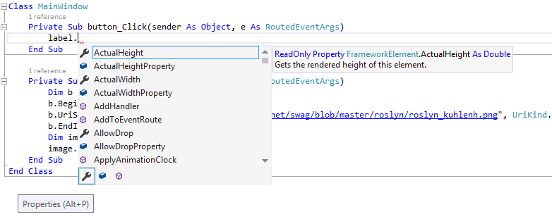
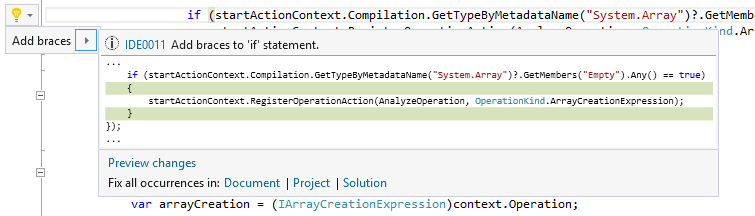
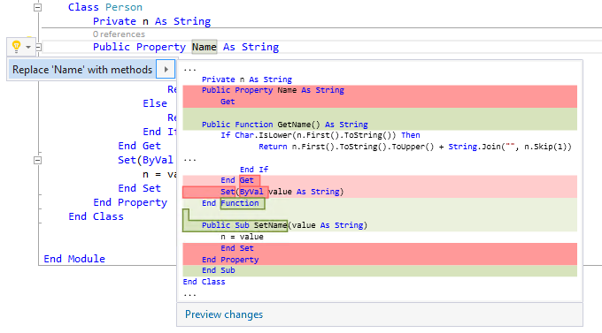
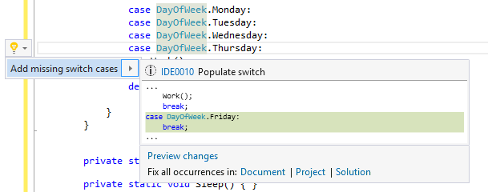

# Visual Studio ‘15' Preview 3 for C# and Visual Basic
One of our major focuses in Visual Studio ‘15' is improving developer productivity inside the editor. As we develop, we all perform series of actions over and over again--like writing methods, renaming variables, changing method signatures, implementing interfaces, etc. Our goal is to help automate or reduce these tasks to a single click so that you can focus on logic rather than syntax, references, style, and formatting. As such, you’ll notice each Visual Studio ‘15’ release is either enhancing existing experiences to save you a little more time and effort or is enabling you to build faster with additional refactorings and code generation.

[Download Visual Studio '15' Preview 3](https://go.microsoft.com/fwlink/?LinkId=746567) and read the [release notes](https://www.visualstudio.com/en-us/news/releasenotes/vs15-relnotes) for more information about what is in this release. 

## Unlock the Potential of C#7.0
One of the biggest productivity gains coming in Visual Studio ’15’ is from the C# language itself, with C#7.0 features now “on” by default:
- **Tuples** allow groups of values to be easily passed around. This is especially helpful when you want to return multiple values from a method without using `out` parameters. C#7.0 tuples may be used as keys in a Dictionary, for example, making it really easy to combine multiple values into a single key (_note_: the C#7.0 compiler generates efficient `Equals` and `GetHashCode` methods and, being value types, C#7.0 tuples are more memory efficient than `System.Tuple`, resulting in fewer allocations).
- **Pattern-matching** lets you declaratively test the shape and contents of a value while extracting data into variables. This makes for more expressive type tests and switch statements.
- **Local functions**, **ref returns**, **binary literals** and more.

```c#
using static System.Console;

static void Main(string[] args)
{
    object[] numbers = { 0b1, 0b10, 0b100, new object[] { 0b100, 0b1_0000 }, 0b10_0000 };
    var t = Tally(numbers);
    WriteLine($"Sum: {t.sum}, count: {t.count}");    
}
...
static (int sum, int count) Tally(object[] values)
{
    var r = (s: 0, c: 0);
    foreach (var v in values)
    {
        switch(v)
        {
            case int i:
                r = (r.s + i, r.c + 1);
                break;
            case object[] l:
                var n = Tally(l);
                r = (r.s + n.sum, r.c + n.count);
                break; 
        }   
    }
    return r;
}
```
Share your feedback on C#7.0 with us on our [GitHub](https://github.com/dotnet/roslyn/issues?q=is%3Aopen+is%3Aissue+label%3A%22Area-Language+Design%22) or tweet [@roslyn](https://twitter.com/roslyn), we’d love to hear what you think! 


## The Productivity of Visual Basic 15 (Coming in RC)
The next version of the Visual Basic language is also getting enhancements in Visual Studio '15'. We're hard at work finishing up the last of these at the moment and expect to have them in VS ‘15' RC. They will be ‘on' by default.
- **Tuples** are the most natural and readable way to express a function which returns more than one thing. That straightforwardness is truly in line with VBs design philosophy. Tuples also a great way to bundle up and pass around a bunch of values without all the ceremony of declaring a named structure or filling a hash-table.

```vb
Async Function CalculateMonthlyTotalsAsync() As Task(Of (total As Decimal, average As Decimal, count As Integer))
```

- **Binary literals** are another great new feature in the spirit of Visual Basic. Long have programmers had to mentally map decimal and hexadecimal numbers to their binary bit patterns. Soon you will be able to express this fundamental concept of computer programming—binary—natively in VB. To support this, we’re also adding the ability to put underscores as digit group separators in the middle of numeric literals. These characters are purely cosmetic but make reading binary and other large literals much easier.

```vb
<Flags>
 Enum MouseEventFlags
    MOUSEEVENTF_ABSOLUTE   = &B0000_1_0000_000000_0
    MOUSEEVENTF_LEFTDOWN   = &B0000_0_0000_000001_0
    MOUSEEVENTF_LEFTUP     = &B0000_0_0000_000010_0
    MOUSEEVENTF_RIGHTDOWN  = &B0000_0_0000_000100_0
    MOUSEEVENTF_RIGHTUP    = &B0000_0_0000_001000_0
    MOUSEEVENTF_MIDDLEDOWN = &B0000_0_0000_010000_0
    MOUSEEVENTF_MIDDLEUP   = &B0000_0_0000_100000_0
 End Enum
```
Join the discussion on Visual Basic 15 language design in [this issue](https://github.com/dotnet/roslyn/issues/11370) or [this issue](https://blogs.msdn.microsoft.com/dotnet/2016/05/31/tuple-tuesday/) on the Roslyn repo, or tweet [@ThatVBGuy](https://twitter.com/ThatVBGuy).


## IntelliSense Improvements
In Preview 3, we've enhanced IntelliSense to make you more productive when working in a large solution or an unfamiliar codebase. This release we've added an icon tray to IntelliSense that allows you to filter your member list by type (e.g., methods, properties, classes, etc.). Each filter toggle has an associated keyboard shortcut which you can discover by hovering your cursor over the icon.



To enable this feature, go to *Tools > Options > Text Editor > [C# | Visual Basic] > IntelliSense* and check the options for highlighting and filtering.

## More Quick Actions and Refactorings
We added the following refactorings and code actions to assist your code writing process:
- **Add braces (C# only)**. Allows you to add braces to the body of an if-else statement. This lets you quickly convert a single line if-statement to multiline with a single click.

- **Convert property to method (C# and VB)**. Sometimes properties start to grow into functions that perform logic. This refactoring will let you transform these logic-heavy properties into methods.

- **Add missing switch/Select case (C# and VB)**. This action will figure out which cases you are missing in your switch/Select and add them for you.


To trigger a refactoring or code action, place your cursor in the expression and use the keyboard shortcut `Ctrl+.` or right-click and choose **Quick Actions and Refactorings**. 

Try out C#7.0 and other features in [Visual Studio '15' Preview 3](https://go.microsoft.com/fwlink/?LinkId=746567) today! As usual, share your thoughts and feedback with us by filing issues on our [Roslyn repo](https://github.com/dotnet/roslyn/issues).

Over 'n' out,
**Kasey Uhlenhuth**, Program Manager, **.NET Managed Languages**