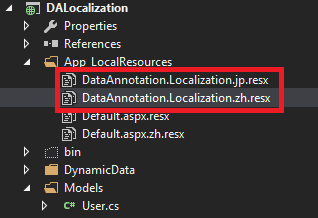

#Announcing .NET Framework 4.6.2
Today we are pleased to announce the availability of .NET Framework 4.6.2! The release is packed with lots of great improvements including those in the following areas:

* [Cryptography](#cryptography)
* [ClickOnce](#clickonce)
* [ASP.NET](#asp.net)
* [Productivity](#productivity)
* [SQL](#sql)
* [Windows Presentation Foundation](#windows-presentation-foundation)
* [Windows Communication Foundation](#windows-communication-foundation)

The full set of changes included in the .NET Framework 4.6.2 are available on the [change list](xxx) and [API diff](xxx) that have been published on [GitHub](https://github.com/microsoft/dotnet).

##Download Now
The release can be downloaded now from the following locations:

1. [.NET Framework 4.6.2 Web Installer](xxx)
2. [.NET Framework 4.6.2 Offline Installer](xxx)
2. [.NET Framework 4.6.2 Developer Pack](xxx)

##Provide Feedback
We would like to thank everyone who provided feedback on the 4.6.2 preview release! Your feedback was instrumental in making 4.6.2 an amazing release. Please continue to direct your feedback towards the following places:

* [Bugs – VS Feedback](https://connect.microsoft.com/VisualStudio/Feedback)
* [Suggestions – User Voice](https://visualstudio.uservoice.com/forums/121579-visual-studio-2015)

# Cryptography
## X509 Certificates Now Support FIPS 186-3 DSA

The .NET Framework 4.6.2 adds support for DSA (Digital Signature Algorithm) X509 certificates whose keys exceed the FIPS 186-2 limit of 1024-bit.

In addition to supporting the larger key sizes of FIPS 186-3, the .NET Framework 4.6.2 allows computing signatures with the SHA-2 family of hash algorithms (SHA256, SHA384, and SHA512). The FIPS 186-3 support is provided by the new [DSACng class](https://msdn.microsoft.com/en-us/library/system.security.cryptography.dsacng).

Keeping in line with recent changes to RSA (.NET Framework 4.6) and ECDsa (.NET Framework 4.6.1), the DSA abstract base class has additional methods to allow callers to make use of this functionality without casting.

<script src="https://gist.github.com/staceyhaffner/e214f78ff29adf165fb4.js"></script>

##Increased Clarity for Inputs to ECDiffieHellman Key Derivation Routines

.NET Framework version 3.5 added support for [Ellptic Curve Diffie-Hellman](https://msdn.microsoft.com/en-us/library/system.security.cryptography.ecdiffiehellman.aspx) Key Agreement that included three different KDF (Key Derivation Function) routines. The inputs to the routines, and the routine itself, were configured via properties on the ECDiffieHellmanCng object; but since not every routine read every input property there was ample room for confusion.

The ECDiffieHellman base class has been updated to more clearly represent these KDF routines and their inputs: 

<script src="https://gist.github.com/staceyhaffner/71710b339cca406629ad.js"></script>

## Support for Persisted-Key Symmetric Encryption

The Windows Cryptography Library (CNG) has support for storing persisted symmetric keys on software and hardware devices and the .NET Framework 4.6.2 has made it possible for users to make use of this feature. Since key names and key providers is implementation-specific, using this feature requires calling the constructor of the concrete implementation type instead of the more common factory approach (e.g. [Aes.Create()](https://msdn.microsoft.com/en-us/library/bb337875.aspx)).

Persisted-key symmetric encryption support exists for the AES ([AesCng](https://msdn.microsoft.com/en-us/library/system.security.cryptography.aescng.aspx)) and 3DES ([TripleDESCng](https://msdn.microsoft.com/en-us/library/system.security.cryptography.tripledescng.aspx)) algorithms.

<script src="https://gist.github.com/staceyhaffner/96ed50b66ea27cc14ac2.js"></script>

## SignedXml Support for SHA-2 Hashing

The .NET Framework 4.6.2 has added support to SignedXml which permits [RSA-SHA256](https://msdn.microsoft.com/en-us/library/system.security.cryptography.xml.signedxml.xmldsigrsasha256url.aspx), [RSA-SHA384](https://msdn.microsoft.com/en-us/library/system.security.cryptography.xml.signedxml.xmldsigrsasha384url.aspx), and [RSA-SHA512](https://msdn.microsoft.com/en-us/library/system.security.cryptography.xml.signedxml.xmldsigrsasha512url.aspx) PKCS#1 signature methods, and [SHA256](https://msdn.microsoft.com/en-us/library/system.security.cryptography.xml.signedxml.xmldsigsha256url.aspx), [SHA384](https://msdn.microsoft.com/en-us/library/system.security.cryptography.xml.signedxml.xmldsigsha384url.aspx), and [SHA512](https://msdn.microsoft.com/en-us/library/system.security.cryptography.xml.signedxml.xmldsigsha512url.aspx) reference digest algorithms.

The URI constants are all exposed on SignedXml:

<script src="https://gist.github.com/staceyhaffner/3137806c60dd3682ca59.js"></script>

Any programs which have registered a custom SignatureDescription handler into CryptoConfig to add support for these algorithms will continue to function as they did in the past, but since there are now platform defaults the CryptoConfig registration should no longer be necessary.

<script src="https://gist.github.com/staceyhaffner/8bd7376597d54f0c95be.js"></script>

#ClickOnce
##Transport Layer Security (TLS) 1.1 and 1.2 Support
ClickOnce has been updated to support TLS 1.1 and 1.2. ClickOnce will automatically detect which TLS protocol is required at runtime. There are no extra steps that are needed within the ClickOnce application to enable this.

ClickOnce continues to support TLS 1.0 for the foreseeable future for compatibility, for applications that do not or cannot upgrade.

##Client Certificate Support
ClickOnce applications can now be hosted in virtual directories with SSL enabled and with client certificates required. End users will now be prompted to select their certificate when accessing an application that is hosted via such virtual directory where as previously the ClickOnce deployment was terminated with an access denied error. Please note that ClickOnce will not prompt for a certificate if the setting is set to "Ignore".


#ASP.NET
##DataAnnotation Localization
The ASP.NET model binding feature makes it very easy to create and maintain data-rich web pages as it will automatically update the view model with the user input data from the databind control. Validation of the input is possible with the DataAnnotation ValidationAttribute, which can be added onto the properties of the view models to trigger a validation when ASP.NET updates the model. 

In .NET Framework 4.6.2, developers will be able to point to the localization string to be displayed during validation by including a single ErrorMessage in the attributes with a pointer to the name property of the correct line item in the localization resx file:

```csharp
public class ContactInfo
{
    [Required(ErrorMessage = "Your email address is invalid")]
    [Display(Name = "User Email")]
    public int Email { get; set; }
    
    [Required(ErrorMessage = "Your phone number is invalid")]
    [Display(Name = "User Phone")]
    public int Phone { get; set; }
}
```


Previously, developers would need to specify `ErrorMessageResourceType` and `ErrorMessageResourceName` values:

```csharp

public class User
{
    [Required(ErrorMessageResourceType = typeof(ModelResources),
    ErrorMessageResourceName = "FirstName_Required")]    
    [StringLength(50, ErrorMessageResourceType = typeof(ModelResources),
    ErrorMessageResourceName = "FirstName_StringLength")]
    public sstring FirstName { get; set; }
    
    [Required(ErrorMessageResourceType = typeof(ModelResources),
    ErrorMessageResourceName = "LastName_Required")]    
    [StringLength(50, ErrorMessageResourceType = typeof(ModelResources),
    ErrorMessageResourceName = "LastName_StringLength")]
    public sstring LastName { get; set; }
    

}

```

It is important to note that each localization resx file will need to be located in the *app_LocalResources* folder and follow the naming convention of DataAnnotation.Localization.{local}.resx.



Developers can also plug in their own stringlocalizer provider to store the localization string somewhere else other than resource file.

##Async Improvements
SessionStateModule and Output-Cache Module have been improved to enable async scenarios. The team is working on releasing async versions of both modules via NuGet, which will need to be imported into an existing project. Both NuGet packages are anticipated to release within the coming weeks. 
 
###SessionStateModule Interfaces
[Session State](https://msdn.microsoft.com/en-us/library/ms178581.aspx) leverages the [Provider Model](https://msdn.microsoft.com/en-us/library/aa479020.aspx) to enable the ability to store user session data in different sources, such as in memory within the ASP.NET worker process (InProcSessionStateStore), in memory in an external state server process (OutOfProcSessionStateStore) and in Microsoft SQL Server or Microsoft SQL Server Express databases (SqlSessionStateStore).

Developers will be able to take advantage of the scalability benefits of async into session state by replacing existing SessionStateModule with the custom session state module which implements the new interface named `ISessionStateModule`. Through the custom session state module, the developer will be able to plug in their async session state provider.

 ###Output-Cache Module
 
[Output Caching](http://www.asp.net/mvc/overview/older-versions-1/controllers-and-routing/improving-performance-with-output-caching-cs) can dramatically improve the performance of an ASP.NET application by caching the result returned from the controller action to avoid unnecessarily generating the same content every time. 

Developers will be able to use the Async APIs with Output Caching by implementing a new interface called `OutputCacheProviderAsync`. Doing so will reduce thread-blocking on a web server and improve scalability of an ASP.NET service. 

#Productivity
## NullReferenceException Improvements
New APIs have been added to enable the debugger to perform some additional analysis when a NullReferenceException occurs. The analysis will provide enough information to determine which reference is NULL. Previously, this was possible only at the granularity of source-lines, but the new APIs make it possible to analyze chains of differences in a single source line, providing more meaningful messages. We are partnering with the Visual Studio team to implement the new APIs to provide a better debugging experience in the future.

#SQL
## Always Encrypted Enhancements
[Always Encrypted](https://msdn.microsoft.com/en-us/library/mt163865.aspx) is a feature designed to protect sensitive data, such as credit card numbers or national identification numbers that are stored in a database. It allows clients to encrypt sensitive data inside client appliactions, never revealing the encryption keys to the Database Engine. As a result, Always Encrypted provides a separation between those who own the data (and can view it) and those who manage the data (but should have no access).

The .NET Framework Data Provider for SQL Server (System.Data.SqlClient) introduces two important enhancements for Always Encrypted around performance and security.

###Performance
To improve performance of parameterized queries against encrypted database columns, encryption metadata for query parameters is now cached. With the [SqlConnection::ColumnEncryptionQueryMetadataCacheEnabled](https://msdnstage.redmond.corp.microsoft.com/en-US/library/mt703754%28VS.110%29.aspx) Property set to true (which is the default value), if the same query is called multiple times, the client retrieves parameter metadata from the server only once.

###Security
To continue protecting sensitive data, the column encryption key entries in the key cache are now evicted after a configurable time interval. The time interval can be set using the  [SqlConnection::ColumnEncryptionKeyCacheTtl](https://msdnstage.redmond.corp.microsoft.com/en-US/library/mt703753%28VS.110%29.aspx) Property.

#Windows Communication Foundation
##NetNamedPipeBinding Best Match
In .NET 4.6.2, we have enhanced [NetNamedPipeBinding](https://msdn.microsoft.com/en-us/library/ms752247.aspx) to support a new pipe lookup, known as “Best Match”.  When using “Best Match”, the NetNamedPipeBinding service will force clients to search for the service listening at the best matching URI to their requested endpoint, rather than the first matching service found. 

The “Best Match” pipe is particularly useful if a WCF client app is connected to the wrong URI when using the default “First Match” behavior. In certain situations when there are more than one pipe that WCF services are listening to, WCF clients using "First Match" could be connected to a wrong service. This could happen if some of the services are hosted by an administrator account. 

To enable this feature, developers can add the following AppSetting to their client application's App.config or Web.config file:

```csharp
<configuration>
  <appSettings>
    <add key="wcf:useBestMatchNamedPipeUri" value="true" />
  </appSettings>
</configuration>
 ```

##DataContractJsonSerializer Improvements
The [DataContractJsonSerializer](https://msdn.microsoft.com/en-us/library/bb412179.aspx) has been improved to better support multiple daylight saving time adjustment rules. When turning on the new setting, DataContractJsonSerializer will use the [TimeZoneInfo](https://msdn.microsoft.com/en-us/library/system.timezoneinfo.aspx) class instead of the[TimeZone](https://msdn.microsoft.com/en-us/library/system.timezone) class. The TimeZoneInfo class supports the multiple adjustment rule, which makes it possible to work with historic time zone data. This is useful when a time zone has different daylight saving time adjustment rules, such as (UTC+2) Istanbul. 

In .NET Framework 4.6.2, developers can toggle this feature on by adding the following AppSetting to the app.config file:

 ```csharp
 <runtime>
    <AppContextSwitchOverrides value="Switch.System.Runtime.Serialization.DoNotUseTimeZoneInfo=false" /> 
</runtime>
 ```

## TransportDefaults No Longer Supports SSL 3
The SSL 3 protocol is no longer a default protocol used for negotiating a secure connection when using NetTcp with transport security and a credential type of certificate. This is due to it being an insecure protocol. In most cases there should be no impact to existing apps as TLS 1.0 has always been included in the default protocol list for NetTcp. All existing clients should be able to negotiate a connection using at least TLS 1.0.
 
While not recommended, in the event that SSL 3 is required, one of the following configuration mechanisms can be used to add it back to the list of negotiated protocols:

* [SslStreamSecurityBindingElement.SslProtocols Property](https://msdn.microsoft.com/en-us/library/system.servicemodel.channels.sslstreamsecuritybindingelement.sslprotocols%28v=vs.110%29.aspx)
* [TcpTransportSecurity.SslProtocols Property](https://msdn.microsoft.com/en-us/library/system.servicemodel.tcptransportsecurity.sslprotocols%28v=vs.110%29.aspx)
* [`<transport>` section of `<netTcpBinding>`](https://msdn.microsoft.com/en-us/library/ms731331%28v=vs.110%29.aspx)
* [`<sslStreamSecurity>` section of `<customBinding>`](https://msdn.microsoft.com/en-us/library/ms731328%28v=vs.110%29.aspx)
 
##  Transport Security for Windows Cryptography Library (CNG) 

[Transport Security](https://msdn.microsoft.com/en-us/library/ms733043.aspx) using certificate now supports certificates stored using the Windows cryptography library (CNG). Currently, this support is limited to using certificates with a public key which has an exponent no more than 32bits in length. When an application targets .NET 4.6.2, this feature is on by default. For applications targeting .NET Framework 4.6.1 or earlier and running on .NET V4.6.2, this feature can be enabled by adding the following line to the <runtime> section of the app.config or web.config file:

```csharp
<runtime>
    <AppContextSwitchOverrides value="Switch.System.ServiceModel.DisableCngCertificates=false" />
</runtime>
```

Enabling the functionality can also be done programmatically: 

```csharp
private const string DisableCngCertificates = @"Switch.System.ServiceModel.DisableCngCertificates";
AppContext.SetSwitch(DisableCngCertificates, false);  
```

## OperationContext.Current Async Improvements
WCF now has the ability to include [OperationContext.Current](https://msdn.microsoft.com/en-us/library/system.servicemodel.operationcontext.current.aspx) with [ExecutionContext](https://msdn.microsoft.com/en-us/library/system.threading.executioncontext.aspx) so that it flows through asynchronous continuations. With this fix, WCF allows CurrentContext to propagate from one thread to another thread. This means that even if there's a context switch between calls to OperationContext.Current, it's value will flow correctly throughout the execution of the method.

The following is an example of the CurrentThread changing between an async operation with the OperationContext.Current still flowing correctly:

```csharp
public async Task InvokeCallbackWithDelay(int delay)
{
    int threadId1 = Thread.CurrentThread.ManagedThreadId;
    OperationContext.Current.GetCallbackChannel<IServiceCallback>().TheCallback("One");
    await Task.Delay(delay);
    int threadId2 = Thread.CurrentThread.ManagedThreadId;
    OperationContext.Current.GetCallbackChannel<IServiceCallback>().TheCallback("Two");
}
```

Previously, the internal implementation of OperationContext.Current was to store the CurrentContext using a ThreadStatic variable, which used the thread's local storage to store the data associated with CurrentContext. If there was a change in the execution context of the method call (i.e. a thread change caused by awaiting another operation), any subsequent calls would be operating on a different thread without a reference to the original value. With the fix, the second call to OperationContext.Current will deliver the expected value even though threadId1 and threadId2 may be different.

#Windows Presentation Foundation
##Group Sorting
An application that requests [CollectionView](https://msdn.microsoft.com/en-us/library/system.windows.data.collectionview.aspx) to group data can now explicitly declare how to sort the groups. This overcomes some unintuitive ordering that can arise when the application dynamically adds or removes groups, or when the application changes the value of item properties involved in grouping.  It can also improve the performance of the group creation process, by moving comparisons of the grouping properties from the sort of the full collection to the sort of the groups.
 
The feature includes two new properties on the [GroupDescription](https://msdn.microsoft.com/en-us/library/system.componentmodel.groupdescription.aspx) class: `SortDescriptions` and `CustomSort`. These describe how to sort the collection of groups produced by the `GroupDescription`, analogous to the way the properties on `ListCollectionView` with the same names describe how to sort the data items. There are also two new static properties on the `PropertyGroupDescription` class for use in the most common cases: `CompareNameAscending` and `CompareNameDescending`.
 
For example, suppose an application wants to group data by Age, sorting the groups in ascending order and the items within each group by LastName.

Prior to this feature, the application would declare:
 
```csharp
<GroupDescriptions>
   <PropertyGroupDescription PropertyName=”Age”/>
</GroupDescriptions>
 
<SortDescriptions>
   <SortDescription PropertyName=”Age”/>
   <SortDescription PropertyName=”LastName”/>
</SortDescriptions>
```

With this new feature the application can now declare:

```csharp
<GroupDescriptions>
   <PropertyGroupDescription
      PropertyName=”Age”
      CustomSort=
           ”{x:Static PropertyGroupDescription.CompareNamesAscending}”/>
   </PropertyGroupDescription>
</GroupDescriptions>
 
<SortDescriptions>
   <SortDescription PropertyName=”LastName”/>
</SortDescriptions>
```

##  Per-Monitor DPI Support
WPF applications are [system-DPI aware](https://msdn.microsoft.com/en-us/library/windows/desktop/dn280512%28v=vs.85%29.aspx), which means that applications are scaled by Windows depending on the DPI of the monitor on which the application is being rendered. This can result in loss of sharpness, blurry text etc. Prior to 4.6.2, [additional native code](https://msdn.microsoft.com/en-us/library/windows/desktop/ee308410%28v=vs.85%29.aspx) was required to enable per-monitor DPI awareness in WPF applications.

Given the recent proliferation of high-DPI and hybrid-DPI environments in the ecosystem, we have now enabled per-monitor DPI awareness in WPF applications. See the [samples and developer guide](https://github.com/Microsoft/WPF-Samples/tree/master/PerMonitorDPI) for more information about how to enable your WPF application to become per-monitor DPI aware. 

## Soft Keyboard Support
Soft Keyboard support enables automatic invocation and dismissal of the touch keyboard in WPF applications without disabling WPF stylus/touch support on Windows 10. Prior to 4.6.2, WPF applications did not implicitly support the invocation or dismissal of the touch keyboard without disabling WPF stylus/touch support.  This is due to a change in the way the touch keyboard tracks focus in applications starting in Windows 8.


