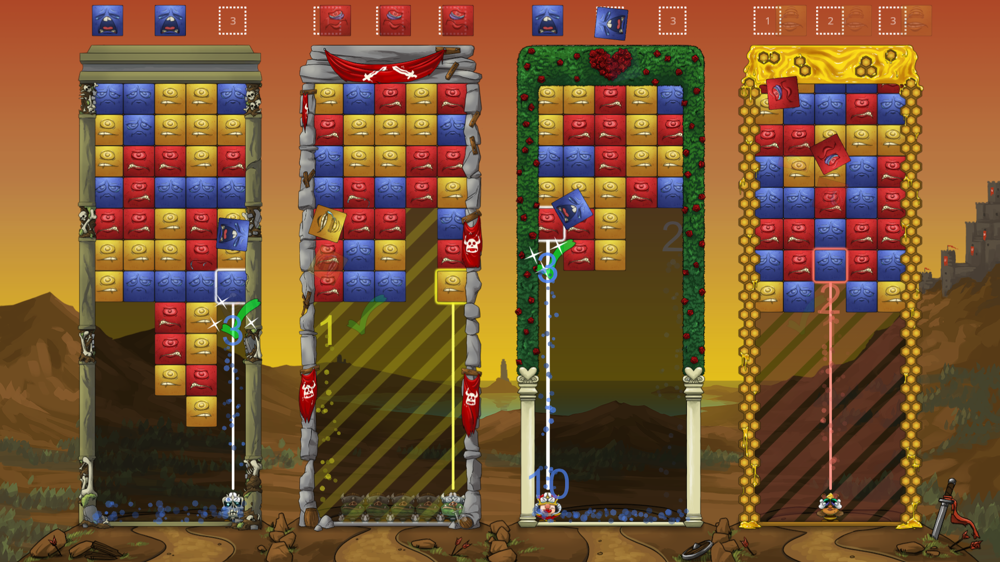

The week in .NET - 7/19/2016
============================

To read the last post, see [The week in .NET – 7/12/2016](https://blogs.msdn.microsoft.com/dotnet/2016/07/12/the-week-in-net-7122016/).

On .NET
-------
Last weeks show was postponed and will be rescheduled at a later date. This week, we will have Rowan Miller on [the show](https://www.youtube.com/channel/UCvtT19MZW8dq5Wwfu6B0oxw/) to talk about EF Core.


Package of the week: ImageResizer
----------------------------------
[ImageResizer](http://imageresizing.net/) is an IIS/ASP.NET lightweight HTTPModule, REST API and managed API that is used for safe and highly-optimized server-side image processing.

Below is an example on how to convert and resize images as they are being uploaded:

```csharp
 //Loop through each uploaded file
  foreach (string fileKey in HttpContext.Current.Request.Files.Keys) 
  {
    HttpPostedFile file = HttpContext.Current.Request.Files[fileKey];
    if (file.ContentLength <= 0) continue; //Skip unused file controls.

    //The resizing settings can specify any of 30 commands.
    //Destination paths can have variables like <guid> and <ext>, or 
    //even a santizied version of the original filename, like <filename:A-Za-z0-9>
    ImageResizer.ImageJob i = new ImageResizer.ImageJob(file, "~/uploads/<guid>.<ext>", new ImageResizer.ResizeSettings( 
                "width=2000;height=2000;format=jpg;mode=max"));
    i.CreateParentDirectory = true; //Auto-create the uploads directory.
    i.Build();
  }  
```

Game of the week: Tumblestone
-----------------------------------
[Tumblestone](http://www.tumblestonegame.com/) is a fast paced action-puzzle game where players can battle their friends in multiplayer or spruce up their skills in the story or arcade modes. Tumblestones story campaign features over 40 hours of progressively difficult content with 10 different game play modifiers, challenging puzzles and boss battles. In arcade mode, players can kick back and relax with the casual Marathon mode, solve challenging puzzles with Infinipuzzel mode or play the fast-paced Heartbat mode.

 

Tumblestone was created by [The Quantum Astrophysicists Guild](http://quantumastrophysics.com/) using [Unity](http://unity3d.com/), JavaScript and [C#](https://channel9.msdn.com/Series/C-Sharp-Fundamentals-Development-for-Absolute-Beginners). It is currently available on Steam for Windows and Mac, Xbox One, Wii U and PlayStation 4.

User group meeting of the week: C# 6 and C# 7 with Kathleen Dollard
------------------------------------------------
On Tuesday, July 19 at 5:45 PM, the Boulder .NET User Group is hosting a [meeting](http://www.meetup.com/Boulder-NET-User-Group/events/232553722/) where you’ll hear about C# 6 and C# 7.

.NET
----

* [.NET Core Roadmap](https://blogs.msdn.microsoft.com/dotnet/2016/07/15/net-core-roadmap/), by Scott Hunter.
* [Visual Studio ‘15’ Preview 3 for C# and Visual Basic](https://blogs.msdn.microsoft.com/dotnet/2016/07/13/visual-studio-15-preview-3-for-c-and-visual-basic/), by Kasey Uhlenhuth.
* [Exploring dotnet new with .NET Core](http://www.hanselman.com/blog/ExploringDotnetNewWithNETCore.aspx), by Scott Hanselman.
* [Build, publish and release DotNet Core 1.0.0 apps on Azure Websites with VSTS](http://www.clemensreijnen.nl/post/2016/07/12/Build-publish-and-release-DotNet-Core-100-apps-on-Azure-Websites-with-VSTS), by Clemens Reijnen.
* [Introducing "Force Feedback Programming"](https://robinsedlaczek.com/2016/06/23/introducing-force-feedback-programming/), by Robin Sedlaczek

ASP.NET
-------
* [Creating your own OpenID Connect server with ASOS: introduction](http://kevinchalet.com/2016/07/13/creating-your-own-openid-connect-server-with-asos-introduction/), by Kévin Chalet.
* [Step by step: .NET Core, Azure Service Bus and AMQP](https://carlos.mendible.com/2016/07/17/step-by-step-net-core-azure-service-bus-and-amqp/), by Carlos Mendible.
* [Adding EF Core and PostgreSQL to an ASP.NET Core project on OS X](http://andrewlock.net/adding-ef-core-to-a-project-on-os-x/), by Andrew Lock.
* [Formatters And Content Negotiation In ASP.NET Web API 2](http://www.c-sharpcorner.com/article/formatters-and-content-negotiation-in-asp-net-web-api-2/), by Akhil Mittal.
* [Securing ASP.NET Web API](http://code.tutsplus.com/tutorials/securing-aspnet-web-api--cms-26012), by Sovit Poudel.
* [No ConfigurationManager in ASP.NET Core](http://www.danylkoweb.com//Blog/no-configurationmanager-in-aspnet-core-GC), by Jonathan Danylko.
* [Working with user secrets in ASP.​NET Core applications](http://asp.net-hacker.rocks/2016/07/11/user-secrets-in-aspnetcore.html), by Jürgen Gutsch.


F#
--
* [F# Docker Image](https://hub.docker.com/_/fsharp/)
* [The Elm Architecture using Fable](http://fsprojects.github.io/Fable/samples/virtualdom/index.html), by Tomas Jansson
* [Why F#](http://www.codemag.com/Article/1605061), by Rachel Reese.
* [TDD Studio](https://github.com/parthopdas/tddstud10), an Open Source alternative to nCrunch, written with F#
​

Check out [F# Weekly](https://sergeytihon.wordpress.com/category/f-weekly/) for more great content from the F# community.

Xamarin
-------

* [Create native iOS and Android apps with Visual Studio and Xamarin](https://info.microsoft.com/CO-BRDEV-WBNR-FY16-06Jun-22-iOS-Android-Apps-Registration.html), by James Montemagno.
* [Xamarin Forms Architectural Guidance](https://xamarinhelp.com/xamarin-forms-architectural-guidance/), by Adam Pedley.
* [Xamarin Forms Navigation Awareness](https://peterfoot.net/2016/07/12/xamarin-forms-navigation-awareness), by Peter Freeman Foot.
* [Introducing Realm Xamarin](https://realm.io/news/introducing-realm-xamarin/)

Games
-----

* [Visual Studio Tools for Unity 2.3](https://blogs.msdn.microsoft.com/visualstudio/2016/07/14/visual-studio-tools-for-unity-2-3/), by Jb Evain.
* [Unity and C# Tutorial - Lesson One [Video]](https://www.youtube.com/watch?v=lClwgUtx0A4), by Craig Hinrichs.
* [0.0 Unity Tower Defense Tutorial - Introduction [Video]](https://www.youtube.com/watch?v=PgDpRMMyxw8), by inScope Studios.
* [Difference Between Update and FixedUpdate](http://www.unitygeek.com/difference-between-update-fixedupdate/), by Unity Geek.


And this is it for this week!

Contribute to the week in .NET
------------------------------

As always, this weekly post couldn't exist without community contributions, and I'd like to thank all those who sent links and tips.

You can participate too. Did you write a great blog post, or just read one? Do you want everyone to know about an amazing new contribution or a useful library? Did you make or play a great game built on .NET?
We'd love to hear from you, and feature your contributions on future posts:

* Send an email to beleroy at Microsoft,
* [comment on this gist](https://gist.github.com/staceyhaffner/43a6896301941f26cf50ed1c37dd5951)
* Leave us a pointer in the comments section below.
* [Send Stacey (@yecats131) tips on Twitter about .NET games](https://twitter.com/yecats131).

This week's post (and future posts) also contains news I first read on [The ASP.NET Community Standup](https://blogs.msdn.microsoft.com/webdev/tag/communitystandup/), on [Weekly Xamarin](http://weeklyxamarin.com/), on [F# weekly](https://sergeytihon.wordpress.com/category/f-weekly/), on [ASP.NET Weekly](http://www.aspnetweekly.com/), and on [Chris Alcock's The Morning Brew](http://themorningbrew.net/).
