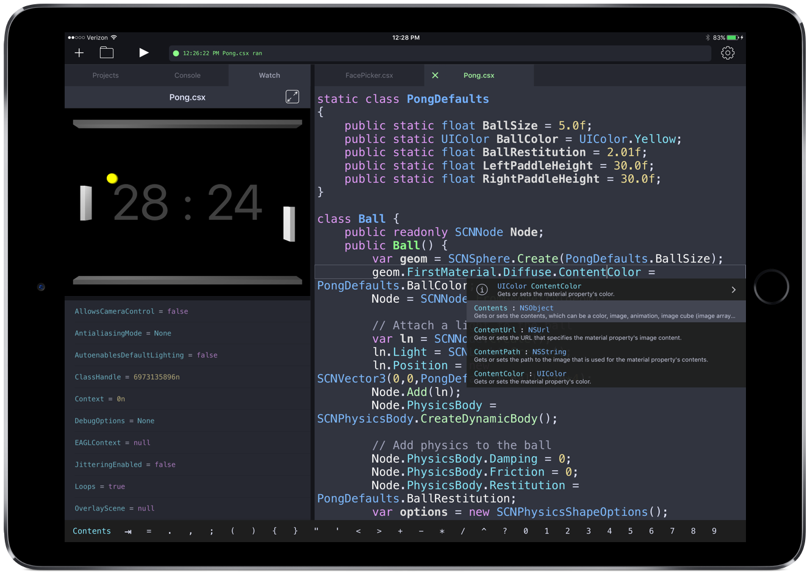

The week in .NET - 7/26/2016
============================

To read last week's post, see [The week in .NET – 7/19/2016](https://blogs.msdn.microsoft.com/dotnet/2016/07/19/the-week-in-net-7192016/).

On .NET
-------
Last week, we had Rowan Miller on the show to talk about Entity Framework.

<iframe width="560" height="315" src="https://www.youtube.com/embed/8Sp7UMzJQD4" frameborder="0" allowfullscreen></iframe>

This week's show has been canceled and is anticipated to return next week.


Package of the week: OpenPop.NET
----------------------------------
[OpenPop.NET](https://www.nuget.org/packages/OpenPop.NET/) is an open source implementation of a POP3 client and a robust MIME parser written in C#. It gives developers access to email on a POP3 server in a matter of minutes. 

The following is an example on how to download all email from a server:


```csharp
public static List<Message> FetchAllMessages(string hostname, int port, bool useSsl, string username, string password)
{
    // The client disconnects from the server when being disposed
    using(Pop3Client client = new Pop3Client())
    {
        // Connect to the server
        client.Connect(hostname, port, useSsl);

        // Authenticate ourselves towards the server
        client.Authenticate(username, password);

        // Get the number of messages in the inbox
        int messageCount = client.GetMessageCount();

        // We want to download all messages
        List<Message> allMessages = new List<Message>(messageCount);

        // Messages are numbered in the interval: [1, messageCount]
        // Ergo: message numbers are 1-based.
        // Most servers give the latest message the highest number
        for (int i = messageCount; i > 0; i--)
        {
            allMessages.Add(client.GetMessage(i));
        }

        // Now return the fetched messages
        return allMessages;
    }
}
```

Xamarin App of the week: Continuous .NET C# and F# IDE
-----------------------------------
Build C# and F# applications on your iPad with [Continuous .NET C# and F# IDE](http://continuous.codes/)! Continuous has many amazing features such as code completion, full syntax highlighting and an interactive output window that lets you see changes to your application as you make them.



Game of the week: FRU
-----------------------------------
[FRU](http://frugame.com/) is a highly innovative puzzle platformer built for Xbox One. In FRU, players use the Kinect to project their silhouette to solve puzzles within the game world. Players will enjoy four chapters, each with a unique twist, while they use their silhouette to strike creative poses to activate or avoid various components within the environment.


FRU was created by Through Games using [Unity](http://unity3d.com/) and [C#](https://channel9.msdn.com/Series/C-Sharp-Fundamentals-Development-for-Absolute-Beginners). It is currently available on Xbox One.

User group meeting of the week: Xamarin Dev Days
------------------------------------------------
On Saturday, July 30 at 9:00 AM, the Seattle Mobile .NET Developers group is hosting a [Xamarin Dev Day](http://www.meetup.com/SeattleMobileDevelopers/events/232666539/), which provides attendees with an intense, hands-on learning experience for the day.


.NET
----

* [[.NET Foundation] New Community Director, Rachel Reese](http://www.dotnetfoundation.org/blog/welcome-rachel)
* [Developer Productivity in VS 2015 and VS 15 - [Video]](https://channel9.msdn.com/Shows/Visual-Studio-Toolbox/Developer-Productivity-in-VS-2015-and-VS-15) by Kasey Uhlenhuth.
* [The Power of Global.json: Leveraging .NET Core Tooling Features](https://ievangelist.github.io/blog/the-global-json/), by David Pine.
* [Using C# to Create PowerShell Cmdlets: Beyond the Basics](https://www.simple-talk.com/dotnet/development/using-c-to-create-powershell-cmdlets-beyond-the-basics/), by Michael Sorens.
* [.NET backward compatibility – Part 4](http://www.codeproject.com/Articles/1114286/NET-backward-compatibility-Part), by Bastian Eicher.
* [TPL: Producer Consumer Pattern - Thread Safe Queue Collection](http://www.codeproject.com/Articles/1112510/TPL-Producer-Consumer-Pattern-Thread-Safe-Queue-Co), by Ameet Parse.
* [Freezable Pattern](https://github.com/jbe2277/waf/wiki/Freezable-Pattern)
* [Reducing allocations and resource usages when using Task.Delay](https://ayende.com/blog/174851/reducing-allocations-and-resource-usages-when-using-task-delay), by Ayende.
*[Key Steps in Developing .NET Core Applications](https://blogs.msdn.microsoft.com/mvpawardprogram/2016/07/19/key-steps-in-developing-net-core-applications/), by Damir Dobric.

ASP.NET
-------

* [Status Code With Empty Response in ASP.NET Core](https://devblog.dymel.pl/2016/06/29/asp-net-core-status-code-empty-response/), by  Michal.
* [Return 401 Unauthorized From ASP.NET Core API](https://devblog.dymel.pl/2016/07/07/return-401-unauthorized-from-asp-net-core-api/), by Michal.
* [The Power of Global.json: Leveraging .NET Core Tooling Features](https://ievangelist.github.io/blog/the-global-json/), by David Pine.
* [Loading tenants from the database with SaasKit in ASP.NET Core](http://andrewlock.net/loading-tenants-from-the-database-with-saaskit-in-asp-net-core/), by Andrew Lock.
* [Service Discovery Patterns with ASP.NET Core](https://github.com/cecilphillip/aspnet-servicediscovery-patterns), by Cecil Phillip.
* [The Minimal ASPNET Core App](http://ardalis.com/the-minimal-aspnet-core-app), by Steve Smith.
* [Understanding ASP.NET Core Initialization](http://developer.telerik.com/featured/understanding-asp-net-core-initialization/), by Ed Charbeneau.
* [Build, ship and run ASP.NET Core on Microsoft Azure using Docker Cloud](http://laurentkempe.com/2016/07/18/Build-ship-and-run-ASP-NET-Core-on-Microsoft-Azure-using-Docker-Cloud/), by Laurent Kempé.


F#
--

* [F# on .NET Core 1.0 RTM SDK Preview 2](https://www.youtube.com/watch?v=ufmlCL8IqmM), presented by Enrico Sada
* [F#: Fixing Recursive-Induced Damage](https://bizmonger.wordpress.com/2016/07/23/f-fixing-recursive-induced-damage/), by Scott Nimrod
* [Currying and Partial Application in F#](http://blog.guvweb.co.uk/2016/07/23/currying_in_fsharp/), by GuvBlog
* [Building a Poker Bot: Function Fold as a Decision Tree](http://mikhail.io/2016/07/building-a-poker-bot-functional-fold-as-decision-tree-pattern/), by Mikhail Shilkov

Check out [F# Weekly](https://sergeytihon.wordpress.com/category/f-weekly/) for more great content from the F# community.

Xamarin
-------

* [New Xamarin Dev Days Cities Announced!](https://blog.xamarin.com/new-xamarin-dev-days-cities-announced/), by Jayme Singleton.
* [Introducing Stack Overflow Documentation](https://blog.xamarin.com/introducing-stack-overflow-documentation/), by Craig Dunn.
* [Explore iOS 10, tvOS 10, watchOS 3, and macOS Sierra Previews Today](https://blog.xamarin.com/explore-ios-10-tvos-10-and-watchos-3-previews-today), by Miguel de Icaza.
* [Effects with XAML](http://jesseliberty.com/2016/07/18/effects-with-xaml), by Jesse Liberty.
* [Build C# and F# Apps on Your iPad with Continuous Mobile Development Environment](https://blog.xamarin.com/build-c-f-apps-on-your-ipad-with-continuous), by James Montemagno.
* [Xamarin Forms – View Model First Navigation](https://codemilltech.com/xamarin-forms-view-model-first-navigation)

Games
-----

* [SadConsole - Version 3 Release](http://thraka.github.io/2016/07/13/version-3-release/), by Andy De George.
* [Shaders Case Study - Stealth Games' XRay Vision - [Video]](https://www.youtube.com/watch?v=OJkGGuudm38), by Makin' Stuff Look Good.
* [Hex Map 1: Creating a Hexagonal Grid](http://catlikecoding.com/unity/tutorials/hex-map-1/), by Catlike Coding.
* [1.0 Unity Tower defense tutorial - Placing tiles - [Video]](https://www.youtube.com/watch?v=wS2LBCcnSQs), by inScope Studios.
* [Unity and C# Tutorial - Lesson Two - Statements - [Video]](https://www.youtube.com/watch?v=Aic0ae1eFZY), by Craig Hinrichs.
* [C# Monogame RPG Made Easy Tutorial 1 - Introduction - [Video]](https://www.youtube.com/watch?v=agt9-J9RPZ0), by CodingMadeEasy
* [Dynamically Resizing Colliders to Match Sprites in Unity](http://www.improxgames.com/blog/2016/7/1/tutorial-dynamically-resizing-colliders-to-match-sprites), by Improx Games


And this is it for this week!

Contribute to the week in .NET
------------------------------

As always, this weekly post couldn't exist without community contributions, and I'd like to thank all those who sent links and tips.

You can participate too. Did you write a great blog post, or just read one? Do you want everyone to know about an amazing new contribution or a useful library? Did you make or play a great game built on .NET?
We'd love to hear from you, and feature your contributions on future posts:

* Send an email to beleroy at Microsoft,
* [comment on this gist](https://gist.github.com/staceyhaffner/0c725dbee8b517f4b9cd0ca5bc37841b)
* Leave us a pointer in the comments section below.
* [Send Stacey (@yecats131) tips on Twitter about .NET games](https://twitter.com/yecats131).

This week's post (and future posts) also contains news I first read on [The ASP.NET Community Standup](https://blogs.msdn.microsoft.com/webdev/tag/communitystandup/), on [Weekly Xamarin](http://weeklyxamarin.com/), on [F# weekly](https://sergeytihon.wordpress.com/category/f-weekly/), on [ASP.NET Weekly](http://www.aspnetweekly.com/), and on [Chris Alcock's The Morning Brew](http://themorningbrew.net/).
