Storing secrets for use in an Azure application
===============================================

Most applications need access to secret information in order to function: it could be an API key, database credentials, or something else. There are or course many different places where people store such secrets. From worst to best, one could think of the following: in your source code repository on GitHub (of course, nobody should ever do that), in config files, in environment variables, or in specialized secret vaults.

Which one you choose depends on the level of security your application requires. Oftentimes, storing an API key in an environment variable will be adequate (what is never adequate is hard-coded values in code or config files checked into source control). If you require a higher level of security, however, you'll need a specialized vault such as Azure Key Vault. 

Azure Key Vault's unique responsibility is to store your secrets securely. Once stored, your secrets can only be accessed by applications you authorize, and only on an encrypted channel. Each secret can be managed in a single secure place, while multiple applications can use it. 

In this post, we'll create a simple service that will compare the temperatures in Seattle and Paris using the [OpenWeatherMap API](http://openweathermap.org/api), for which we'll need a secret API key. I'll walk you through the usage of [Azure's Key Vault](https://azure.microsoft.com/en-us/services/key-vault/) for storing the key, then I'll show how to retrieve and use it in a simple [Azure function](https://azure.microsoft.com/en-us/documentation/articles/functions-reference-csharp/).

Prerequisites
-------------

In order to be able to follow along, you'll need an [Azure subscription](https://azure.microsoft.com/pricing/free-trial/).

Setting up Key Vault
-------------------

First, we're going to set-up Key Vault. There are quite a few steps involved, but only steps 6-8 have to be repeated for new secrets, the others being the one-time building of the vault.

1. Open the [Azure portal](https://portal.azure.com) and click on "Resource groups". Choose an existing group, or create a new one. For this tutorial, we'll create a new one called "sample-weather-group". After clicking the "Create" button, you may have to wait a few seconds and refresh the list of resource groups.

   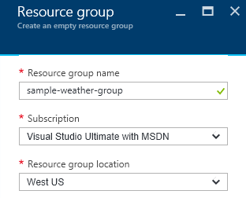

2. Select the newly created group, then click the "Add" button over its property page. Enter "Key Vault" in the search box, and select the Key Vault service, then click "Create".

   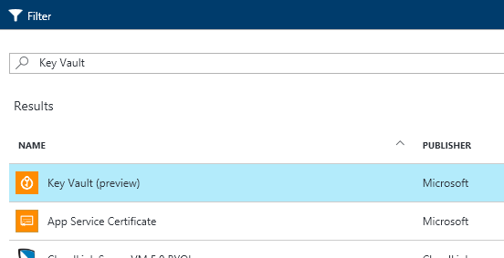

3. Enter "sample-weather-vault" as the name of the new vault. Select the right subscription and location, and leave the "sample-weather-group" resource group selected. Click "Create".

   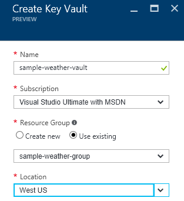

4. If you refresh the resource group property page, you'll see the new vault appear. We're now ready to add a key to it. Get an API key from [OpenWeatherMaps](http://openweathermap.org/api). Select the vault in the list of resources under the resource group, then select "Secrets". You can now click "Add" to add a new secret. Under "Upload options", select "Manual". Enter "open-weather-map-key" as the name of the secret, and paste the API key from OpenWeatherMaps into the value field. Click "Create".

   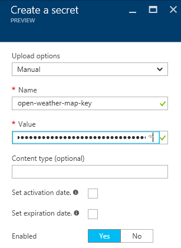

5. We will later need the URL for the secret we just created. This can be found under "Secret Identifier" on the property page of the current version of the secret, which can be reached by navigating to "Secrets" under the key vault, then clicking the secret, and then its latest version.

   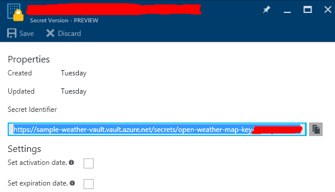

Preparing Active Directory authentication
-----------------------------------------

Of course, the application will need to securely connect to the vault, for which it will have to use some form of master secret.
This is similar to the master password that a password vault uses.
We'll use Active Directory for this.

1. To access Active Directory, in [the Azure portal](https://portal.azure.com), select "More Services" and choose "Azure Active Directory". In the next menu that will appear, click "App registrations". Click the "Add" button above the list of applications. You'll be asked for a name for the application. We'll choose "sample-weather-ad". For the application type, leave the default "Web app / API" selected., and leave the "Web application and/or Web API" type checked. We also have to provide a sign-on URL. For our purposes, this doesn't need to actually exist, but only to be unique. Click the "Create" button.

   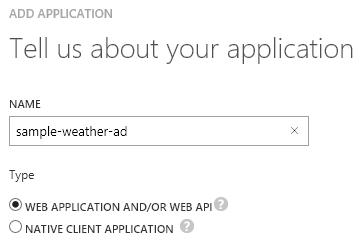

2. Now that the application has been created, select it in the application list, so that you can see your application's application ID. You'll need that and a key.

   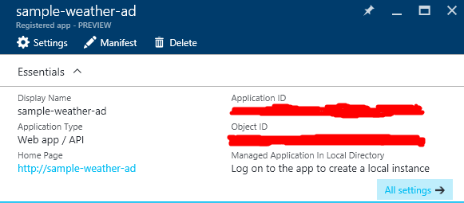

3. Click on "All settings", then select "Keys". We can add a new key by entering a description, selecting a duration, and hitting the "Save" button. If you do choose to have the key expire, you should also take the time to create a reminder on the schedule of the team in charge of managing this application.

   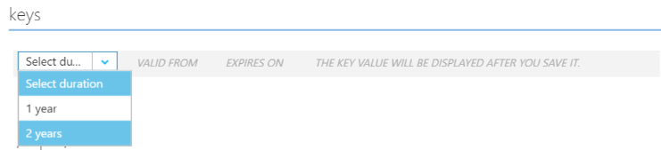

   Note that using a different key and id for each application that will use the secrets makes it possible to revoke access to the whole vault for a specific application in one operation.

4. Once you've saved, the key can be viewed and copied to a safe place. Do it now, because this is the last time the Azure portal is going to show it.

   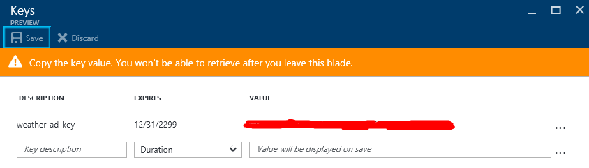

5. We'll also need the URL of the Active Directory end point. This is not the URL that we manually entered above when we created the AD application. It can be obtained by clicking the "Endpoints" button above the list of applications.

   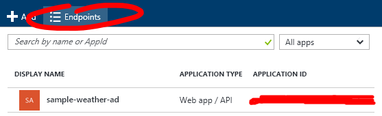

   The URL we want to copy for later use is the one under "OAuth 2.0 Token Endpoint".

6.  

7.
   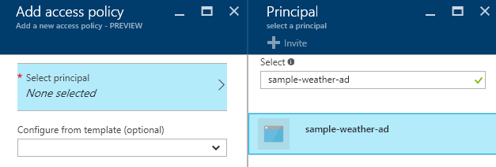
   select and ok. Don't forget to hit "Save"on top of the list of access policies.


7. We're now ready to authorize the application to access the vault and get values out of it. Navigate back to the key vault's property page, and select the vault we created earlier, then "Access policies". Click "Add new", then "Select principal". In the list, you should see "xxx". Select it, then click the "Select" button. Then click on "Secret permissions" and check "Get", then click "OK".

   ![Adding permissions for AD]

Creating the Azure function
---------------------------

We're going to use Azure Functions to implement the actual service, because it's the easiest way to write code on Azure, but roughly the same steps would apply to any other kind of application.

1. From the resource group's property page, click "Add", and type "Function App" in the filter box. Select "Function App", the click "Create". Name your new function app "sample-weather". Select the relevant subscription, resource group, plan and location.

   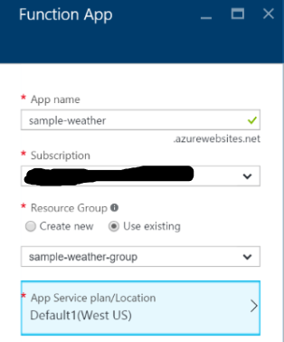

2. Refresh the resource group's property page, then select the new "sample-weather" app service. Create a new function under the function app. Name it "ParisSeattleWeatherComparison" and choose the empty C# template:

   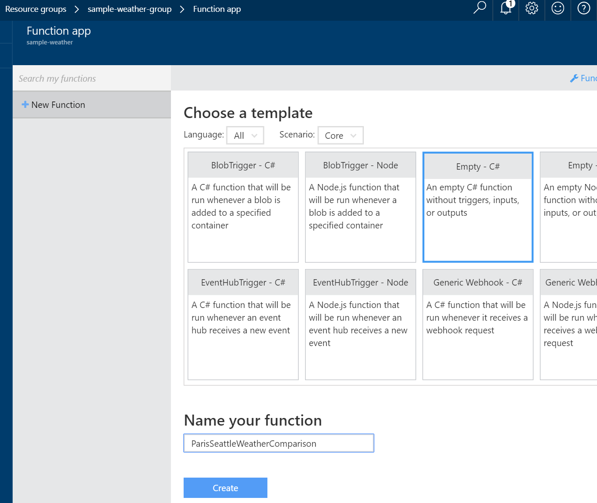

   Now we have an empty function. Let's add some code.

3. Click "View Files" under the code editor. This shows the list of files in the function's directory. Click the "+" icon to add a new file, and name it "weather.csx". Enter the following code in that file:

    ```csharp
    using System.Collections.Generic;

    public class WeatherList
    {
        public IEnumerable<Weather> List { get; set; }
    }

    public class Weather
    {
        public int Id { get; set; }
        public string Name { get; set; }
        public WeatherData Main { get; set; }
    }

    public class WeatherData
    {
        public double Temp { get; set; }
        public double Humidity { get; set; }
        public double Pressure { get; set; }
    }
    ```

   Those classes will help deserialize the response from the weather server. The structure of the `WeatherList / Weather / WeatherData` types reflects the schema of the JSON documents that the weather service will return. It does not, nor needs to reflect the entirety of the schema returned by the API: the `Microsoft.AspNet.WebApi.Client` library will figure out which parts to deserialize and how to map them onto the provided object model.

4. Enter the following code as the body of the function:

    ```csharp
    #r "System.Runtime"
    #r "System.Threading.Tasks"

    #load "weather.csx"

    using System.Configuration;
    using System.Net;
    using System.Net.Http;
    using System.Threading.Tasks;
    using Microsoft.IdentityModel.Clients.ActiveDirectory;
    using Microsoft.Azure.KeyVault;

    public static async Task<HttpResponseMessage> Run(HttpRequestMessage req, TraceWriter log)
    {
        // City codes from http://bulk.openweathermap.org/sample/city.list.json.gz
        const int parisId = 6455259;
        const int seattleId = 5809844;

        var adUrl = ConfigurationManager.AppSettings["WeatherADUrl"];
        var adClientId = ConfigurationManager.AppSettings["WeatherADClientID"];
        var adKey = ConfigurationManager.AppSettings["WeatherADKey"];
        var keyUrl = ConfigurationManager.AppSettings["WeatherKeyUrl"];
        
        var keyVault = new KeyVaultClient(async (string authority, string resource, string scope) => {
            var authContext = new AuthenticationContext(authority);
            var credential = new ClientCredential(adClientId, adKey);
            var token = await authContext.AcquireTokenAsync(resource, credential);

            return token.AccessToken;
        });

        var apiKey = keyVault.GetSecretAsync(keyUrl).Result.Value;

        using (var weatherClient = new HttpClient())
        {
            weatherClient.BaseAddress = new Uri("http://api.openweathermap.org/");
            var weatherResponse = await weatherClient.GetAsync($"data/2.5/group?id={parisId},{seattleId}&units=metric&APPID={apiKey}");
            if (weatherResponse.IsSuccessStatusCode)
            {
                var weather = await weatherResponse.Content.ReadAsAsync<WeatherList>();
                var parisTemperature = weather.List.Where(city => city.Id == parisId).FirstOrDefault()?.Main.Temp;
                var seattleTemperature = weather.List.Where(city => city.Id == seattleId).FirstOrDefault()?.Main.Temp;
                if (parisTemperature != null && seattleTemperature != null)
                {
                    if (parisTemperature > seattleTemperature)
                    {
                        return req.CreateResponse(HttpStatusCode.OK, 
                            $"It's nicer in Paris ({parisTemperature}°C) than in Seattle ({seattleTemperature}°C) right now.");
                    }
                    else
                    {
                        return req.CreateResponse(HttpStatusCode.OK, 
                            $"It's nicer in Seattle ({seattleTemperature}°C) than in Paris ({parisTemperature}°C) right now.");
                    }
                }
            }
        }
        return req.CreateResponse(HttpStatusCode.InternalServerError, $"Something went wrong.");
    }
    ```

   We also need to define the bindings for the function. Open `function.json` and enter the following as its content.

   ```json
    {
    "bindings": [
        {
            "authLevel": "function",
            "name": "req",
            "type": "httpTrigger",
            "direction": "in"
        },
        {
            "name": "res",
            "type": "http",
            "direction": "out"
        }
    ],
        "disabled": false
    }
   ```

4. In the code above, you'll notice that we're reading the AD URL, client ID and key from configuration, because of course we haven't done all this to store secrets in code... For the code to function, we'll have to enter that information into the function's Azure configuration. This can be done by clicking "Function app settings" on the bottom-left of the function editing screen.

    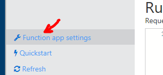

    In the screen thig brings up, you'll want to select the "Configure app settings" option. Once there, you'll see a few general settings, but what we're interested in is the table of custom "App settings". We'll add new key-value pairs in there with the names we used in the code:
    
    * "WeatherADURL" with the Active Directory OAuth 2.0 Token Endpoint URL.
    * "WeatherADClientID" with the Active Directory application ID we got in the previous section.
    * "WeatherADKey" with the Active Directory application key.
    * "WeatherKeyUrl" with the URL for the secret API key we stored in the vault earlier.
    
    Don't forget to hit "Save" on top of the panel.

    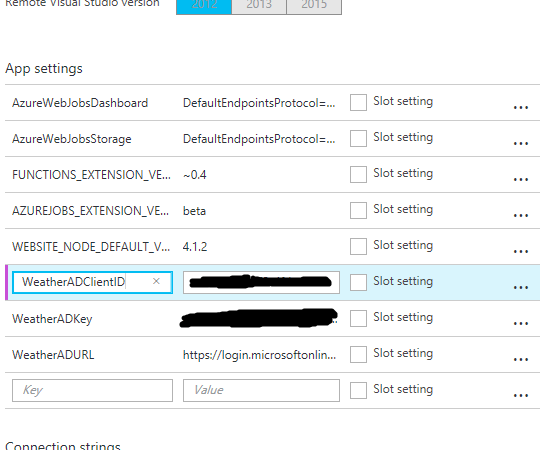

5. Go back to the function editor and add a project.json file to import the NuGet packages we need.

    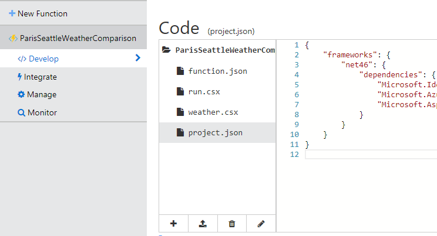

   Enter the following code into the file.

    ```json
    {
        "frameworks": {
            "net46": {
                "dependencies": {
                    "Microsoft.IdentityModel.Clients.ActiveDirectory": "3.13.4",
                    "Microsoft.Azure.KeyVault": "2.0.1-preview",
                    "Microsoft.AspNet.WebApi.Client": "5.2.3"
                }
            }
        }
    }
    ```

References
----------

1. [Manage Key Vault using CLI](https://azure.microsoft.com/en-us/documentation/articles/key-vault-manage-with-cli/)
2. [Azure Key Vault .NET Samples](https://github.com/Azure/azure-sdk-for-net/tree/AutoRest/src/KeyVault/Microsoft.Azure.KeyVault.Samples)
3. [Azure Functions C# Reference](https://azure.microsoft.com/en-us/documentation/articles/functions-reference-csharp/)