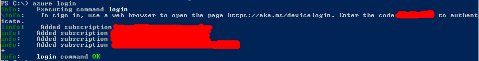
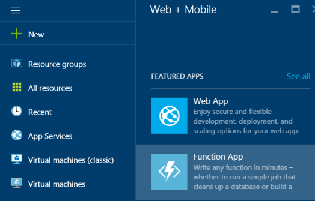

Storing secrets for use in an Azure application
===============================================

Most applications need access to secret information in order to function: it could be an API key, database credentials, or something else. There are or course many different places where people store such secrets. From worst to best, one could think of the following: in your source code repository on GitHub (of course, nobody should ever do that), in config files, in environment variables, or in specialized secret vaults.

Which one you choose depends on the level of security your application requires. Oftentimes, storing an API key in an environment variable will be adequate (what is never adequate is hard-coded values in code or config files checked into source control). If you require a higher level of security, however, you'll need a specialized vault such as Azure Key Vault. 

Azure Key Vault's unique responsibility is to store your secrets securely. Once stored, your secrets can only be accessed by applications you authorize, and only on an encrypted channel. Each secret can be managed in a single secure place, while multiple applications can use it. 

In this post, we'll create a simple service that will compare the temperatures in Seattle and Paris using the [OpenWeatherMap API](http://openweathermap.org/api), for which we'll need a secret API key. I'll walk you through the usage of [Azure's Key Vault](https://azure.microsoft.com/en-us/services/key-vault/) for storing the key, then I'll show how to retrieve and use it in a simple [Azure function](https://azure.microsoft.com/en-us/documentation/articles/functions-reference-csharp/).

Prerequisites
-------------

In order to be able to follow along, you'll need an [Azure account](https://azure.microsoft.com/pricing/free-trial/), and [the Azure command-line](https://github.com/azure/azure-xplat-cli).

Setting up Key Vault
-------------------

First, we're going to set-up Key Vault. There are quite a few steps involved, but only steps 6-8 have to be repeated for new secrets, the others being the one-time building of the vault.

1. Log your PowerShell Azure console in using `azure login`:
   
   Follow the instructions on the screen, which will likely include using a browser to enter a validation code.

2. Select the subscription you want to use, if you have more than one, using `azure account set "name of the subscription"`:
   

3. Create a new resource group (change the location as needed):
   `azure group create sample-weather-group -l WestUS`.
   You can skip this if you already have a resource group that you want to use.

4. Register Key Vault with your subscription:
   `azure provider register Microsoft.Key Vault`.
   This only needs to be done once per subscription.

5. Create a new vault under the group we created above (change the location as needed):
   `azure Key Vault create sample-weather-vault -g sample-weather-group -l WestUS`

6. Get an API key from [OpenWeatherMaps](http://openweathermap.org/api).

7. Create the key in the vault:
   `azure Key Vault key create sample-weather-vault open-weather-map-key -d software`
   
8. Store the API key on Key Vault (replace the 'x's with your actual key):
   `azure Key Vault secret set sample-weather-vault  open-weather-map-key -w xxxxxxxxxxxxxxxxxxxxxxxxxxxx`

Preparing Active Directory authentication
-----------------------------------------

Of course, the application will need to securely connect to the vault, for which it will have to use some form of master secret. This is similar to the master password that a password vault uses. We'll use Active Directory for this.

If you don't already have a directory that you want to use, you'll need to create one. This is currently done in [the old Azure portal](https://manage.windowsazure.com/) and is outside of the scope of this tutorial.

...

Go to "configure", where you can see your application's client ID. You'll need that and a key.


Scroll down to the keys section and add a new one.


Once you've saved, the key can be viewed and copied to a safe place. Do it now, because this is the last time the Azure portal is going to show it.


Now we can go back to the command-line and add the client ID to the list of authorized apps for our vault. Note that using a different key and id for each application that will use the secrets makes it possible to revoke access to the whole vault for a specific application in one operation.

Creating the Azure function
---------------------------

We're going to use Azure Functions to implement the actual service, because it's the easiest way to write code on Azure, but roughly the same steps would apply to any other kind of application.

1. From the [the Azure portal](https://portal.azure.com/), click "New", and pick "Function App" under "Web + Mobile",

   

   then name your new function app "sample-weather".

   

2. Navigate to the new function app under your subscription, and create a new function. Name it "ParisSeattleWeatherComparison" and choose the empty C# template:

   !Creating the function[](05-creating-the-function.png)

   Now we have an empty function. Let's add some meat to it.

3. Enter the following code as the body of the function:

```csharp
```

References
----------

1. [Manage Key Vault using CLI](https://azure.microsoft.com/en-us/documentation/articles/key-vault-manage-with-cli/)
2. [Azure Key Vault .NET Samples](https://github.com/Azure/azure-sdk-for-net/tree/AutoRest/src/Key Vault/Microsoft.Azure.Key Vault.Samples)
3. [Azure Functions C# Reference](https://azure.microsoft.com/en-us/documentation/articles/functions-reference-csharp/)