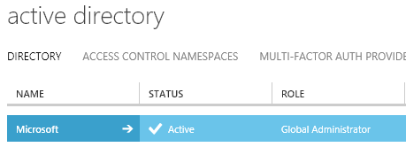
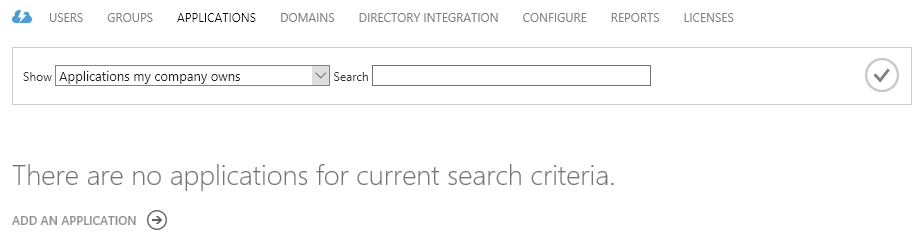
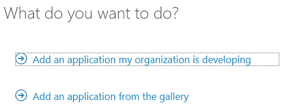
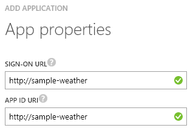
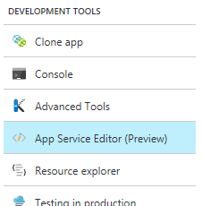

Storing secrets for use in an Azure application
===============================================

Most applications need access to secret information in order to function: it could be an API key, database credentials, or something else. There are or course many different places where people store such secrets. From worst to best, one could think of the following: in your source code repository on GitHub (of course, nobody should ever do that), in config files, in environment variables, or in specialized secret vaults.

Which one you choose depends on the level of security your application requires. Oftentimes, storing an API key in an environment variable will be adequate (what is never adequate is hard-coded values in code or config files checked into source control). If you require a higher level of security, however, you'll need a specialized vault such as Azure Key Vault. 

Azure Key Vault's unique responsibility is to store your secrets securely. Once stored, your secrets can only be accessed by applications you authorize, and only on an encrypted channel. Each secret can be managed in a single secure place, while multiple applications can use it. 

In this post, we'll create a simple service that will compare the temperatures in Seattle and Paris using the [OpenWeatherMap API](http://openweathermap.org/api), for which we'll need a secret API key. I'll walk you through the usage of [Azure's Key Vault](https://azure.microsoft.com/en-us/services/key-vault/) for storing the key, then I'll show how to retrieve and use it in a simple [Azure function](https://azure.microsoft.com/en-us/documentation/articles/functions-reference-csharp/).

Prerequisites
-------------

In order to be able to follow along, you'll need an [Azure account](https://azure.microsoft.com/pricing/free-trial/), and [the Azure command-line](https://github.com/azure/azure-xplat-cli).

Setting up Key Vault
-------------------

First, we're going to set-up Key Vault. There are quite a few steps involved, but only steps 6-8 have to be repeated for new secrets, the others being the one-time building of the vault.

1. Log your console in using `azure login`.

   

   Follow the instructions on the screen, which will likely include using a browser to enter a validation code.

2. Select the subscription you want to use, if you have more than one, using `azure account set "name of the subscription"`:

   

3. Create a new resource group (change the location as needed):

   ```azure group create sample-weather-group -l WestUS```

   You can skip this if you already have a resource group that you want to use.

4. Register Key Vault with your subscription:

   ```azure provider register Microsoft.Key Vault```

   This only needs to be done once per subscription.

5. Create a new vault under the group we created above (change the location as needed).

   ```azure Key Vault create sample-weather-vault -g sample-weather-group -l WestUS```

6. Get an API key from [OpenWeatherMaps](http://openweathermap.org/api).

7. Create the key in the vault.

   ```azure Key Vault key create sample-weather-vault open-weather-map-key -d software```
   
8. Store the API key on Key Vault (replace the 'x's with your actual key).

   ```azure Key Vault secret set sample-weather-vault  open-weather-map-key -w xxxxxxxxxxxxxxxxxxxxxxxxxxxx```

Preparing Active Directory authentication
-----------------------------------------

Of course, the application will need to securely connect to the vault, for which it will have to use some form of master secret.
This is similar to the master password that a password vault uses.
We'll use Active Directory for this. Managing Active Directory is currently done in [the old Azure portal](https://manage.windowsazure.com/).
Once you've selected the same subscription that you used for the Key Vault, you should see the Active Directory instance that the Key Vault will be able to use to verify authentication tokens.



We'll select that instance and create a new application there.
Go to the "Applications" tab and click the "Add" button that is in the bottom toolbar.



You'll then be asked to choose between an application you're developing or an application from the gallery.
We'll choose the first option, "Add an application my organization is developing".



Next, you'll be asked for a name for the application.
We'll choose "sample-weather-ad", and leave the "Web application and/or Web API" type checked.


Then, we need to provide URIs that need to be unique, but won't actually be used for our application. They are used as identifiers, but don't need to actually exist.



Now that the application has been created, go to the "Configure" tab, where you can see your application's client ID. You'll need that and a key.


Scroll down to the keys section and add a new one.


Once you've saved, the key can be viewed and copied to a safe place. Do it now, because this is the last time the Azure portal is going to show it. Also notice that this key expires, so take the time to create a reminder on the schedule of the team in charge of managing this application.


Now we can go back to the command-line and add the client ID to the list of authorized apps for our vault. Note that using a different key and id for each application that will use the secrets makes it possible to revoke access to the whole vault for a specific application in one operation.

We'll also need the URL of the Active Directory end point.
This can be obtained by clicking the "View endpoints" button on the bottom of the screen.


The URL we want to copy for later use is the one under "OAuth 2.0 Token Endpoint".

We're now ready to authorize the application to access the vault and get values out of it.
From the command-line, do the following.

```azure keyvault set-policy --vault-name sample-weather-vault --spn xxxxxxxx-xxxx-xxxx-xxxx-xxxxxxxxxxxx --perms-to-secrets '[\"get\"]'```

The string behind `--spn` should be replaced with the client ID from above. This command authorizes the application to get values out of the vault, but it should be pointed out that there are other Key Vault commands that can be enabled to allow the application to decrypt or sign values using stored certificates without having to read the actual secrets that can remain safely in the vault. Adapt this according to your requirements.
Note that the syntax and escaping of the "permissions to secrets" parameter, a JSON array, may vary depending on the shell you're using.
The syntax in the sample works with PowerShell on Windows.  

Creating the Azure function
---------------------------

We're going to use Azure Functions to implement the actual service, because it's the easiest way to write code on Azure, but roughly the same steps would apply to any other kind of application.

1. From the [the Azure portal](https://portal.azure.com/), click "New", and pick "Function App" under "Web + Mobile",

   

   then name your new function app "sample-weather".

   

2. Navigate to the new function app under your subscription, and create a new function. Name it "ParisSeattleWeatherComparison" and choose the empty C# template:

   !Creating the function[](05-creating-the-function.png)

   Now we have an empty function. Let's add some meat to it.

3. Enter the following code as the body of the function:

```csharp
```

4. In the code above, you'll notice that we're reading the AD URL, client ID and key from configuration, because of course we haven't done all this to store secrets in code... For the code to function, we'll have to enter that information into the function's Azure configuration. This can be done by clicking "Function app settings" on the top-right of the function editing screen.

    

    In the screen thig brings up, you'll want to select the last option, "Go to App Service Settings", under "Advanced Settings".
    This will lead you to a long list where you'll want to find and select "Application Settings" under the "Settings" heading.
    Once there, you'll see a few general settings, but what we're interested in is the table of custom "App settings".
    We'll add new key-value pairs in there with the names we used in the code: "WeatherADURL" with the Active Directory OAuth 2.0 Token Endpoint URL, "WeatherADClientID" with the Active Directory client app ID we got in the previous section, "WeatherADKey" with the Active Directory application key, and "WeatherKeyUrl" with the URL for the secret API key we stored in the vault earlier.
    Don't forget to hit "Save" on top of the panel.

    

5. While we're in advanced settings, we can also access the App Service Editor and set-up a project.json file to import the NuGet packages we need.

    

    Add a project.json file under `wwwroot/ParisSeattleWeatherComparison` with the following code.

    ```json
    {
        "frameworks": {
            "net46": {
                "dependencies": {
                    "Microsoft.IdentityModel.Clients.ActiveDirectory": "3.13.4"
                }
            }
        }
    }
    ```

    

References
----------

1. [Manage Key Vault using CLI](https://azure.microsoft.com/en-us/documentation/articles/key-vault-manage-with-cli/)
2. [Azure Key Vault .NET Samples](https://github.com/Azure/azure-sdk-for-net/tree/AutoRest/src/Key Vault/Microsoft.Azure.Key Vault.Samples)
3. [Azure Functions C# Reference](https://azure.microsoft.com/en-us/documentation/articles/functions-reference-csharp/)