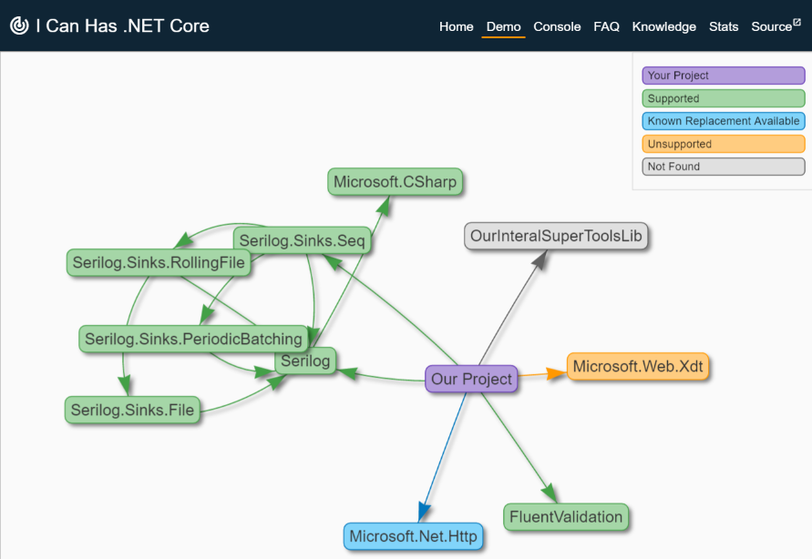

The week in .NET - 8/23/2016
============================

To read last week's post, see [The week in .NET – 8/16/2016](https://blogs.msdn.microsoft.com/dotnet/2016/08/16/the-week-in-net-8162016/).

On .NET
-------

Last week, we moved into our new studios with Channel 9, where JB Evain joined me to interview [Lucas Meijer from Unity](https://www.youtube.com/watch?v=dCbX_gfNFbc). We had our fair share of technical hiccups, but Lucas gave some great demos:

<iframe width="560" height="315" src="https://www.youtube.com/embed/dCbX_gfNFbc" frameborder="0" allowfullscreen></iframe>

This week, we'll bump up the lights a bit, and I won't forget my power supply (promise). We'll have Phillip Carter on the show, to give an intro to F#. Join us [at 10AM Pacific Time on Thursday, on Channel 9](https://channel9.msdn.com/Shows/On-NET).

Tool of the week: I can has .NET Core
-------------------------------------

Another extremely useful web tool by the people behind Octopus Deploy, "I can has .NET Core" explores the dependency graph of a NuGet package or GitHub repository and tells you if anything will get in the way of a .NET Core migration. It also advises on available replacement libraries.



Package of the week: Warden
---------------------------

[Warden](https://github.com/warden-stack/Warden) is a simple, cross-platform library, built to solve the problem of monitoring the resources such as websites, API, databases, CPU etc. It allows to quickly define the watchers responsible for performing checks on specific resources and integrations to easily notify about any issues related to the possible downtime of your system.

```csharp
var configuration = WardenConfiguration
    .Create()
    .AddWebWatcher("http://my-website.com")
    .AddMongoDbWatcher("mongodb://localhost:27017", "MyDatabase", cfg =>
    {
        cfg.WithQuery("Users", "{\"name\": \"admin\"}")
           .EnsureThat(users => users.Any(user => user.role == "admin"));
    })
    .IntegrateWithSendGrid("api-key", "noreply@system.com", cfg =>
    {
        cfg.WithDefaultSubject("Monitoring status")
           .WithDefaultReceivers("admin@system.com");
    })
    .SetGlobalWatcherHooks(hooks =>
    {
        hooks.OnStart(check => GlobalHookOnStart(check))
             .OnCompleted(result => GlobalHookOnCompleted(result));
    })
    .SetAggregatedWatcherHooks((hooks, integrations) =>
    {
        hooks.OnFirstFailureAsync(results => 
                integrations.SendGrid().SendEmailAsync("Monitoring errors have occured."))
             .OnFirstSuccessAsync(results => 
                integrations.SendGrid().SendEmailAsync("Everything is up and running again!"));
    })
    .SetHooks(hooks =>
    {
        hooks.OnIterationCompleted(iteration => OnIterationCompleted(iteration))
             .OnError(exception => Logger.Error(exception));
    })
    .Build();

var warden = WardenInstance.Create(configuration);
await warden.StartAsync();
```

User group meeting of the week: TypeShape - Practical Generic Programming in F# in NYC
--------------------------------------------------------------------------------------

The [New York City F# User Group](http://www.meetup.com/nyc-fsharp/) will have Eirik Tsarpalis on Thursday, August 25 at 6:30PM in the Empire State Building, for [a talk on TypeShape - Practical Generic Programming in F#](http://www.meetup.com/nyc-fsharp/events/233448670/).

.NET
----

* [Visual Studio "15" Preview 4](https://blogs.msdn.microsoft.com/visualstudio/2016/08/22/visual-studio-15-preview-4/) by John Montgomery.
* [PowerShell on Linux and Open Source](https://blogs.msdn.microsoft.com/powershell/2016/08/18/powershell-on-linux-and-open-source-2/) by Kenneth Hansen and Angel Calvo.
* [GitHub Extension for Visual Studio 2.0 is now available](https://github.com/blog/2232-github-extension-for-visual-studio-2-0-is-now-available) by Andreia Gaita.
* [GC pauses and safe points](http://mattwarren.org/2016/08/08/GC-Pauses-and-Safe-Points/) and [Preventing .NET garbage collections with the TryStartNoGCRegion API](http://mattwarren.org/2016/08/16/Preventing-dotNET-Garbage-Collections-with-the-TryStartNoGCRegion-API/) by Matt Warren.
* [An approach to building .NET Core apps using Bamboo and Cake](http://www.inversionofcontrol.co.uk/an-approach-to-building-net-core-apps-using-bamboo-and-cake/) by Matthew Abbott.
* [Detecting and Setting Zoom Level in the WPF WebBrowser Control](https://weblog.west-wind.com/posts/2016/Aug/22/Detecting-and-Setting-Zoom-Level-in-the-WPF-WebBrowser-Control) by Rick Strahl.
* [Wire – Writing one of the fastest .NET serializers](https://rogeralsing.com/2016/08/16/wire-writing-one-of-the-fastest-net-serializers/) by Roger Johansson.

ASP.NET
-------

* [Exploring the cookie authentication middleware in ASP.NET Core](http://andrewlock.net/exploring-the-cookieauthenticationmiddleware-in-asp-net-core/) and [How to set the hosting environment in ASP.NET Core](http://andrewlock.net/how-to-set-the-hosting-environment-in-asp-net-core/) by Andrew Lock.
* [ASP.NET Core Basic Security Settings Cheatsheet](http://blog.securityps.com/2016/08/aspnet-core-basic-security-settings.html) by Nick Coblentz.
* [Dependency Injection with .NET Core](https://csharp.christiannagel.com/2016/06/04/dependencyinjection/), [Dependency Injection with Options](https://csharp.christiannagel.com/2016/07/27/diwithoptions/), [Configuration with .NET Core](https://csharp.christiannagel.com/2016/08/02/netcoreconfiguration/), [Dependency Injection with Configuration](https://csharp.christiannagel.com/2016/08/16/diwithconfiguration/), and [Professional C# 6](https://csharp.christiannagel.com/2016/04/12/professionalcsharp6/) by Christian Nagel.
* [Netling, a load tester client](https://github.com/hallatore/Netling) by Tore Lervik.
* [
Looking At ASP.NET Core's IApplicationLifetime](http://www.khalidabuhakmeh.com/looking-at-asp-net-cores-iapplicationlifetime) by Khalid Abuhakmeh.
* [Welcome Razor Pages](http://en.xn--mgbz4cf.com/post/welcome-razor-pages) by Hisham.
* [The basics of publishing your .NET Core web app](https://jonhilton.net/2016/08/18/publishing-your-net-core-web-app/) by Jon Hilton.
* [ASP.NET Core logging with NLog and SQL Server](https://damienbod.com/2016/08/17/asp-net-core-logging-with-nlog-and-microsoft-sql-server/) by Damien Bod.
* [Building a lightweight, controller-less, Markdown-only website in ASP.NET Core](http://www.strathweb.com/2016/08/building-a-lightweight-controller-less-markdown-only-website-in-asp-net-core/) by Filip W.
* [ASP.NET MVC: Precompiling views](http://gunnarpeipman.com/2016/08/asp-net-mvc-precompiling-views/) by Gunnar Peipman.

F#
--

* [Functional Programming with F#](https://www.youtube.com/playlist?list=PLEoMzSkcN8oNiJ67Hd7oRGgD1d4YBxYGC), a YouTube series by David Wilson
* [Basic Regression Truee](http://brandewinder.com/2016/08/14/gradient-boosting-part-2/), by Mathias Brandewinder
* [OOP in F# - How to define and implement classes, abstract classes and interfaces](https://kimsereyblog.blogspot.com.by/2016/08/oop-in-fsharp-how-to-define-and.html), by Kimserey Lam
* [FAKE your way to ASP.NET Core on Azure WebApps, part 1 - The Problem](http://www.codinginfinity.me/post/2016-08-19/fake_your_way_part1), by  Jakub Fijałkowski
* [Fable |> React - Running a F# Sudoku solver everywhere](http://www.navision-blog.de/blog/2016/08/14/fable-sudoku-creating-a-sudoku-solver-app-with-f/), by Steffen Forkmann

Check out [F# Weekly](https://sergeytihon.wordpress.com/category/f-weekly/) for more great content from the F# community.

Xamarin
-------

* ["Document All the Things" Contest Winners](https://blog.xamarin.com/document-all-the-things-contest-winners/) by Chris Hardy.
* [Webinar Recording | Continuous Everything: Why You Need Mobile DevOps](https://blog.xamarin.com/webinar-recording-continuous-everything-why-you-need-mobile-devops/) by Courtney Witmer.
* [Continuous Integration for Android with Visual Studio Team Services](https://blog.xamarin.com/continuous-integration-for-android-with-visual-studio-team-services/) by James Montemagno.
* [Preview: Xamarin Profiler 0.34.0](https://releases.xamarin.com/preview-xamarin-profiler-0-34/) by Adrian Murphy.
* [Xamarin.Forms E-Z Print](https://codemilltech.com/xamarin-forms-e-z-print/) by Matthew Soucoup.
* [Yet Another Podcast #161 – David Britch](http://jesseliberty.com/2016/08/18/yet-another-podcast-161-david-britch) by Jesse Liberty.
* [Prism for Xamarin.Forms 6.2 Release](http://brianlagunas.com/prism-for-xamarin-forms-6-2-release/) by Brian Lagunas.
* [Announcing FreshMvvm 2.1 and 2.2](http://www.michaelridland.com/xamarin/announcing-freshmvvm-2-1-and-2-2/) by Michael Ridland.
* [Latest Version of InTheHand.Core](https://peterfoot.net/2016/08/17/latest-version-of-inthehand-core/) by Peter Foot.

And this is it for this week!

Contribute to the week in .NET
------------------------------

As always, this weekly post couldn't exist without community contributions, and I'd like to thank all those who sent links and tips. The F# section is provided by Phillip Carter, the gaming section by Stacey Haffner, and the Xamarin section by Dan Rigby.

You can participate too. Did you write a great blog post, or just read one? Do you want everyone to know about an amazing new contribution or a useful library? Did you make or play a great game built on .NET?
We'd love to hear from you, and feature your contributions on future posts:

* Send an email to beleroy at Microsoft,
* [comment on this gist](xx)
* Leave us a pointer in the comments section below.
* [Send Stacey (@yecats131) tips on Twitter about .NET games](https://twitter.com/yecats131).

This week's post (and future posts) also contains news I first read on [The ASP.NET Community Standup](https://blogs.msdn.microsoft.com/webdev/tag/communitystandup/), on [Weekly Xamarin](http://weeklyxamarin.com/), on [F# weekly](https://sergeytihon.wordpress.com/category/f-weekly/), on [ASP.NET Weekly](http://www.aspnetweekly.com/), and on [Chris Alcock's The Morning Brew](http://themorningbrew.net/).
