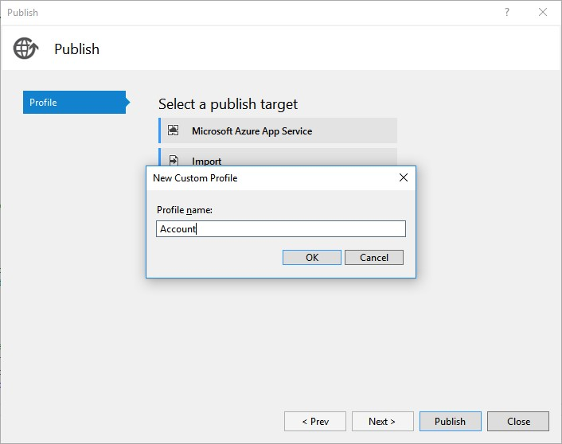
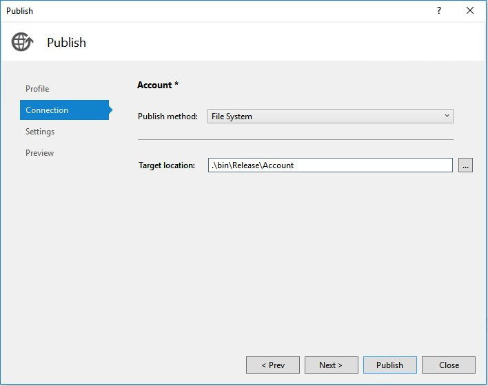
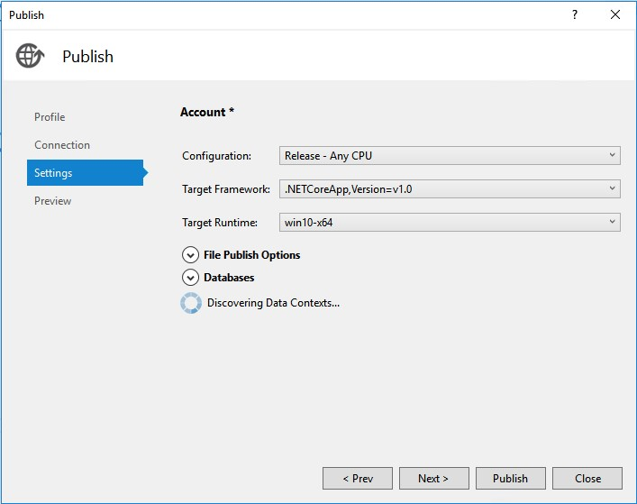
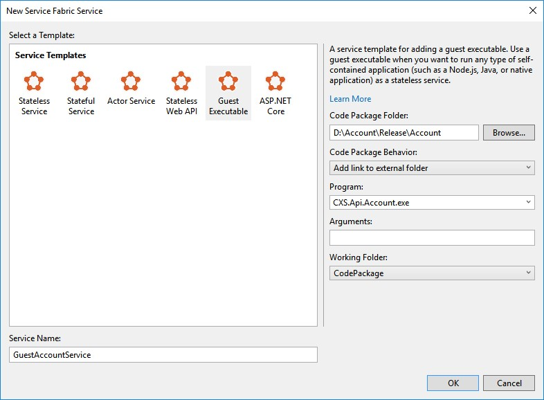

# Hosting .NET Core services on Service Fabric  #
This tutorial is for users who already have a group of ASP.NET Core services which they want to host as micro services in Azure using Azure Service Fabric. Azure Service Fabric is a great way to host micro services in a PaaS world to obtain many benefits like high density, scalability and upgradability.  In this tutorial, I will take a [self-contained](https://docs.microsoft.com/en-us/dotnet/articles/core/deploying/index) ASP.NET Core service targeting the .NETCoreApp framework and host it as a guest executable in Service Fabric.

Writing cross platform services/apps using the same code base is one of the key benefits of ASP.NET Core. If you plan to host the services on Linux and also want to host the same set of services on Windows cluster using Service Fabric then you can easily achieve this by using the guest services feature of Service Fabric. You can run any type of application, such as Node.js, Java, ASP.NET Core or native applications in Service Fabric. Service Fabric terminology refers to those types of applications as guest executables. Guest executables are treated by Service Fabric like stateless services. As a result, they will be placed on nodes in a cluster, based on availability and other metrics.

The current Service Fabric SDK templates only provide a way to host .NET services which target full .NET Frameworks, like 45x. If you already have a service that targets .NETCoreApp alone or .NETCoreApp and .NET Framework 4* then you cannot use the built-in ASP.NET Core template as the Service Fabric SDK NuGet package only supports .NET Framework 4.5.2. To avoid this, we need to use the guest services solution for all the projects that target .NETCoreApp as a target framework in their project.json.

## Service Fabric Application package ##
 As explained in [Deploying a guest executable](https://azure.microsoft.com/en-us/documentation/articles/service-fabric-deploy-existing-app/) to Service Fabric, any Service Fabric application that is deployed on the Service Fabric cluster needs to follow a predefined directory structure. 

	|-- ApplicationPackage
	    |-- code
	        |-- existingapp.exe
	    |-- config
	        |-- Settings.xml
	    |-- data
	    |-- ServiceManifest.xml
	|-- ApplicationManifest.xml

The root contains the ApplicationManifest.xml that defines the entire application. A subdirectory for each service included in the application is used to contain all the artifacts that the respective service requires. It contains the following items

- **ServiceManifest.xml** which defines the service.
- **Code**. This directory contains the service code.
- **Config**. This directory contains a Settings.xml for configuring specific settings for service.
- **Data**.  This directory stores local data that the service might need. 

In order to deploy a guest service, we need to get all the required binaries to run the service and copy them under the Code folder. Config and Data folders are optional only and are used by services that require them. For .NETCoreApp self-contained projects, you can easily achieve this directory structure by using the publish to file system mechanism from Visual Studio. Once you publish the service to a folder, all the required binaries for the service including .NETCoreApp binaries will be copied to this folder. We can then use the published location and map it to Code folder in the Service Fabric service.

##Publish .NETCoreApp Service to Folder ##
Right click the .NET Core project and click **Publish**.

Create a Custom publish target and Name it as **Account**.

Under Connection set the Target location where you want the project to be published. Choose the Publish method as **File System**. 

Under Settings, Set the Configuration to be **Release – Any CPU**. Target Framework to be **.NETCoreApp, Version=v1.0** and Target Runtime to be **win10-64**. Click the **Publish** button.
 

You have now published the service to a directory. 

## Creating a Guest Service Fabric Application ##
Visual Studio provides a Guest Service Fabric Application template to help you deploy a guest executable to a Service Fabric cluster.
 
Following are the steps
 
1. Choose **File** -> **New Project** and Create a **Service Fabric Application**.  The template can be found under **Visual C#** -> **Cloud**. Choose an appropriate project name as this will reflect the name of the application that is deployed on the Cluster.

2.  Choose **Guest Executable** template. Under the Code Package Folder, browse to previously published directory of service.
3.  Under Code Package Behavior you can specify either **Add link to external folder** or **Copy Folder contents to Project**.  You can use the linked folders which will enable you to update the guest executable in its source as a part of the application package build.
4.  Choose the Program that needs to run as service and also specify the arguments and working directory if they are different. In my case I am just using Code Package.
5.  If your Service needs an endpoint for communication, you can now add the protocol, port and type to the ServiceManifest.xml for example
 `<Endpoint Protocol="http" Name="CustomerTransactionsServiceEndpoint" Type="Input" Port="5000" />`

6. Set the project as **Startup Project**.
7. You can now publish to the cluster by just **F5 debugging**. 

If you have multiple services that you want to deploy as Guest Services you can simply edit this Guest Service Project file to include new Code, Config and Data packages for the new service or use the **ServiceFabricAppPackageUtil.exe** as mentioned in this [tutorial](https://azure.microsoft.com/en-us/documentation/articles/service-fabric-deploy-multiple-apps/). 

## Resources ##

1. [Self-contained ASP.NET Core deployments](https://docs.microsoft.com/en-us/dotnet/articles/core/deploying/index)
2. [Service Fabric programming model](https://azure.microsoft.com/en-us/documentation/articles/service-fabric-choose-framework)
2. [Deploying a guest service in Service Fabric](https://azure.microsoft.com/en-us/documentation/articles/service-fabric-deploy-existing-app/).
2. [Deploying multiple guest services in Service Fabric](https://azure.microsoft.com/en-us/documentation/articles/service-fabric-deploy-multiple-apps/).

 
