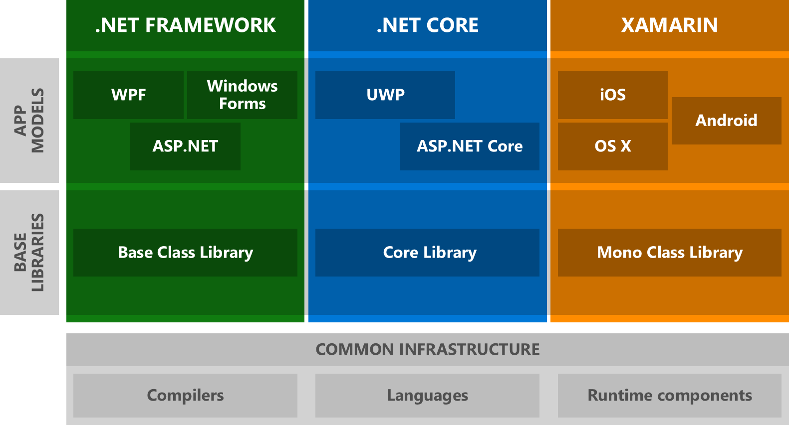
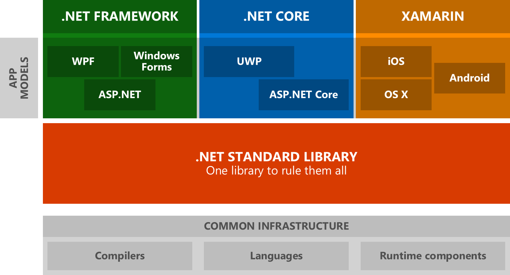
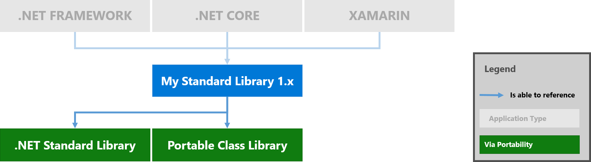
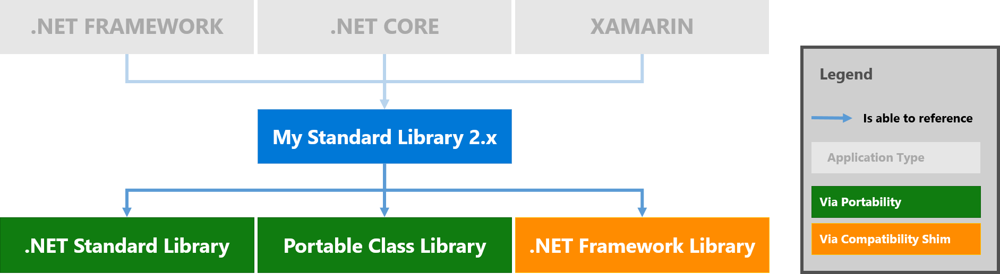

# Introducing .NET Standard

In my last post, I talked about how we want to [make porting to .NET Core
easier][post-porting]. In this post, I'll focus on how we're making this plan a
reality with .NET Standard. We'll cover which APIs we plan to include, how
cross-framework compatibility will work, and what all of this means for .NET
Core.

If you're interested in details, this post is for you. But don't worry if you
don't have time or you're not interested in details: you can just read the TL;DR
section.

# For the impatient: TL;DR

.NET Standard solves the code sharing problem for .NET developers across all
platforms by bringing all the APIs that you expect and love across the
environments that you need: desktop applications, mobile apps & games, and
cloud services:

* .NET Standard is a set of APIs that all .NET platforms have to implement. This
  unifies the .NET platforms and prevents future fragmentation.
* .NET Core will implement .NET Standard 2.0 which will add many of the existing
  APIs to .NET Core. It also enables referencing .NET Framework binaries through
  a compatibility shim.
* .NET Standard will replace Portable Class Libraries (PCLs) as our tooling
  story for building multi-platform .NET libraries. Since it's a single NuGet
  package it can be easily used from Visual Studio, VS Code, Xamarin Studio, as
  well as the command line.
* The .NET Standard API definition is [available on GitHub][dotnet/standard].

# Why do we need a standard?

As explained in detail in the post [Introducing .NET Core][post-netcore], the
.NET platform was forked quite a bit over the years. On the one hand, this is
actually a really good thing. It allowed tailoring .NET to fit the needs that a
single platform wouldn't have been able to. For example, the .NET Compact
Framework was created to fit into the (fairly) restrictive footprint of phones
in the 2000 era. The same is true today: Unity (a fork of Mono) runs on more
than 20 platforms. Being able to fork and customize is an important capability
for any technology that requires reach.

But on the other hand, this forking poses a massive problem for developers
writing code for multiple .NET platforms because there isn't a unified class
library to target:



There are currently three major flavors of .NET, which means you have to master
three different base class libraries in order to write code that works across
all of them. Since the industry is much more diverse now than when .NET was
originally created it's safe to assume that we're not done with creating new
.NET platforms. Either Microsoft or someone else will build new flavors of .NET
in order to support new operating systems or to tailor it for specific device
capabilities.

This is where the .NET Standard comes in:



For developers, this means they only have to master one base class library.
Libraries targeting .NET Standard will be able to run on all .NET platforms. And
platform providers don't have to guess which APIs they need to offer in order to
consume the libraries available on NuGet.

**Applications**. In the context of applications you don't use .NET Standard
directly. However, you still benefit indirectly. First of all, .NET Standard
makes sure that all .NET platforms share the same API shape for the base class
library. Once you learn how to use it in your desktop application you know how
to use it in your mobile application or your cloud service. Secondly, with .NET
Standard most class libraries will become available everywhere, which means the
consistency at the base layer will also apply to the larger .NET library
ecosystem.

**Portable Class Libraries**. Let's contrast this with how Portable Class
Libraries (PCL) work today. With PCLs, you select the platforms you want to run
on and the tooling presents you with the resulting API set you can use. So while
the tooling helps you to produce binaries that work on multiple platforms, it
still forces you to think about different base class libraries. With .NET
Standard you have a single base class library. Everything in it will be
supported across all .NET platforms -- current ones as well as future ones.
Another key aspect is that the API availability in .NET Standard is very
predictable: higher version equals more APIs. With PCLs, that's not necessarily
the case: the set of available APIs is the result of the intersection between
the selected platforms, which doesn't always produce an API surface you can
easily predict.

**Consistency in APIs**. If you compare .NET Framework, .NET Core, and
Xamarin/Mono, you'll notice that .NET Core offers the smallest API surface
(excluding OS-specific APIs). The first inconsistency is having drastic
differences in the availability of foundational APIs (such as networking- and
crypto APIs). The second problem .NET Core introduced was having differences in
the API shape of core pieces, especially in reflection. Both inconsistencies are
the primary reason why porting code to .NET Core is much harder than it should
be. By creating the .NET Standard we're codifying the requirement of having
consistent APIs across all .NET platforms, and this includes availability as
well as the shape of the APIs.

**Versioning and Tooling**. As I mentioned in [Introducing .NET
Core][post-netcore] our goal with .NET Core was to lay the foundation for a
portable .NET platform that can unify APIs in shape and implementation. We
intended it to be the next version of portable class libraries. Unfortunately,
it didn't result in a great tooling experience. Since our goal was to represent
any .NET platform we had to break it up into smaller NuGet packages. This works
reasonably well if all these components can be deployed with the application
because you can update them independently. However, when you target an abstract
specification, such as PCLs or the .NET Standard, this story doesn't work so
well because there is a very specific combination of versions that will allow
you to run on the right set of platforms. In order to avoid that issue, we've
defined .NET Standard as a single NuGet package. Since it only represents the
set of required APIs, there is no need to break it up any further because all
.NET platforms have to support it in its entirety anyways. The only important
dimension is its version, which acts like an API level: the higher the version,
the more APIs you have, but the lower the version, the more .NET platforms have
already implemented it.

To summarize, we need .NET Standard for two reasons:

1. **Driving force for consistency**. We want to have an agreed upon set of
   required APIs that all .NET platforms have to implement in order to gain
   access to the .NET library ecosystem.

2. **Foundation for great cross-platform tooling**. We want a simplified tooling
   experience that allows you to target the commonality of all .NET platforms by
   choosing a single version number.

## What's new in .NET Standard 2.0?

When [we shipped .NET Core 1.0][post-release], we also introduced .NET Standard.
There are multiple versions of the .NET Standard in order to represent the API
availability across all current platforms. The following table shows which
version of an existing platform is compatible with a given version of .NET
Standard.

The arrows indicate that the platform supports a higher version of .NET
Standard. For instance, .NET Core 1.0 supports the .NET Standard version 1.6,
which is why there are arrows pointing to the right for the lower versions 1.0 -
1.5.

You can use this table to understand what the highest version of .NET Standard
is that you can target, based on which .NET platforms you intend to run on. For
instance, if you want to run on .NET Framework 4.5 and .NET Core 1.0, you can at
most target .NET Standard 1.1.

|.NET Platform              |   1.0|   1.1|   1.2|   1.3|   1.4|   1.5|   1.6|
|:--------------------------|-----:|-----:|-----:|-----:|-----:|-----:|-----:|
|.NET Core                  |&rarr;|&rarr;|&rarr;|&rarr;|&rarr;|&rarr;|   1.0|
|.NET Framework             |&rarr;|  4.5 | 4.5.1|   4.6| 4.6.1| 4.6.2| vNext|
|Xamarin.iOS                |&rarr;|&rarr;|&rarr;|&rarr;|&rarr;|&rarr;|     *|
|Xamarin.Android            |&rarr;|&rarr;|&rarr;|&rarr;|&rarr;|&rarr;|     *|
|Universal Windows Platform |&rarr;|&rarr;|&rarr;|&rarr;|  10.0|      |      |
|Windows                    |&rarr;|   8.0|   8.1|      |      |      |      |
|Windows Phone              |&rarr;|&rarr;|   8.1|      |      |      |      |
|Windows Phone Silverlight  |   8.0|      |      |      |      |      |      |

.NET Standard is also compatible with Portable Class Libraries. The mapping from
PCL profiles to .NET Standard versions is listed in [our
documentation][docs-netstandard].

From a library targeting .NET Standard you'll be able to reference two kinds of
other libraries:

* **.NET Standard**, if their version is lower or equal to the version you're
  targeting.
* **Portable Class Libraries**, if their profile can be mapped to a .NET
  Standard version and that version is lower or equal to the version you're
  targeting.

Graphically, this looks as follows:



Unfortunately, the adoption of PCLs and .NET Standard on NuGet isn't as high as
it would need to be in order to be a friction free experience. This is how many
times a given target occurs in packages on NuGet.org:

|Target        |Occurrences|
|:-------------|----------:|
|.NET Framework|     46,894|
|.NET Standard |      1,886|
|Portable      |      4,501|

As you can see, it's quite clear that the vast majority of class libraries on
NuGet are still targeting .NET Framework. However, we know that a large number
of these libraries are only using APIs we'll expose in .NET Standard 2.0.

In .NET Standard 2.0, we'll make it possible for libraries that target .NET
Standard to *also* reference existing .NET Framework binaries through a
compatibility shim:



Of course, this will only work for cases where the .NET Framework library uses
APIs that are available for .NET Standard. That's why this isn't the preferred
way of building libraries you intend to use across different .NET platforms.
However, this compatibility shim provides a bridge that enables you to convert
your libraries to .NET Standard without having to give up referencing existing
libraries that haven't been converted yet.

If you want to learn more about how the compatibility shim works, take a look at
the [specification for .NET Standard 2.0][spec-compatshim].

## Breaking changes between .NET Standard 1.x and 2.0

Our goal for .NET Core is to significantly extend its surface area so that more
functionality can be shared across all the .NET platforms. This mostly means
filling in existing APIs.

This allows us to make .NET Standard much bigger. Unfortunately, some of the
existing .NET platforms do not support all the APIs we have already added in
.NET Standard 1.5 and 1.6. We have two options:

1. We can update the existing platforms to include those APIs
2. Perform a breaking change in .NET Standard and remove those APIs from .NET
   Standard 2.0 and re-introduce them in a later version of .NET Standard.

At first, it seems much more logical to go with option (1). Unfortunately,
updating existing platforms means shipping a new version of that platform. This
doesn't help our adoption problem as those new platforms aren't necessarily
available to target in all circumstances, which is particularly true for .NET
Framework. Thus, we're going with option (1) where we can and fall back to 
option (2) where we cannot:

* **.NET Framework**. At the time we ship .NET Standard 2.0 we expect .NET
  Framework 4.6.1 to have enough adoption to make this a viable prerequisite for
  .NET Standard 2.0. However, we don't think this holds true for later versions
  of .NET Framework.

* **Xamarin**. With Xamarin, the .NET platform doesn't ship with the OS but with
  the app, so updating Xamarin is mostly an SDK problem. We hope we can update
  it to simply include all APIs that are currently missing (in fact, the
  majority of APIs were already added to the stable Cycle 8 release/Mono 4.6.0).

[This document][netstandard-20-removals] includes all the APIs that are
available in .NET Standard 1.6 but aren't implemented yet in .NET Framework
4.6.1 and thus will not be made available in .NET Standard 2.0.

We ran an analysis of all packages on NuGet.org that target .NET Standard and
use any of these APIs. At the time of this writing we only found six
non-Microsoft owned packages that are impacted. We'll reach out to those package
owners and work with them to mitigate the issue.

The mitigation for these packages is as follows:

* If they absolutely require the APIs, they will have to cross-compile, i.e.
  target the specific platforms rather than using .NET Standard.
* If they can replace the dependency with other APIs we added in .NET Standard
  2.0, they can either only target the later version or cross-compile and
  continue to support .NET Standard 1.6.

## What's in .NET Standard?

In order to decide which APIs will be part of .NET Standard we use the following
principles:

1. All types that are part of the intersection between .NET Framework, Xamarin
   iOS, and Xamarin Android are candidates to be added to .NET Core. Please note
   that this doesn't mean that these types will become a part of .NET Standard.

2. APIs that should be required for all current and future platforms are being
   added to .NET Standard.

3. Problematic and legacy technologies that we only want to provide for
   backwards compatibility will default to being optional components. That means
   they aren't part of .NET Standard but are available as a separate NuGet
   package. We try to build these as libraries targeting .NET Standard so that
   their implementation can be consumed from any platform, but that might not
   always be feasible.

4. Any members on types added in (1) and (2) that prevent (3) are subject to be
   removed. For example, we decided that `AppDomain` is in .NET Standard while
   Code Access Security (CAS) is a legacy component. This requires us to remove
   all members from `AppDomain` that use types that are part of CAS, such as
   overloads on `CreateDomain` that accept `Evidence`.

5. All removals in (4) will be reviewed by the [.NET Standard's review
   body][reviewboard].

It's easier to see what we're planning for .NET Standard 2.0 in terms of
assemblies. As a starting point, we've looked at the assemblies that .NET
Framework and Xamarin have in common and made an assessment of what we believe
is so fundamental that it should be part of .NET Standard:

* `Microsoft.CSharp`
* `mscorlib`
* `System`
* `System.Core`
* `System.Drawing`
* `System.IO.Compression`
* `System.IO.Compression.FileSystem`
* `System.Net`
* `System.Net.Http`
* `System.Numerics`
* `System.Runtime.Serialization`
* `System.Xml`
* `System.Xml.Linq`

Please note that not all APIs in these assemblies are being added to .NET
Standard. As explained above, some APIs might become optional via a separate
package.

Conversely, assemblies not listed above might still be available in other
packages. Their absence merely indicates that they aren't part of .NET Standard
itself and thus they might not be available on all .NET platforms.

If you want to find out which APIs will be included in .NET Standard 2.0, you
can take a look at the [.NET Standard GitHub repository][dotnet/standard].
Please note that .NET Standard 2.0 is work in progress, so the API surface is
actively being worked on right now. This means some APIs might be added, some
might be removed.

## Can I still use platform-specific APIs?

One of the biggest challenges in creating an experience for multi-platform class
libraries is to avoid only having the lowest-common denominator while also
making sure you don't accidentally create libraries that are much less portable
than you intend to.

In PCLs we've solved the problem by having multiple profiles, each representing
the intersection of a set of platforms. The benefit is that this allows you to
max out the API surface between a set of targets. The .NET Standard represents
the set of APIs that all .NET platforms have to implement.

This brings up the question how we model APIs that cannot be implemented on all
platforms:

* **Runtime specific APIs.** For example, the ability to generate and run code
  on the fly using reflection emit. This cannot work on .NET platforms that do
  not have a JIT compiler, such as .NET Native on UWP or via Xamarin's iOS
  tool chain.

* **Operating system specific APIs**. In .NET we've exposed many APIs from Win32
  in order to make them easier to consume. A good example is the Windows
  registry. The implementation depends on the underlying Win32 APIs that don't
  have equivalents on other operating systems.

We have a couple of options for these APIs:

1. **Make the API unavailable**. You cannot use APIs that do not work across all
   .NET platforms.

2. **Make the API available but throw `PlatformNotSupportedException`**. This
   would mean that we expose all APIs regardless of whether they are supported
   everywhere or not. Platforms that do not support them provide the APIs but
   throw `PlatformNotSupportedException`.

3. **Emulate the API**. Mono implements the registry as an API over `.ini` files.
   While that doesn't work for apps that use the registry to read information
   about the OS, it works quite well for the cases where the application simply
   uses the registry to store its own state and user settings.

We believe the best option is a combination. As mentioned above we want the .NET
Standard to represent the set of APIs that all .NET platforms are required to
implement. We want to make this set sensible to implement while ensuring popular
APIs are present so that writing cross-platform libraries is easy and intuitive.

Our general strategy for dealing with technologies that are only available on
some .NET platforms is to make them NuGet packages that sit above the .NET
Standard. So if you create a .NET Standard-based library, it'll not reference
these APIs by default. You'll have to add a NuGet package that brings them in.

This strategy works well for APIs that are self-contained and thus can be moved
into a separate package. For cases where individual members on types cannot be
implemented everywhere, we'll use the second and third approach: platforms have
to have these members but they can decide to throw or emulate them.

Let's look at a few examples and how we plan on modelling them:

* **Registry**. The Windows registry is a self-contained component that will be
  provided as a separate NuGet package (e.g. `Microsoft.Win32.Registry`). You'll
  be able to consume it from .NET Core, but it will only work on Windows.
  Calling registry APIs from any other OS will result in
  `PlatformNotSupportedException`. You're expected to guard your calls
  appropriately or making sure your code will only ever run on Windows. We're
  considering improving our tooling to help you with detecting these cases.

* **AppDomain**. The `AppDomain` type has many APIs that aren't tied to creating
  app domains, such as getting the list of loaded assemblies or registering an
  unhandled exception handler. These APIs are heavily used throughout the .NET
  library ecosystem. For this case, we decided it's much better to add this type
  to .NET Standard and let the few APIs that deal with app domain creation
  throw exceptions on platforms that don't support that, such as .NET Core.

* **Reflection Emit**. Reflection emit is reasonably self-contained and thus we
  plan on following the model as Registry, above. There are other APIs that
  logically depend on being able to emit code, such as the expression tree's
  `Compile` method or the ability to compile regexes. In some cases we'll
  emulate their behavior (e.g. interpreting expression trees instead of
  compiling them) while in other cases we'll throw (e.g. when compiling
  regexes).

In general, you can always work around APIs that are unavailable in .NET
Standard by targeting specific .NET platforms, like you do today. We're thinking
about ways how we can improve our tooling to make the transitions between being
platform-specific and being platform-agnostic more fluid so that you can always
choose the best option for your situation and not being cornered by earlier
design choices.

To summarize:

* We'll expose concepts that might not be available on all .NET platforms.
* We generally make them individual packages that you have to explicitly
  reference.
* In rare cases, individual members might throw exceptions.

The goal is to make .NET Standard-based libraries as powerful and as expressive
as possible while making sure you're aware of cases where you take dependencies
on technologies that might not work everywhere.

## What does this mean for .NET Core?

We [designed .NET Core][post-netcore] so that its reference assemblies are the
.NET portability story. This made it harder to add new APIs because adding them
in .NET Core preempts the decision on whether these APIs are made available
everywhere. Worse, due to versioning rules, it also means we have to decide
which combination of APIs are made available in which order.

**Out-of-band delivery**. We've tried to work this around by making those APIs
available "out-of-band" which basically means making them new components that
can sit on top of the existing APIs. For technologies where this is easily
possible, that's the preferred way because it also means any .NET developer can
play with the APIs and give us feedback. We've done that for immutable
collections with great success.

**Implications for runtime features**. However, for features that require
runtime work, this is much harder because we can't just give you a NuGet package
that will work. We also have to give you a way to get an updated runtime. That's
harder on platforms that have a system wide runtime (such as .NET Framework) but
is also harder in general because we have multiple runtimes for different
purposes (e.g. JIT vs AOT). It's not practical to innovate across all these
spectrums at once. The nice thing about .NET Core is that this platform is
designed to be fully self-contained. So for the future, we're more likely to
leverage this capability for experimentation and previewing.

**Splitting .NET Standard from .NET Core**. In order to be able to evolve .NET
Core independently from other .NET platforms we've divorced the portability
mechanism from .NET Core. The .NET Standard is an independent reference assembly
that is simply implemented by all .NET platforms, but each of the .NET platforms
uses a different set of reference assemblies and thus can freely add new APIs in
whatever cadence they choose. We can then, after the fact, make decisions around
which of these APIs are added to .NET Standard and thus should become
universally available.

Separating portability from .NET Core helps us to speed up development of .NET
Core and makes experimentation of newer features much simpler. Instead of
artificially trying to design features to sit on top of existing platforms, we
can simply modify the layer that needs to be modified in order to support the
feature. We can also add the APIs on the types they logically belong on instead
of having to worry about whether that type has already shipped in other
platforms.

Adding new APIs in .NET Core isn't a statement whether they will go into the
.NET Standard but our goal for .NET Standard is to create and maintain
consistency between the .NET platforms. So adding members on types that are
already part of the standard are automatically considered when the standard is
updated.

## As a library author, what should I do now?

As a library author, you should consider switching to .NET Standard because it
will replace Portable Class Libraries for targeting multiple .NET platforms.

In case of .NET Standard 1.x the set of available APIs is very similar to PCLs.
But .NET Standard 2.x will have a significantly bigger API set and will also
allow you to depend on libraries targeting .NET Framework.

The key differences between PCLs and .NET Standard are:

* **Platform tie-in**. One challenge with PCLs is that while you target multiple
  platforms, it's still a specific set. This is especially true for NuGet
  packages as you have to list the platforms in the lib folder name, e.g.
  `portable-net45+win8`. This causes issues when new platforms show up that
  support the same APIs. .NET Standard doesn't have this problem because you
  simply target a version of the standard which doesn't include any platform
  information, e.g. `netstandard14`.

* **Platform availability**. PCLs currently support a wider range of platforms
  and not all profiles have a corresponding .NET Standard version. Take a look
  at the [documentation][docs-netstandard] for more details.

* **Library availability**. PCLs are designed to enforce that you cannot take
  dependencies on APIs and libraries that the selected platforms will not be
  able to run. Thus, PCL projects will only allow you to reference other PCLs
  that target a superset of the platforms your PCL is targeting. .NET Standard
  is similar, but it additionally allows referencing .NET Framework binaries,
  which are still the de facto exchange currency in the library ecosystem. Thus,
  with .NET Standard 2.0 you'll have access to a much larger set of libraries.

In order to make an informed decision, I suggest you:

1. Use [API Port][apiport] to see how compatible your code base is with the
   various versions of .NET Standard.
2. Look at the [.NET Standard documentation][docs-netstandard] to ensure you can
   reach the platforms that are important to you.

For example, if you want to know whether you should wait for .NET Standard 2.0
you can check against both, .NET Standard 1.6 and .NET Standard 2.0 by
downloading the [API Port][apiport] command line tool and run it against your
libraries like so:

```
> apiport analyze -f C:\src\mylibs\ -t ".NET Standard,Version=1.6"^
                                    -t ".NET Standard,Version=2.0"
```

> ***Note:*** .NET Standard 2.0 is still work in progress and therefore API
> availability is subject to change. I also suggest that you watch out for the
> APIs that are available in .NET Standard 1.6 but are [removed from .NET
> Standard 2.0][netstandard-20-removals].

## Summary

We've created .NET Standard so that sharing and re-using code between multiple
.NET platforms becomes much easier. With .NET Standard 2.0, we're focusing on
compatibility. This includes substantially growing .NET Core so that more APIs
can be shared, but also includes a compatibility shim that allows referencing
binaries that were compiled against the .NET Framework. Moving forward, you
should be using .NET Standard instead of Portable Class Libraries.

.NET Standard 2.0 will ship in the same timeframe as the upcoming release of
Visual Studio, code-named "Dev 15". You'll reference .NET Standard as a NuGet
package. It will have first class tooling support from Visual Studio, VS Code as
well as Xamarin Studio. You can follow our progress via our new
[dotnet/standard] GitHub repository.

Please let us know what you think!

[post-porting]: https://blogs.msdn.microsoft.com/dotnet/2016/05/27/making-it-easier-to-port-to-net-core/
[post-netcore]: https://blogs.msdn.microsoft.com/dotnet/2014/12/04/introducing-net-core/
[post-release]: https://blogs.msdn.microsoft.com/dotnet/2016/06/27/announcing-net-core-1-0/
[docs-netstandard]: https://docs.microsoft.com/en-us/dotnet/articles/standard/library
[dotnet/standard]: https://github.com/dotnet/standard
[spec-netstandard2]: https://github.com/dotnet/standard/blob/master/docs/netstandard-20/README.md
[spec-compatshim]: https://github.com/dotnet/standard/blob/master/docs/netstandard-20/README.md#assembly-unification
[netstandard-20-removals]: https://github.com/dotnet/standard/blob/master/docs/netstandard-20/netstandard-20-removals.md
[apiport]: https://github.com/Microsoft/dotnet-apiport
[reviewboard]: https://github.com/dotnet/standard/tree/master/docs/review-board
