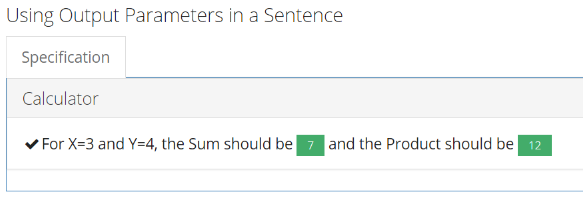

The week in .NET: On .NET on Orchard 2 - Mocking on Core - StoryTeller
=======================================================================

To read last week's post, see [The week in .NET: On .NET with Steeltoe – C# Functional Extensions – Firewatch](https://blogs.msdn.microsoft.com/dotnet/2016/09/20/the-week-in-net-on-net-with-steeltoe-c-functional-extensions-firewatch/).

On .NET
-------

Last week, [Sébastien Ros was on the show](xx) to talk about [Orchard 2](https://github.com/orchardcms/orchard2):

<iframe src="https://channel9.msdn.com/Shows/On-NET/Sbastien-Ros-Orchard-2/player" width="560" height="315" allowFullScreen frameBorder="0"></iframe>

This week, we'll speak with [JB Evain](http://evain.net/) about his work on the [Visual Studio 2015 Tools](https://visualstudiogallery.msdn.microsoft.com/8d26236e-4a64-4d64-8486-7df95156aba9) for [Unity](https://unity3d.com/),  and maybe also [Cecil](https://github.com/jbevain/cecil). The show begins at 12PM Pacific Time (note that's 2 hours later than usual) [on Channel 9](https://channel9.msdn.com/Shows/On-NET). We'll take questions on Gitter, on [the dotnet/home channel](https://gitter.im/dotnet/home). Please use the `#onnet` tag. It's OK to start sending us questions in advance if you can't do it live during the show.

Mocking on .NET Core
--------------------

Three major .NET mocking frameworks now have official pre-releases with .NET Standard support:

* [FakeItEasy](https://ci.appveyor.com/nuget/FakeItEasy) (nuget feed from AppVeyor CI builds).
* [Moq](https://www.nuget.org/packages/Moq/4.6.38-alpha): Note that there is another "moq.netcore" package from the ASP.NET team's MyGet feed. It is an obsolete private fork meant to unblock testing in the early days before Moq had releases that support .NET Standard. Consumers of the "moq.netcore" package should switch to use the latest official Moq package.
* [NSubstitute](https://www.nuget.org/packages/NSubstitute/2.0.0-rc).

Package of the week: Storyteller
--------------------------------

[BDD](https://en.wikipedia.org/wiki/Behavior-driven_development) enables you to focus on the functional behavior your code should have. Its products are runnable code expressed in plain English, and are thus easy to validate by non-technical stakeholders, converging specification and testing. The natural language used in BDD also opens some really interesting scenarios, such as documentation that lives on with the code.

[StoryTeller](http://storyteller.github.io/) is such a BDD package for .NET (soon on .NET Core), that is perfect for integration testing, executable specifications, and living documentation. [StoryTeller 3.0](https://jeremydmiller.com/2016/09/19/storyteller-3-0-official-release-and-on-to-4-0/) was just released, and it's used by [StructureMap](http://structuremap.github.io/), [Marten](http://jasperfx.github.io/marten), and of course StoryTeller itself.



```csharp
[FormatAs("Adding {x} to {y} should equal {returnValue}")]
public double AddingNumbersTogether(double x, double y)
{
    _calculator.Value = x;
    _calculator.Add(y);
    return _calculator.Value;
}
```

Blogger of the week: Muhammad Rehan Saeed
-----------------------------------------

[Muhammad Rehan Saeed](http://rehansaeed.com/) appears in Week in .NET almost weekly, with long-form, detailed posts that are absolutely outstanding. We are featuring two of his posts this week. Check them out!

User group meeting of the week: Deep Dive to Azure IoT Hub in Edmondton, Alberta
--------------------------------------------------------------------------------

On Wednesday, September 28, in Edmonton, Alberta, Canada, Sergii Baidachnyi is taking you on [a deep dive into Azure's IoT hub](http://www.meetup.com/Edmonton-NET-User-Group/events/234182774/) with the [Edmonton .NET User Group](http://www.meetup.com/Edmonton-NET-User-Group/).

.NET
----

* [Introducing .NET Standard](https://blogs.msdn.microsoft.com/dotnet/2016/09/26/introducing-net-standard/) by Immo Landwerth.
* [Get started with VS Code using C# and .NET Core](https://channel9.msdn.com/Blogs/dotnet/Get-started-with-VS-Code-using-CSharp-and-NET-Core) by Kendra Havens.
* [GLAD is available](https://blogs.msdn.microsoft.com/maoni/2016/09/19/556/) by Maoni Stephens.
* [Announcing the DotNetCompilerPlatform 1.0.2 release](https://blogs.msdn.microsoft.com/webdev/2016/09/20/announcing-the-dotnetcompilerplatform-1-0-2-release/) by Matt FJH.
* [Cake v0.16.0 released](http://cakebuild.net/blog/2016/09/cake-v0-16-0-released) by Patrik Svensson.
* [When a disk cache performs better than an in-memory cache (befriending the .net GC)](http://www.productiverage.com/when-a-disk-cache-performs-better-than-an-inmemory-cache-befriending-the-net-gc) by Productive Rage.
* [The Dotnet Watch Tool](http://rehansaeed.com/the-dotnet-watch-tool/) by Muhammad Rehan Saeed.
* [Deal with Swallowed Exceptions Magically with IL Weaving](https://buildplease.com/pages/ilweaving/) by Nick Chamberlain.
* [September Update to docs.microsoft.com](https://docs.microsoft.com/teamblog/september-docs-update/) by Jeff Sandquist.

ASP.NET
-------

* [Reusing Configuration Files in ASP.NET Core](https://blogs.msdn.microsoft.com/dotnet/2016/09/21/reusing-configuration-files-in-asp-net-core/) by Connie Yau.
* [Introducing IdentityServer4 for authentication and access control in ASP.NET Core](https://blogs.msdn.microsoft.com/webdev/2016/09/19/introducing-identityserver4-for-authentication-and-access-control-in-asp-net-core/) by Jeffrey T. Fritz.
* [IdentityServer4 RC1](https://leastprivilege.com/2016/09/06/identityserver4-rc1/) by Dominick Baier.
* [NGINX for ASP.NET Core In-Depth](http://rehansaeed.com/nginx-asp-net-core-depth/) by Muhammad Rehan Saeed.
* [To do: write "to do" app with ASP.Net Core](https://medium.com/@ThisisZone/to-do-write-to-do-app-with-asp-net-core-c02bc3ca9fa1#.6s0c2rjx1) by Andy Butland.
* [Use NancyFx in ASP.NET Core](http://www.talkingdotnet.com/use-nancyfx-in-asp-net-core/) by Talking Dotnet.
* [Step by step: ASP.NET Core on Docker](https://carlos.mendible.com/2016/09/26/step-by-step-asp-net-core-on-docker/) by Carlos Mendible.
* [Adding Localisation to an ASP.NET Core application](https://andrewlock.net/adding-localisation-to-an-asp-net-core-application/) and [How to use machine-specific configuration with ASP.NET Core](https://andrewlock.net/how-to-use-machine-specific-configuration-with-asp-net-core/) by Andrew Lock.
* [Troubleshooting High CPU Usage of a .NET Web Application](http://www.codeproject.com/Tips/1130593/Troubleshooting-High-CPU-Usage-of-a-NET-Web-Applic) by Paulo Henrique S.S.

F#
--

* [xUnit-Jet – Open Sourced](https://tech.jet.com/blog/2016/09-14-xunit-jet-open-sourced/) by Rand Davis.
* [F# and ASP.NET Core (video)](https://www.youtube.com/watch?v=zYi4ev6ll0Y), by Enrico Sada via Community for F#.
* [F# in the Real World (video)](https://vimeo.com/183301783), by Yan Cui
* [Xando: Down the rabbit hole of CQRS and Event Sourcing](http://alxandr.me/2016/09/19/xando-pt-1), by alxandr
* [Absolute layout and relative layout Xamarin Forms](https://kimsereyblog.blogspot.com.by/2016/09/absolute-layout-and-relative-layout.html), by Kimserey Lam
* [Using F# and Canopy for UI Testing](http://www.jeremybellows.com/blog/Using-Fsharp-and-Canopy-for-UI-Testing), by Jeremy Bellows
* [Learning F#, ASP.NET Core, and Polymer](https://github.com/joeaudette/playground/blob/master/spa-stack/README.md) by Joe Audette.

Check out [F# Weekly](https://sergeytihon.wordpress.com/category/f-weekly/) for more great content from the F# community.

Xamarin
-------

* [Scaling from Side Project to 200,000+ Downloads with Xamarin and Microsoft Azure](https://blog.xamarin.com/scaling-from-side-project-to-200000-downloads-with-xamarin-and-microsoft-azure/) by Courtney Witmer.
* [Start Building Azure-Connected Apps with the Xamarin Shopping Demo App](https://blog.xamarin.com/start-building-azure-connected-apps-with-the-xamarin-shopping-demo-app/) by Mike James.
* [Xamarin Around the World with Xamarin Dev Days](https://blog.xamarin.com/xamarin-around-the-world-with-xamarin-dev-days/) by Jayme Singleton.
* [New iOS 10 Privacy Permission Settings](https://blog.xamarin.com/new-ios-10-privacy-permission-settings/), [The Xamarin Show 2 - Continuous Integration with Simina Pasat](https://channel9.msdn.com/Shows/XamarinShow/Continuous-Integration-with-Simina-Pasat), and [The Xamarin Show - Snack Pack 1: Android Emulators](https://channel9.msdn.com/Shows/XamarinShow/Snack-Pack-1-Android-Emulators) by James Montemagno.
* [Preview: iOS Simulator (for Windows) Update 4](https://releases.xamarin.com/preview-ios-simulator-for-windows-update-4/) by Adrian Murphy.
* [NuGet Support in Xamarin Studio 6.1](http://lastexitcode.com/blog/2016/09/17/NuGetSupportInXamarinStudio6-1/) by Matt Ward.
* [Xamarin Forms Triggers vs Behaviors vs Effects](https://xamarinhelp.com/xamarin-forms-triggers-behaviors-effects/) by Adam Pedley.
* [Hololens app with UrhoSharp : Introduction – Part 1](http://blog.lordinaire.fr/2016/09/xamarin-build-hololens-apps-with-urhosharp-part-1/) by Maxime Frappat.
* [Hololens – Xamarin, URHO and an Spatial Mapping sample (with 2 more lines of code it became a Shooting Game)](https://elbruno.com/2016/09/19/hololens-xamarin-urho-and-an-spatial-mapping-sample-with-2-more-lines-of-code-it-became-a-shooting-game/) by Bruno Capuano.
* [The Thumb Zone: Designing For Mobile Users](https://www.smashingmagazine.com/2016/09/the-thumb-zone-designing-for-mobile-users) by Samantha Ingram.
* [Fix for UITest crashing after Xamarin Studio update to 6.1 (build 5441) fails with SetUp : System.InvalidOperationException](http://www.xradapp.com/fix-for-uitest-crashing-after-xamarin-studio-update-to-6-1-build-5441-fails-with-setup-system-invalidoperationexception/) by Mark J Radacz.
* [Yet Another Podcast #164 – Azure Mobile Apps with Chris Risner](http://jesseliberty.com/2016/09/19/yet-another-podcast-164-azure-mobile-apps-with-chris-risner/) by Jesse Liberty.

Azure
-----

* [Azure Functions in practice](https://www.troyhunt.com/azure-functions-in-practice/) by Troy Hunt.
* [Tutorial: Launch Your ASP.NET Core WebApp on Azure with TLS & Authentication](https://stormpath.com/blog/dotnet-core-azure-lets-encrypt-authentication) by Laura Rodriguez.

Games
-----

* [Unity 2D: Checking if a Character or Object is on the Ground using Raycasts](https://kylewbanks.com/blog/unity-2d-checking-if-a-character-or-object-is-on-the-ground-using-raycasts) by Kyle Banks.


And this is it for this week!

Contribute to the week in .NET
------------------------------

As always, this weekly post couldn't exist without community contributions, and I'd like to thank all those who sent links and tips. The F# section is provided by Phillip Carter, the gaming section by Stacey Haffner, and the Xamarin section by Dan Rigby.

You can participate too. Did you write a great blog post, or just read one? Do you want everyone to know about an amazing new contribution or a useful library? Did you make or play a great game built on .NET?
We'd love to hear from you, and feature your contributions on future posts:

* Send an email to beleroy at Microsoft,
* [comment on this gist](https://gist.github.com/bleroy/dab191a0bfc1909b777aed2b3fdb7f09)
* Leave us a pointer in the comments section below.
* [Send Stacey (@yecats131) tips on Twitter about .NET games](https://twitter.com/yecats131).

This week's post (and future posts) also contains news I first read on [The ASP.NET Community Standup](https://blogs.msdn.microsoft.com/webdev/tag/communitystandup/), on [Weekly Xamarin](http://weeklyxamarin.com/), on [F# weekly](https://sergeytihon.wordpress.com/category/f-weekly/), on [ASP.NET Weekly](http://www.aspnetweekly.com/), and on [Chris Alcock's The Morning Brew](http://themorningbrew.net/).
