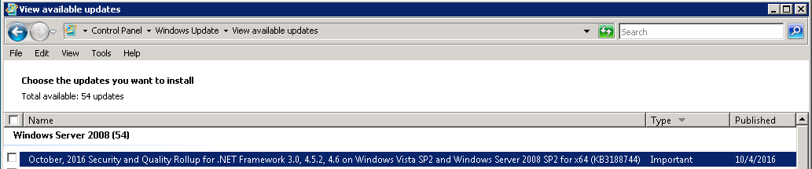
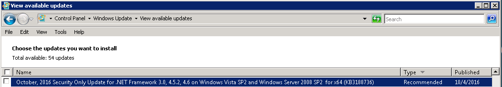
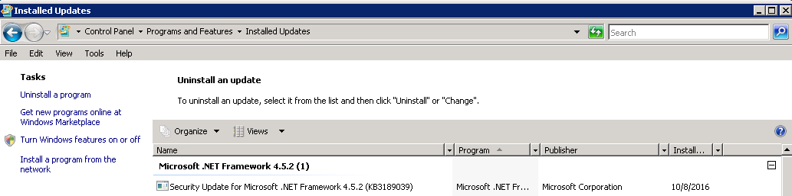

# .NET Framework Monthly Rollups Explained

We recently introduced the [.NET Framework Monthly Rollup](https://blogs.msdn.microsoft.com/dotnet/2016/08/15/introducing-the-net-framework-monthly-rollup/), a new and simpler way for you to install all applicable .NET Framework updates in a single step. We wanted to go into more depth on these new releases.

This post describes the three monthly update types that you can install. It shows you what the install process looks like and addresses some common questions that we have heard since introducing the new model.

The introduction of these new monthly releases aligns with a similar set of [monthly Windows releases](https://blogs.technet.microsoft.com/windowsitpro/2016/10/07/more-on-windows-7-and-windows-8-1-servicing-changes/) that you can also learn more about.

## Monthly Releases
There are three kinds of updates that you can choose from. You can read the descriptions below to help you pick the best one for your situation. 

### Security and Quality Rollup
The Security and Quality Rollup  is recommended for consumer and developer machines. It includes both security and quality improvements and is cumulative, meaning that it contains all of the updates from previous rollups. This makes it easy to catch up if you have missed any of the previous updates. The Security and Quality Rollup update will be made available on Windows Update and Windows Update Catalog. 

- When: Second Tuesday of the month (Patch Tuesday).
- Where: Windows Update, Windows Server Update Services and Microsoft Update Catalog.
- Cumulative: Yes.
- Contents: Security and/or quality improvements.

### Security-Only Update
The Security-Only Update is recommended for production machines. It contains only the security updates that are new for that month. This enables you to fine-tune the security updates that are applied. If you have installed the Security and Quality Rollup for the month, then you are up to date and do not need to install the Security-Only Update. The Security-Only Update will be made available on Windows Server Update Services and Microsoft Update Catalog. 

- When: Second Tuesday of the month (Patch Tuesday).
- Where: Windows Server Update Services, Microsoft Update Catalog.
- Cumulative: No.
- Contents: Security improvements.

### Quality Rollup
The Quality Rollup is recommended for large businesses that want to use and/or preview quality improvements as soon as they become available. These same quality improvements will typically be included in the following Security and Quality Rollup, approximately three weeks later. The Quality Rollup will be made available on Windows Update, Windows Server Update Services and Microsoft Update Catalog. 

- When: Typically the Third Tuesday of the Month (one week after Patch Tuesday).
- Where: Windows Update, Windows Server Update Services and Microsoft Update Catalog.
- Cumulative: Yes.
- Contents: Quality improvements.

## More Information

The following information answers common questions.

### Including Past Updates
The Security and Quality Rollup and Quality Rollup will contain all of the past updates for .NET Framework 4.5.x and 4.6.x.

The rollups will not contain all past updates for .NET Framework 3.5 at first. The remainder of past .NET Framework 3.5 updates will be included over time. We will notify you on our blog when the monthly rollups include all of the past .NET Framework 3.5 updates. 

### Supported .NET Framework Versions

These new releases apply to [supported .NET Framework versions](https://support.microsoft.com/en-us/gp/framework_faq/en-us). This means that you need to install a supported version of the .NET Framework to get these updates. At the time of writing, the supported versions are:

- .NET Framework 3.5 SP1
- .NET Framework 4.5.2 or later

### Supported OS Versions
These new releases apply to Windows Vista SP2, Windows 7 SP1, Windows 8.1, Windows Server 2008 SP2, Windows Server 2008 R2, Windows Server 2012 and Windows Server 2012 R2. 

On Windows 10, these same .NET Framework security and quality updates are included in [Monthly Windows Updates](https://technet.microsoft.com/en-us/itpro/windows/plan/windows-10-servicing-options#the-windows-servicing-model).

## Cadence

We intend to ship updates monthly, however, we will only release updates if we have made changes. Also, some changes only apply to a subset of .NET Framework versions and/or Windows versions.

## Updating to a later .NET Framework

These updates include patch-level changes. They will not upgrade the .NET Framework that is currently installed on your computer to a newer version. For example, if you have .NET Framework 4.5.2 but do not have 4.6.2, you will still not have .NET Framework 4.6.2 after installing one of these updates. If you want to upgrade to a later .NET Framework version, you must install it separately.

## Installation

You will see a single item for each operating system:
 

*Security and Quality Rollup on Windows Server 2008 SP2*

*Security-Only Update on Windows Server 2008 SP2*

We’ve been asked a lot about the uninstall experience for these releases. The Security and Quality Rollup above appears as a single installation. It is possible to remove the release for a specific version of the .NET Framework after the update has been applied.

For example, if you installed the Security and Quality Rollup and you have .NET Framework 3.5 and 4.5.2 installed, you can uninstall the .NET Framework 3.5 Security and Quality Rollup, leaving only the .NET Framework 4.5.2 Security and Quality Rollup on your computer. You can do the opposite, too.

In the image below, you can see that the version-specific updates are displayed in the “Uninstall Updates” dialog in Add or Remote Programs:

*Installed Security-Only Update on WIndows Server 2008 SP2*

# Closing

You now have a simpler way to stay current with the latest updates to the .NET Framework. There are three releases to choose from, a Security and Quality Rollup for most users and Security-Only and Quality-Only releases for those who want more control and an opportunity to preview changes before they are released more broadly.

For most users, you’ll get the latest changes in Windows Update each month, which isn’t much different than the experience today. Some of you will need to do a bit more planning on moving to the Security-Only and/or Quality-Only releases.

This new model is aligned with a similar set of Windows changes. On Windows 10, the .NET Framework changes are included in the Windows updates.

We’d like to hear feedback on how these release work for you and how you are approaching them in your environment. We’ll post the specific updates on the blog so that you know what we’ve released and if they are applicable to your environment.