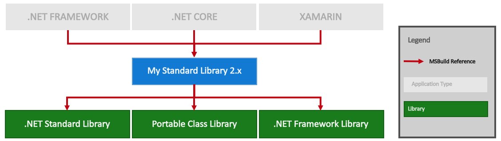
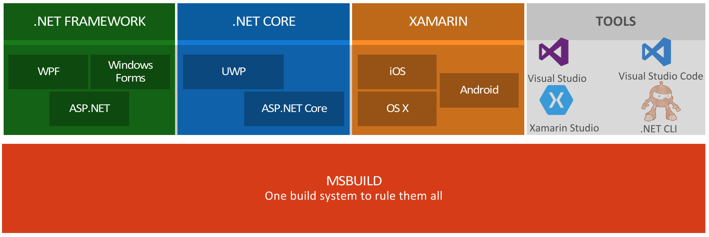
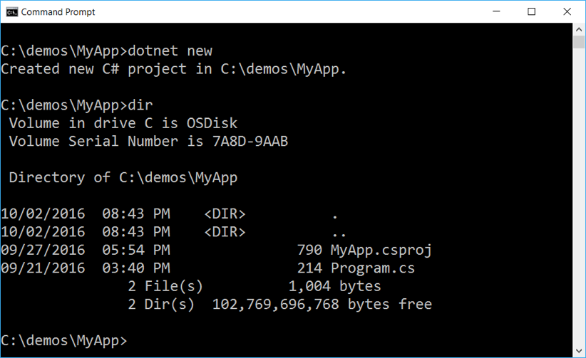
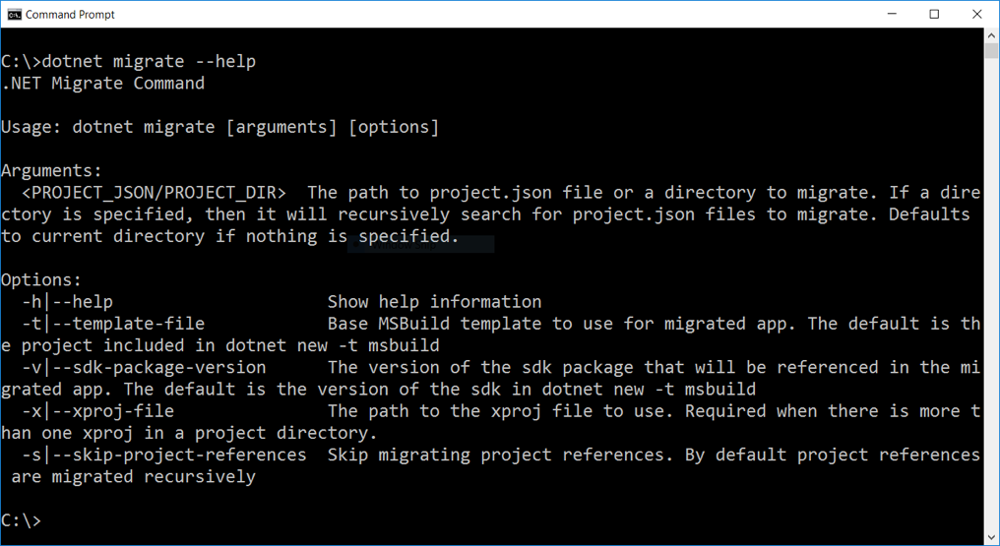

.NET Core Tooling in Visual Studio “15”
=======================================

We released .NET Core 1.0 back in June. This included runtime and tools components. The tools provide you with a development experience in Visual Studio, Visual Studio Code and at the command line. We are updating the tools to make them more similar to existing .NET tools and work much better with other project types.

We started telling you about the [changes to project.json](https://blogs.msdn.microsoft.com/dotnet/2016/05/23/changes-to-project-json/), back in May. We’ve made a lot of progress since then. We now want to tell you about the new experience, based on MSBuild and the CSProj file format. This also includes changes to the command line experience and migration of existing projects.

One of the key advantages of the .NET platform is that you can share code across cloud, desktop and mobile applications. You may have read Immo’s blog post last week [Introducing .NET Standard](https://blogs.msdn.microsoft.com/dotnet/2016/09/26/introducing-net-standard/), which will significantly extend your ability to share code. The .NET Core tooling changes are aligned with that, establishing a standard build and project format for .NET, actually re-adopting the MSBuild system we already had.

For the impatient: TL;DR
------------------------

The new .NET Core tools provide a build and project system that is familiar to .NET developers.  It makes .NET Core application and .NET Standard Library projects just another kind of .NET project you can use in Visual Studio and with other project types in the ways you want and expect.

Here are the key improved experiences:

- **Project references work:** You can reference .NET Core and .NET Standard Library projects from existing .NET projects (WPF, ASP.NET, Xamarin, Unity, …) and the opposite direction is true, too, per the [.NET Standard](https://blogs.msdn.microsoft.com/dotnet/2016/09/26/introducing-net-standard/) post.
- **Package references are integrated:** NuGet package references are now a CSProj reference, not a special file using its own format.
- **Cross-targeting support:** You can cross-target multiple target frameworks in one project.
- **Simplified CSProj format:** The CSProj format has been made as minimal as possible to make it easier to edit by hand for VS Code and command line scenarios. Hand-editing is optional and not required in Visual Studio.
- **Support for file wildcards:** No requirement to list individual files in the project file. This is part of the CSProj simplification, but a big improvement on its own.
- **Migration of project.json/xproj to csproj** : You can seamlessly migrate your existing .NET Core projects from project.json to csproj, in Visual Studio or at the command line.

This new set of tools and improvements provides a big step forward in the experience. We've preserved key project.json characteristics that many of you have told us you value while resolving it's key gaps (primarily the first point above).

Why do we need a standard Build System?
---------------------------------------

> Give a .NET developer 5 mins with a new project type and she'll find an opportunity to reuse existing code. 

We've been talking recently about [.NET Standard 2.0](https://blogs.msdn.microsoft.com/dotnet/2016/09/26/introducing-net-standard/). It will give you access to many more APIs and can be used to share code across all the apps you are working on. That sounds great! It turns out that a key enabler of this outcome is a standard build system. In absense of that, the .NET Standard 2.0 vision doesn't really work. .NET Standard requires a standard API and standard project types to act as currencies within a standard build system. With those in place, you can flow code to all the places you want. 

The following image demonstrates the various project references that .NET Standard 2.0 will enable, adapted from the .NET Standard blog post. The image demonstrates which of the references must be MSBuild-based in order for the system to work. Hint: it's all of them.



Let's take a look at the architecture that this establishes. The following likely familiar style of image shows that MSBuild is a base mechansism for both the project types and the tools. Certainly, MSBuild is not used at runtime for those project types, but it is neccessary in order to make sure the various project to project and NuGet references work correctly.



MSBuild is the build system that we will use for all .NET project types. .NET Core is the only one that isn't using it today, so it's the only one that has to change. This includes .NET Standard Library projects. As stated above, with all project types using the same build system and project formats, it's easy and intuitive to re-use libraries across different project types.

The New Tools Experience at the Command line
--------------------------------------------

The new tools experience is intended to have similar ease-of-use as the existing project.json system, with a better experience if you want to switch back and forth with Visual Studio. The following walkthrough is intended to demonstrate that. Today's post focusses on the command line experience. We will publish another post at a later date that walks through the same experiences in Visual Studio "15".

Note: Currently, CSProj editing is manual, when working outside of Visual Studio. We intend to add `dotnet` commands that will update CSProj and SLN files for common tasks, such as adding a NuGet package.

Note: The CSProj improvements that are described will appear first in the .NET Core and .NET Standard Library project types. They will appear in other project types over time, as appropriate.

### New Template

`dotnet new` is the command to use to create new templates with the .NET Core command line tools. It will generates a CSProj project and `Program.cs` files. The CSProj file will be given the same name as the directory by default. You can see the new experience in the image below.



### CSProj Format

The CSProj file format has been significantly simplified to make it more friendly for the command line experience. If you are familiar with project.json, you can see that if contains very similar information. It also supports a wildcard syntax, to avoid the need of listing individual source files. 

This is the default CSProj that `dotnet new` creates. It provides you with access to all of the assemblies that are part of the .NET Core runtime install, such as System.Collections. It also provides access to all of the tools and targets that comes with the .NET Core SDK.

```xml
<Project>
  <Import Project="$(MSBuildExtensionsPath)\$(MSBuildToolsVersion)\Microsoft.Common.props" />
  <PropertyGroup>
    <VersionPrefix>1.0.0</VersionPrefix>
    <OutputType>Exe</OutputType>
    <TargetFramework>netcoreapp1.0</TargetFramework>
  </PropertyGroup>
  <ItemGroup>
    <Compile Include="**\*.cs" />
  </ItemGroup>
  <ItemGroup>
    <PackageReference Include="Microsoft.NETCore.App" Version="1.0.0" />
    <PackageReference Include="Microsoft.NET.SDK" Version="1.0.0" />
  </ItemGroup>
  <Import Project="$(MSBuildToolsPath)\Microsoft.CSharp.targets" />
</Project>
```

### NuGet Package references

You can add NuGet package references within the CSProj format, instead of needing to specify them in a separate file with a special format. NuGet pacakge references take the following form: `<PackageReference Include="[Package-Name]" Version="[Package-Version]" />`.
 
You can see the same CSProj example from above, with an additional package reference include, here to [WindowsAzure.Storage](https://www.nuget.org/packages/WindowsAzure.Storage/):

``` xml
<Project>
  <Import Project="$(MSBuildExtensionsPath)\$(MSBuildToolsVersion)\Microsoft.Common.props" />
  <PropertyGroup>
    <VersionPrefix>1.0.0</VersionPrefix>
    <OutputType>Exe</OutputType>
    <TargetFramework>netcoreapp1.0</TargetFramework>
  </PropertyGroup>
  <ItemGroup>
    <Compile Include="**\*.cs" />
  </ItemGroup>
  <ItemGroup>
    <PackageReference Include="Microsoft.NETCore.App" Version="1.0.0" />
    <PackageReference Include="Microsoft.NET.SDK" Version="1.0.0" />
    <PackageReference Include="WindowsAzure.Storage" Version="7.2.1" />
  </ItemGroup>
  <Import Project="$(MSBuildToolsPath)\Microsoft.CSharp.targets" />
</Project>
```
### Cross-targeting

In the most cases, you will target a single .NET Core, .NET Framework or .NET Standard target with your library. Sometimes you need more flexibility and have to produce multiple assets. MSBuild now suppports cross-targeting as a key scenario. You can see the syntax below to specify the set of targets that you want to build for, as a semicolon-separated list.

``` xml
<PropertyGroup>
    <VersionPrefix>1.0.0</VersionPrefix>
    <TargetFrameworks>netstandard16;net452</TargetFrameworks>
</PropertyGroup>
 ```

 You can see this same information within a complete CSProj file:

``` xml
<Project>
  <Import Project="$(MSBuildExtensionsPath)\$(MSBuildToolsVersion)\Microsoft.Common.props" />
  <PropertyGroup>
    <VersionPrefix>1.0.0</VersionPrefix>
    <OutputType>Exe</OutputType>
    <TargetFramework>netcoreapp1.0</TargetFramework>
  </PropertyGroup>
  <PropertyGroup>
    <VersionPrefix>1.0.0</VersionPrefix>
    <TargetFrameworks>netstandard16;net452</TargetFrameworks>
  </PropertyGroup>
  <ItemGroup>
    <Compile Include="**\*.cs" />
  </ItemGroup>
  <ItemGroup>
    <PackageReference Include="Microsoft.NETCore.App" Version="1.0.0" />
    <PackageReference Include="Microsoft.NET.SDK" Version="1.0.0" />
  </ItemGroup>
  <Import Project="$(MSBuildToolsPath)\Microsoft.CSharp.targets" />
</Project>
```

To make cross-targeting useful, you need to use conditional compilation to enable or disable blocks of code, per #defines. The build will set the correct #defines that the target frameworks you have specified. In this case, the following #defines would be usable witin your code.

- #defineA
- #defineB

### Project Migration

You will be able to migrate existing project.json projects to CSProj. You can see the following project.json file, created with the existing `dotnet new` command migrated to the new CSProj format with `dotnet migrate`.

```json
{
  "version": "1.0.0-*",
  "buildOptions": {
    "debugType": "portable",
    "emitEntryPoint": true
  },
  "dependencies": {},
  "frameworks": {
    "netcoreapp1.0": {
      "dependencies": {
        "Microsoft.NETCore.App": {
          "type": "platform",
          "version": "1.0.1"
        }
      },
      "imports": "dnxcore50"
    }
  }
}
```



```xml
<Project>
  <Import Project="$(MSBuildExtensionsPath)\$(MSBuildToolsVersion)\Microsoft.Common.props" />
  <PropertyGroup>
    <VersionPrefix>1.0.0</VersionPrefix>
    <OutputType>Exe</OutputType>
    <TargetFramework>netcoreapp1.0</TargetFramework>
  </PropertyGroup>
  <ItemGroup>
    <Compile Include="**\*.cs" />
  </ItemGroup>
  <ItemGroup>
    <PackageReference Include="Microsoft.NETCore.App" Version="1.0.0" />
    <PackageReference Include="Microsoft.NET.SDK" Version="1.0.0" />
  </ItemGroup>
  <Import Project="$(MSBuildToolsPath)\Microsoft.CSharp.targets" />
</Project>
```

The .NET and ASP.NET Teams created some very large project.json projects as part of shipping .NET Core and ASP.NET Core 1.0. We are using them as test cases for the migrate command. Once those projects are migrating without issue, we'll know that we're close to having a great solution for everyone. This is one of the projects what we're working on currently.

Build System Performance
------------------------

Is there anything we can say on this topic? Too early?

.NET CLI commands
-----------------

There are a set of useful command exposed by the .NET CLI tools. `dotnet restore`, `dotnet build`, `dotnet publish` and `dotnet pack` are good examples. These commands will continue to be included with the .NET CLI and do largely the same thing as before, with the exception that they will be implemented on top of MSBuild, as appropriate.

The .NET CLI moves to providing a much thinner layer on MSBuild, much thinner that it did as the build system for project.json. The primary role for the .NET CLI is to provide a user-friendly experience for executing MSBuild commands and also as a single tools host for commands that do not use MSBuild, such as `dotnet new`.

Closing
-------

We are in the process of building the new tools and related experiences that you've seen earlier in this post. In fact, we have all of these scenarios working at a basic level. We're focussed on polishing the command line experience and integrating into Visual Studio, Visual Studio Code and Xamarin Studio.

We're love to hear your feedback on these new plans. We think that these changes are a big step forward for .NET Core and .NET Standard Library projects. We're excited to ship an preview update to you later this year and a final version with Visual Studio "15". Please cotinue to give us feedback as you start using those releases.
