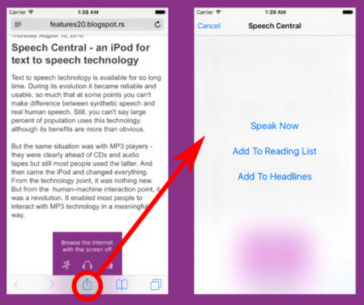

The week in .NET - On .NET on Cecil - NAudio - SpeechCentral
============================================================

To read last week's post, see [The week in .NET: On .NET on Orchard 2 – Mocking on Core – StoryTeller – Armello](https://blogs.msdn.microsoft.com/dotnet/2016/09/27/the-week-in-net-on-net-on-orchard-2-mocking-on-core-storyteller-armello/).

On .NET
-------

Last week, [JB Evain was on the show](https://channel9.msdn.com/Shows/On-NET/JB-Evain-Cecil-modifying-IL):

<iframe src="https://channel9.msdn.com/Shows/On-NET/JB-Evain-Cecil-modifying-IL/player" width="640" height="360" allowFullScreen frameBorder="0"></iframe>

This week, we'll speak with [Immo Landwerth](https://twitter.com/terrajobst) from the .NET team about [NetStandard 2.0](https://blogs.msdn.microsoft.com/dotnet/2016/09/26/introducing-net-standard/). The show begins at 10AM Pacific Time [on Channel 9](https://channel9.msdn.com/Shows/On-NET). We'll take questions on Gitter, on [the dotnet/home channel](https://gitter.im/dotnet/home). Please use the `#onnet` tag. It's OK to start sending us questions in advance if you can't do it live during the show.

Package of the week: NAudio
---------------------------

[NAudio](https://github.com/naudio/NAudio) is a library for reading, writing, decoding, encoding, converting, and playing audio files.

The following code concatenates audio files.

```csharp
public static void Combine(string[] inputFiles, Stream output)
{
    foreach (string file in inputFiles)
    {
        Mp3FileReader reader = new Mp3FileReader(file);
        if ((output.Position == 0) && (reader.Id3v2Tag != null))
        {
            output.Write(reader.Id3v2Tag.RawData, 0, reader.Id3v2Tag.RawData.Length);
        }
        Mp3Frame frame;
        while ((frame = reader.ReadNextFrame()) != null)
        {
            output.Write(frame.RawData, 0, frame.RawData.Length);
        }
    }
}
```

Xamarin App of the week: Speech Central
--------------------------------------

[Speech Central](https://itunes.apple.com/us/app/speech-central-take-web-on/id1127349155?ls=1&mt=8) is an iPhone app that lets you enjoy the Internet with the screen off, using vocal commands and speech. You can keep up with the news while you perform another activity, saving significantly on your battery and data plan.

Speech Central was built in C# using Xamarin.



User group meeting of the week: Real World Examples of Azure Functions in Seattle
---------------------------------------------------------------------------------

[.netda](http://www.meetup.com/NET-Developers-Association-Westside/) is hosting a meeting tonight at 7:00PM on [Real World Examples of Azure Functions](http://www.meetup.com/NET-Developers-Association-Westside/events/234174442/).

Game of the week: Hand of Fate
------------------------------

[Hand of Fate](http://www.defiantdev.com/hof1.html) is a cross between action, RPG and deck building game play. Challenge the Dealer, a mysterious game master, while you battle your way beyond the thirteen gates at the end of the world. In Hand of Fate, you must make strategic decisions when building your deck and see the consequences of those decisions play out in the traditional RPG/action combat style. Hand of Fate features unique deck building mechanics, hundreds of encounters, items, armor, weapons and mysteries. 


[Hand of Fate](http://armello.com/) was created by [Defiant Development](http://www.defiantdev.com/) using [Unity](https://unity3d.com/) and [C#](https://channel9.msdn.com/Series/C-Sharp-Fundamentals-Development-for-Absolute-Beginners). It is available on Xbox One, PlayStation 4 and Windows, Mac and Linux on [Steam](http://store.steampowered.com/app/266510/).

.NET
----

* [Scientist.NET 1.0 released!](http://haacked.com/archive/2016/09/29/scientist-1.0-released/) by Phil Haack.
* [TLS 1.2 Comes to Mono: Update](http://tirania.org/blog/archive/2016/Sep-30.html) by Miguel de Icaza.
* [Storing and using secrets in Azure](https://blogs.msdn.microsoft.com/dotnet/2016/10/03/storing-and-using-secrets-in-azure/) by Bertrand Le Roy.
* [An Experience Report of Moving a Complicated Codebase to the CoreCLR](https://jeremydmiller.com/2016/09/28/an-experience-report-of-moving-a-complicated-codebase-to-the-coreclr/) by Jeremy D. Miller.
* [Implementing Seeding, Custom Conventions and Interceptors in EF Core 1.0](https://blogs.msdn.microsoft.com/dotnet/2016/09/29/implementing-seeding-custom-conventions-and-interceptors-in-ef-core-1-0/) by Alina Popa.
* [Cake for Visual Studio released](http://cakebuild.net/blog/2016/09/cake-for-visual-studio) and [Announcing Cake for Yeoman](http://cakebuild.net/blog/2016/09/cake-for-yeoman) by Alistair Chapman.
* [How to debug a Cake file using Visual Studio Code](http://cakebuild.net/blog/2016/09/debug-cake-vscode) by Martin Björkström.
* [Optimising LINQ](http://mattwarren.org/2016/09/29/Optimising-LINQ/) and [Adding a verb to the dotnet CLI tooling](http://mattwarren.org/2016/10/03/Adding-a-verb-to-the-dotnet-CLI-tooling/) by Matt Warren.
* [Should I learn .NET Core?](https://jonhilton.net/2016/09/28/should-i-learn-net-core/) by Jon Hilton.

ASP.NET
-------

* [Sharing Authorization Cookies between ASP.NET 4.x and ASP.NET Core 1.0](http://www.hanselman.com/blog/SharingAuthorizationCookiesBetweenASPNET4xAndASPNETCore10.aspx) by Scott Hanselman.
* [External Network Access to Kestrel and IIS Express in ASP.NET Core](https://weblog.west-wind.com/posts/2016/Sep/28/External-Network-Access-to-Kestrel-and-IIS-Express-in-ASPNET-Core) by Rick Strahl.
* [Localising the DisplayAttribute and avoiding magic strings in ASP.NET Core](https://andrewlock.net/localising-the-displayattribute-and-avoiding-magic-strings-in-asp-net-core/) and [Injecting services into ValidationAttributes in ASP.NET Core](https://andrewlock.net/injecting-services-into-validationattributes-in-asp-net-core/) by Andrew Lock.
* [IdentityServer4, Web API and Angular2 in a single ASP.NET Core project](https://damienbod.com/2016/10/01/identityserver4-webapi-and-angular2-in-a-single-asp-net-core-project/) by Damien Bod.
* [Introducing the ASP.Net Async SessionState Module](https://blogs.msdn.microsoft.com/webdev/2016/09/29/introducing-the-asp-net-async-sessionstate-module/) by Matt FJH.
* [Strongly typed configuration in ASP.NET Core without IOptions&lt;T&gt;](http://www.strathweb.com/2016/09/strongly-typed-configuration-in-asp-net-core-without-ioptionst/) by Filip W.
* [ASP.NET Core MVC Attribute Routing](http://codeopinion.com/asp-net-core-mvc-attribute-routing/) by Derek Comartin.
* [Using OpenID Connect](https://blogs.msdn.microsoft.com/mvpawardprogram/2016/09/27/using-openid-connect/) by Shaun Luttin.

F#
--

* [Ionide F# 2.5.0 for VS Code is released, now you can write in F# Interactive!](https://twitter.com/IonideProject/status/780053835729473536)
* [Function Application and Composition](http://sidburn.github.io/blog/2016/09/25/function-application-and-composition) by David Raab.
* [Can programming be liberated from function abstraction?](http://tomasp.net/blog/2016/no-functions/), by Tomas Petricek
* [Using the ALGLIB random forest with F#](http://brandewinder.com/2016/09/25/alglib-random-forest-with-fsharp/), by Mathias Brandewinder
* [Creating Slack Slash Commands With Azure Functions](https://gregshackles.com/creating-slack-slash-commands-with-azure-functions/), by Greg Shackles
* [BuildStats.info |> F#](https://dusted.codes/buildstatsinfo-fsharp), by Dustin Moris Gorski

Check out [F# Weekly](https://sergeytihon.wordpress.com/category/f-weekly/) for more great content from the F# community.

Xamarin
-------

* [Stable Release: Cycle 8 Service Release 0](https://releases.xamarin.com/stable-release-cycle-8-service-release-0/), [Preview: Xamarin Profiler 0.34.2](https://releases.xamarin.com/preview-xamarin-profiler-0-34-2/), [Preview: iOS Simulator (for Windows) Update 5](https://releases.xamarin.com/preview-ios-simulator-for-windows-update-5/), and [Alpha Preview: Xamarin.Mac Support on MacOS 10.12 Sierra](https://releases.xamarin.com/alpha-preview-xamarin-mac-support-on-macos-10-12-sierra/) by Adrian Murphy.
* [HockeySDK 4.1.0 for Xamarin](https://www.hockeyapp.net/blog/2016/09/26/hockeysdk-xamarin-4-1-0.html) by HockeyApp Team.
* [Iowa Caucuses Launch Inaugural Polling Apps with Xamarin](https://blog.xamarin.com/iowa-caucuses-launch-inaugural-polling-apps-with-xamarin/) by Lacey Butler.
* [Speech Recognition in iOS 10](https://blog.xamarin.com/speech-recognition-in-ios-10/) by Pierce Boggan.
* [Enhanced Notifications in Android N with Direct Reply](https://blog.xamarin.com/enhanced-notifications-in-android-n-with-direct-reply/), [Android Archiving and Publishing Made Easy](https://blog.xamarin.com/android-archiving-and-publishing-made-easy/), [The Xamarin Show #3: Xamarin.Forms Performance Tips and Tricks](https://channel9.msdn.com/Shows/XamarinShow/XamarinForms-Performance-Tips-and-Tricks), and [Updating Azure Mobile SQLiteStore to 3.0](http://motzcod.es/post/150988588867/updating-azure-mobile-sqlitestore-to-30) by James Montemagno.
* [Background Audio and Cross Platform Development with Xamarin (App Dev on Xbox series)](https://blogs.windows.com/buildingapps/2016/09/23/background-audio-and-cross-platform-development-with-xamarin-app-dev-on-xbox-series/) by Nikola Metulev.
* [Xamarin vs. Native](https://colbylwilliams.github.io/2016/09/27/xamarin-vs-native.html), [Default Designer](https://colbylwilliams.github.io/2016/09/26/default-designer.html), and [Type Names as Storyboard IDs](https://colbylwilliams.github.io/2016/09/28/type-name-storyboard-id.html) by Colby Williams.
* [Toast Notifications for Xamarin Forms](https://xamarinhelp.com/toast-notifications-xamarin-forms/), [Proxy Pattern To Separate Dependencies](https://xamarinhelp.com/proxy-pattern-separate-dependencies/), and [Layered Dependency Injection](https://xamarinhelp.com/layered-dependency-injection/) by Adam Pedley.
* [Realities of Cross-Platform Development: How Platform-Specific Can You Go?](https://visualstudiomagazine.com/articles/2016/09/01/how-platform-specific-can-you-go.aspx) by Wallace McClure.
* [Debugging provisioning profiles on the command line](http://www.knowing.net/index.php/2016/09/22/debugging-provisioning-profiles-on-the-command-line/) by Larry O'Brien.
* [How To Design Error States For Mobile Apps](https://www.smashingmagazine.com/2016/09/how-to-design-error-states-for-mobile-apps) by Nick Babich.
* [Back It On Up! Android and Xamarin and Backups!](https://codemilltech.com/back-up-xamarin-android/) by Matthew Soucoup.
* [Improving layout performance on Android](http://blog.ostebaronen.dk/2016/09/improving-layout-performance-on-android.html) by Tomasz Cielecki.
* [Genymotion and VirtualBox install issue](http://codeworks.it/blog/?p=502) by Corrado Cavalli.

Azure
-----

* [Azure Functions in practice](https://www.troyhunt.com/azure-functions-in-practice/) by Troy Hunt.

Gaming
------

* [[Unity] Creating a 2D Platformer (E13. max slopes)](https://www.youtube.com/watch?v=1i1hTLU6JTY) by Sebastian Lague
* [Unity - 2D Movement (Part 3B) - Jump : Standard Jump](https://www.youtube.com/watch?v=Kvje4xqB258) by Pixel Make
* [Unity - 2D Movement (Part 4A) - Shoot : Spawn Bullet](https://www.youtube.com/watch?v=xc2jsbYIXjY) by Pixel Make
* [Curated #UnityTips No. 15 by DevDog October 2016](http://devdog.io/blog/2016/10/11-best-unity-tips-for-game-developers-15) by DevDog
* [[Unity 5] Tutorial: How to make a climbing system like in Assassins Creed in Unity - part 9](https://www.youtube.com/watch?v=qOdNKxUe__o&feature=youtu.be) by Gamad

And this is it for this week!

Contribute to the week in .NET
------------------------------

As always, this weekly post couldn't exist without community contributions, and I'd like to thank all those who sent links and tips. The F# section is provided by Phillip Carter, the gaming section by Stacey Haffner, and the Xamarin section by Dan Rigby.

You can participate too. Did you write a great blog post, or just read one? Do you want everyone to know about an amazing new contribution or a useful library? Did you make or play a great game built on .NET?
We'd love to hear from you, and feature your contributions on future posts:

* Send an email to beleroy at Microsoft,
* [comment on this gist](https://gist.github.com/bleroy/ada8c541a285f20a467cdb4c7a984994)
* Leave us a pointer in the comments section below.
* [Send Stacey (@yecats131) tips on Twitter about .NET games](https://twitter.com/yecats131).

This week's post (and future posts) also contains news I first read on [The ASP.NET Community Standup](https://blogs.msdn.microsoft.com/webdev/tag/communitystandup/), on [Weekly Xamarin](http://weeklyxamarin.com/), on [F# weekly](https://sergeytihon.wordpress.com/category/f-weekly/), and on [Chris Alcock's The Morning Brew](http://themorningbrew.net/).
