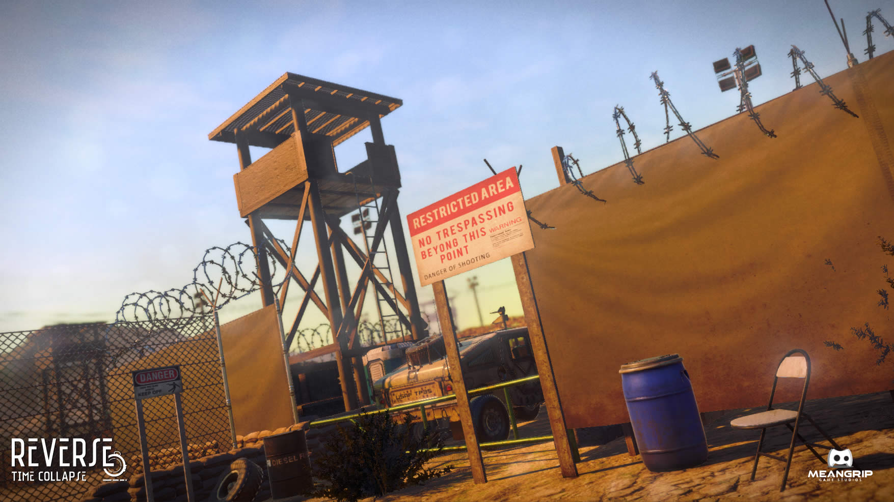

The week in .NET - On .NET on EF Core 1.1 - FluentValidation - Reverse: Time Collapse 
==================================================================

To read last week's post, see [The week in .NET – Bond – The Gallery](https://blogs.msdn.microsoft.com/dotnet/2016/10/18/the-week-in-net-bond-the-gallery/).

On .NET
-------

Last week, [Rowan Miller was on the show](https://channel9.msdn.com/Shows/On-NET/Rowan-Miller-Entity-Framework-Core-11):

<iframe src="https://channel9.msdn.com/Shows/On-NET/Rowan-Miller-Entity-Framework-Core-11/player" width="960" height="540" allowFullScreen frameBorder="0"></iframe>

This week, we'll speak with [Martin Woodward](https://twitter.com/martinwoodward) about [the .NET Foundation](https://www.dotnetfoundation.org/). The show is on Thursdays and begins at 10AM Pacific Time [on Channel 9](https://channel9.msdn.com/Shows/On-NET). We'll take questions on Gitter, on [the dotnet/home channel](https://gitter.im/dotnet/home) and on Twitter. Please use the `#onnet` tag. It's OK to start sending us questions in advance if you can't do it live during the show.

Package of the week: FluentValidation
-------------------------------------

[FluentValidation](https://github.com/JeremySkinner/fluentvalidation) is a lightweight validation library that uses a fluent interface and Lambda expressions for building validation rules. It's written by [Jeremy Skinner](http://www.jeremyskinner.co.uk/) and is compatible with NetStandard 1.0.

```csharp
using FluentValidation;

public class CustomerValidator: AbstractValidator<Customer> {
  public CustomerValidator() {
    RuleFor(customer => customer.Surname).NotEmpty();
    RuleFor(customer => customer.Forename).NotEmpty().WithMessage("Please specify a first name");
    RuleFor(customer => customer.Discount).NotEqual(0).When(customer => customer.HasDiscount);
    RuleFor(customer => customer.Address).Length(20, 250);
    RuleFor(customer => customer.Postcode).Must(BeAValidPostcode).WithMessage("Please specify a valid postcode");
  }

  private bool BeAValidPostcode(string postcode) {
    // custom postcode validating logic goes here
  }
}

Customer customer = new Customer();
CustomerValidator validator = new CustomerValidator();
ValidationResult results = validator.Validate(customer);

bool validationSucceeded = results.IsValid;
IList<ValidationFailure> failures = results.Errors;
```

Game of the week: Reverse: Time Collapse
----------------------------------------

[Reverse: Time Collapse](https://madewith.unity.com/games/reverse-time-collapse) is an action-adventure game that features a unique time travel story, in that time travels backwards. Take on the role of a scientist, a journalist and a secret agent who are forced to time travel as a result of a laboratory accident. Use each of the characters to solve puzzles across time while avoiding the deadly attacks of the Guardians of Time and Secret Service agents. Reverse: Time Collapse explores historical events such as WikiLeaks (2010), the Kennedy Assassination (1963) and Roswell (1947).



[Reverse: Time Collapse](https://madewith.unity.com/games/reverse-time-collapse) is under active development by [Meangrip](http://www.meangrip.com/) using [Unity](https://unity3d.com/) and [C#](https://channel9.msdn.com/Series/C-Sharp-Fundamentals-Development-for-Absolute-Beginners).

User group meeting of the week: VS 2015 with .NET Core Tooling in Raleigh, NC
-----------------------------------------------------------------------------

[TRINUG.NET](http://www.meetup.com/TRINUG/) holds [a meeting on Wednesday, October 26 in Raleigh, NC, to talk about .NET Core tooling in VS 2015](http://www.meetup.com/TRINUG/events/234356387/).

Blogger of the week: Rick Strahl
--------------------------------

Rick's been blogging for as long as I can remember, and his posts are always very detailed and carefully researched. He's a problem solver, and likes to share his findings. It's fair to say that anyone who has been working with .NET for a few years has saved some time thanks to one of Rick's posts at least once. This week's issue features [his latest post](https://weblog.west-wind.com/posts/2016/Oct/16/Error-Handling-and-ExceptionFilter-Dependency-Injection-for-ASPNET-Core-APIs).

.NET
----

* [.NET Core Tooling in Visual Studio “15”](https://blogs.msdn.microsoft.com/dotnet/2016/10/19/net-core-tooling-in-visual-studio-15/) by David Carmona and Joe Morris.
* [Announcing the October 2016 Update for .NET Core 1.0](https://blogs.msdn.microsoft.com/dotnet/2016/10/20/announcing-the-october-2016-update-for-net-core-1-0/) by Lee Coward.
* [Introducing C# script runner for .NET Core and .NET CLI](http://www.strathweb.com/2016/10/introducing-c-script-runner-for-net-core-and-net-cli/) by Filip W.
* [Making .NET code less allocatey - Allocations and the Garbage Collector](https://blog.maartenballiauw.be/post/2016/10/19/making-net-code-less-allocatey-garbage-collector.html) by Maarten Balliauw.
* [Tuples with C# 7.0](https://csharp.christiannagel.com/2016/10/11/tuples/) by Christian Nagel.
* [Generate C# ETW EventSource classes from JSON event specifications using T4](https://github.com/ohadschn/ET4W) by Ohad Schneider.
* [EntityFramework Configuration Provider for .NET Framework & .NET Core](http://www.codeproject.com/Articles/1143199/EntityFramework-Configuration-Provider-for-NET-Fra) by Patrick J. Nolan.
* [Windows 10 1607, UWP and Lifecycle on HoloLens (2)](https://mtaulty.com/2016/10/23/windows-10-1607-uwp-and-lifecycle-on-hololens-2/), [Composition APIs–Walked Through Demo Code](https://mtaulty.com/2016/10/20/windows-10-1607-uwp-composition-apis-walked-through-demo-code/), and [Project Rome–Transferring Browser Tabs Across Devices](https://mtaulty.com/2016/10/20/windows-10-1607-uwp-and-project-rome-transferring-browser-tabs-across-devices/) by Mike Taulty.
* [Why the Command Line? Why now?](http://developer.telerik.com/featured/why-command-line/) by Sam Basu.
* [Multiple optimizations passes with case insensitive routing](https://ayende.com/blog/175841/multiple-optimizations-passes-with-case-insensitive-routing) by Ayende Rahien.
* [Introducing NATSConsumer and .NET Core support](http://danielwertheim.se/introducing-natsconsumer-and-net-core-support/) by Daniel Wertheim.
* [Interception in .NET – Part 3: Static Interception](https://weblogs.asp.net/ricardoperes/interception-in-net-part-3-static-interception) by Ricardo Peres.

ASP.NET
-------

* [Exploring ServiceStack's simple and fast web services on .NET Core](http://www.hanselman.com/blog/ExploringServiceStacksSimpleAndFastWebServicesOnNETCore.aspx) and [Exploring Application Insights for disconnected or connected deep telemetry in ASP.NET Apps](http://www.hanselman.com/blog/ExploringApplicationInsightsForDisconnectedOrConnectedDeepTelemetryInASPNETApps.aspx) by Scott Hanselman.
* [Modifying the UI based on user authorisation in ASP.NET Core](https://andrewlock.net/modifying-the-ui-based-on-user-authorisation-in-asp-net-core/) by Andrew Lock.
* [Angular 2 and ASP.NET Core MVC](http://www.ryansouthgate.com/2016/10/19/angular2-aspnet-core-mvc/) by Ryan Southgate.
* [Creating route links and passing-in values](http://www.neptuo.com/blog/2016/10/24/mvc-route-values/) by Marek Fišera.
* [Contoso University updated to ASP.NET Core](https://lostechies.com/jimmybogard/2016/10/21/contoso-university-updated-to-asp-net-core/) by Jimmy Bogard.
* [Using Apache Web Server as a reverse-proxy for ASP.NET Core](http://tattoocoder.com/using-apache-web-server-as-reverse-proxy-for-aspnetcore/) by Shayne Boyer.
* [Creating a new .NET Core web application, what are your options?](https://jonhilton.net/2016/10/19/creating-a-new-net-core-web-application-what-are-your-options/) by Jon Hilton.
* [Accessing SQL from Entity Framework Core Queries in ASP.NET Core](http://rion.io/2016/10/19/accessing-entity-framework-core-queries-behind-the-scenes-in-asp-net-core/) by Rion Williams.
* [Request Filtering for ASP.NET Core applications: Part 4 - Extending the Request Filtering Rules](http://www.hishambinateya.com/request-filtering-for-asp.net-core-applications:-part-4-extending-the-request-filtering-rules) and [Localization Resource Generator & Translator via "dotnet" CLI](http://www.hishambinateya.com/localization-resource-generator-and-translator-via-dotnet-cli) by Hisham Bin Ateya.
* [ASP.NET Core: Globalization and Localization](http://www.dotnetcurry.com/aspnet/1314/aspnet-core-globalization-localization) by Daniel Jimenez Garcia.
* [Building Apps with Polymer and ASP.NET CORE](http://www.fiyazhasan.me/tag/polymer-series/) and [Don't Share Your Secrets! (.NET CORE Secret Manager Tool)](http://www.fiyazhasan.me/dont-share-your-secrets-asp-net-core-secret-manager-tool/) by Fizz.
* [Error Handling and ExceptionFilter Dependency Injection for ASP.NET Core APIs](https://weblog.west-wind.com/posts/2016/Oct/16/Error-Handling-and-ExceptionFilter-Dependency-Injection-for-ASPNET-Core-APIs) by Rick Strahl.
* [Working with Environments and Launch Settings in ASP.NET Core](https://www.exceptionnotfound.net/working-with-environments-and-launch-settings-in-asp-net-core/) by Matthew P Jones.

F#
--

* [Deploying F# Suave web application to Azure using Flynn](http://www.zohaib.me/deploying-fsharp-suave-web-app-to-azure-using-flynn/#.WAQiJVCEDu0.twitter), by Zohaib Rauf.
* [F# - Basic Merkle Tree](http://blog.stermon.com/articles/2016/10/09/fsharp-basic-merkle-tree?utm_content=40807262&utm_medium=social&utm_source=twitter), by Ramón Soto Mathiesen.
* [Writing a PNG Decoder in F#, Part I](http://plinth.org/techtalk/?p=196), by Steve Hawley.
* [Implementing Spark Apps in F#](https://github.com/Microsoft/Mobius/blob/master/notes/spark-fsharp-mobius.md), by Kaarthik Sivashanmugam.
* [F# compiler speeds up](https://twitter.com/gmpl/status/788431792810450944), thanks to Gusty.

Check out [F# Weekly](https://sergeytihon.wordpress.com/category/f-weekly/) for more great content from the F# community.

Xamarin
-------

* [Xamarin Beta Release: Cycle 8 Service Release 1](https://releases.xamarin.com/beta-release-cycle-8-service-release-1/) by Adrian Murphy.
* [Xamarin.Forms Book Now Available in Easy to Digest Chapter Summaries](https://blog.xamarin.com/xamarin-forms-book-now-available-in-easy-to-digest-chapter-summaries/) by Charles Petzold.
* [Create a Game with iOS 10 and Message App Extensions](https://blog.xamarin.com/create-a-game-with-ios-10-and-message-app-extensions/) by John Miller.
* [Understanding the Uniqueness of Mobile DevOps with Roy Cornelissen, Xpirit](https://blog.xamarin.com/mobile-leaders-podcast-understanding-the-uniqueness-of-mobile-devops-with-roy-cornelissen-xpirit/) by Anusha Sethuraman.
* [Snack Pack 2: iOS Simulators](https://channel9.msdn.com/Shows/XamarinShow/Snack-Pack-2-iOS-Simulators) and [The Xamarin Show 7: Continuous C# & F# IDE for iPad with Frank Krueger](https://channel9.msdn.com/Shows/XamarinShow/Continuous-CSharp-IDE-for-iPad-with-Frank-Krueger) by James Montemagno.
* [Push Notifications Lifecycle](https://xamarinhelp.com/push-notifications-lifecycle/) by Adam Pedley.
* [Reactive Goodies – IReactiveDerivedList Basics](https://janhannemann.wordpress.com/2016/10/16/reactive-goodies-ireactivederivedlist-basics/), [ReactiveUI Goodies – IReactiveDerivedList Filtering 1](https://janhannemann.wordpress.com/2016/10/17/reactiveui-goodies-ireactivederivedlist-filtering-1/), [ReactiveUI Goodies – IReactiveDerivedList Filtering 2](https://janhannemann.wordpress.com/2016/10/18/reactiveui-goodies-ireactivederivedlist-filtering-2/), and [ReactiveUI Goodies – IReactiveDerivedList Grouping](https://janhannemann.wordpress.com/2016/10/19/reactiveui-goodies-ireactivederivedlist-grouping/) by Jan Hannemann.
* [ADAL and the .NET Standard Transition](http://blog.tpcware.com/2016/10/adal-and-the-net-standard-transition/) by Nicolò Carandini.
* [Getting the most out of your assets – The MonoGame Content Pipeline](http://darkgenesis.zenithmoon.com/getting-the-most-out-of-your-assets-the-monogame-content-pipeline/) by Simon Jackson.
* [VSTS – Mac build agent fail restoring NuGet packages](https://jimblizzard.wordpress.com/2016/10/17/vsts-mac-build-agent-fail-restoring-nuget-packages/) by Jim Blizzard.
* [How To Build Honest UIs And Help Users Make Better Decisions](https://www.smashingmagazine.com/2016/10/how-to-build-honest-uis-and-help-users-make-better-decisions) by Graeme Fulton.
* [Icons As Part Of A Great User Experience](https://www.smashingmagazine.com/2016/10/icons-as-part-of-a-great-user-experience) by Nick Babich.

Azure
-----

* [Use .NET Core to Create Azure Blob Storage SAS Keys](https://carlos.mendible.com/2016/10/24/use-net-core-create-azure-blob-storage-sas-keys/) by Carlos Mendible.

Games
-----

* [Kat Commentary – VR Techniques (Part 1 – Movement)](http://katvharris.azurewebsites.net/blog/kat-commentary-vr-part-1/) by Kat Harris.
* [The Damage Is Too Damn High or Achieving the Perfect Balance](https://medium.com/@hex3r_/the-damage-is-too-damn-high-or-achieving-the-perfect-balance-3ccccbe70756#.ke6dx3qd2) by Arthur Mostovoy.
* [Beginning C# Part 15: Do/While Loops](https://videos.raywenderlich.com/courses/beginning-c/lessons/15) by Brian Moakley.
* [Tobi's Unity Utilities](https://github.com/TobiasWehrum/unity-utilities) by Tobias Wehrum.
* [MVC Pattern](https://definenormal2016.wordpress.com/2016/10/21/mvc-pattern/) by Alex Ouellet.

And this is it for this week!

Contribute to the week in .NET
------------------------------

As always, this weekly post couldn't exist without community contributions, and I'd like to thank all those who sent links and tips. The F# section is provided by [Phillip Carter](https://twitter.com/_cartermp), the gaming section by [Stacey Haffner](https://twitter.com/yecats131), and the Xamarin section by [Dan Rigby](https://twitter.com/DanRigby).

You can participate too. Did you write a great blog post, or just read one? Do you want everyone to know about an amazing new contribution or a useful library? Did you make or play a great game built on .NET?
We'd love to hear from you, and feature your contributions on future posts:

* Send an email to beleroy at Microsoft,
* [comment on this gist](https://gist.github.com/bleroy/c6b14432fdf83cd26dcf7104c49da055)
* Leave us a pointer in the comments section below.
* [Send Stacey (@yecats131) tips on Twitter about .NET games](https://twitter.com/yecats131).

This week's post (and future posts) also contains news I first read on [The ASP.NET Community Standup](https://blogs.msdn.microsoft.com/webdev/tag/communitystandup/), on [Weekly Xamarin](http://weeklyxamarin.com/), on [F# weekly](https://sergeytihon.wordpress.com/category/f-weekly/), and on [Chris Alcock's The Morning Brew](http://themorningbrew.net/).
