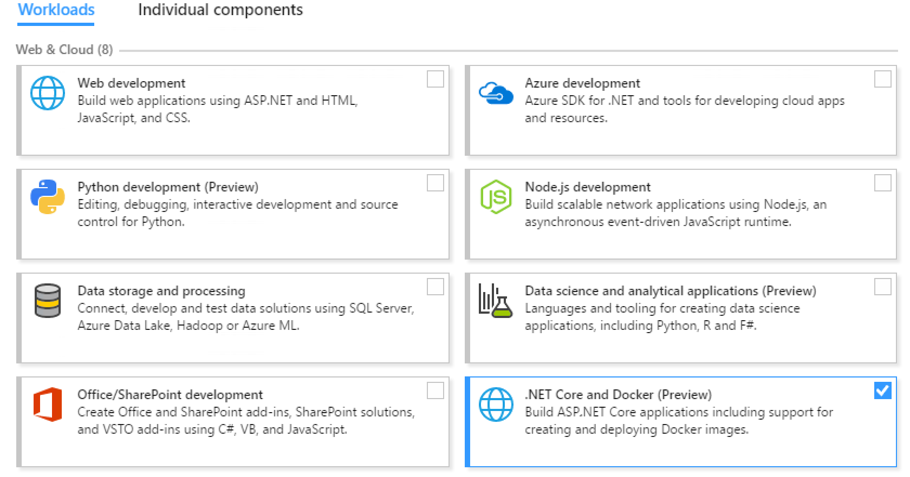
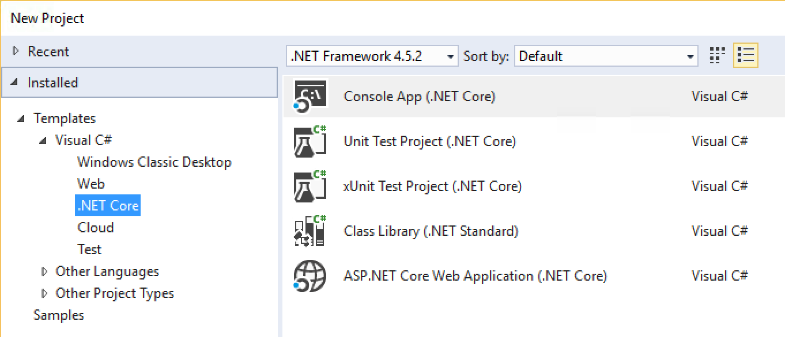
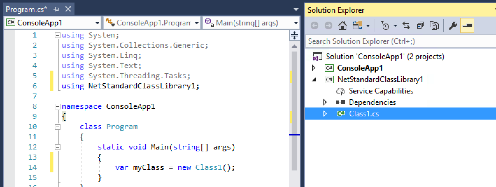
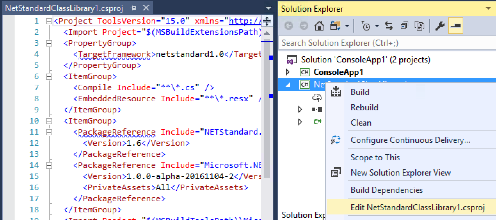
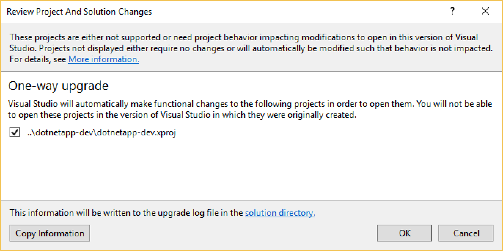
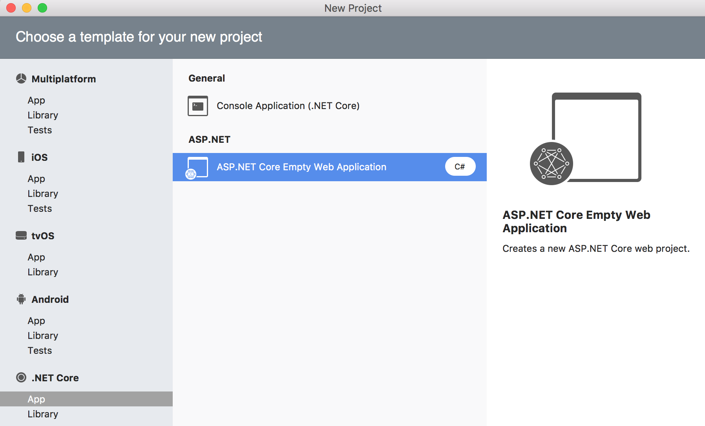
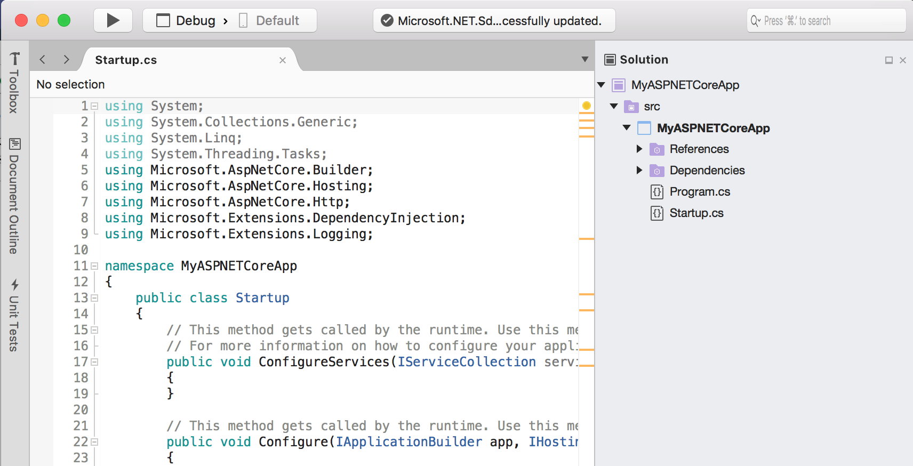
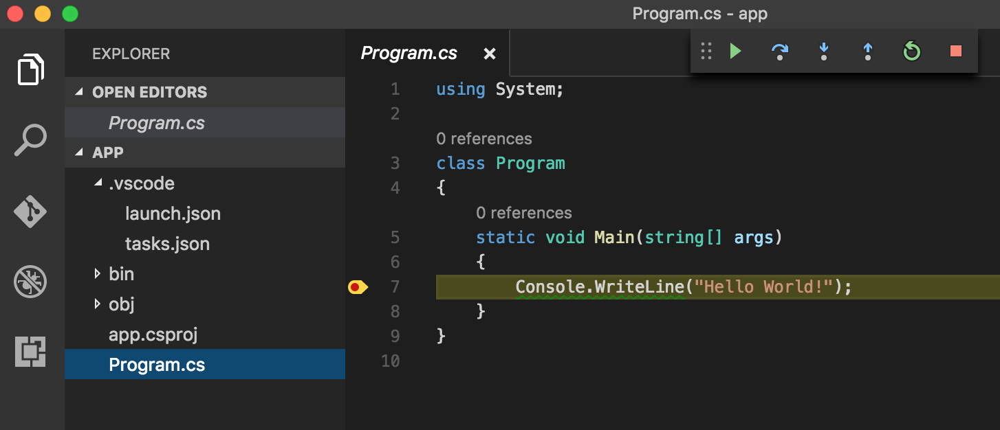

Announcing .NET Core Tools MSBuild "alpha"
==========================================

We are excited to announce the first "alpha" release of the new [MSBuild-based .NET Core Tools](). You can try out the new .NET Core Tools in Visual Studio 2017 RC, Visual Studio for Mac, Visual Studio Code and at the commandline. The new Tools release can be used with both the [.NET Core 1.0](https://blogs.msdn.microsoft.com/dotnet/2016/06/27/announcing-net-core-1-0/) and [.NET Core 1.1](https://blogs.msdn.microsoft.com/dotnet/2016/11/16/announcing-net-core-1-1/) runtimes.

When we started building .NET Core and ASP.NET Core it was important to have a project system that worked across Windows, Mac and Linux and worked in editors other than Visual Studio. The new project.json project format was created to facilitate this. Feedback from customers was they loved the new project.json model, but they wanted their projects to be able to work with existing .NET code they already had. In order to do this we are making .NET Core become .csproj/MSBuild based so it can interop with existing .NET projects and we are taking the best features of project.json and moving them into .csproj/MSBuild.

There are now four experiences that you can take advantage of for .NET Core development, across Windows, macOS and Linux.

- [Visual Studio 2017 RC][#vs2017rc]
- [Visual Studio for Mac][#vs4m]
- [Visual Studio Code][#vscode]
- [.NET Core CLI][#core-cli]

Yes! There is a new member of the Visual Studio family, dedicated to the Mac. [Visual Studio for Mac](https://blogs.msdn.microsoft.com/visualstudio/2016/11/16/visual-studio-for-mac/) supports Xamarin and .NET Core projects. Visual Studio for Mac is currently in preview. You can read more about how you can use [.NET Core in Visual Studio for Mac](#vs4m).

For more detailed information and known issues, see the [.NET Core Tools release notes](). You can [download the new .NET releases](https://dot.net/core) and learn more about the new experiences in [.NET Core Documentation](https://docs.microsoft.com/dotnet/articles/core).

Overview
--------

If you've been [following along](https://blogs.msdn.microsoft.com/dotnet/2016/10/19/net-core-tooling-in-visual-studio-15/), you'll know that the new Preview 3 release includes support for the MSBuild build system and the csproj project format. We adopted MSBuild for .NET Core for the following reasons:

- **One .NET tools ecosystem** -- MSBuild is a key component of the .NET tools ecosystem. Tools, scripts and VS extensions that target MSBuild should now extend to working with .NET Core.
- **Project to project references** - MSBuild enables project to project references between .NET projects. All other .NET projects use MSBuild, so switching to MSBuild enables you to reference Portable Class Libraries (PCL) from .NET Core projects and .NET Standard libraries from .NET Framework projects, for example.
- **Proven scalability** - MSBuild has been proven to be capable of building large projects. As .NET Core adoption increases, it is important to have a build system we can all count on. Updates to MSBuild will improve the experience for all project types, not just .NET Core.

The transition from project.json to csproj is an important one, and one where we have received a lot of feedback. Let's start with what's not changing:

- **One project file** - Your project file contains dependency and target framework information, all in one file. No source files are listed by default.
- **Targets and dependencies** -- .NET Core target frameworks and metapackage dependencies remain the same and are declared in a similar way in the new csproj format.
- **.NET Core CLI Tools** - The `dotnet` tool continues to expose the same commands, such as `dotnet build` and `dotnet run`.
- **.NET Core Templates** - You can continue to rely on `dotnet new` for templates (for example, `dotnet new -t library`).
- **Supports multiple .NET Core version** -- The new tools can be used to target .NET Core 1.0 and 1.1. The tools themselves run on .NET Core 1.0 by default.

There are many of you that have already adopted .NET Core with the existing project.json project format and build system. Us, too! We built a migration tool that migrates project.json project files to csproj. We've been using those on our own projects with good success. The migration tool is integrated into Visual Studio and Visual Studio for Mac. It is also available at the command line, with `dotnet migrate`. We will continue to improve the migration tool based on feedback to ensure that it's ready to run at scale by the final release.

Now that we've moved .NET Core to use MSBuild and the csproj project format, there is an opportunity to share improvements that we're making with other projects types. In particular, we intend to standardize on package reference within the csproj format for other .NET project types.

Let's look at the .NET Core support for each of the four supported experiences.

Visual Studio 2017 RC
---------------------

[Visual Studio 2017 RC](https://blogs.msdn.microsoft.com/visualstudio/2016/11/16/visual-studio-2017-rc/) includes support for the new .NET Core Tools, as a *Preview* workload. You will notice the following set of improvements over the experience in Visual Studio 2015.

- Project to project references now work.
- Project and NuGet references are declared similarly, both in csproj.
- csproj project files can be manually edited while the project is open.

### Installation

You can install the [Visual Studio 2017][VSRC] from the [Visual Studio site][VSRC].

You can install the .NET Core Tools in Visual Studio 2017 RC by selecting the ".NET Core and Docker Tools (Preview)" workload, under the "Web and Cloud" workload as you can see below. The overall installation process for Visual Studio has changed! You can read more about that in the [Visual Studio 2017 RC] blog post. 



### Creating new Projects

The .NET Core project templates are available under the ".NET Core" project node in Visual Studio. You will see a familar set of projects.
 


### Project to project references

You can now reference .NET Standard projects from .NET Framework, Xamarin or UWP projects. You can see two app projects relying on a .NET Standard Library in the image below.



### Editing CSProj files

You can now edit CSProj files, while the project is open and with intellisense. It's not an experience we expect most of you to do every day, but it is still a major improvement. It also does a good job of showing the similarily between NuGet and projects references.



### Dynamic Project system

The new csproj format adds all source files by default. You do not need to list each .cs file. You can see this in action by adding a .cs file to your project directory from outside Visual Studio. You should see the .cs file added to Solution Explorer within 1s.

A more minimal project file has a lot of benefits, including readability. It also helps with source control by reducing a whole category of changes and the potential merge conflicts that have historically come with it.

### Opening and upgrading project.json Projects

You will be prompted to upgrade project.json-based xproj projects to csproj when you open them in Visual Studio 2017. You can see that experience below. The migration is one-way. There is no supported way to go back to project.json other than via source control or backups.



Visual Studio for Mac
---------------------

[Visual Studio for Mac](https://blogs.msdn.microsoft.com/visualstudio/2016/11/16/visual-studio-for-mac/) is a new member of the Visual Studio family, focussed on cross-platform mobile and cloud development on the mac. It includes support for .NET Core and Xamarin projects. In fact, Visual Studio for Mac is an evolution of Xamarin Studio.

Visual Studio for Mac is intended to provide a very similar .NET Core development experience as what was described above for Visual Studio 2017 RC. We'll continue to improve both experiences together as we get closer to shipping .NET Core Tools, Visual Studio for Mac and Visual Studio 2017 next year.

### Installation

You can install the [Visual Studio for Mac][vs4m] from the [Visual Studio site][vs4m]. Support for .NET Core and ASP.NET Core projects is included.

### Creating new Projects

The .NET Core project templates are available under the ".NET Core" project node in Visual Studio. You will see a familar set of projects.
 


You can see a new ASP.NET Core project, below.



### Other experiences

Visual Studio for Mac does not yet support xproj migration. That experience will be added before release. 

Visual Studio for Mac has existing support for editing csproj files while the project is loaded. You can open the csproj file by right-clicking on the project file, selecting `Tools` and then `Edit File`.

Visual Studio Code
------------------

The Visual Studio Code C# extension has also been updated to support the new .NET Core Tools release. At present, the extension has been updated to support building and debugging your projects. The extension commands (in the command palette) have not yet been updated.

### Installation

You can install [VS Code](http://code.visualstudio.com/) from the [visualstudio.com](http://code.visualstudio.com/). You can add .NET Core support by installing the C# extension. You can install it via the Extensions tab or wait to be prompted when you open a C# file.

### Debugging a .NET Core Project

You can build and debug csproj .NET Core projects.



.NET Core CLI Tools
-------------------

The .NET Core CLI Tools have also been updated. They are now built on top of MSBuild (just like Visual Studio) and expect csproj project files. All of the logic that once processed project.json files has been removed. The CLI tools are now much simpler (from an implementation perspective), relying heavily on MSBuild, but no less useful or needed.

When we started the project to update the CLI tools, we had to consider the ongoing purpose of the CLI tools, particularly since MSBuild is itself a commandline tool with its own command line syntax, ecosystem and history. We came to the conclusion that it was important to provide a set of simple and intutive tools that made adopting .NET Core (and other .NET platforms) easy and provided a uniform interface for both MSBuild and non-MSBuild tools. This vision will become more valuable as we focus more on .NET Core tools extensibility in future releases.

### Installing

You can install the new .NET Core Tools from the [.NET Core site](https://dot.net/core), by installing the Preview 3 .NET Core SDK. The SDK comes with .NET Core 1.0. You can also use it with .NET Core 1.1, which you can install separately.

Discussion on side-by-side. Guidance should be to install the zips not the MSI/PKGs if you are doing preview2 development outside of VS.

### Side by side install

By installing the new SDK, you will update the default behavior of the `dotnet` command. It will use msbuild and process csproj projects instead of project.json. Similarly, `dotnet new` will create a csproj profile file.

In order to continue using the earlier project.json-based tools on a per-project basis, create a global.json file in your project directory and add the "sdk" property to it. The following example shows a global.json that contrains `dotnet` to using the project.json-based tools:

```json
{
    "sdk": {
        "version": "1.0.0-preview2-003131"
    }
}
```

### Templates

You can use the `dotnet new` command for creating a new project. It continues to support multiple project types with the `-t` argument (for example, `dotnet new -t lib`). The complete list of supported templates follows:

- `console`
- `web`
- `lib`
- `xunittest`

We intend to extend the set of templates in the future and make it easier for the community to extend the set of templates. In fact, we'd like to enable acqisition of full samples via `dotnet new`.

### Upgrading project.json projects

You can use the `dotnet migrate` command to migrate a project.json project to the csproj format. This command will also migrate any project-to-project references you have in your
project.json file automatically. You can check the [dotnet migrate command documentation](https://docs.microsoft.com/dotnet/articles/cli-preview3/tools/dotnet-migrate) for more information. 

You can see an example below of what a default project look file looks like after migration from project.json to csproj. We are continuing to look for opportunities to simplify and reduce the size of the csproj format.

```xml
<Project ToolsVersion="15.0" xmlns="http://schemas.microsoft.com/developer/msbuild/2003">
  <Import Project="$(MSBuildExtensionsPath)\$(MSBuildToolsVersion)\Microsoft.Common.props" />
  
  <PropertyGroup>
    <TargetFramework>netcoreapp1.1</TargetFramework>
    <DebugType>portable</DebugType>
    <AssemblyName>hw-test</AssemblyName>
    <OutputType>Exe</OutputType>
    <PackageTargetFallback Condition=" '$(TargetFramework)' == 'netcoreapp1.1' ">$(PackageTargetFallback);dnxcore50</PackageTargetFallback>
  </PropertyGroup>

  <ItemGroup>
    <Compile Include="**\*.cs" />
    <EmbeddedResource Include="**\*.resx" />
    <EmbeddedResource Include="compiler\resources\**\*" />
  </ItemGroup>

  <ItemGroup>
    <PackageReference Include="Microsoft.NET.Sdk">
      <Version>1.0.0-alpha-20161104-2</Version>
      <PrivateAssets>All</PrivateAssets>
    </PackageReference>
  </ItemGroup>

  <ItemGroup Condition=" '$(TargetFramework)' == 'netcoreapp1.1' ">
    <PackageReference Include="Microsoft.NETCore.App">
      <Version>1.1.0</Version>
    </PackageReference>
  </ItemGroup>

  <PropertyGroup Condition=" '$(Configuration)' == 'Release' ">
    <DefineConstants>$(DefineConstants);RELEASE</DefineConstants>
  </PropertyGroup>
  
  <Import Project="$(MSBuildToolsPath)\Microsoft.CSharp.targets" />
</Project>
```
 
Existing .NET csproj files, for other project types, include GUIDs and file references. Those are (intentionally) missing from .NET Core csproj project files.

### Adding project references

Adding a project reference in csproj is done using a `<ProjectReference>` element within an `<ItemGroup>` element. You can see an example below. 

```xml
<ItemGroup>
  <ProjectReference Include="..\ClassLibrary1\ClassLibrary1.csproj" />
</ItemGroup>
```

After this operation, you still need to call `dotnet restore` to generate "the assets file" (the replacement for the project.lock.json file). 

### Adding NuGet references

We made another improvement to the overall csproj experience by integrating NuGet package information into the csproj file. This is done through a new `<PackageReference>` element. You can see an example of the below. 

```xml 
<PackageReference Include="Newtonsoft.Json">
  <Version>9.0.1</Version>
</PackageReference>
```

### Upgrading your project to use .NET Core 1.1

The `dotnet new` command produces projects that depends on .NET Core 1.0. You can update your project file to depend on .NET Core 1.1 instead, as you can see in the example below.

```xml
<Project ToolsVersion="15.0" xmlns="http://schemas.microsoft.com/developer/msbuild/2003">
  <Import Project="$(MSBuildExtensionsPath)\$(MSBuildToolsVersion)\Microsoft.Common.props" />
  
  <PropertyGroup>
    <OutputType>Exe</OutputType>
    <TargetFramework>netcoreapp1.1</TargetFramework>
  </PropertyGroup>

  <ItemGroup>
    <Compile Include="**\*.cs" />
    <EmbeddedResource Include="**\*.resx" />
  </ItemGroup>

  <ItemGroup>
    <PackageReference Include="Microsoft.NETCore.App">
      <Version>1.1.0</Version>
    </PackageReference>
    <PackageReference Include="Microsoft.NET.Sdk">
      <Version>1.0.0-alpha-20161104-2</Version>
      <PrivateAssets>All</PrivateAssets>
    </PackageReference>
  </ItemGroup>
  
  <Import Project="$(MSBuildToolsPath)\Microsoft.CSharp.targets" />
</Project>
```

The project file has been updated in two places:

- The target framework has been updated from `netcoreapp1.0` to `netcoreapp1.1`
- The `Microsoft.NETCore.App` version has been updated from '1.0.1' to '1.0.0'

.NET Core Tooling for Production Apps
-------------------------------------

We shipped .NET Core 1.0 and the project.json-based .NET Core tools back in June. Many of you are using that release every day on your desktop to build your app and in production on your server/cloud. We shipped .NET Core 1.1 today, and you can start using it the same way.

Today's .NET Core Tools release is considered alpha and is not recommended for use in production. You are recommended to use the existing project.json-based .NET Core tools (this is the preview 2 version) for production use, including with Visual Studio 2015.

When we ship the new msbuild-based .NET Core Tools, you will be able to open your projects in Visual Studio 2017 and Visual Studio for Mac and go through a quick migration. 

For now, we recommend that you you try out today's Tools alpha release and the .NET Core Tools Preview workload in Visual Studio 2017 RC with sample projects or projects that are under source control.

Closing
-------

Please try the new .NET Core Tools release and give us feedback. You can try out the new csproj/MSBuild support in Visual Studio 2017 RC, Visual Studio for Mac, Visual Studio Code and at the command line. You've got great options for .NET Core development on Windows, macOS and Linux. 

To recap, the biggest changes are:

- .NET Core csproj support is now available as an alpha release.
- .NET Core is integrated into Visual Studio 2017 RC and Visual Studio for Mac. It can be added to Visual Studio Code by the C# extension.
- .NET Core tools are now based on the same technology as other .NET projects.

Thanks to everyone who has given us feedback about both project.json and csproj. Please keep it coming and please do try the new release.

[core]: https://dot.net/core
[VSRC]: https://www.visualstudio.com/vs/visual-studio-2017-rc/
[vs4m]: https://www.visualstudio.com/vs/visual-studio-mac/
