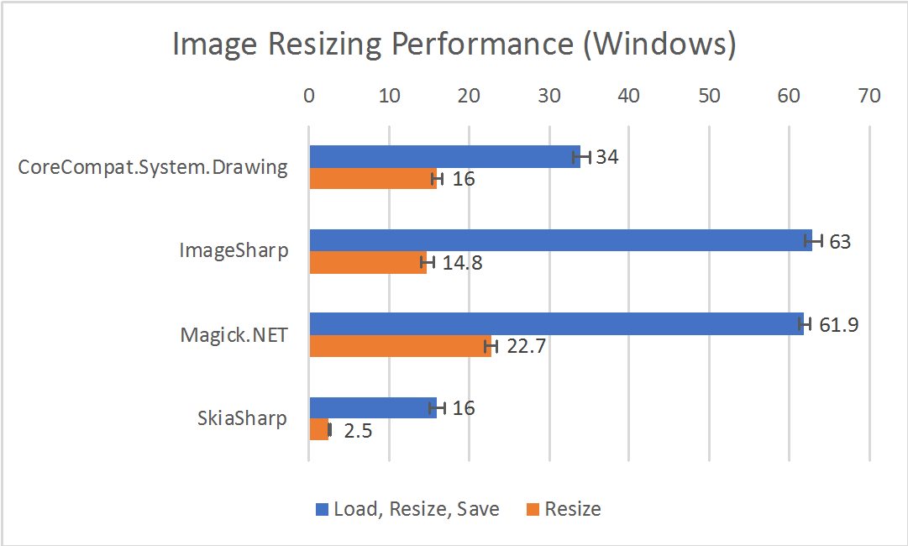
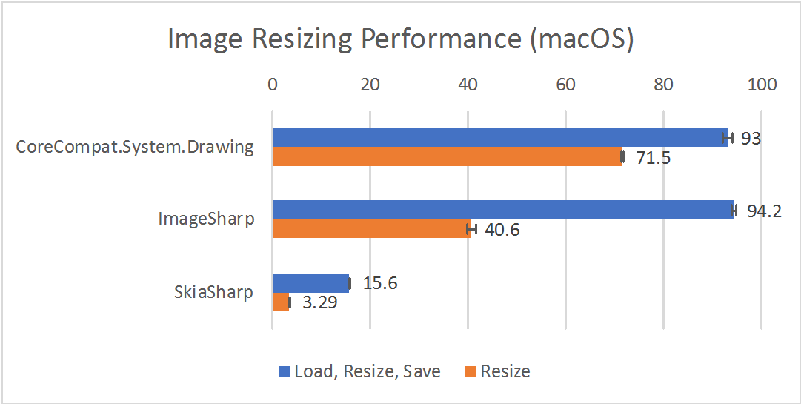
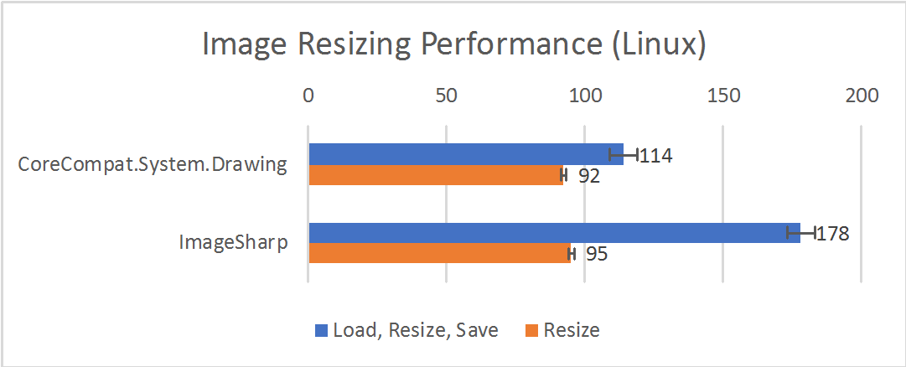
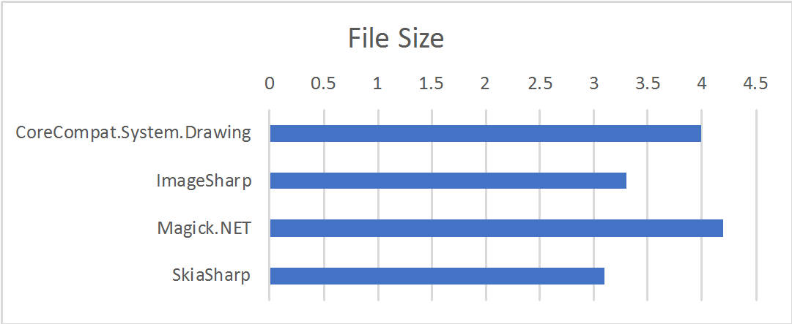

.NET Core Image Processing
==========================

Image processing, and in particular image resizing, is a common requirement for web applications. As such, I wanted to paint a panorama of the options that exist for .NET Core to process images. For each option, I'll give a code sample for image resizing, and I'll outline interesting features. I'll conclude with a comparison of the performance of the libraries, in terms of speed, size, and quality of the output.

CoreCompat.System.Drawing
-------------------------

If you have existing code relying on `System.Drawing`, using this library is clearly your fastest path to .NET Core and cross-platform bliss: the performance and quality are fine, and the API is exactly the same. [The built-in `System.Drawing` APIs](https://msdn.microsoft.com/en-us/library/mt481535(v=vs.110).aspx) are the easiest way to process images with .NET Framework, but they rely on the GDI+ features from Windows, which are not included in .NET Core, and are a client technology that was never designed for multi-threaded server environments. There are locking issues that may make this solution unsuitable for your applications.

[`CoreCompat.System.Drawing`](https://github.com/CoreCompat/CoreCompat) is a .NET Core port of [the Mono implementation of `System.Drawing`](https://github.com/mono/mono/tree/master/mcs/class/System.Drawing). Like `System.Drawing` in .NET Framework and in Mono, [`CoreCompat.System.Drawing`](https://github.com/CoreCompat/CoreCompat) also relies on GDI+ on Windows. Caution is therefore advised, for the same reasons.

Also be careful when using the library cross-platform, to include the [runtime.osx.10.10-x64.CoreCompat.System.Drawing](https://www.nuget.org/packages/runtime.osx.10.10-x64.CoreCompat.System.Drawing) and / or [runtime.linux-x64.CoreCompat.System.Drawing](https://www.nuget.org/packages/runtime.linux-x64.CoreCompat.System.Drawing/1.0.0-beta009) packages.

```csharp
using System.Drawing;

const int size = 150;
const int Quality = 75;

using (var image = new Bitmap(System.Drawing.Image.FromFile(inputPath)))
{
    int width, height;
    if (image.Width > image.Height)
    {
        width = size;
        height = Convert.ToInt32(image.Height * size / (double)image.Width);
    }
    else
    {
        width = Convert.ToInt32(image.Width * size / (double)image.Height);
        height = size;
    }
    var resized = new Bitmap(width, height);
    using (var graphics = Graphics.FromImage(resized))
    {
        graphics.CompositingQuality = CompositingQuality.HighSpeed;
        graphics.InterpolationMode = InterpolationMode.HighQualityBicubic;
        graphics.CompositingMode = CompositingMode.SourceCopy;
        graphics.DrawImage(image, 0, 0, width, height);
        using (var output = File.Open(
            OutputPath(path, outputDirectory, SystemDrawing), FileMode.Create))
        {
            var qualityParamId = Encoder.Quality;
            var encoderParameters = new EncoderParameters(1);
            encoderParameters.Param[0] = new EncoderParameter(qualityParamId, Quality);
            var codec = ImageCodecInfo.GetImageDecoders()
                .FirstOrDefault(codec => codec.FormatID == ImageFormat.Jpeg.Guid);
            resized.Save(output, codec, encoderParameters);
        }
    }
}
```

* Nuget: [CoreCompat.System.Drawing](https://www.nuget.org/packages/CoreCompat.System.Drawing/), [runtime.osx.10.10-x64.CoreCompat.System.Drawing](https://www.nuget.org/packages/runtime.osx.10.10-x64.CoreCompat.System.Drawing), and [runtime.linux-x64.CoreCompat.System.Drawing](https://www.nuget.org/packages/runtime.linux-x64.CoreCompat.System.Drawing/1.0.0-beta009)
* GitHub: [CoreCompat/CoreCompat](https://github.com/CoreCompat/CoreCompat)

ImageSharp
----------

[ImageSharp](https://github.com/JimBobSquarePants/ImageSharp) is a brand new, pure managed code, and cross-platform image processing library. Its performance is not as good as that of libraries relying on native OS-specific dependencies, but it remains very reasonable. Its only dependency is .NET itself, which makes it extremely portable: there is no additional package to install, just reference [ImageSharp](https://github.com/JimBobSquarePants/ImageSharp) itself, and you're done.

If you decide to use [ImageSharp](https://github.com/JimBobSquarePants/ImageSharp), don't include the package that shows on NuGet: that's going to be an empty placeholder until the first official release of ImageSharp ships. For the moment, you need to get a nightly build from a [MyGet](https://www.myget.org) feed. This can be done by adding the following `NuGet.config` to the root directory of the project:

```xml
<?xml version="1.0" encoding="utf-8"?>
<configuration>
  <packageSources>
    <add key="ImageSharp Nightly" value="https://www.myget.org/F/imagesharp/api/v3/index.json" />
  </packageSources>
</configuration>
```

Resizing an image with [ImageSharp](https://github.com/JimBobSquarePants/ImageSharp) is very simple.

```csharp
using ImageSharp;

const int size = 150;
const int Quality = 75;

Configuration.Default.AddImageFormat(new JpegFormat());

using (var input = File.OpenRead(inputPath))
{
    using (var output = File.OpenWrite(outputPath))
    {
        var image = new Image(input)
            .Resize(new ResizeOptions
            {
                Size = new Size(size, size),
                Mode = ResizeMode.Max
            });
        image.ExifProfile = null;
        image.Quality = Quality;
        image.Save(output);
    }
}
```

For a new codebase, the library is surprisingly complete. It includes all the filters you'd expect to treat images, and even includes very comprehensive support for reading and writing [EXIF tags](https://en.wikipedia.org/wiki/Exif) (that code is shared with [Magick.NET](https://magick.codeplex.com/)):

```csharp
var exif = image.ExifProfile;
var description = exif.GetValue(ImageSharpExifTag.ImageDescription);
var yearTaken = DateTime.ParseExact(
    (string)exif.GetValue(ImageSharpExifTag.DateTimeOriginal).Value,
    "yyyy:MM:dd HH:mm:ss",
    CultureInfo.InvariantCulture)
    .Year;
var author = exif.GetValue(ImageSharpExifTag.Artist);
var copyright = $"{description} (c) {yearTaken} {author}";
exif.SetValue(ImageSharpExifTag.Copyright, copyright);
```

Note that the latest builds of ImageSharp are more modular than they used to, and if you're going to use image formats such as Jpeg, or image processing capabilities such as `Resize`, you need to import additional packages in addition to the core ImageSharp package (respectively `ImageSharp.Processing` and `ImageSharp.Formats.Jpeg`).

* MyGet: [ImageSharp](https://www.myget.org/feed/imagesharp/package/nuget/ImageSharp)
* GitHub: [JimBobSquarePants/ImageSharp](https://github.com/JimBobSquarePants/ImageSharp)

Magick.NET
----------

[Magick.NET](https://magick.codeplex.com/) is the .NET wrapper for the popular [ImageMagick](http://www.imagemagick.org/script/index.php) library. ImageMagick is an open-source, cross-platform library that focuses on image quality, and on offering a very wide choice of supported image formats. It also has the same support for EXIF as [ImageSharp](https://github.com/JimBobSquarePants/ImageSharp).

The .NET Core build of [Magick.NET](https://magick.codeplex.com/) currently only supports Windows. The author of the library, [Dirk Lemstra](https://github.com/dlemstra) is [looking for help with converting build scripts](https://github.com/dlemstra/Magick.NET/issues/16) for the native ImageMagick dependency, so if you have some expertise building native libraries on Mac or Linux, this is a great opportunity to help an awesome project.

[Magick.NET](https://magick.codeplex.com/) has the best image quality of all the libraries discussed in this post, as you can see in the samples below, and it performs relatively well. It also has a very complete API, and the best support for exotic file formats.

```csharp
using ImageMagick;

const int size = 150;
const int Quality = 75;

using (var image = new MagickImage(inputPath))
{
    image.Resize(size, size);
    image.Strip();
    image.Quality = Quality;
    image.Write(outputPath);
}
```

* NuGet: [Magick.NET.Core-Q8](https://www.nuget.org/packages/Magick.NET.Core-Q8/)
* CodePlex: [Magick.NET](https://magick.codeplex.com/)
* Github: [dlemstra/Magick.NET](https://github.com/dlemstra/Magick.NET/)

SkiaSharp
---------

[SkiaSharp](https://github.com/mono/SkiaSharp/) is the .NET wrapper for [Google's Skia cross-platform 2D graphics library](https://skia.org/).

I'm including [SkiaSharp](https://github.com/mono/SkiaSharp/) in this post because it's very promising, despite the fact that [it is not yet](https://github.com/mono/SkiaSharp/issues/20) [compatible with .NET Core](https://github.com/mono/SkiaSharp/issues/111). It's by far the fastest library featured here.

```csharp
using SkiaSharp;

const int size = 150;

using (var input = File.OpenRead(inputPath))
{
    using (var inputStream = new SKManagedStream(input))
    {
        var original = SKBitmap.Decode(inputStream);
        int width, height;
        if (original.Width > original.Height)
        {
            width = size;
            height = original.Height * size / original.Width;
        }
        else
        {
            width = original.Width * size / original.Height;
            height = size;
        }
        var surface = SKSurface.Create(width, height, original.ColorType, original.AlphaType);
        var canvas = surface.Canvas;
        var scale = (float)width / original.Width;
        canvas.Scale(scale);
        var paint = new SKPaint();
        paint.FilterQuality = SKFilterQuality.High;
        canvas.DrawBitmap(original, 0, 0, paint);
        canvas.Flush();

        using (var output = File.OpenWrite(outputPath))
        {
            surface.Snapshot()
                   .Encode(SKImageEncodeFormat.Jpeg, 85)
                   .SaveTo(output);
        }
    }
}
```

* NuGet: [SkiaSharp](https://www.nuget.org/packages/SkiaSharp/)
* GitHub: [mono/SkiaSharp](https://github.com/mono/SkiaSharp/)

Performance comparison
----------------------

The first benchmark loads, resizes, and saves images on disk as Jpegs with a a quality of 75. I used 12 images with a good variety of subjects, and details that are not too easy to resize, so that defects are easy to spot. The images are roughly one megapixel JPEGs, except for one of the images that is a little smaller. Your mileage may vary, depending on what type of image you need to work with. I'd recommend you try to reproduce these results with a sample of images that corresponds to your own use case.

For the second benchmark, an empty megapixel image is resized to a 150 pixel wide thumbnail, without disk access.

The benchmarks use .NET Core 1.0.3 (the latest LTS at this date) for `CoreCompat.System.Drawing`, ImageSharp, and Magick.NET, and Mono 4.6.2 for SkiaSharp.

I ran the benchmarks on Windows on a HP Z420 workstation with a quad-core Xeon E5-1620 processor, 16GB of RAM, and the built-in Radeon GPU. For Linux, the results are for the same machine as Windows, but in a 4GB VM, so lower performance does not mean anything regarding Windows vs. Linux performance, and only library to library comparison should be considered meaningful. The macOS numbers are on an iMac with a 1.4GHz Core i5 processor, 8GB of RAM, and the built-in Intel HD Graphics 5000 GPU, running macOS Sierra.

Results are going to vary substantially depending on hardware: usage and performance of the GPU and of SIMD depends on both what's available on the machine, and on the usage the library is making of it. Developers wanting to get maximum performance should further experiment. I should mention that I had to disable OpenCL on Magick.NET (`OpenCL.IsEnabled = false;`), as I was getting substantially worse performance with it enabled on that workstation than on my laptop.



|                   Library | Load, resize, save (ms) | Resize (ms) |
|---------------------------|------------------------:|------------:|
| CoreCompat.System.Drawing |                  34 ± 1 |  16.0 ± 0.6 |
|                ImageSharp |                  63 ± 1 |  14.8 ± 0.8 |
|                Magick.NET |                  62 ± 1 |  22.7 ± 0.7 |
|                 SkiaSharp |                  16 ± 1 |   2.5 ± 0.1 |

For both metrics, lower is better.



|                   Library | Load, resize, save (ms) | Resize (ms) |
|---------------------------|------------------------:|------------:|
| CoreCompat.System.Drawing |                  93 ± 1 |  71.5 ± 0.3 |
|                ImageSharp |              94.2 ± 0.4 |  40.6 ± 0.8 |
|                 SkiaSharp |              15.6 ± 0.1 | 3.29 ± 0.03 |

For both metrics, lower is better.



|                   Library | Load, resize, save (ms) | Resize (ms) |
|---------------------------|------------------------:|------------:|
| CoreCompat.System.Drawing |                 114 ± 5 |      92 ± 1 |
|                ImageSharp |                 178 ± 5 |      95 ± 1 |

For both metrics, lower is better.



|                   Library | File Size (kB) |
|---------------------------|---------------:|
| CoreCompat.System.Drawing |            4.0 |
|                ImageSharp |            3.3 |
|                Magick.NET |            4.2 |
|                 SkiaSharp |            3.1 |

Lower is better. Note that file size is affected by the quality of the subsampling that's being performed, so size comparisons should take into account the visual quality of the end result.

Quality comparison
------------------

Here are the resized images. As you can see, the quality varies a lot from one image to the next, and between libraries. Some images show dramatic differences in sharpness, and some moiré effects can be seen in places. You should make a choice based on the constraints of your project, and on the performance vs. quality trade-offs you're willing to make.

| ImageSharp | CoreCompat.System.Drawing | Magick.NET | SkiaSharp |
|:----------:|:-------------------------:|:----------:|:---------:|
|  |  |  |  |
|  |  |  |  |
|  |  |  |  |
|  |  |  |  |
|  |  |  |  |
|  |  |  |  |
|  |  |  |  |
|  |  |  |  |
|  |  |  |  |
|  |  |  |  |
|  |  |  |  |
|  |  |  |  |

Conclusions
-----------

There is today a good choice of libraries for image processing on .NET Core, that can fit different requirements, with even more great choices coming in the near future.

If performance is your priority, CoreCompat.System.Drawing is a good choice today if the possible lock issues in Windows server scenarios are not a showstopper for your application. SkiaSharp, when available on .NET Core, will be a fantastic choice.

If quality or file type support is your priority, Magick.NET is the clear winner. Cross-platform support is not quite there yet, however, but [you can help](https://github.com/dlemstra/Magick.NET/issues/16).

Finally, the only pure managed code library available at this point, ImageSharp, is an excellent choice. Its performance is close to that of Magick.NET, and the fact that it has no native dependencies means that the library is guaranteed to work everywhere .NET Core works. The library is still in alpha, and significant performance improvements are in store, notably with future usage of `Span<T>` and ref returns.

Acknowledgements
----------------

All four libraries in this post are open-source, and only exist thanks to the talent and generosity of their authors, contributors and maintainers. In particular,

* [Frederik Carlier](https://github.com/qmfrederik) wrote [`CoreCompat.System.Drawing`](https://github.com/CoreCompat/CoreCompat).
* [James Jackson South](https://github.com/jimbobsquarepants) wrote [ImageSharp](https://github.com/JimBobSquarePants/ImageSharp). James was extremely helpful while I was preparing this post, and even contributed sample code.
* [Dirk Lemstra](https://github.com/dlemstra) wrote [Magick.NET](https://magick.codeplex.com/). Dirk was also super-patient and nice, and helped me fix some performance issues I had on my benchmark machine. He also fixed my sample code.
* [Matthew Leibowitz](https://github.com/mattleibow) maintains [SkiaSharp](https://github.com/mono/SkiaSharp/).

Sample code
-----------

My sample code [can be found on GitHub](https://github.com/bleroy/core-imaging-playground). The repository includes [the sample images](https://github.com/bleroy/core-imaging-playground/tree/master/images) I've been using in this post.