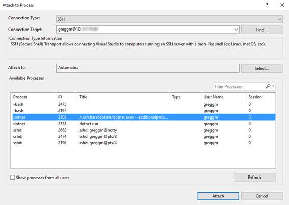
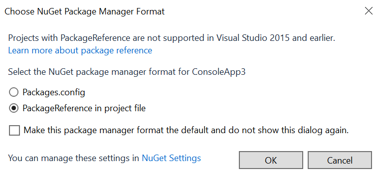
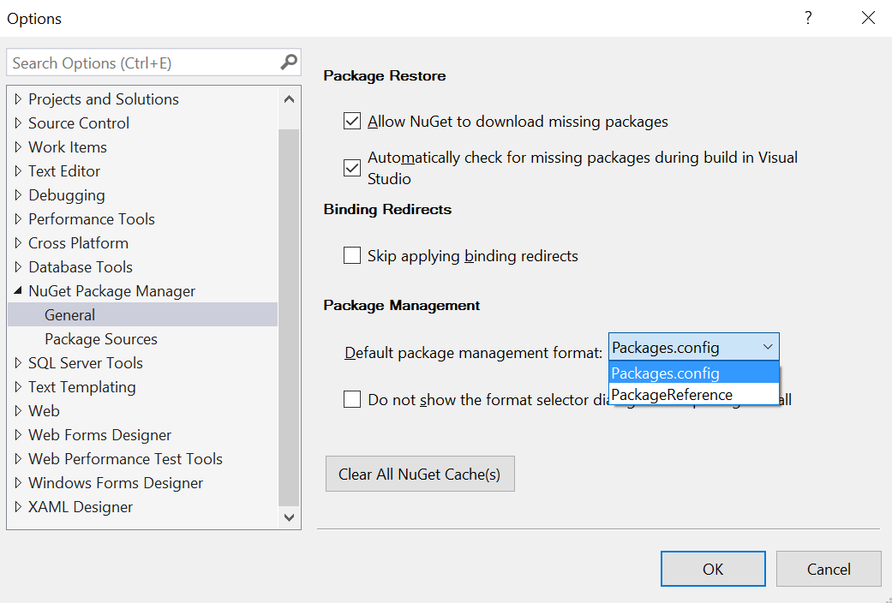
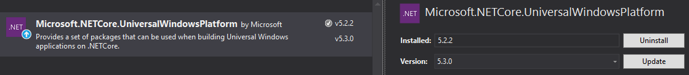

# Announcing .NET Core, .NET Native and NuGet Updates in VS 2017 RC

Today, we are releasing updates to the .NET Core SDK, .NET Native Tools and NuGet, all of which are included in Visual Studio 2017 RC. You can also install the .NET Core SDK for commandline use, on Windows, Mac and Linux. Please check out the Visual Studio blog to learn more about this [Visual Studio 2017 update](https://blogs.msdn.microsoft.com/visualstudio/2017/01/26/update-to-visual-studio-2017-release-candidate/). 

- [Install Visual Studio 2017 RC](https://www.visualstudio.com/vs/visual-studio-2017-rc)
- [Install .NET Core 1.0 SDK - RC3](https://github.com/dotnet/core/blob/master/release-notes/rc3-download.md)

The following improvements are the .NET highlights of the release:

- .NET Core - The csproj project format has been simplified and project migration is much more reliable.
- .NET Native - Major performance increase for SIMD and other performance improvements.
- NuGet - .NET Framework, UWP, .NET Core and other .NET projects can now use PackageReference instead of packages.config for NuGet dependencies

Note: csproj projects created with [earlier releases of Visual Studio 2017](https://blogs.msdn.microsoft.com/dotnet/2016/12/12/updating-visual-studio-2017-rc-net-core-tooling-improvements/) or on the command line with the .NET Core SDK must be manually updated to load in the latest release. Please read the Updating .NET Core Projects section, below, for more information.

.NET Core
=========

The .NET Core tools have been significantly improved in this update, fixing bugs and usability issues. A major focus of this release has been simplifying the project file and improving project migration. We are no longer using the "preview" term, but "RC3" to match Visual Studio 2017 RC.

The tools in the new SDK produce and operate on csproj projects. If you are using project.json projects, including with Visual Studio 2015, then please wait to install the new SDK until you are ready to move to csproj and MSBuild. If you are a Visual Studio user, you will get the SDK when you install Visual Studio 2017.

### Getting the Release

This .NET Core SDK release is available in Visual Studio 2017 RC, as part of the **.NET Core cross-platform development** workload. It is also available in the **ASP.NET Web** workload and an optional component of the **.NET Desktop** workload. These workloads can be selected as part of the Visual Studio 2017 RC installation process.

The ability to build and consume .NET Standard class libraries is available in the all of the above workloads and in the UWP workload. 

You can also install the .NET Core SDK release for command-line use on Windows, macOS and Linux by following the instructions at [.NET Core 1.0 - RC3 Download](https://github.com/dotnet/core/blob/master/release-notes/rc3-download.md). 

The release is also available as Docker images, in the [dotnet repo](https://hub.docker.com/r/microsoft/dotnet/). The following images include the new SDK:

- 1.0.3-sdk-msbuild-rc3
- 1.0.3-sdk-msbuild-rc3-nanoserver
- 1.1.0-sdk-msbuild-rc3
- 1.1.0-sdk-msbuild-rc3-nanoserver

The [aspnetcore-build repo](https://hub.docker.com/r/microsoft/aspnetcore-build/) has also been updated.

### .NET Code SDK Components

This release contains the .NET Core Tools 1.0 RC3, the .NET Core 1.0.3 runtime and the .NET Core 1.1.0 runtime. No changes have been made to the .NET Core runtime in this release. .NET Core 1.0.3 and 1.1.0 were both released previously.

The .NET Core SDK includes a set of .NET Core Tools and one of more runtimes. In previous SDK releases, there was only ever one runtime included. This change in approach was made to make it easier to acquire all supported runtimes as a single step. This experience helps when you are collaborating with developers who are using multipe runtimes. It also makes it easier to update multiple runtimes on your machine when fixes are released. The SDK naturally gets larger, but not as much as you might guess since there is only ever one set of tools in the package. It also enables us to improve the tools for everyone more easily.

### Smaller Project file

The following example is the new, much shorter, default template for .NET Core apps. This is the final project format for .NET Core.

``` xml
<Project Sdk="Microsoft.NET.Sdk">
  <PropertyGroup>
    <OutputType>Exe</OutputType>
    <TargetFramework>netcoreapp1.0</TargetFramework>
  </PropertyGroup>
</Project>
```

You can change the `TargetFramework` value from `netcoreapp1.0` to `netcoreapp1.1` in order to target .NET Core 1.1. The example project above targets .NET Core 1.0.

The following csproj elements/attributes are no longer included in the project file.

- `ToolsVersion` - no longer a required attribute.
- `Compile Include` - the new default includes all files.
- `EmbeddedResource Include` - the new default includes all resources.
- `PackageReference` - is now implicit for [Microsoft.NETCore.App](http://www.nuget.org/packages/Microsoft.NETCore.App/), and [NETStandard.Library](http://www.nuget.org/packages/NETStandard.Library/). All other packages, include ASP.NET Core, still require PackageReference!
- `PackageReference` for the [Microsoft.NET.Sdk](http://www.nuget.org/packages/Microsoft.NET.Sdk) package has been moved to a required top-level `Project` `Sdk` attribute.

The default template for .NET Standard library projects is very similar:

``` xml
<Project Sdk="Microsoft.NET.Sdk">
  <PropertyGroup>
    <TargetFramework>netstandard1.4</TargetFramework>
  </PropertyGroup>
</Project>
```

Just like with the .NET Core template above, you can target a different version of .NET Standard by changing the `TargetFramework` value. [.NET Standard 1.4](https://github.com/dotnet/standard/blob/master/docs/versions.md) was chosen as the default version since it is supported by the .NET Framework and .NET Core and is the highest version currently supported by .NET Native (for UWP apps).

The default template for ASP.NET Core apps is only slightly larger and also does a good job of demonstrating what package references look like, for the [ASP.NET Core meta package](http://www.nuget.org/packages/Microsoft.AspNetCore/).

```xml
<Project Sdk="Microsoft.NET.Sdk.Web">
  <PropertyGroup>
    <TargetFramework>netcoreapp1.0</TargetFramework>
  </PropertyGroup>
  <ItemGroup>
    <Folder Include="wwwroot\" />
  </ItemGroup>
  <ItemGroup>
    <PackageReference Include="Microsoft.ApplicationInsights.AspNetCore" Version="2.0.0-beta1" />
    <PackageReference Include="Microsoft.AspNetCore" Version="1.0.3" />
  </ItemGroup>
</Project>
```

### Updating .NET Core csproj Projects

As described above, the .NET Core csproj project files are now shorter. This change moves multiple pieces of project data that were explicitly declared in earlier project files into default settings that are implicitly declared as part of the SDK. The existing explicitly declared data becomes a duplicate declaration of the same implicitly declared data, when loaded with the new tools, which generates MSBuild errors for `Compile` and `EmbeddedResource` elements and warnings for `PackageReference`.

You need to remove the following data from your existing csproj files:

- Compile
- EmbeddedResource
- PackageReference Include="Microsoft.NETCore.App" ...
- PackageReference Include="NETStandard.Library" ...
- PackageReference Include="Microsoft.NET.Sdk" ...

The SDK reference has moved to the root `Project` element, as you can see in the examples above. The SDK reference is required.

For more information, see: [Implicit metapackage package reference in the .NET Core SDK](https://github.com/dotnet/core/blob/master/release-notes/1.0/sdk/1.0-rc3-implicit-package-refs.md) and [https://github.com/dotnet/core/blob/master/release-notes/1.0/sdk/1.0-rc3-default-compile-items.md](Default Compile Item Values in the the .NET Core SDK).

### Project.json/xproj -> csproj Migration

Major improvements have been made to project file migration (project.json/xproj -> csproj). The team fixed many [project migration issues](https://github.com/dotnet/cli/issues?q=is%3Aissue+milestone%3A1.0.0-preview5+label%3Amigration+is%3Aclosed) to improve the migration experience. 

We recommend that you discard previously migrated csproj project files and do a fresh migration from project.json/xproj so that you'll get the new improvements. You won't need to follow the manual csproj project file updates described in the section above.

### .NET Core CLI

.NET Core CLI commands were added to make it easier to manage your projects from the command-line. Our goal is to ensure that you can make project changes manually, via CLI commands or via UI in Visual Studio.

- `dotnet sln` -- This command adds, removes and lists projects to/from a solution. Usage: `dotnet sln [arguments] [options] [command]`
- `dotnet add reference` -- This command adds a project reference to a project. It replaces `dotnet add p2p`. Usage: `dotnet add [PROJECT] reference [options] [args]`
- `dotnet add package` -- This command adds/removes/updates packages in a project file. Usage: `dotnet add <PROJECT> package [options] [args]`.

Note that these command check for illegal states, as appropriate. For example, If you attempt to add a package that is not compatible with a given project, the command will (correctly) fail. 

### Other Improvements

Edit and continue now works for .NET Core projects.

You can now remote [debug .NET Core apps running on Linux over SSH from Visual Studio](https://blogs.msdn.microsoft.com/visualstudioalm/2017/01/26/debugging-net-core-on-unix-over-ssh/). See the process attach dialog, attaching to a .NET Core process on Linux!



### Docs

You may wonder where the docs are for the new tools. The [.NET Core Docs](https://docs.microsoft.com/en-us/dotnet/articles/core/) site continues to document the project.json tools and experience. This will continue to be the case until Visual Studio 2017 ships its final release.

In the meantime, the docs are being updated to document the csproj/msbuild tools and experience in the [csproj branch of dotnet/docs](https://github.com/dotnet/docs/tree/csproj) and the [csproj branch of aspnet/docs](https://github.com/aspnet/docs/tree/csproj). The docs are not ready for consumption, but feel free to follow progress or contribute. As suggested, we intend to have a complete set of docs in place for Visual Studio 2017 RTM on the main [.NET Core Docs](https://docs.microsoft.com/en-us/dotnet/articles/core/) site.

NuGet
=====

.NET Core projects have adopted the new PackageReference syntax for csproj project files, as you can see in the ASP.NET Core template example above. The PackageReference syntax has now been enabled for other projects, including .NET Framework and UWP.

When you create a new .NET Framework or UWP project, you will now be asked if you want to use the existing packages.config or the new PackageReference format, as you can see below.



You can set the default NuGet format type in the dialog above or in the NuGet settings dialog, as you can see below.



PackageReference is the new NuGet format going forward. We recommend that you start using it for new projects. It is new in Visual Studio 2017 and is not supported in earlier Visual Studio versions.

At present, there is no automated way to convert an existing project that uses packages.config to the new PackageReference format. We know that this is an important scenario that you would like to see integrated into Visual Studio and are working on enabling it. We expect to make this capability available after Visual Studio 2017 releases.

.NET Native
===========

.NET Native 1.6 RC contains lots of great improvements, including addressing over 100 customer reported issues!

### Hardware-accelerated System.Numerics.Vectors

We've updated .NET Native's [System.Numerics.Vectors](http://www.nuget.org/packages/System.Numerics.Vectors) support to be hardware-accelerated on all .NET Native platforms (using 128-bit SSE2 on x64 and x86 and 128-bit NEON on ARM32)! 

Here's a rendering of a Mandelbrot set with .NET Native 1.6:


Here's the same rendering with .NET Native 1.4:


As you can see, .NET Native 1.6 takes just 1.9 seconds while .NET Native 1.4 takes 64 seconds to do the same work! The use of SIMD registers providers a major improvement in performance for System.Numerics.Vectors.

### How to Get .NET Native 1.6 RC

.NET Native is now included within the [Microsoft.NETCore.UniversalWindowsPlatform NuGet package](http://www.nuget.org/packages/Microsoft.NETCore.UniversalWindowsPlatform/), starting with version 5.3.0. This means that you can select the version of .NET Native you want to use by selecting a specific version of the Microsoft.NETCore.UniversalWindowsPlatform package (starting with version 5.3.0). This capability is new with Visual Studio 2017. By using NuGet, we can ship .NET Native updates more easily and it's easier for you to select the version you want to use, per project.

Here are the steps:

1. Right click on the project and select **Manage NuGet Packages...**
2. Select the **Microsoft.NETCore.UniversalWindowsPlatform** NuGet package.
3. Change the version to **5.3.0**.
4. Click the **Update** button.



If you do not see version 5.3.0 listed, make sure that the Package Source is set to **nuget.org**.

You can revert back to .NET Native 1.4 at any time by rolling back the Microsoft.NETCore.UniversalWindowsPlatform NuGet package from 5.3.0 to any earlier version such as 5.2.2 or 5.1.0. This can be done by following the same steps outlined above with the desired version.

Visual Studio 2017 RC comes with .NET Native 1.4 by default. This is the same version that is included in Visual Studio 2015 Update 3, with the addition of a few fixes. .NET Native 1.6 is not supported in Visual Studio 2015.

### Publishing apps to the store

You can publish apps to the Windows Store with .NET Native 1.6 RC, starting today. 

We will be actively listening for feedback and may make additional changes for the Visual Studio 2017 RTM. You will need to upgrade to a later version of the Microsoft.NETCore.UniversalWindowsPlatform package if there are additional updates at that time.

### General Improvements 

Here are some of the general improvements: 

* You can now inspect static fields that contain the `ThreadStatic` attribute.
* We've began building the Shared Library package on x64 with profile-guided optimizations which reduces the package size and improves startup time for x64 native apps. This change brings x64 to parity with x86 and ARM32.
* We've integrated .NET Native garbage collector with Windows Runtime MemoryManager API to properly calculate memory load factor in UWP applications.
* We've reduced compile times for applications that contain large and/or complex methods by ~25% in certain scenarios. 
* Up to 400% performance improvement in reverse p/invoke, and 135% performance improvement when accessing Windows Runtime objects in certain scenarios.
* We've made improvements to the reflection stack and metadata formats that resulted in up to 300% performance improvements in some customer scenarios.
* We've made improvements to delegate invocation that can reduce code size and give up to 7% faster performance.
* We've also made many other code quality improvements which improved startup times, better steady-state performance, less memory usage and smaller app size.

Here are some of the more common customer reported issues that we fixed:

* We've resolved an issue that sometimes resulted in a 1300 error when submitting a package to the store after upgrading / cherry-picking .NET Core assembly packages. 
* We've resolved an issue that caused a memory leak when interacting with certain Windows Runtime objects in a different process.
* We've significantly reduced global lock contention when accessing Windows Runtime objects from multiple threads
* We've resolved an issue that resulted in queries not executing properly in Entity Framework when enabling .NET Native. ([GitHub #6381](https://github.com/aspnet/EntityFramework/issues/6381))
* We've resolved an issue with System.Linq.Expressions that resulted in unsupressable error messages. ([GitHub #5088](https://github.com/dotnet/corefx/issues/5088))
* .NET Native will now show a warning if you have a native DLL in a different CPU architecture than the application being built. This is a common mistake that results in the application not being able to launch.

### Known issues

.NET native does not currently support portable PDBs. When debugging managed components with portable PDBs in application compiled with .NET native, you may have trouble setting breakpoints, stepping in, and/or inspecting variables of related types in those components. You can delete the files from the local package directory (users\userName\.nuget\packages) to workaround the warning. This change was also made in the servicing update for .NET Native 1.4 in the latest update to Visual Studio 2017 RC. Earlier versions of .NET native may incorrectly throw `OutOfMemoryException` and crash during build when consuming portable PDBs. 

Closing
=======

We announced our intention last summer to [bring more uniformity to .NET projects](https://blogs.msdn.microsoft.com/dotnet/2016/05/23/changes-to-project-json/) and .NET development. Today's releases are a major step forward on that plan. Our first focus has been the .NET project format and build tools, as described here. Later this year, we'll focus more on available APIs. We intend to make .NET development simpler and easier and will stay focussed on that vision.

Thanks for using Visual Studio 2017 RC, for trying out the new .NET features and for giving us feedback. We've made major improvements for .NET development across multiple application types. We hope that you like them. Tell us what you think!

Please share feedback in the comments or send it directly to us via email:

- dotnet@microsoft.com for .NET Core 
- dotnetnative@microsoft.com for .NET Native

Thanks for Stacey Haffner and Joe Morris for their contributions to this post.
